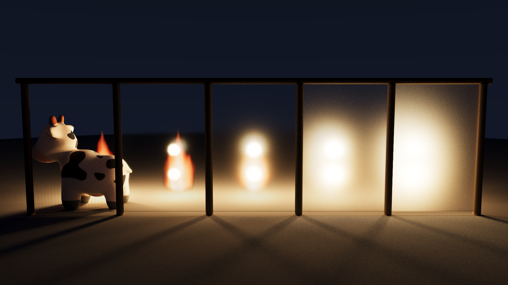

# sundog

**sundog** 是面向 NVIDIA RTX GPU 的开源路径追踪渲染器，基于
**OptiX 9.1 + CUDA 13.0 + PhysX 5.8**，目标硬件是 NVIDIA RTX 5090（sm_120，
Blackwell）。**场景即程序**：每个场景是一个 Python 文件，直接运行它就完成
渲染——megakernel 路径追踪（NEE + MIS）、硬件三角形与大规模实例化、
PhysX GPU 刚体装载、OptiX AI 降噪，固定种子时输出逐位可复现。


**Molten Oracle**（封面，原生 4K）— 机械奶牛在祭坛烈焰上被击碎的瞬间：
PhysX GPU 定格 49 个刚体的爆裂、穹顶破口的 envmap 神光与地面碎影、
零发射黑烟柱、极坐标镂空齿轮、纹理化符文发光体、下沉水池——
一图汇演前十六章全部机制。

|  |  |
|:---:|:---:|
| **Marble Run** — 纯 quadric 弹珠乐园，五种解析图元 | **Glasswork** — 嵌套介质 + 透明彩影，牛立气泡中 |

|  |  |
|:---:|:---:|
| **Cornell Lume** — NEE+MIS，四档粗糙度 | **Parabolica** — 抛物碗聚光 + 双面材质 |

|  |  |
|:---:|:---:|
| **Spot Atrium** — 机器人 Sparky 会奶牛：usemtl 多材质组网格（玻璃头罩/发光屏/金属/塑料） | **Spot Swarm** — 32768 实例 ≈1.9 亿等效三角形 |


**Spot Cascade** — 512 只奶牛倾泻到第 1.0 秒的锐利定格（`--physics-time`），
姿态由 **PhysX GPU 刚体模拟**在加载时算出，场景文件里只有初始位姿与速度。
同一份初始条件模拟到静止的对照见
[docs/gallery/06-spot-cascade-settled.png](docs/gallery/06-spot-cascade-settled.png)。


**Campfire** — 火焰是**程序化体积光源**（发射 + 吸收参与介质，光线行进积分），
也是全场唯一主光源；照明由火焰内嵌的软阴影点光经 NEE 完成。


**Lakeside** — `water` 材质三件套：ior 1.33 电介质界面、fbm 波纹法线
（倒影破碎与落日波光路径）、Beer–Lambert 水体吸收（深水偏蓝绿）。


**Suncatcher** — 全场零显式灯，照明百分之百来自一张 4k HDR 晴日天空：
**环境光重要性采样**（亮度 × sinθ 的 2D CDF）让 NEE 直接命中小而炽烈的太阳，
硬影与天光软照明同源一张图片；粗糙度渐变的金属弧列把流云糊成高光阶梯。



**Frosted Veil** — **粗糙电介质（磨砂玻璃）**：五扇粗糙度递增的玻璃屏后
各燃一簇体积火焰，GGX 微表面透射把火苗逐扇糊成光晕；屏前地面的火光
光斑却逐扇同锐——阴影线的光滑近似被排进同一幅画框里。

|  |  |
|:---:|:---:|
| 余烬湖岸 16 spp 原始蒙特卡洛（体积火焰 + 水面 = 重噪声） | 同样 16 spp + **OptiX AI 降噪** |

全部成图与渲染统计见 [docs/GALLERY.md](docs/GALLERY.md)；GPU 性能与降噪基准见
[docs/BENCHMARKS.md](docs/BENCHMARKS.md)；版本演进见 [CHANGELOG.md](CHANGELOG.md)。

> 📖 **技术报告**：[docs/report/](docs/report/index.md) ——面向无图形学背景读者的
> 17 章 + 附录教程式报告，从渲染方程与蒙特卡洛讲到 OptiX 工程、RT Core、
> PhysX 物理装载、体积渲染、水面材质、HDR 环境光照、透明阴影/嵌套介质
> 与磨砂玻璃微表面透射，数学推导与源码逐一对账。

## 特性

- **Megakernel 路径追踪**：raygen 内迭代 path loop（trace depth 1），
  NEE + MIS（balance heuristic），深度 ≥4 起俄罗斯轮盘
- **几何**：5 种 quadric（sphere / rect / disk / cylinder / parabola）自定义求交
  + 硬件三角形网格（OBJ，vt 纹理坐标 + 平滑法线）；单层 IAS 实例化，支持非均匀缩放
- **材质**：lambert、GGX metal、dielectric（玻璃，可选 `roughness` 磨砂——
  GGX 微表面反射+透射，roughness=0 逐位退化回光滑 delta）、emissive
  （区域光自动 NEE）
- **双面材质**：正/背面独立材质、`null` 穿透面、alpha cutout 镂空
- **纹理**：solid / checker / grid / PNG 图像（sRGB）
- **灯光**：point（带半径软阴影）、distant，以及 emissive rect/disk/sphere/mesh
  区域光（网格发光体按世界空间三角形面积 CDF 做 NEE 采样，纹理化亦可）
- **HDR 环境光照**：`s.background_envmap(…)` 支持 equirect `.hdr` 环境贴图，
  按亮度 × sinθ 预构建 2D CDF 做**环境光重要性采样**，与 NEE/MIS 全接驳——
  一张带太阳的天空图即可点亮整个场景（`importance=False` 切均匀采样对照）
- **物理装载**：场景声明刚体初始条件（`s.physics(…)` + 逐对象 opt-in），
  加载时用 **PhysX 5 GPU 刚体**（`eENABLE_GPU_DYNAMICS` + GPU 宽相，在 RTX 上模拟）
  沉降到静止——或按 `stop_time`/`--physics-time` **锐利定格于运动中的任一瞬间**
  ——烘焙变换后再构建加速结构
- **体积火焰**：程序化发射型参与介质（发射 + 吸收，raygen 解析界定 +
  光线行进），火焰内嵌软阴影点光经 NEE 照亮场景（`s.flame(…)`）；
  阴影线按火焰透射率衰减——火焰投影、烟柱遮光（宿主火焰对自家点光豁免）
- **水面材质**：`water` = ior 1.33 电介质界面 + fbm 波纹法线 + Beer–Lambert
  水体吸收（介质内路径按长度衰减）
- **透明阴影**：阴影线沿直线透射玻璃/水——逐界面菲涅尔 + 介质段
  Beer–Lambert（有色玻璃投有色亮影、水下点收到直接光、Snell 窗口自然
  涌现）；`--opaque-shadows` 保留旧布尔遮挡供对照
- **嵌套介质**：介质栈 + 相对折射率——水中玻璃按 η=1.5/1.33 折射、
  玻璃中气泡按 1.33/1.0，`dielectric` 可带 `absorb`（良构嵌套假设）
- **ACES 色调映射**：Hill 拟合（RRT+ODT），默认对全部输出生效——高光沿肩部
  渐进滚降而非硬截断为纯白（`tonemap="clamp"` 保留线性退路供数值实验）
- **降噪**：OptiX AI denoiser（HDR + albedo/normal 引导 AOV）
- **决定性**：PCG32，固定 `--seed` 时同 GPU/驱动上逐位一致（golden 测试依赖此性质）
- **统计**：`--stats` 输出 JSON（分段计时、光线数、Mrays/s、显存峰值）

## 测试机引导

源码放 NFS（双机共享），构建产物放测试机本地 `/tmp`：

```bash
# 一次性：用户态安装 CUDA 13.0 toolkit + OptiX 9.1 SDK + PhysX 5.8 到 /tmp（无需 sudo；
# PhysX 首次从 NFS 源码包构建并缓存产物 tarball 回 NFS，之后秒级恢复）
scripts/setup-testbox.sh

# 每个 shell：
source scripts/env-testbox.sh   # CUDA_HOME、OPTIX_HOME、PHYSX_HOME、LD_LIBRARY_PATH、SUNDOG_BUILD
```

`/tmp` 重启即清空——重跑 `setup-testbox.sh` 即可（幂等）。

## 构建

```bash
source scripts/env-testbox.sh
make -j16                        # 产出 $SUNDOG_BUILD/libsundog.so（渲染后端库）
```

可调项：`DEBUG=1`（`-O0 -G`）。设备代码走 PTX JIT——
OptiX-IR 在目标驱动上不可用，来龙去脉见技术报告第 9 章 §9.6。

## 渲染一个场景

**场景即程序**——渲染 = 直接运行场景文件，输出名由场景代码里的
`s.run(out=…)` 指定，命令行参数原样透传给渲染后端、覆盖场景内建设置：

```
python3 scenes/07-campfire.py                    # 渲出 07-campfire.png
python3 scenes/07-campfire.py --spp 16 --size 640x360 --out /tmp/quick.png

--spp N            每像素采样数          --seed N       固定种子 => 决定性输出
--size WxH         分辨率
--clamp F          间接光 firefly 钳制（0 = 关）
--denoise / --no-denoise                 --gamma F      输出 gamma（默认 2.2）
--opaque-shadows   旧式布尔阴影遮挡，火焰也不衰减阴影线（对照实验用）
--tonemap MODE     输出色调映射：aces（默认）| clamp（线性截断）
--physics-time F   刚体定格于模拟第 F 秒（0 = 强制沉降到静止）
--stats FILE.json  渲染统计
--aov-albedo / --aov-normal F.png        --quiet        关闭进度输出
--probe            打印 GPU/驱动/OptiX 信息
```

场景数据经 ctypes 逐调用直灌渲染库（libsundog.so），渲染在 python 进程内
完成——没有中间表示、没有临时文件、没有子进程。

## 场景格式

场景用 Python 定义（`scenes/scenelib.py` 的 API），见
[docs/SCENES.md](docs/SCENES.md)。示例场景在 `scenes/`（`smoke.py` 最小、
`features.py` 全特性、`01…13` 画廊，其中 `06-spot-cascade`/`12-molten-oracle` 需要 PhysX GPU；
`03/05/06/10/11/12/13` 的网格与 HDR 资产由 `scripts/fetch-assets.sh` 下载）。

## 测试

全部在测试机上跑：

```bash
make host-tests        # 场景/scenelib 单测（编译需 CUDA/OptiX 头，运行无需 GPU、需 python3）
make smoke             # scripts/run-smoke.sh：probe + 小渲染 + denoise + stats 校验
make golden            # scripts/run-golden.sh：7 场景 PSNR≥45 对比 golden + 决定性检查
make check             # 以上全部
scripts/run-sanitizer.sh    # compute-sanitizer memcheck + initcheck
scripts/make-goldens.sh     # 重新生成 tests/golden/（渲染器有意变更后）
```

## 基准与画廊

```bash
scripts/run-benchmark.sh        # 两层基准（特性/降噪）-> docs/BENCHMARKS.md
scripts/render-gallery.sh       # 1080p 正式渲染 -> out/gallery/ + docs/GALLERY.md
```

## 目录结构

```
src/          host 端 C++（C 场景构建 ABI、渲染编排、accel、pipeline、denoise、PNG、stats）
device/       CUDA/OptiX 设备代码（单 module）+ host 共享的类型/装配头
extern/       第三方单头文件库（见 THIRD_PARTY.md）
scenes/       Python 场景（自执行）+ scenelib.py + 纹理
assets/       网格资产（spot.obj 按需下载、sparky.obj 入库；来源见 assets/LICENSES.md）
tests/        场景解析/scenelib 单测、img_compare 工具、golden 参考图
scripts/      测试机引导 / 测试 / 基准 / 画廊脚本（本 README 上文）
docs/         SCENES.md、GALLERY.md、BENCHMARKS.md；gallery/ 入库成图
docs/report/  技术报告（17 章 + 附录 + figures/，见 report/index.md）
out/          渲染输出（不入库）
```
