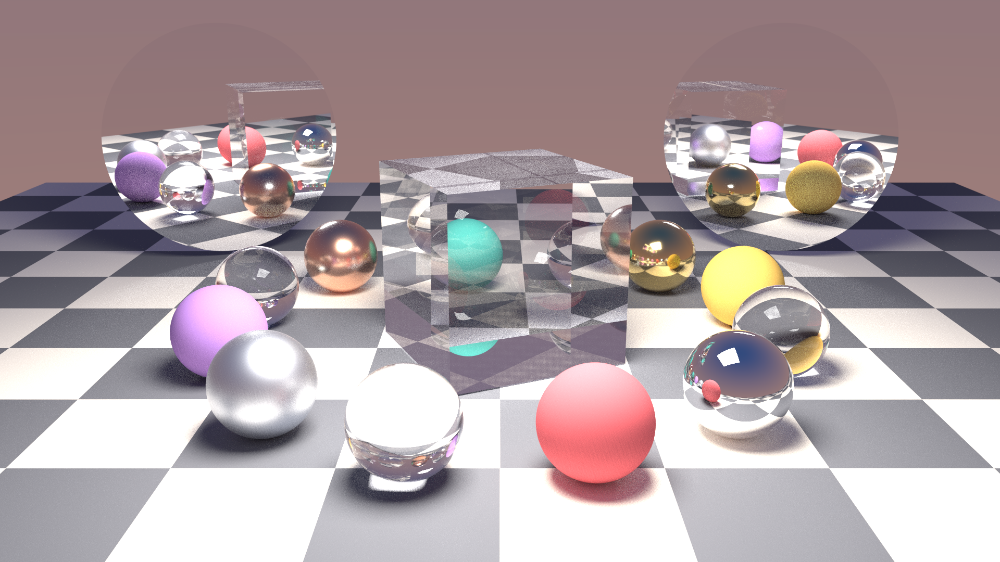
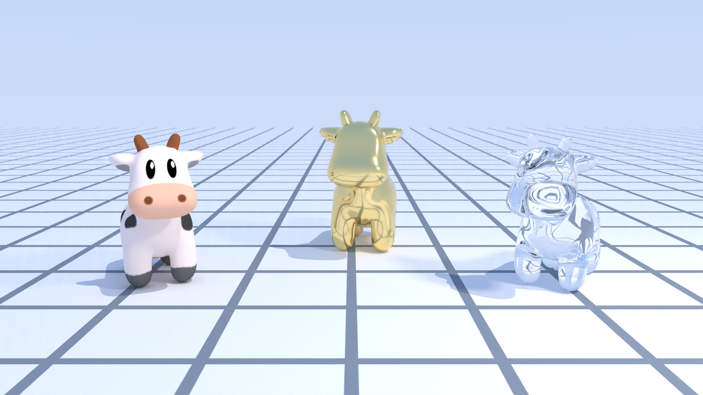

# sundog

**sundog** 是把作者早年的 CPU 光线追踪库 [cxxrt](https://gitlab-master.nvidia.com/gemsg/raytracing)
用 **OptiX 9.1 + CUDA 13.0** 全新重写的 GPU 路径追踪器，目标硬件是
NVIDIA RTX 5090（sm_120，Blackwell）。它不是移植——host/device 代码全部重写；
但保留了一个 `--parity` 兼容模式，可以和原 CPU 渲染器逐场景对比正确性与性能
（见 `docs/BENCHMARKS.md`）。



|  |  |
|:---:|:---:|
| **Cornell Lume** — NEE+MIS，四档粗糙度 | **Parabolica** — 抛物碗聚光 + logo 镂空投影 |

|  |  |
|:---:|:---:|
| **Spot Atrium** — 硬件三角形 + OBJ UV 纹理（Spot 卡通奶牛，CC0） | **Spot Swarm** — 32768 实例 ≈1.9 亿等效三角形 |

|  |  |
|:---:|:---:|
| 32 spp 原始蒙特卡洛 | 32 spp + **OptiX AI 降噪** |

全部成图与渲染统计见 [docs/GALLERY.md](docs/GALLERY.md)；CPU/GPU 基准见
[docs/BENCHMARKS.md](docs/BENCHMARKS.md)（RTX 5090 vs 16 线程 CPU 原版，同场景同 spp 快 **101–144×**）。

## 特性

- **Megakernel 路径追踪**：raygen 内迭代 path loop（trace depth 1），
  NEE + MIS（balance heuristic），深度 ≥4 起俄罗斯轮盘
- **几何**：5 种 quadric（sphere / rect / disk / cylinder / parabola）自定义求交
  + 硬件三角形网格（OBJ，vt 纹理坐标 + 平滑法线）；单层 IAS 实例化，支持非均匀缩放
- **材质**：lambert、GGX metal、dielectric（光滑玻璃）、emissive（区域光自动 NEE）
- **cxxrt 语义**：双面材质（正/背面独立）、`null` 穿透面、alpha cutout 镂空
- **纹理**：solid / checker / grid / PNG 图像（sRGB）
- **灯光**：point（带半径软阴影）、distant，以及 emissive rect/disk/sphere 区域光
- **降噪**：OptiX AI denoiser（HDR + albedo/normal 引导 AOV）
- **决定性**：PCG32，固定 `--seed` 时同 GPU/驱动上逐位一致（golden 测试依赖此性质）
- **统计**：`--stats` 输出 JSON（分段计时、光线数、Mrays/s、显存峰值）

## 测试机引导

源码放 NFS（双机共享），构建产物放测试机本地 `/tmp`：

```bash
# 一次性：用户态安装 CUDA 13.0 toolkit + OptiX 9.1 SDK 到 /tmp（无需 sudo）
scripts/setup-testbox.sh

# 每个 shell：
source scripts/env-testbox.sh   # CUDA_HOME、OPTIX_HOME、SUNDOG_BUILD=/tmp/sundog-build
```

`/tmp` 重启即清空——重跑 `setup-testbox.sh` 即可（幂等）。

## 构建

```bash
source scripts/env-testbox.sh
make -j16                        # 产出 $SUNDOG_BUILD/sundog
```

可调项：`ARCH=sm_120`、`DEBUG=1`（`-O0 -G`）、`IR=1`（OptiX-IR，**当前不可用**，
见 `docs/ARCHITECTURE.md` 的已知问题——默认走 PTX JIT）。

## CLI

```
sundog --scene FILE --out FILE.png [options]
sundog --probe

--spp N            每像素采样数          --seed N       固定种子 => 决定性输出
--size WxH         分辨率                --chunk N      每次 optixLaunch 的 spp（默认 16）
--max-depth N      路径深度上限          --clamp F      间接光 firefly 钳制（0 = 关）
--denoise / --no-denoise                 --gamma F      输出 gamma（默认 2.2）
--parity           cxxrt 兼容采样        --exposure F   曝光（EV）
--stats FILE.json  渲染统计              --aov-albedo / --aov-normal F.png
--probe            打印 GPU/驱动/OptiX 信息
--quiet            关闭进度输出
```

CLI 覆盖场景 JSON 里的 `render` 设置。

## 场景格式

见 [docs/SCENES.md](docs/SCENES.md)。示例场景在 `scenes/`（`smoke.json` 最小、
`features.json` 全特性、`01…05` 画廊、`compat-01/03` 是 cxxrt example 的 1:1 移植）。

## 测试

全部在测试机上跑：

```bash
make host-tests        # 纯 host 单元测试（math/rng/intersect/bsdf，无 GPU 也能跑）
make smoke             # scripts/run-smoke.sh：probe + 小渲染 + denoise + stats 校验
make golden            # scripts/run-golden.sh：4 场景 PSNR≥45 对比 golden + 决定性检查
make check             # 以上全部
scripts/run-sanitizer.sh    # compute-sanitizer memcheck + initcheck
scripts/make-goldens.sh     # 重新生成 tests/golden/（渲染器有意变更后）
```

## 基准与画廊

```bash
scripts/build-cpu-baseline.sh   # 构建 cxxrt CPU 基线到 /tmp/cxxrt-baseline
scripts/run-benchmark.sh        # 三层基准 -> docs/BENCHMARKS.md（--quick 自测流程）
scripts/render-gallery.sh       # 1080p 正式渲染 -> out/gallery/ + docs/GALLERY.md
```

## 目录结构

```
src/          host 端 C++（CLI、场景解析、accel、pipeline、denoise、PNG、stats）
device/       CUDA/OptiX 设备代码（单 module）+ host 共享的头（可单测）
extern/       第三方单头文件库（见 THIRD_PARTY.md）
scenes/       场景 JSON + 纹理
assets/       网格资产（spot.obj，CC0，来源见 assets/LICENSES.md）
tests/        host 单测、img_compare 工具、golden 参考图
scripts/      测试机引导 / 测试 / 基准 / 画廊脚本（本 README 上文）
docs/         SCENES.md、ARCHITECTURE.md、GALLERY.md、BENCHMARKS.md；gallery/ 入库成图
out/          渲染输出（不入库）
```
