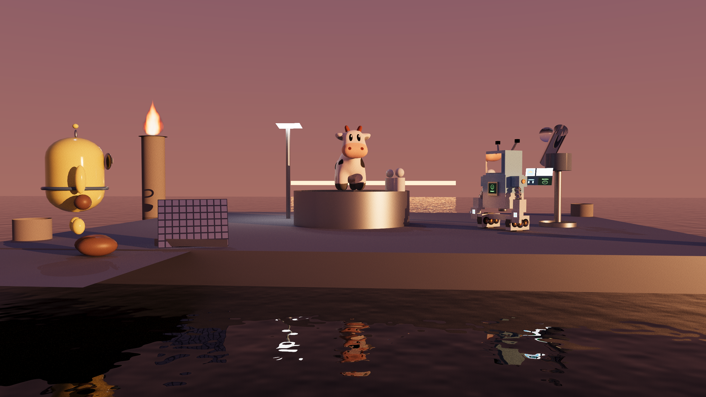

# sundog

**sundog** 是面向 NVIDIA RTX GPU 的开源路径追踪渲染器，基于
**OptiX 9.1 + CUDA 13.0 + PhysX 5.8**，目标硬件是 NVIDIA RTX 5090（sm_120，
Blackwell）。**场景即程序**：每个场景是一个 Python 文件，直接运行它就完成
渲染——megakernel 路径追踪（NEE + MIS）、硬件三角形与大规模实例化、
PhysX GPU 刚体装载、OptiX AI 降噪，固定种子时输出逐位可复现。


**Assembly Hall**（旗舰演示，2K）— 玩具工厂总装大厅，一帧收纳渲染器的
全部能力：正午阳光从天窗涌入大厅（**HDR 环境光重要性采样**），熔炉的
纯吸收黑烟升入光束、在地面光斑里投下**体积阴影**；一簇炉火只透过磨砂
玻璃隔间显形为一团暖晕（**GGX 微表面透射**），旁边未遮的炉口火苗锐利
对照；传送带上糖果色**塑料**Sparky 列队驶过（涂层双瓣混合 BSDF），被
质检唤醒的那只亮起**纹理网格 NEE 灯**屏幕；黄色胶囊吉祥物立在光斑中
督工，**PhysX GPU** 把一箱玩具奶牛定格在倾泻半空，水冷池用 **fbm 波纹
与 Beer–Lambert 吸收**倒映全场——spot、sparky、capsule_mascot 三份网格
资产同框，金属桁架与 alpha 镂空齿轮标志收尾。


**Atelier**（旗舰演示，2K）— 工作室一角：后墙壁炉的**程序化火焰**把
烟黑炉膛与石台染成暖橙；炉前的彩色塑料积木、金银铜球、磨砂玻璃球和
Spot 全部从空中落下，落定姿态完全由 **PhysX 短仿真**算出再交给 OptiX
绘制——多材质 Sparky 的每个 usemtl 组都是独立刚体，**落地时故意散了架**；
胶囊吉祥物站在石盆边旁观。右前浅石盆盛着 **Beer–Lambert 清水**，顶部
区域光与斜向小聚光画出**软阴影**，低强度 HDR 天空给金属与玻璃擦上高光。



**Dusk Tide**（旗舰演示，2K）— 暮潮观测站：日落后的海岸平台上，Spot
蹲守中央检修台，Sparky 亮屏操作**多材质光学仪器**（铬镜筒/玻璃物镜/
涂层外壳），胶囊吉祥物校准格纹金属样片；低角度暖阳与冷色天顶补光刻画
**陶瓷、粗糙金属、铬、低粗糙度涂层与纹理表面**，地平线余晖在前景波浪
水面拉出光道，与火焰信标的暖反射、天空冷调在同一片 **fbm 波纹**里交错
（**RGB Beer 吸收**的暮海水色）。

## 特性对比

同一场景、同一机位，一个开关之差——左开右关：

### 透明阴影
| 开 | 关 |
|:---:|:---:|
|  |  |

开：阴影线沿直线穿过玻璃，逐界面菲涅尔 × Beer–Lambert——有色玻璃投下
透明彩影；关：布尔遮挡，玻璃投实心黑影。（11 号场景 · 512 spp）

### 火焰体积阴影
| 开 | 关 |
|:---:|:---:|
|  |  |

开：阴影线按火焰透射率衰减，黑烟柱在神光下投出体积阴影；关：阴影线
无视参与介质，烟柱下的地面光斑同亮。（12 号场景 · 512 spp）

### 环境光重要性采样
| 开 | 关 |
|:---:|:---:|
|  |  |

同 64 spp：开——按亮度 × sinθ 的 2D CDF 直接命中小而炽烈的太阳，硬影
干净；关——均匀球面采样几乎打不中太阳，直射日光沦为噪声。（10 号场景）

### 网格 NEE 灯
| 开 | 关 |
|:---:|:---:|
|  |  |

深夜变体（Sparky 的发光屏是唯一光源；为读性同步提升屏幕强度与曝光、
双侧关闭 firefly 钳制），同 256 spp：开——发光网格被 NEE 主动采样，
屏光照明干净；关——只能被 BSDF 路径偶然撞中，照明塌暗、噪声爆炸。
（03 号场景深夜变体）

### 粗糙电介质（磨砂玻璃）
| 开 | 关 |
|:---:|:---:|
|  |  |

开：五扇屏按粗糙度阶梯 0 → 0.6，屏后火苗逐扇糊成光晕；关：五扇全部
强制光滑，火苗扇扇清晰、玻璃隐形。（13 号场景 · 512 spp）

### 下一事件估计（NEE）
| 开 | 关 |
|:---:|:---:|
|  |  |

同 64 spp：开——每次弹跳主动向光源连线；关——只靠 BSDF 路径撞灯，
小光源下噪声爆炸。（02 号场景）

### OptiX AI 降噪
| 开 | 关 |
|:---:|:---:|
|  |  |

同 16 spp：体积火焰 + 波纹水面的重噪声被一次网络推理抹平（HDR +
albedo/normal 引导层）。（09 号场景）

### ACES 色调映射
| 开 | 关 |
|:---:|:---:|
|  |  |

开：高光沿肩部渐进滚降，火心保住层次与色相；关：线性截断，火心撞墙
成死白色块。（07 号场景 · 512 spp）

全部 17 个场景的成图、说明与渲染统计见 [docs/GALLERY.md](docs/GALLERY.md)；
GPU 性能与降噪基准见 [docs/BENCHMARKS.md](docs/BENCHMARKS.md)；版本演进见
[CHANGELOG.md](CHANGELOG.md)。

> 📖 **技术报告**：[docs/report/](docs/report/index.md) ——面向无图形学背景读者的
> 18 章 + 附录教程式报告，从渲染方程与蒙特卡洛讲到 OptiX 工程、RT Core、
> PhysX 物理装载、体积渲染、水面材质、HDR 环境光照、透明阴影/嵌套介质、
> 磨砂玻璃微表面透射与塑料涂层混合 BSDF，数学推导与源码逐一对账。

## 特性

- **Megakernel 路径追踪**：raygen 内迭代 path loop（trace depth 1），
  NEE + MIS（balance heuristic），深度 ≥4 起俄罗斯轮盘
- **几何**：5 种 quadric（sphere / rect / disk / cylinder / parabola）自定义求交
  + 硬件三角形网格（OBJ，vt 纹理坐标 + 平滑法线）；单层 IAS 实例化，支持非均匀缩放
- **材质**：lambert、GGX metal、dielectric（玻璃，可选 `roughness` 磨砂——
  GGX 微表面反射+透射，roughness=0 逐位退化回光滑 delta）、plastic
  （漫反射底 + GGX 电介质涂层的双瓣混合，双向菲涅尔耦合保能量守恒）、
  emissive（区域光自动 NEE）
- **双面材质**：正/背面独立材质、`null` 穿透面、alpha cutout 镂空
- **纹理**：solid / checker / grid / PNG 图像（sRGB）
- **灯光**：point（带半径软阴影）、distant，以及 emissive rect/disk/sphere/mesh
  区域光（网格发光体按世界空间三角形面积 CDF 做 NEE 采样，纹理化亦可）
- **HDR 环境光照**：`s.background_envmap(…)` 支持 equirect `.hdr` 环境贴图，
  按亮度 × sinθ 预构建 2D CDF 做**环境光重要性采样**，与 NEE/MIS 全接驳——
  一张带太阳的天空图即可点亮整个场景（`importance=False` 切均匀采样对照）
- **物理装载**：场景声明刚体初始条件（`s.physics(…)` + 逐对象 opt-in），
  加载时用 **PhysX 5 GPU 刚体**（`eENABLE_GPU_DYNAMICS` + GPU 宽相，在 RTX 上模拟）
  沉降到静止——或按 `stop_time`/`--physics-time` **锐利定格于运动中的任一瞬间**
  ——烘焙变换后再构建加速结构
- **体积火焰**：程序化发射型参与介质（发射 + 吸收，raygen 解析界定 +
  光线行进），火焰内嵌软阴影点光经 NEE 照亮场景（`s.flame(…)`）；
  阴影线按火焰透射率衰减——火焰投影、烟柱遮光（宿主火焰对自家点光豁免）
- **水面材质**：`water` = ior 1.33 电介质界面 + fbm 波纹法线 + Beer–Lambert
  水体吸收（介质内路径按长度衰减）
- **透明阴影**：阴影线沿直线透射玻璃/水——逐界面菲涅尔 + 介质段
  Beer–Lambert（有色玻璃投有色亮影、水下点收到直接光、Snell 窗口自然
  涌现）；`--opaque-shadows` 保留旧布尔遮挡供对照
- **嵌套介质**：介质栈 + 相对折射率——水中玻璃按 η=1.5/1.33 折射、
  玻璃中气泡按 1.33/1.0，`dielectric` 可带 `absorb`（良构嵌套假设）
- **ACES 色调映射**：Hill 拟合（RRT+ODT），默认对全部输出生效——高光沿肩部
  渐进滚降而非硬截断为纯白（`tonemap="clamp"` 保留线性退路供数值实验）
- **降噪**：OptiX AI denoiser（HDR + albedo/normal 引导 AOV）
- **决定性**：PCG32，固定 `--seed` 时同 GPU/驱动上逐位一致（golden 测试依赖此性质）
- **统计**：`--stats` 输出 JSON（分段计时、光线数、Mrays/s、显存峰值）

## 测试机引导

源码放 NFS（双机共享），构建产物放测试机本地 `/tmp`：

```bash
# 一次性：用户态安装 CUDA 13.0 toolkit + OptiX 9.1 SDK + PhysX 5.8 到 /tmp（无需 sudo；
# PhysX 首次从 NFS 源码包构建并缓存产物 tarball 回 NFS，之后秒级恢复）
scripts/setup-testbox.sh

# 每个 shell：
source scripts/env-testbox.sh   # CUDA_HOME、OPTIX_HOME、PHYSX_HOME、LD_LIBRARY_PATH、SUNDOG_BUILD
```

`/tmp` 重启即清空——重跑 `setup-testbox.sh` 即可（幂等）。

## 构建

```bash
source scripts/env-testbox.sh
make -j16                        # 产出 $SUNDOG_BUILD/libsundog.so（渲染后端库）
```

可调项：`DEBUG=1`（`-O0 -G`）。设备代码走 PTX JIT——
OptiX-IR 在目标驱动上不可用，来龙去脉见技术报告第 9 章 §9.6。

## 渲染一个场景

**场景即程序**——渲染 = 直接运行场景文件，输出名由场景代码里的
`s.run(out=…)` 指定，命令行参数原样透传给渲染后端、覆盖场景内建设置：

```
python3 scenes/07-campfire.py                    # 渲出 07-campfire.png
python3 scenes/07-campfire.py --spp 16 --size 640x360 --out /tmp/quick.png

--spp N            每像素采样数          --seed N       固定种子 => 决定性输出
--size WxH         分辨率
--clamp F          间接光 firefly 钳制（0 = 关）
--denoise / --no-denoise                 --gamma F      输出 gamma（默认 2.2）
--opaque-shadows   旧式布尔阴影遮挡，火焰也不衰减阴影线（对照实验用）
--tonemap MODE     输出色调映射：aces（默认）| clamp（线性截断）
--physics-time F   刚体定格于模拟第 F 秒（0 = 强制沉降到静止）
--stats FILE.json  渲染统计
--aov-albedo / --aov-normal F.png        --quiet        关闭进度输出
--probe            打印 GPU/驱动/OptiX 信息
```

场景数据经 ctypes 逐调用直灌渲染库（libsundog.so），渲染在 python 进程内
完成——没有中间表示、没有临时文件、没有子进程。

## 场景格式

场景用 Python 定义（`scenes/scenelib.py` 的 API），见
[docs/SCENES.md](docs/SCENES.md)。示例场景在 `scenes/`（`smoke.py` 最小、
`features.py` 全特性、`01…17` 画廊，其中 `06-spot-cascade`/`12-molten-oracle`/`15-assembly-hall`/`16-atelier` 需要 PhysX GPU；
网格资产全部入库，仅 `10/11/12/15/16` 的 HDR 天空由 `scripts/fetch-assets.sh` 下载）。

## 测试

全部在测试机上跑：

```bash
make host-tests        # 场景/scenelib 单测（编译需 CUDA/OptiX 头，运行无需 GPU、需 python3）
make smoke             # scripts/run-smoke.sh：probe + 小渲染 + denoise + stats 校验
make golden            # scripts/run-golden.sh：8 场景 PSNR≥45 对比 golden + 决定性检查
make check             # 以上全部
scripts/run-sanitizer.sh    # compute-sanitizer memcheck + initcheck
scripts/make-goldens.sh     # 重新生成 tests/golden/（渲染器有意变更后）
```

## 基准与画廊

```bash
scripts/run-benchmark.sh        # 两层基准（特性/降噪）-> docs/BENCHMARKS.md
scripts/render-gallery.sh       # 旗舰 2K + 特性对比 + 1080p 目录 -> out/gallery/ + docs/GALLERY.md（JOBS=n 多卡并行）
```

## 目录结构

```
src/          host 端 C++（C 场景构建 ABI、渲染编排、accel、pipeline、denoise、PNG、stats）
device/       CUDA/OptiX 设备代码（单 module）+ host 共享的类型/装配头
extern/       第三方单头文件库（见 THIRD_PARTY.md）
scenes/       Python 场景（自执行）+ scenelib.py + 纹理
assets/       网格资产（spot/sparky/capsule_mascot 全部入库；HDR 天空按需下载；来源见 assets/LICENSES.md）
tests/        场景解析/scenelib 单测、img_compare 工具、golden 参考图
scripts/      测试机引导 / 测试 / 基准 / 画廊脚本（本 README 上文）
docs/         SCENES.md、GALLERY.md、BENCHMARKS.md；gallery/ 入库成图
docs/report/  技术报告（18 章 + 附录 + figures/，见 report/index.md）
out/          渲染输出（不入库）
```
