# sundog 画廊

由 `scripts/render-gallery.sh` 生成于 2026-07-15。
正式图入库于 `docs/gallery/`（无损重压缩的 1080p PNG）；渲染原件在 `out/gallery/`（不入库）。

## 01-marble-run

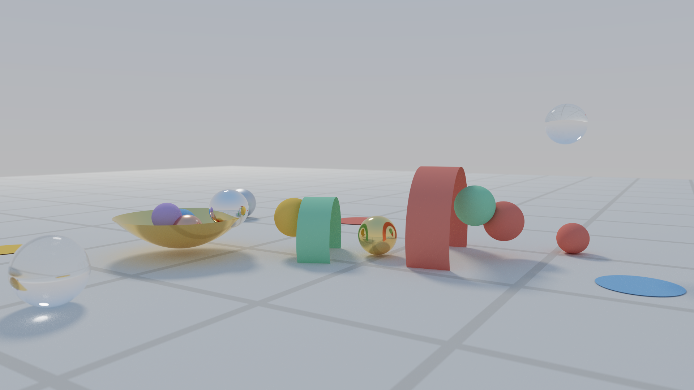

晨光弹珠乐园：一串彩色弹珠沿弹跳弧线定格——落下、触地、穿过红绿拱门、落进金色抛物面碗；糖果色朗伯球、粗糙度阶梯金属球与玻璃弹珠同场——纯 quadric（零三角形），五种解析图元全部到场。

## 02-cornell-lume

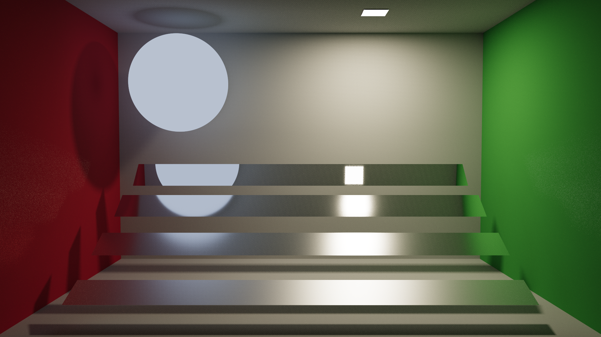

Cornell 盒变体：暖色小面积主灯加冷色低强度月光球，四档粗糙度钢球，NEE+MIS 在小光源下的收敛能力一目了然。

## 03-spot-atrium

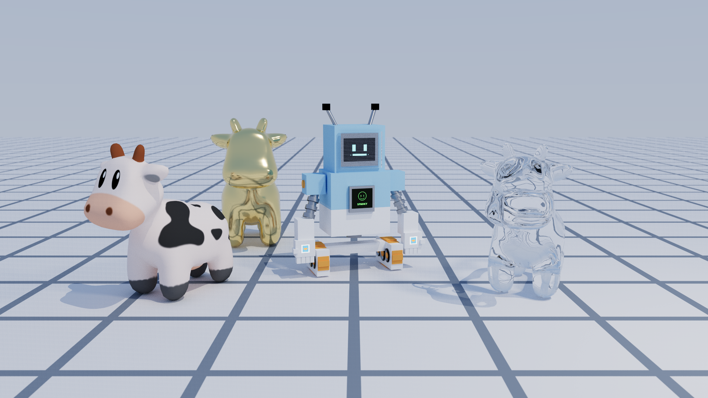

网格地板中庭里的三只 Spot 卡通奶牛（原生纹理 / 金 / 玻璃，各 5,856 三角形），硬件三角形求交、OBJ UV 纹理与平滑法线。

## 04-parabolica

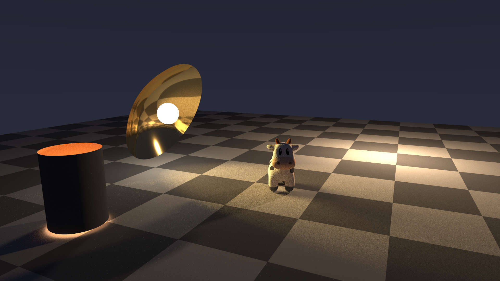

夜景抛物面聚光：金色抛物碟（背面材质成像）把发光灯珠聚成一道光束扫过暗色地面，展示 parabola 自定义求交与双面材质语义。

## 05-spot-swarm

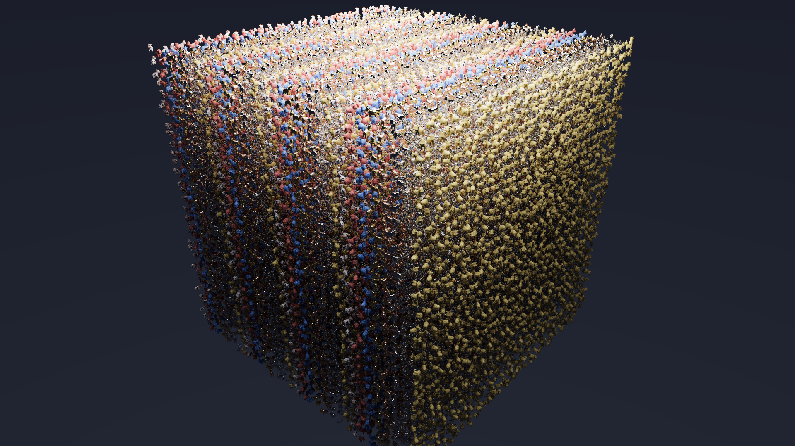

32768 个实例化 Spot 卡通奶牛的阵列（约 1.9 亿等效三角形）——同一份三角形 GAS 通过 IAS 实例复用，展示单层实例化的规模能力。

## 06-spot-cascade

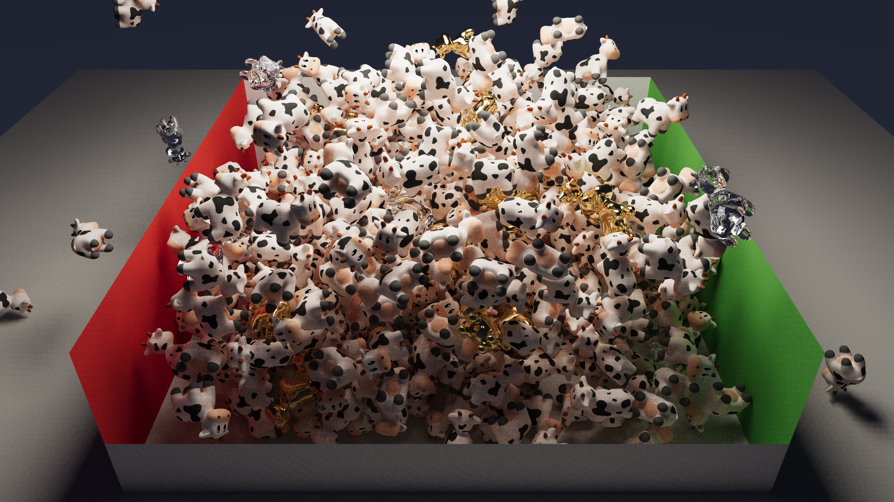

512 只 Spot 倾泻到第 1.0 秒的锐利定格：场景 JSON 只声明初始位姿与速度，加载时由 NVIDIA PhysX GPU 刚体模拟（eENABLE_GPU_DYNAMICS）推进到指定瞬间（--physics-time）烘焙渲染——下层已开始堆积，上方牛雨仍在翻滚下落，墙外有被弹飞的散兵。

## 06-spot-cascade-settled

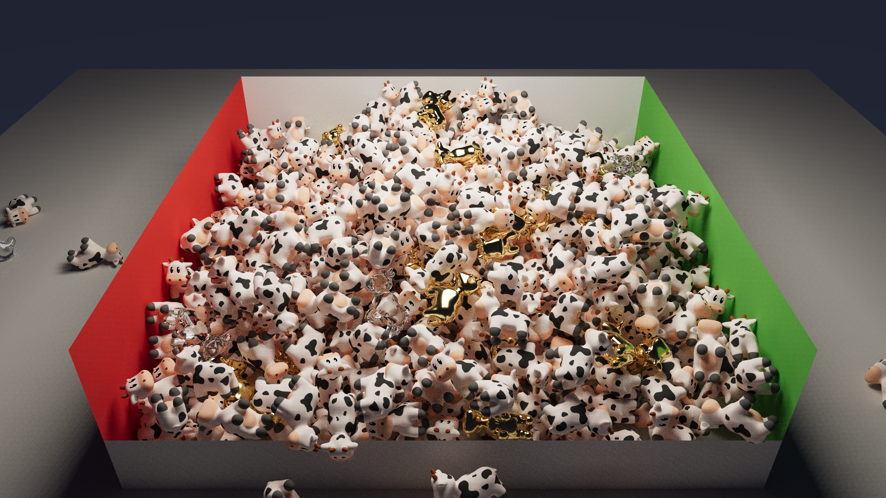

同一份初始条件模拟到全体休眠的静止堆（对照）：不同时刻、同一物理，堆叠形态完全出自模拟。

## 07-campfire

篝火夜景：火焰是程序化的发射型参与介质（发射+吸收，raygen 内解析圆柱界定后光线行进积分），也是全场唯一主光源——照明由火焰内嵌的暖色软阴影点光经 NEE 完成。五只 Spot 围坐，微弱月光勾勒轮廓。

## 08-lakeside

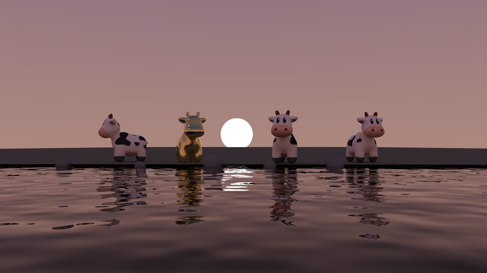

黄昏湖畔：water 材质三件套——ior 1.33 电介质界面、fbm 波纹法线（倒影破碎与落日波光）、Beer–Lambert 水体吸收（深水偏蓝绿）。岸边奶牛的倒影被缓涌揉碎，太阳波光路径直铺到镜头前。

## 09-ember-shore

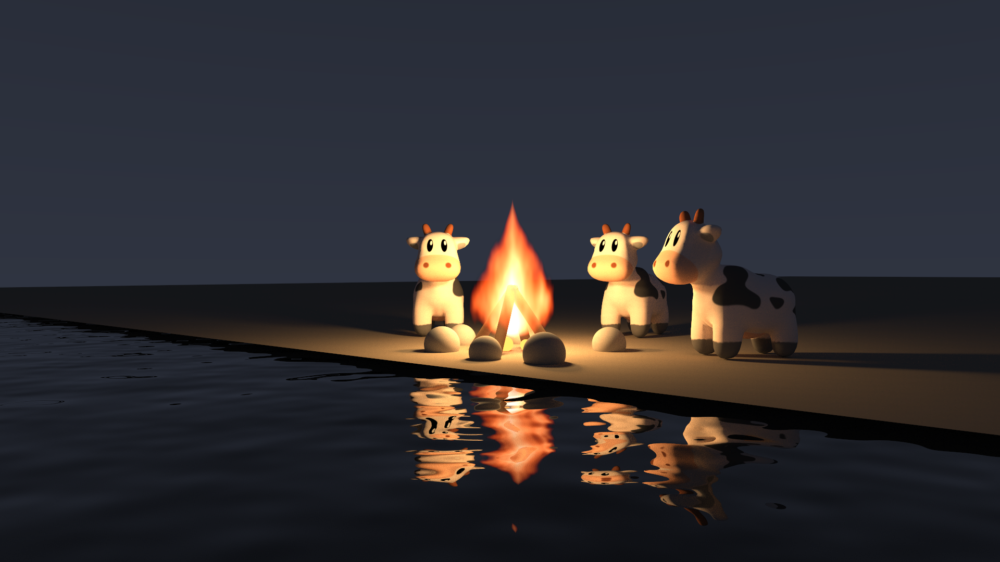

余烬湖岸：夜色水边的篝火——体积火焰的光经波纹水面反射，火光倒影在浪里揉碎；火焰、水面与软阴影同框，是低采样噪声最重的场景，也因此是 AI 降噪的对比载体。

## 09-ember-shore-spp16-denoised

同一场景仅 16 spp + OptiX AI 降噪（albedo/normal 引导）——体积火焰与水面反射的重噪声被一次网络推理抹平。

## 09-ember-shore-spp16-raw

对照组：同样 16 spp、不降噪的原始蒙特卡洛噪点。

## 10-suncatcher

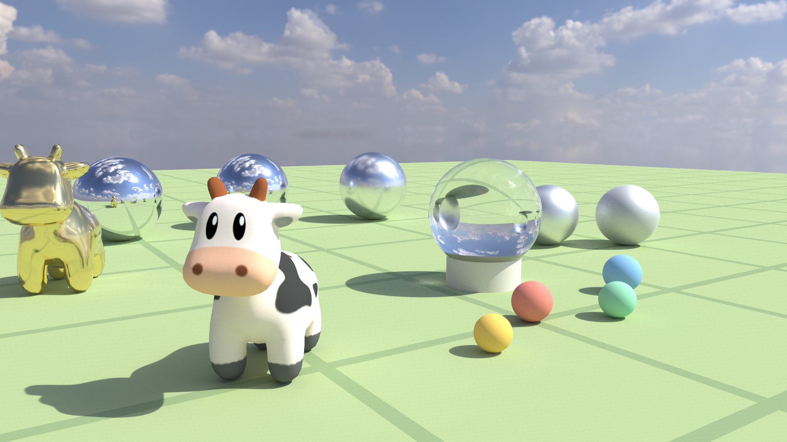

晴空捕日：全场零显式灯，照明百分之百来自一张 4k HDR 晴日天空（Poly Haven，CC0）。五只粗糙度渐变的金属球列成弧线（镜面端收进流云与金牛，粗糙端把天空糊成高光），中央玻璃球把整片天空倒扣进球心；按亮度×sinθ 预构建 2D CDF 的环境光重要性采样让 NEE 直接命中小而炽烈的太阳——草地上的长影与糖果弹珠的软天光同源一张图。

## 11-glasswork

琉璃静物：玻璃球里嵌着水球、水球里悬着气泡——三层嵌套介质由介质栈与相对折射率逐界面算对，藏在球后的奶牛经两重界面折射，倒过来又正回去，最终立在气泡里。三颗有色玻璃珠（Beer–Lambert 吸收）在桌面投下玫瑰、金、青三色的透明亮影——阴影线不再把玻璃当不透明，而是沿直线累积菲涅尔与介质衰减。

## 12-molten-oracle

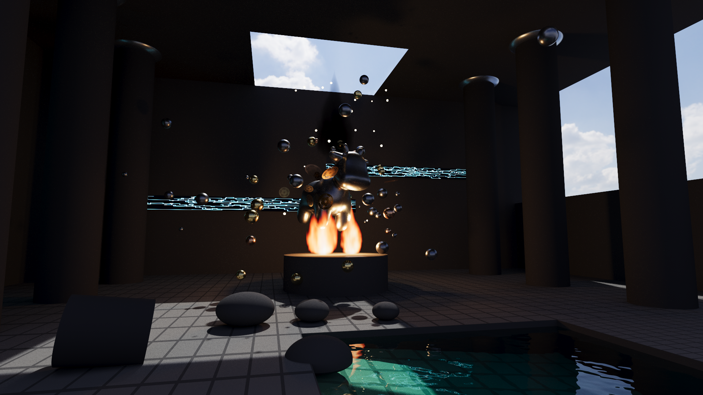

封面场景「熔岩圣殿的机械先知」：机械奶牛在祭坛烈焰上被无形之力击碎，PhysX GPU 在 0.20 秒定格 49 个刚体的爆裂瞬间——金铜齿轮（极坐标 alpha 镂空圆盘）悬浮其间；破晓阳光越过后墙从穹顶破口斜射而入（envmap 重要性采样），在地面拉出被碎片凿碎的光斑长影，与祭坛双火焰的地狱暖光冷暖对切；纯吸收的黑烟柱（零发射体积）在天窗前升腾，石壁符文（纹理化发光体）泛着幽蓝，右侧下沉水池从苔绿清浅坠入幽蓝——一图汇演十六章全部机制。

## 渲染统计

| 图像 | 分辨率 | spp | 降噪 | 渲染时间 (s) | Mrays/s | 峰值显存 (MB) |
|---|---|---|---|---|---|---|
| 01-marble-run | 1920x1080 | 512 | 否 | 0.39 | 6222 | 690 |
| 02-cornell-lume | 1920x1080 | 512 | 否 | 1.40 | 4772 | 690 |
| 03-spot-atrium | 1920x1080 | 256 | 否 | 0.23 | 6204 | 694 |
| 04-parabolica | 1920x1080 | 512 | 否 | 0.42 | 6007 | 694 |
| 05-spot-swarm | 1920x1080 | 128 | 否 | 0.21 | 3462 | 708 |
| 06-spot-cascade | 1920x1080 | 256 | 否 | 0.55 | 4150 | 694 |
| 06-spot-cascade-settled | 1920x1080 | 256 | 否 | 0.52 | 4259 | 694 |
| 07-campfire | 1920x1080 | 512 | 否 | 0.44 | 5548 | 694 |
| 08-lakeside | 1920x1080 | 512 | 否 | 0.25 | 7186 | 694 |
| 09-ember-shore | 1920x1080 | 512 | 否 | 0.29 | 6591 | 694 |
| 09-ember-shore-spp16-denoised | 1920x1080 | 16 | 是 | 0.01 | 6580 | 696 |
| 09-ember-shore-spp16-raw | 1920x1080 | 16 | 否 | 0.01 | 6614 | 694 |
| 10-suncatcher | 1920x1080 | 512 | 否 | 0.62 | 4226 | 856 |
| 11-glasswork | 1920x1080 | 512 | 否 | 0.77 | 3935 | 856 |
| 12-molten-oracle | 1920x1080 | 1024 | 否 | 4.81 | 2689 | 854 |
