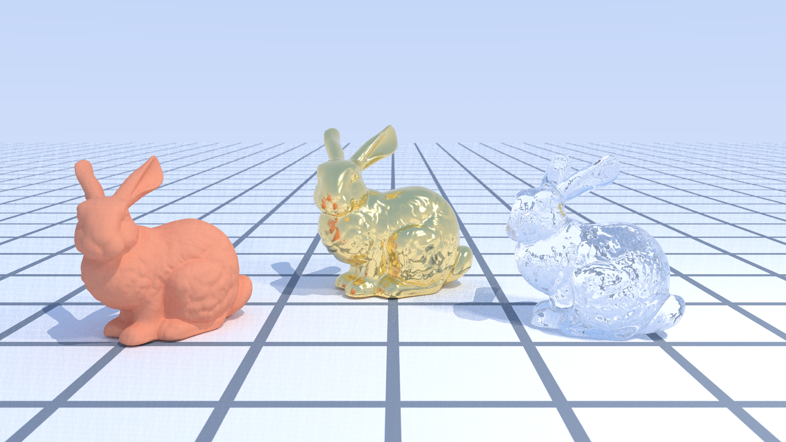
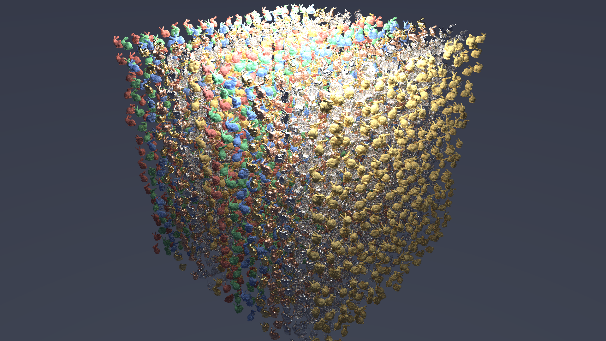

# sundog 画廊

由 `scripts/render-gallery.sh` 生成于 2026-07-09。
正式图入库于 `docs/gallery/`（无损重压缩的 1080p PNG）；渲染原件在 `out/gallery/`（不入库）。

## 01-prism-court

黄昏渐变天空下的棱镜庭院：玻璃立方、抛光镜面与四档粗糙度的金属球，考验折射、多次镜面反弹与 GGX 高光。

## 02-cornell-lume

Cornell 盒变体：暖色小面积主灯加冷色低强度月光球，四档粗糙度钢球，NEE+MIS 在小光源下的收敛能力一目了然。

## 03-bunny-atrium

网格地板中庭里的三只 Stanford Bunny（陶土 / 金 / 玻璃，各 14.4 万三角形），硬件三角形求交加平滑法线。

## 03-bunny-atrium-spp32-denoised

同一场景仅 32 spp + OptiX AI 降噪（albedo/normal 引导）——低采样即可得到干净画面。

## 03-bunny-atrium-spp32-raw

对照组：同样 32 spp、不降噪的原始蒙特卡洛噪点。

## 04-parabolica

夜景抛物面聚光：金色抛物碟（背面材质成像）把发光灯珠的光束打向标牌，展示 parabola 自定义求交与双面材质语义。

## 05-bunny-swarm

4096 个实例化 bunny 的阵列——同一份三角形 GAS 通过 IAS 实例复用，展示单层实例化的规模能力。

## 渲染统计

| 图像 | 分辨率 | spp | 降噪 | 渲染时间 (s) | Mrays/s | 峰值显存 (MB) |
|---|---|---|---|---|---|---|
| 01-prism-court | 1920x1080 | 512 | 否 | 0.58 | 6234 | 690 |
| 02-cornell-lume | 1920x1080 | 512 | 否 | 1.01 | 6618 | 690 |
| 03-bunny-atrium | 1920x1080 | 256 | 否 | 0.22 | 6727 | 696 |
| 03-bunny-atrium-spp32-denoised | 1920x1080 | 32 | 是 | 0.03 | 5478 | 696 |
| 03-bunny-atrium-spp32-raw | 1920x1080 | 32 | 否 | 0.03 | 5463 | 696 |
| 04-parabolica | 1920x1080 | 512 | 否 | 0.36 | 6983 | 694 |
| 05-bunny-swarm | 1920x1080 | 128 | 否 | 0.14 | 4558 | 698 |
