# sundog 画廊

由 `scripts/render-gallery.sh` 生成于 2026-07-17。
正式图入库于 `docs/gallery/`（无损重压缩 PNG，旗舰 2K、其余 1080p）；渲染原件在 `out/gallery/`（不入库）。

## 旗舰演示

玩具工厂总装大厅：一帧收纳渲染器的全部能力。正午阳光从天窗涌进大厅（HDR 环境光重要性采样），在混凝土地面铺出亮斑；熔炉的纯吸收烟柱升入光束，在光斑里投下体积阴影（阴影线的火焰透射率）。熔炉角燃着两簇发射型体积火焰，其中一簇只透过磨砂玻璃隔间显形为一团暖晕（GGX 微表面透射）；传送带上糖果色塑料 Sparky 列队驶过（涂层双瓣混合 BSDF），被质检唤醒的那只亮起纹理网格屏（NEE 网格灯），黄色胶囊吉祥物在带边督工（塑料 + 发光天线顶灯），线尾一只 UV 纹理Spot 等待装箱；右前方 PhysX GPU 把一箱玩具奶牛定格在倾泻半空（--physics-time），左前的水冷池用 fbm 波纹与 Beer–Lambert 吸收倒映整座大厅。金属桁架横贯屋顶，齿轮标志以 alpha 镂空圆盘悬挂——spot、sparky、capsule_mascot 三份网格资产同框。

## 特性对比

同一场景、同一机位，一个开关之差——左列开、右列关。

### 透明阴影

| 开 | 关 |
|:---:|:---:|
| 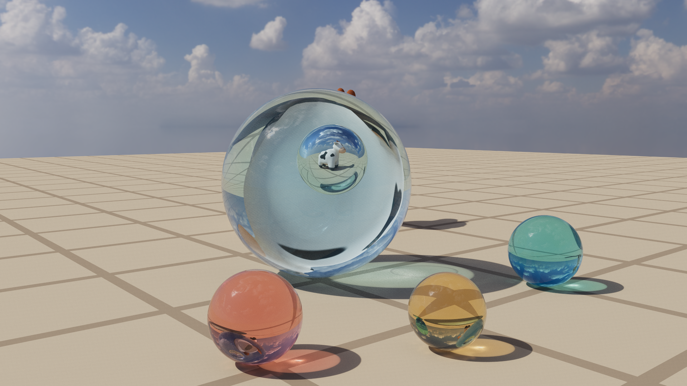 | 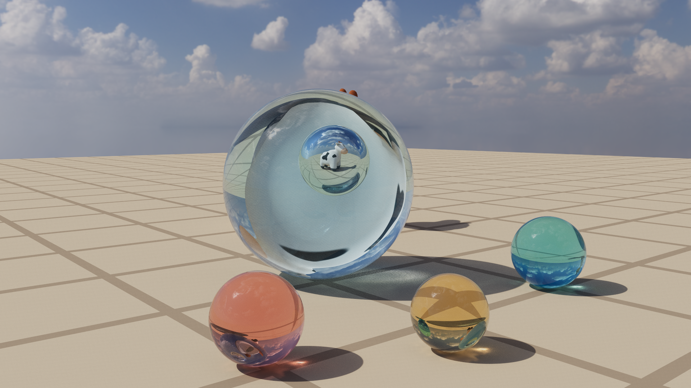 |

开：阴影线沿直线穿过玻璃，逐界面菲涅尔 × Beer–Lambert 衰减——有色玻璃投下透明彩影；关：布尔遮挡，玻璃投实心黑影。（11 号场景 · 512 spp）

### 火焰体积阴影

| 开 | 关 |
|:---:|:---:|
|  | 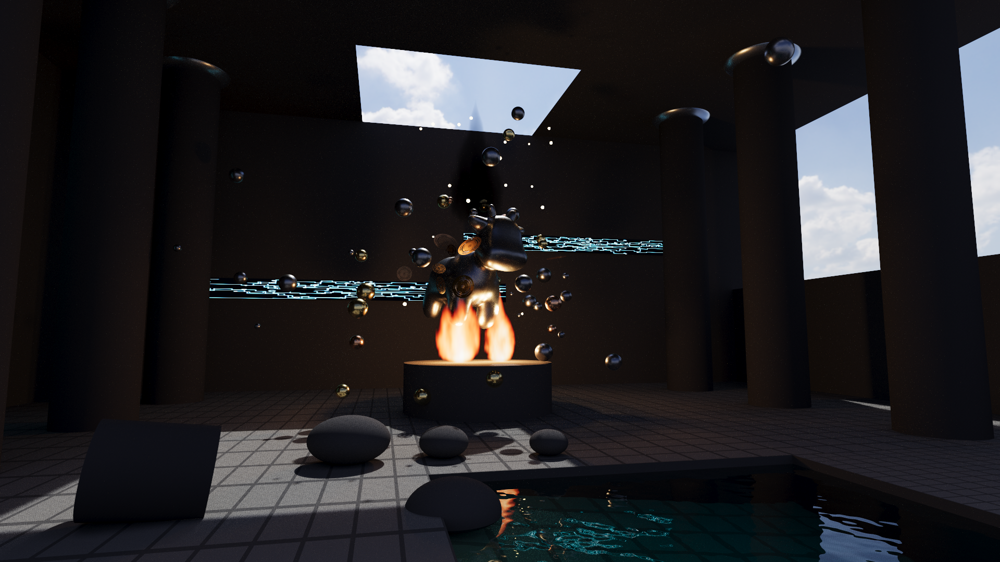 |

开：阴影线按火焰透射率衰减，黑烟柱在神光下投出体积阴影；关：阴影线无视参与介质，烟柱下的地面光斑同亮（--opaque-shadows 同时关闭两类透射阴影，此构图的可见差异来自烟柱）。（12 号场景 · 512 spp）

### 环境光重要性采样

| 开 | 关 |
|:---:|:---:|
| 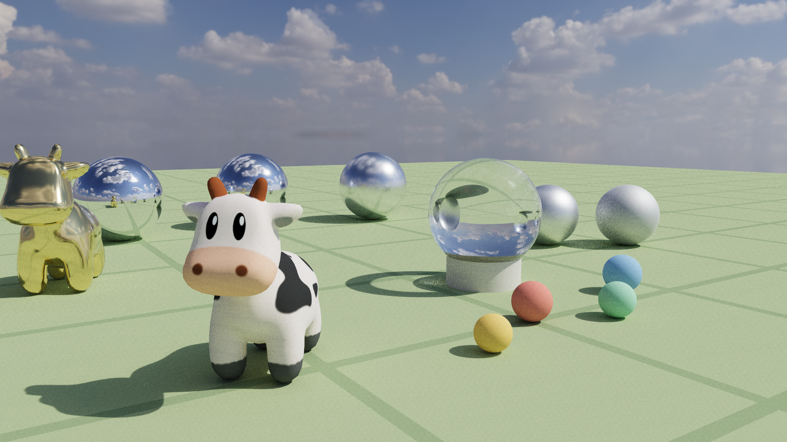 | 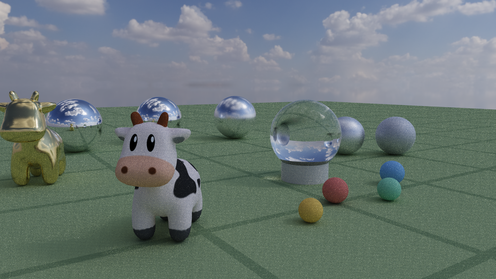 |

同 64 spp：开——按亮度 × sinθ 的 2D CDF 直接命中小而炽烈的太阳，硬影干净；关——均匀球面采样几乎永远打不中太阳，直射日光沦为噪声。（10 号场景 · 64 spp）

### OptiX AI 降噪

| 开 | 关 |
|:---:|:---:|
|  | 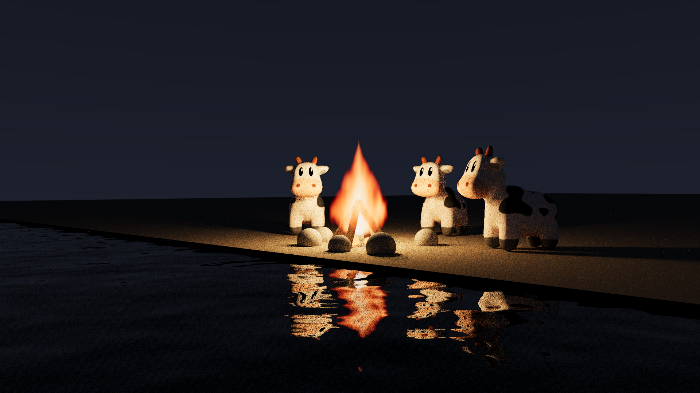 |

同 16 spp：体积火焰 + 波纹水面的重噪声被一次网络推理抹平（HDR + albedo/normal 引导层）。（09 号场景 · 16 spp）

### 网格 NEE 灯

| 开 | 关 |
|:---:|:---:|
| 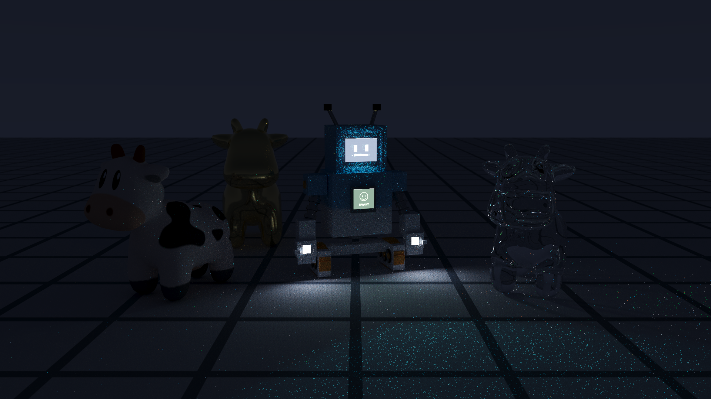 | 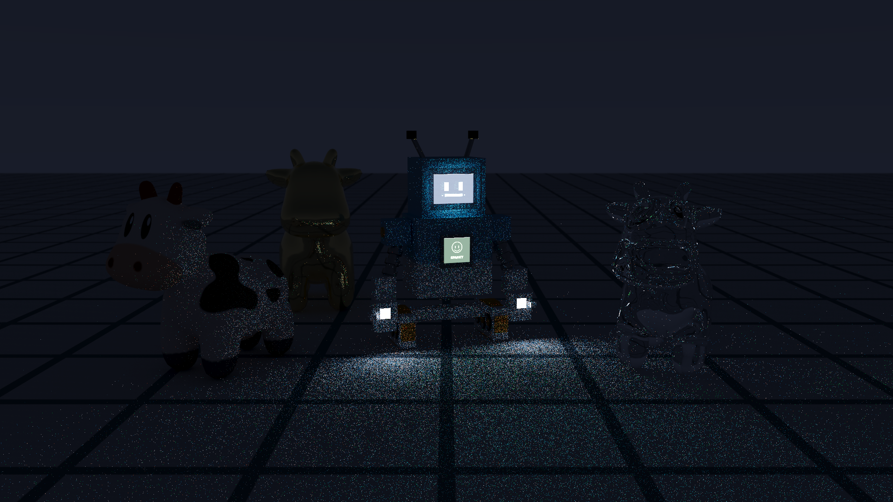 |

同 256 spp 的深夜变体（撤去太阳与补光，Sparky 的发光屏是唯一光源）：开——发光网格按三角形面积 CDF 被 NEE 主动采样，屏光照明干净；关——同样的发光网格只能被 BSDF 路径偶然撞中，照明塌暗、噪声爆炸（为读性变体同步提升屏幕强度与曝光、双侧关闭 firefly 钳制）。（03 号场景深夜变体 · 256 spp）

### ACES 色调映射

| 开 | 关 |
|:---:|:---:|
| 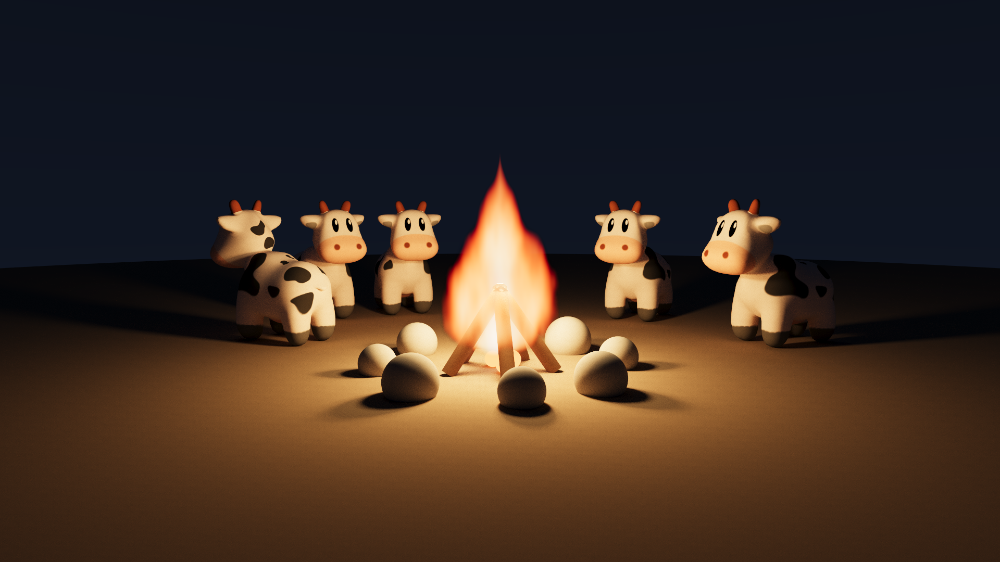 | 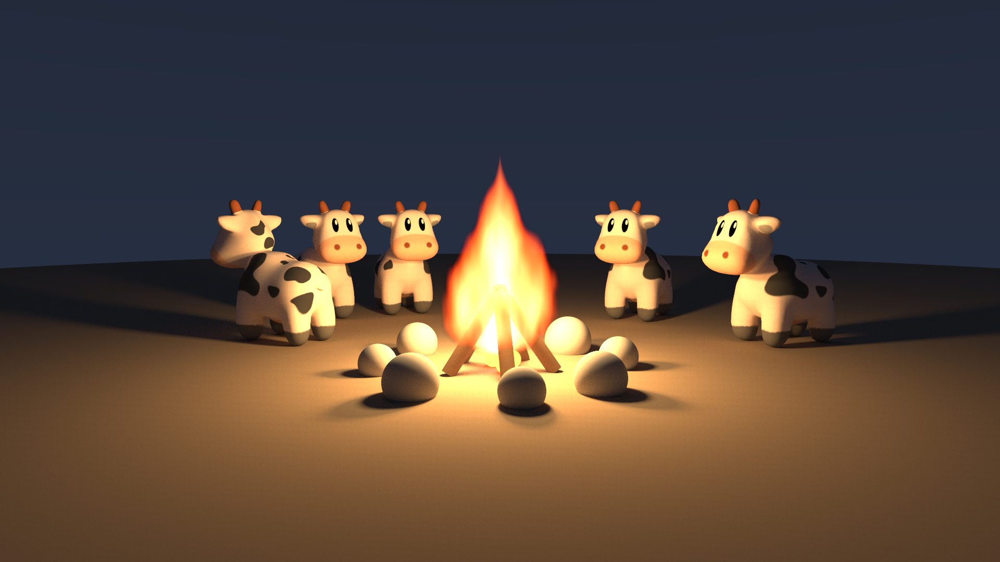 |

开：高光沿肩部渐进滚降，火心保住层次与色相；关：线性截断，火心撞墙成死白色块。（07 号场景 · 512 spp）

### 下一事件估计（NEE）

| 开 | 关 |
|:---:|:---:|
|  |  |

同 64 spp：开——每次弹跳主动向光源连线；关——只靠 BSDF 路径撞灯，小光源下噪声爆炸。（02 号场景 · 64 spp）

### 粗糙电介质（磨砂玻璃）

| 开 | 关 |
|:---:|:---:|
| 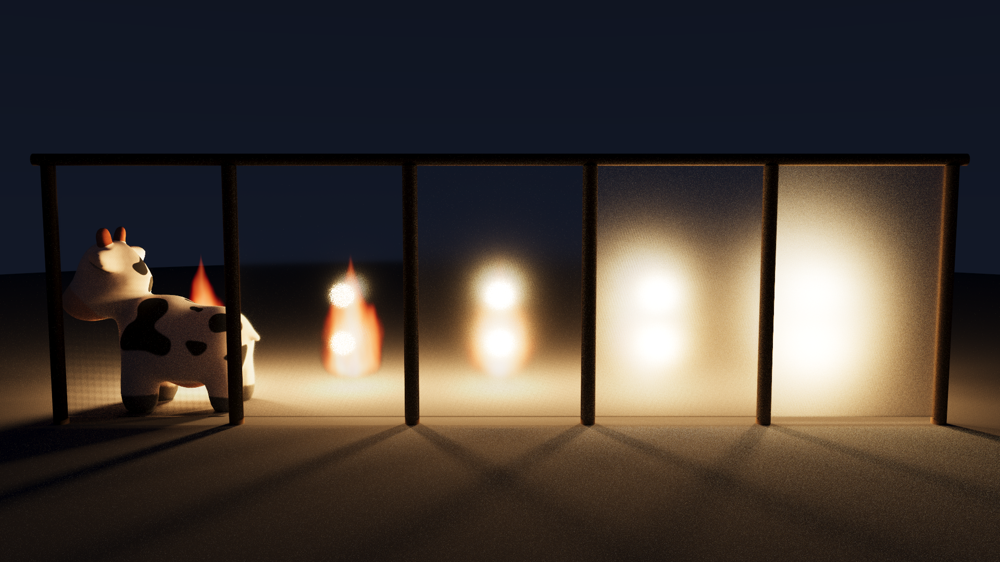 | 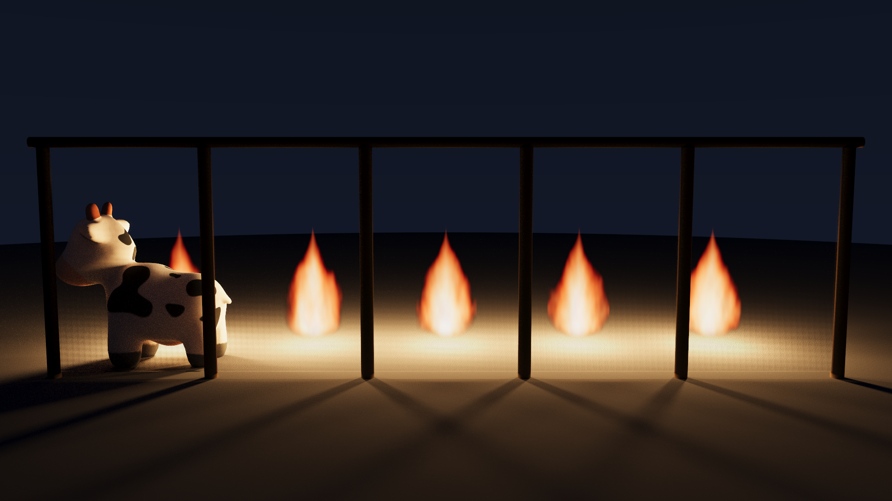 |

开：五扇屏按粗糙度阶梯 0 → 0.6，屏后火苗逐扇糊成光晕；关：五扇全部强制光滑，火苗扇扇清晰。（13 号场景 · 512 spp）

## 全部场景

### 01-marble-run

晨光弹珠乐园：一串彩色弹珠沿弹跳弧线定格——落下、触地、穿过红绿拱门、落进金色抛物面碗；糖果色朗伯球、粗糙度阶梯金属球与玻璃弹珠同场——纯 quadric（零三角形），五种解析图元全部到场。

### 02-cornell-lume

Cornell 盒变体：暖色小面积主灯加冷色低强度月光球，四档粗糙度钢球，NEE+MIS 在小光源下的收敛能力一目了然。

### 03-spot-atrium

机器人 Sparky 与三只 Spot 奶牛同台：一个 OBJ 的十个 usemtl 材质组拆成同变换子网格——玻璃头罩、发光像素屏（纹理化网格区域光，经 NEE 采样照亮周遭）、金属关节、塑料壳；奶牛照旧演示硬件三角形、UV 纹理与平滑法线。

### 04-parabolica

夜景抛物面聚光：金色抛物碟（背面材质成像）把发光灯珠聚成一道光束扫过暗色地面，展示 parabola 自定义求交与双面材质语义。

### 05-spot-swarm

32768 个实例化 Spot 卡通奶牛的阵列（约 1.9 亿等效三角形）——同一份三角形 GAS 通过 IAS 实例复用，展示单层实例化的规模能力。

### 06-spot-cascade

512 只 Spot 倾泻到第 1.0 秒的锐利定格：场景只声明初始位姿与速度，加载时由 NVIDIA PhysX GPU 刚体模拟（eENABLE_GPU_DYNAMICS）推进到指定瞬间（--physics-time）烘焙渲染——下层已开始堆积，上方牛雨仍在翻滚下落，墙外有被弹飞的散兵。

### 06-spot-cascade-settled

同一份初始条件模拟到全体休眠的静止堆（对照）：不同时刻、同一物理，堆叠形态完全出自模拟。

### 07-campfire

篝火夜景：火焰是程序化的发射型参与介质（发射+吸收，raygen 内解析圆柱界定后光线行进积分），也是全场唯一主光源——照明由火焰内嵌的暖色软阴影点光经 NEE 完成。五只 Spot 围坐，微弱月光勾勒轮廓。

### 08-lakeside

黄昏湖畔：water 材质三件套——ior 1.33 电介质界面、fbm 波纹法线（倒影破碎与落日波光）、Beer–Lambert 水体吸收（深水偏蓝绿）。岸边奶牛的倒影被缓涌揉碎，太阳波光路径直铺到镜头前。

### 09-ember-shore

余烬湖岸：夜色水边的篝火——体积火焰的光经波纹水面反射，火光倒影在浪里揉碎；火焰、水面与软阴影同框，是低采样噪声最重的场景，也因此是 AI 降噪的对比载体。

### 09-ember-shore-spp16-denoised

同一场景仅 16 spp + OptiX AI 降噪（albedo/normal 引导）——体积火焰与水面反射的重噪声被一次网络推理抹平。

### 09-ember-shore-spp16-raw

对照组：同样 16 spp、不降噪的原始蒙特卡洛噪点。

### 10-suncatcher

晴空捕日：全场零显式灯，照明百分之百来自一张 4k HDR 晴日天空（Poly Haven，CC0）。五只粗糙度渐变的金属球列成弧线（镜面端收进流云与金牛，粗糙端把天空糊成高光），中央玻璃球把整片天空倒扣进球心；按亮度×sinθ 预构建 2D CDF 的环境光重要性采样让 NEE 直接命中小而炽烈的太阳——草地上的长影与糖果弹珠的软天光同源一张图。

### 11-glasswork

琉璃静物：玻璃球里嵌着水球、水球里悬着气泡——三层嵌套介质由介质栈与相对折射率逐界面算对，藏在球后的奶牛经两重界面折射，倒过来又正回去，最终立在气泡里。三颗有色玻璃珠（Beer–Lambert 吸收）在桌面投下玫瑰、金、青三色的透明亮影——阴影线不再把玻璃当不透明，而是沿直线累积菲涅尔与介质衰减。

### 12-molten-oracle

「熔岩圣殿的机械先知」（v0.15 前的封面场景）：机械奶牛在祭坛烈焰上被无形之力击碎，PhysX GPU 在 0.20 秒定格 49 个刚体的爆裂瞬间——金铜齿轮（极坐标 alpha 镂空圆盘）悬浮其间；破晓阳光越过后墙从穹顶破口斜射而入（envmap 重要性采样），在地面拉出被碎片凿碎的光斑长影，与祭坛双火焰的地狱暖光冷暖对切；纯吸收的黑烟柱（零发射体积）在天窗前升腾、在神光下投出体积阴影，石壁符文（纹理化发光体）泛着幽蓝，右侧下沉水池从苔绿清浅坠入幽蓝——除磨砂玻璃外一图汇演全书机制。

### 13-frosted-veil

霜幕屏风：五扇磨砂玻璃屏一字排开，粗糙度自左向右 0 → 0.6 逐扇递增，每扇背后同位各燃一小簇体积火焰——镜面端火苗清晰如无物，磨砂端只剩一团暖色光晕，GGX 微表面透射（VNDF 采样 + Walter BTDF）把“看得见”连续糊成“只看得见光”；最清一扇后立着奶牛，火光勾出暖色轮廓。屏前地面的火光光斑却逐扇一样锐利——阴影线仍按光滑菲涅尔直线透射，这笔近似的账记在报告第 16 章。

### 14-toy-factory

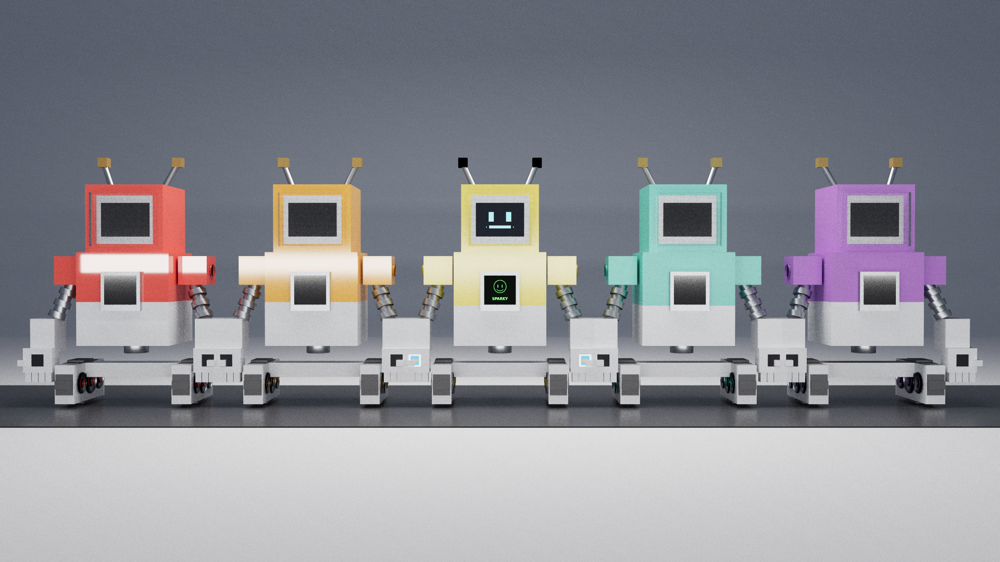

玩具工厂：五只同模具糖果色 Sparky 玩具在质检台一字排开，塑料壳（新材质：漫反射底 + GGX 电介质涂层的双瓣混合）的涂层粗糙度自左向右 0.03 → 0.6 逐只递增——相机正后方的细长灯管在清漆端映出一条锐利亮条，逐只糊成宽晕直至摊平成哑光，除涂层参数外一切恒定。中间那只（出厂默认 0.15）被质检唤醒，纹理发光屏做网格 NEE 灯；其余四只睡眠，熄灭的深色高光泽屏幕同样是塑料。金属关节、玻璃头罩与胶质履带混搭成料；针孔相机成图（光圈盘采样的结构性伪影就此规避）。

## 渲染统计

| 图像 | 分辨率 | spp | 降噪 | 渲染时间 (s) | Mrays/s | 峰值显存 (MB) |
|---|---|---|---|---|---|---|
| 01-marble-run | 1920x1080 | 512 | 否 | 0.40 | 6127 | 690 |
| 02-cornell-lume | 1920x1080 | 512 | 否 | 1.45 | 4599 | 690 |
| 03-spot-atrium | 1920x1080 | 256 | 否 | 0.32 | 4105 | 698 |
| 04-parabolica | 1920x1080 | 512 | 否 | 0.41 | 6066 | 694 |
| 05-spot-swarm | 1920x1080 | 128 | 否 | 0.21 | 3480 | 708 |
| 06-spot-cascade | 1920x1080 | 256 | 否 | 0.56 | 4107 | 694 |
| 06-spot-cascade-settled | 1920x1080 | 256 | 否 | 0.51 | 4377 | 694 |
| 07-campfire | 1920x1080 | 512 | 否 | 0.46 | 5205 | 694 |
| 08-lakeside | 1920x1080 | 512 | 否 | 0.26 | 6990 | 694 |
| 09-ember-shore | 1920x1080 | 512 | 否 | 0.32 | 6040 | 694 |
| 09-ember-shore-spp16-denoised | 1920x1080 | 16 | 是 | 0.01 | 5966 | 696 |
| 09-ember-shore-spp16-raw | 1920x1080 | 16 | 否 | 0.02 | 3645 | 694 |
| 10-suncatcher | 1920x1080 | 512 | 否 | 0.67 | 3913 | 856 |
| 11-glasswork | 1920x1080 | 512 | 否 | 0.77 | 3938 | 856 |
| 12-molten-oracle | 1920x1080 | 1024 | 否 | 6.06 | 2135 | 854 |
| 13-frosted-veil | 1920x1080 | 1024 | 否 | 3.27 | 2488 | 694 |
| 14-toy-factory | 1920x1080 | 384 | 否 | 0.74 | 4007 | 694 |
| 15-assembly-hall | 2560x1440 | 768 | 否 | 91.15 | 215 | 876 |

> 口径注：本表统计并非单一硬件口径——涉及 NVIDIA GB200、NVIDIA GeForce RTX 5090。跨行比较渲染时间/吞吐前请核对各图 stats 的 device 字段（compare/ 对比图不采集统计）。
