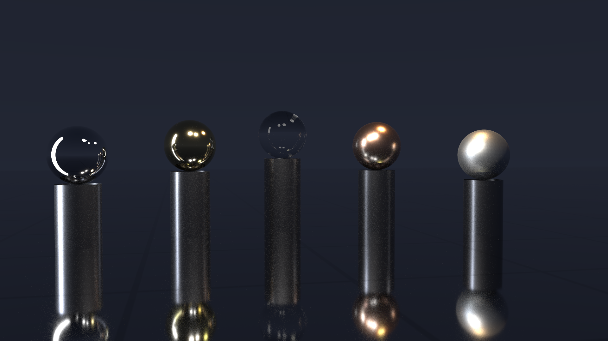

# sundog 画廊

由 `scripts/render-gallery.sh` 生成于 2026-07-13。
正式图入库于 `docs/gallery/`（无损重压缩的 1080p PNG）；渲染原件在 `out/gallery/`（不入库）。

## 01-obsidian-hall

曜石陈列馆：黑镜面地板上的圆柱展台弧线，粗糙度阶梯金属球与玻璃球列展，两盏抛物面聚光灯打出光池，冷白灯带侧光拉出长影，一件立式镜环收进整个展厅——纯 quadric（零三角形），五种解析图元全部到场。

## 02-cornell-lume

Cornell 盒变体：暖色小面积主灯加冷色低强度月光球，四档粗糙度钢球，NEE+MIS 在小光源下的收敛能力一目了然。

## 03-spot-atrium

网格地板中庭里的三只 Spot 卡通奶牛（原生纹理 / 金 / 玻璃，各 5,856 三角形），硬件三角形求交、OBJ UV 纹理与平滑法线。

## 04-parabolica

夜景抛物面聚光：金色抛物碟（背面材质成像）把发光灯珠聚成一道光束扫过暗色地面，展示 parabola 自定义求交与双面材质语义。

## 05-spot-swarm

32768 个实例化 Spot 卡通奶牛的阵列（约 1.9 亿等效三角形）——同一份三角形 GAS 通过 IAS 实例复用，展示单层实例化的规模能力。

## 06-spot-cascade

512 只 Spot 倾泻到第 1.0 秒的锐利定格：场景 JSON 只声明初始位姿与速度，加载时由 NVIDIA PhysX GPU 刚体模拟（eENABLE_GPU_DYNAMICS）推进到指定瞬间（--physics-time）烘焙渲染——下层已开始堆积，上方牛雨仍在翻滚下落，墙外有被弹飞的散兵。

## 06-spot-cascade-settled

同一份初始条件模拟到全体休眠的静止堆（对照）：不同时刻、同一物理，堆叠形态完全出自模拟。

## 07-campfire

篝火夜景：火焰是程序化的发射型参与介质（发射+吸收，raygen 内解析圆柱界定后光线行进积分），也是全场唯一主光源——照明由火焰内嵌的暖色软阴影点光经 NEE 完成。五只 Spot 围坐，微弱月光勾勒轮廓。

## 08-lakeside

黄昏湖畔：water 材质三件套——ior 1.33 电介质界面、fbm 波纹法线（倒影破碎与落日波光）、Beer–Lambert 水体吸收（深水偏蓝绿）。岸边奶牛的倒影被缓涌揉碎，太阳波光路径直铺到镜头前。

## 09-ember-shore

余烬湖岸：夜色水边的篝火——体积火焰的光经波纹水面反射，火光倒影在浪里揉碎；火焰、水面与软阴影同框，是低采样噪声最重的场景，也因此是 AI 降噪的对比载体。

## 09-ember-shore-spp16-denoised

同一场景仅 16 spp + OptiX AI 降噪（albedo/normal 引导）——体积火焰与水面反射的重噪声被一次网络推理抹平。

## 09-ember-shore-spp16-raw

对照组：同样 16 spp、不降噪的原始蒙特卡洛噪点。

## 渲染统计

| 图像 | 分辨率 | spp | 降噪 | 渲染时间 (s) | Mrays/s | 峰值显存 (MB) |
|---|---|---|---|---|---|---|
| 01-obsidian-hall | 1920x1080 | 512 | 否 | 0.41 | 6514 | 690 |
| 02-cornell-lume | 1920x1080 | 512 | 否 | 1.12 | 5958 | 690 |
| 03-spot-atrium | 1920x1080 | 256 | 否 | 0.19 | 7337 | 694 |
| 04-parabolica | 1920x1080 | 512 | 否 | 0.37 | 6834 | 694 |
| 05-spot-swarm | 1920x1080 | 128 | 否 | 0.17 | 4304 | 708 |
| 06-spot-cascade | 1920x1080 | 256 | 否 | 0.49 | 4684 | 694 |
| 06-spot-cascade-settled | 1920x1080 | 256 | 否 | 0.49 | 4496 | 170 |
| 07-campfire | 1920x1080 | 512 | 否 | 0.40 | 6006 | 694 |
| 08-lakeside | 1920x1080 | 512 | 否 | 0.21 | 8584 | 694 |
| 09-ember-shore | 1920x1080 | 512 | 否 | 0.25 | 7566 | 694 |
| 09-ember-shore-spp16-denoised | 1920x1080 | 16 | 是 | 0.01 | 7516 | 696 |
| 09-ember-shore-spp16-raw | 1920x1080 | 16 | 否 | 0.01 | 7446 | 694 |
