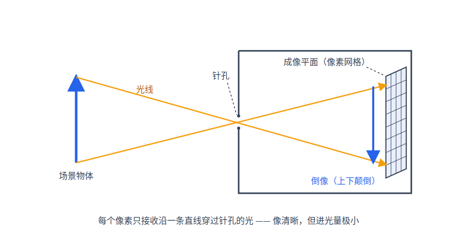
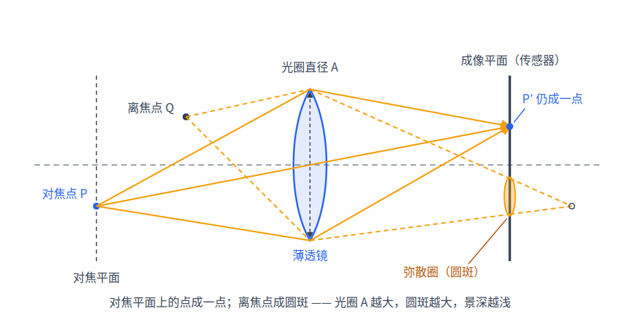

# 第 1 章 成像与光线

本章回答三个最基础的问题：数字图像到底是什么？渲染器在计算什么？为什么要从眼睛出发"反着"追光线？这些答案是全书的地基——后面每一章都是在把本章末尾那句"渲染一帧 = 对每个像素解一个积分"逐步算清楚。

## 1.1 像素、RGB 与线性空间

数字图像是一个二维网格，每个格子叫像素（pixel），存放三个数 $`(R,G,B)`$，分别表示红、绿、蓝三种颜色分量的强度。渲染（rendering）就是给定场景的几何、材质与光源描述，计算出每个像素该填什么数。

问题是"强度"以什么尺度记。物理上光能量是线性可加的：两束光叠在一起，能量相加。渲染器内部必须用与真实光能量成正比的浮点数做运算，这个尺度叫**线性空间**。但显示器不是线性设备：把 8-bit 码值 $`v\in[0,1]`$ 送进显示器，屏幕发出的亮度约为 $`v^{\gamma}`$，$`\gamma\approx 2.2`$。这一惯例源自 CRT 电子枪的物理特性，又恰好与人眼"对暗部变化更敏感"的感知特性互补——把有限的 256 级码值更多地分配给暗部。因此写图像文件前要做一次**伽马校正**（gamma correction）：$`v' = v^{1/\gamma}`$，让"编码再显示"两次幂运算相互抵消。

关键结论是：**平均、加权、混合这些运算只在线性空间中物理正确，显示编码必须留到最后一步**。举一个两条采样的例子：某像素一半样本能量为 0、一半为 1.0。线性平均得 0.5，按 sRGB 编码后约 0.73；若先编码再平均，得 $`(0+1)/2 = 0.5`$，显示时被解码回 $`0.5^{2.2}\approx 0.22`$ 的能量——比正确值暗了一半还多。所以 sundog 的累积缓冲以及 AI 降噪器（denoiser，见[第 10 章·随机数、纹理与 AI 降噪](10-sampling-denoising.md)）全部工作在线性浮点域，编码只发生在两处边界：输入侧，sRGB 纹理由硬件在采样时解码回线性（第 10 章）；输出侧，线性辐亮度在落盘的最后一刻才做感知编码——但用的不是上面的 sRGB 伽马，而是下一节的 PQ。

不过写文件之前还差一步：线性辐亮度是**无上界**的浮点数，而任何图像文件的码值都是有限级数——怎么把前者装进后者，是下一节的主题。

## 1.2 HDR 输出：把无界的辐亮度原样交给显示器

线性空间里没有"最亮"这回事：火焰的心部、直视的太阳，能量可以比一张白纸亮几个数量级。传统渲染器的做法是**色调映射**（tone mapping）——用截断或一条胶片式 S 曲线把无界能量压进 $`[0,1]`$，再按 1.1 节的伽马写成 8-bit 文件。代价是结构性的：动态范围在文件里就已经被压掉了，显示器再亮也还原不回来。sundog 在 v0.17 之前正是这么做的（截断，后升级为 ACES 曲线）；v0.18 起这条 SDR 链路整体退役——**不再做任何色调映射**，改为把线性 HDR 原样编码进一个装得下它的容器：**PQ**（perceptual quantizer，SMPTE ST 2084，HDR10/BT.2100 的转移函数）加 12-bit 码值，落盘为无损 AVIF。支持 HDR 的显示器直接呈现火心的真实层次；亮度上限不再是"一张白纸"，而是标准定义的 10,000 cd/m²（尼特，nit）。

PQ 的本体是一条把**绝对显示亮度**映到码值的感知均匀曲线：

```math
E = \left( \frac{c_1 + c_2\,Y^{m_1}}{1 + c_3\,Y^{m_1}} \right)^{m_2},\qquad Y = \frac{L}{10000\ \mathrm{cd/m^2}}
```

其中 $`m_1 = 2610/16384`$、$`m_2 = 2523/4096\times 128`$、$`c_1 = 3424/4096`$、$`c_2 = 2413/4096\times 32`$、$`c_3 = 2392/4096\times 32`$（对账 `pqOetf()`（src/transfer.h），逆变换 `pqEotf()` 同文件）。这条曲线按人眼的对比敏感度分配码值：0.05 到 10,000 尼特——五个多数量级——被一条曲线覆盖，且任意两个相邻码值的亮度差都恰好贴着可觉察阈值走。几个锚点：100 尼特（SDR 峰值白）编码到 0.508，1,000 尼特到 0.752，10,000 尼特到 1.0——SDR 的整个世界只占了 PQ 码值域的一半，另一半全部留给高光。


*图：PQ 转移函数（对数横轴，0.05–10,000 尼特）。灰色带是 8-bit sRGB 能表达的 SDR 区间（约 0.1–100 尼特）——PQ 用一半码值覆盖它，另一半装下高出两个数量级的高光。*

从渲染缓冲到文件还有三个衔接（对账 `Film::writeAvif()`（src/film.cpp））。**曝光**：$`2^{\text{exposure}}`$（摄影"档"，默认 0）乘在一切编码之前——它工作在线性 HDR 域，含义是整体亮度定标。**色域**：渲染在 sRGB/BT.709 基色下进行，PQ 容器按惯例配 BT.2020 广色域，一个 3×3 矩阵（`bt709To2020()`（src/transfer.h），行和为 1，白点不动）完成基变换——709 色域是 2020 的子集，变换无损。**亮度锚**：线性 1.0 定为 203 cd/m²（BT.2408 的参考白——HDR 制作中"漫反射白"的标准亮度），场景里能量为 1 的白纸在 HDR 显示器上呈现为舒适的纸白，而火心的 20 则真实地亮到它的 20 倍。管线全貌：

```cpp
float3 c = f3(hdr[i].x, hdr[i].y, hdr[i].z) * exp2f(exposure);  // 曝光（HDR 域）
c = bt709To2020(c);                                             // 色域 709 → 2020
rgb[3*i+k] = lroundf(pqOetf(c[k] * 203.0f / 10000.0f) * 4095.0f); // PQ → 12-bit
```

文件容器是 AVIF（AV1 图像格式）：YUV444 + identity 矩阵 + 全范围 + 无损量化，RGB 码值逐位可逆——"无损"不是营销词，而是决定性契约的一部分（第 11 章的 golden 与 sha256 检验直接建立在它上面；编码器线程数也因此固定为 4，不随宿主核数漂移）。文件头写入 CICP 元数据（基色 BT.2020、转移函数 PQ），支持 HDR 的浏览器与看图器据此正确呈现；降噪器的 albedo/normal 引导 AOV 按其 LDR 本性走 sRGB 8-bit 无损 AVIF（`Film::writeAovAvif()`）。

这套输出没有 SDR 退路——项目里不再有"压到 [0,1]"的任何路径。需要"所见即线性"的数值实验（如第 14 章的白炉测试）也不再受限：PQ 是标准定义的双射，`pqEotf()` 从文件码值精确还原线性能量，比旧日"从 8-bit sRGB 文件读回"精度高得多。

## 1.3 针孔相机：从像素 (p_x, p_y) 到一条光线

有了"每个像素要填一个线性 RGB 值"，下一个问题是这个值由场景中的什么决定。答案来自最简单的相机模型——针孔相机（pinhole camera）：一个不透光的盒子，正面开一个无穷小的孔。场景中任意一点发出的光里，只有恰好穿过小孔的那一条直线能到达盒底的成像平面（image plane），因此每个像素与场景之间由**唯一一条直线**相连，成像处处清晰。渲染时我们把成像平面从盒内翻到孔前方（避免上下颠倒），沿这条直线定义一条光线（ray）：

```math
r(t) = o + t\cdot d, \qquad t \ge 0
```

其中 $`o`$ 是起点（针孔位置），$`d`$ 是方向向量，$`t`$ 是沿线走过的参数距离。全书所有"光线"都指这个参数化。

sundog 在场景文件里用 lookfrom（相机位置）、lookat（注视点）、up（头顶方向）、vfov（竖直视场角，vertical field of view）描述相机，`makeCamera()`（src/scene_build.cpp）把它们换算成发射光线所需的几何量。先建相机的右手正交基：

```math
w = \mathrm{normalize}(\text{lookfrom} - \text{lookat}),\quad u = \mathrm{normalize}(\text{up} \times w),\quad v = w \times u
```

注意 $`w`$ 指向相机**正后方**（从注视点指向相机），$`u`$ 是右方向，$`v`$ 是真正的上方向（up 只需大致朝上，叉乘两次后自动正交化）。

视场角决定成像平面的大小。设 $`\theta = \text{vfov}\cdot\pi/180`$，在距针孔单位距离处，平面的半高、半宽为

```math
\text{halfH} = \tan(\theta/2),\qquad \text{halfW} = \text{aspect}\cdot\text{halfH}
```

其中宽高比 $`\text{aspect} = W/H`$，$`W`$、$`H`$ 是图像的宽、高（以像素数计）。代码实际把平面放在距离 focus 处（focus 取场景给的 focus_dist，未给则取 $`|\text{lookfrom}-\text{lookat}|`$），所有尺寸随之放大 focus 倍——对针孔相机，平面放多远都不改变光线方向（下文的 $`P(s,t)-o`$ 随 focus 等比放大，normalize 后方向不变，针孔成像因此不受影响），这样做是为 1.4 节铺路：透镜采样时这张平面将直接充当焦平面。于是：

```math
\text{lowerLeft} = o - \text{focus}\cdot\big(\text{halfW}\cdot u + \text{halfH}\cdot v + w\big)
```

是平面的左下角；$`\text{horizontal} = 2\,\text{halfW}\cdot\text{focus}\cdot u`$ 与 $`\text{vertical} = 2\,\text{halfH}\cdot\text{focus}\cdot v`$ 是平面的全宽、全高边向量。给定平面坐标 $`(s,t)\in[0,1)^2`$（此处 $`(s,t)`$ 是成像平面上的归一化坐标，与光线参数 $`t`$ 无关），平面上的点和光线方向为

```math
P(s,t) = \text{lowerLeft} + s\cdot\text{horizontal} + t\cdot\text{vertical},\qquad d = \mathrm{normalize}\big(P(s,t) - o\big)
```

从像素 $`(p_x, p_y)`$ 到 $`(s,t)`$ 的换算在 `__raygen__render()`（device/programs.cu）开头：

```math
s = \frac{p_x + j_x}{W}, \qquad t = \frac{(H - 1 - p_y) + j_y}{H}
```

这里有两个细节。其一，$`j_x, j_y \in [0,1)`$ 是**像素内抖动**：每条样本不打在像素中心，而是打在像素小方格内的一个随机位置。这既是抗锯齿（anti-aliasing，边缘由"非黑即白"变成按覆盖比例过渡），也正是 1.5 节"像素值是个积分"的采样点；sundog 还对抖动做了分层以进一步降噪，细节见[第 10 章·随机数、纹理与 AI 降噪](10-sampling-denoising.md)。其二，$`H-1-p_y`$ 做了一次上下翻转：图像存储约定第 0 行在**顶部**，而 vertical 指向世界的**上方**，顶行像素应取 $`t\approx 1`$。


*图：针孔相机——场景点与像素经小孔由唯一直线相连，盒内成上下颠倒的像；渲染时把成像平面翻到孔前以避免倒像。*

## 1.4 薄透镜与景深

针孔相机处处清晰，但真实相机为了进光量必须用有限口径的透镜，代价是只有一个距离上的物体是清晰的——这就是景深（depth of field）。描述它的最简模型是薄透镜（thin lens）：忽略透镜厚度，只保留一条成像规则——**对焦距离上的一个物点，经透镜面上任意位置折射的光线都汇聚回同一像点**。

把这条规则反过来（从渲染的视角）就是：起点在透镜圆盘上任取、终点固定为焦平面（focal plane，距相机 focus 的那张平面）上同一点 $`P`$ 的所有光线，是同一像素收集的光束。若物体恰好在焦平面上，这束光线全部相交于物体上一点，成像清晰；若物体在焦平面前后，这束光线打在物体表面时已散开成一个斑，多条样本平均后就是模糊——这个斑叫弥散圈（circle of confusion），物体离焦平面越远、光圈越大，圈越大越模糊。

sundog 的实现是这条规则的直译（`__raygen__render()`，device/programs.cu）：

```cpp
float3 org = cam.origin;
if (cam.lensRadius > 0.0f) {
  float2 rd = concentricDisk(rng.rnd2()) * cam.lensRadius;
  org = org + cam.u * rd.x + cam.v * rd.y;
}
float3 dir = normalize(cam.lowerLeft + u * cam.horizontal +
                       v * cam.vertical - org);
```

代码中的标量 `u`、`v` 就是 1.3 节的平面坐标 $`(s,t)`$（命名沿自源码），与基向量 `cam.u`、`cam.v` 无关。`concentricDisk()`（device/rng.cuh）把 $`[0,1)^2`$ 的均匀随机数映射为单位圆盘上的均匀点，乘以 lensRadius 得到透镜面上的随机起点，其中 lensRadius 是光圈（aperture）直径的一半（`makeCamera()` 里 `lensRadius = aperture / 2`）。关键在于 1.3 节已经把成像平面放在了 focus 距离处——它就是焦平面，所以 dir 指向的目标点 $`P`$ 不随起点变化：**起点在透镜上抖动，目标点钉在焦平面上**。aperture = 0 时起点退回针孔，模型自动退化为 1.3 节。


*图：对焦平面上的点经透镜面各处折射后汇聚回传感器同一点；离焦点的光束在传感器上摊成弥散圈，形成模糊（渲染时反向使用该几何：起点在透镜上抖动、目标点钉在焦平面上）。*

## 1.5 光的可逆性：为什么反着追

真实世界里，光从光源出发，经无数次反射折射，极小一部分进入眼睛。直接模拟这个正向过程注定徒劳：光源发出的光绝大多数永远不会进入相机——尤其 sundog 支持点光源与针孔（或小光圈）相机，光子恰好穿过一个几何点的概率是零。

出路来自光的可逆性。**Helmholtz 互易性**（Helmholtz reciprocity）说：表面反射在对调入射与出射方向后，反射比例不变（严格表述要等第 2 章定义 BRDF 之后，见[第 2 章·光的度量与渲染方程](02-rendering-equation.md)）。它的推论是：一条光路正着走与反着走，沿途每次反射的衰减完全相同。于是我们可以掉转方向，从像素出发沿视线反向发射光线，问"这条视线看到多亮"——答案与正向模拟一致，而且每条被追踪的路径都天然以相机为终点，一条也不浪费。这个思路叫光线追踪（ray tracing）；沿视线弹跳多次直至联通光源的完整算法叫路径追踪（path tracing），是[第 4 章·路径追踪算法](04-path-tracing.md)的主题。

至此可以写下全书的路线图。像素 $`p = (p_x, p_y)`$ 的值，是它对应的所有视线——像素内位置 × 透镜位置——所携带"亮度" $`L`$ 的平均，即一个期望（也就是一个积分）：

```math
I_p \;=\; \mathbb{E}\big[\,L(\text{随机相机光线})\,\big] \;\approx\; \frac{1}{N}\sum_{s=1}^{N} L(r_s)
```

**渲染一帧 = 对每个像素解一个这样的积分。**全书就是把这个式子的每一部分展开：

- $`L`$ 到底是什么物理量、它满足什么方程——[第 2 章·光的度量与渲染方程](02-rendering-equation.md)；
- 期望如何用随机样本估计、误差多大——[第 3 章·蒙特卡洛积分](03-monte-carlo.md)；
- $`L(r)`$ 的递归求值算法——第 4 章（路径追踪）；
- 表面如何反光——[第 5 章·材质与 BSDF](05-materials.md)；
- 光线如何打中几何、场景如何摆放——第 6、7 章；
- 为什么 GPU 上能快出两个数量级——第 8、9 章；
- 噪声从哪来、怎么去掉——第 10 章；怎么证明算得对——第 11 章。

上式中的样本数 $`N`$ 就是每像素采样数（samples per pixel/spp）。spp 越大，平均越接近期望，图像噪声越小：


*图：同一场景以 1/4/16/64/256 spp 渲染。噪声随 spp 增加而减弱，代价是渲染时间线性增长；定量规律（spp 翻 4 倍噪声减半）见第 3 章。*

## 1.6 sundog 的一帧：流程速览

把前五节串起来，sundog 渲染一帧的全部逻辑可以写成十行伪代码：

```text
for 每个像素 p:                              # GPU 上全部并行（第 9 章）
  for s = 0 .. spp-1:                        # 主机按 chunk 分批发射
    rng ← Pcg32(p, s, seed)                  # 可复现的独立随机流（第 10 章）
    (jx, jy) ← 像素内分层抖动(s)              # 1.3 节
    ray ← 相机光线(p + (jx,jy), 透镜采样)     # 1.3 / 1.4 节
    L ← 路径追踪(ray, rng)                    # 第 4 章
    accum[p] += (L - accum[p]) / (s + 1)     # 线性空间在线平均（1.5 节的 1/N·Σ）
可选: accum ← AI 降噪(accum)                  # 仍在线性域（第 10 章）
写 AVIF: PQ(2^exposure · accum → BT.2020，1.0 ↦ 203 nits) → 12-bit  # 1.1/1.2 节
```

与实现的对应：外层"每个像素并行"是一次 optixLaunch，路径追踪的主循环整个写在 raygen 程序里（组织方式见[第 9 章·OptiX 工程实现](09-optix-pipeline.md)）；内层 spp 循环被主机切成块多次发射（src/capi_render.cpp 渲染循环），既能报告进度也避免单次内核超时；累积用增量式均值 `accum += (L - accum)/(s+1)`，跨多次发射维持全局平均。一帧结束后主机把线性浮点缓冲取回，走 1.2 节的曝光→色域→PQ 编码流程落盘。这段速览只是渲染循环本身；一个 OptiX 应用完整的七步生命周期（数据上传、建加速结构、编译程序、Pipeline/SBT、发射、遍历求交着色、降噪）在第 9 章 9.1 节有整幅流程图与逐步走读。

## 小结

数字图像是线性能量值的网格，所有累积在线性空间进行，出口才做曝光→BT.2020 色域→PQ 编码（`Film::writeAvif()`，12-bit HDR AVIF——无界高光不再被压进 [0,1]，而是原样交给 HDR 显示器）；每个像素经针孔/薄透镜模型对应一束光线 $`o + t\cdot d`$；由光路可逆性，从眼睛反向追踪与物理过程同解；于是渲染一帧就是对每个像素估计一个期望 $`\mathbb{E}[L]`$。但"亮度 $`L`$"到目前为止还只是个直觉词——它的严格定义（辐亮度）以及它满足的方程（渲染方程），是[第 2 章·光的度量与渲染方程](02-rendering-equation.md)的内容。
