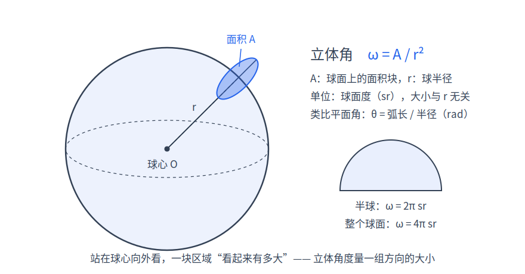
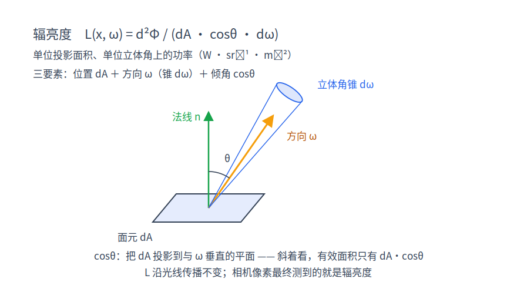
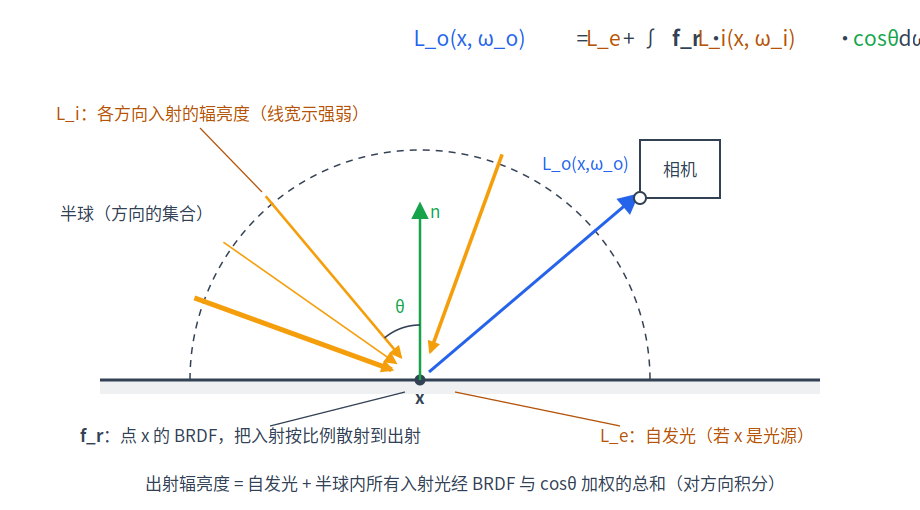

# 第 2 章 光的度量与渲染方程

[第 1 章·成像与光线](01-images-and-rays.md)把渲染归结为"对每个像素估计一条随机视线的亮度 $`L`$ 的期望"，但"亮度"还只是个直觉词。本章先建立度量光的正确物理量（立体角 → 辐亮度），再定义描述表面反光的数学对象，最后把它们组装成整本书要解的那个方程——渲染方程。本章不涉及任何代码推导，只在末尾指认每个量在 sundog 里的落点。

## 2.1 立体角：给"一束方向"定大小

平面上，角度是"弧长除以半径"：一段圆弧对圆心张开的角 $`\theta = \ell / r`$，整圆 $`2\pi`$。把这个想法升到三维：从观察点看一块面积，它"占据了多大的一片方向"？把这块面积沿视线投影到以观察点为球心的**单位球面**上，投影的面积就是它张开的立体角（solid angle），记作 $`\omega`$，单位是球面度（steradian/sr）。等价地，半径 $`r`$ 的球面上一块面积为 $`A`$ 的区域，对球心张开

```math
\omega = \frac{A}{r^2}
```

整个球面面积 $`4\pi r^2`$，故全空间的方向共 $`4\pi\ \mathrm{sr}`$；一张平面上方的半球是 $`2\pi\ \mathrm{sr}`$。

积分要用微分形式。取球坐标：极角 $`\theta`$ 从北极（法线方向）量起，方位角 $`\varphi`$ 绕轴转一圈。球面上 $`[\theta,\theta+\mathrm{d}\theta]\times[\varphi,\varphi+\mathrm{d}\varphi]`$ 的小块，沿经线方向边长 $`r\,\mathrm{d}\theta`$；沿纬线方向，该纬度圈的半径只有 $`r\sin\theta`$，边长 $`r\sin\theta\,\mathrm{d}\varphi`$。两边相乘再除以 $`r^2`$：

```math
\mathrm{d}\omega = \sin\theta \,\mathrm{d}\theta \,\mathrm{d}\varphi
```

$`\sin\theta`$ 因子的直觉：越靠近极点，"经纬格子"越窄。验证半球：

```math
\int_0^{2\pi}\!\!\int_0^{\pi/2} \sin\theta \,\mathrm{d}\theta \,\mathrm{d}\varphi = 2\pi\big[-\cos\theta\big]_0^{\pi/2} = 2\pi \checkmark
```

后文把"方向"与"立体角"混用同一个记号：$`\omega`$ 作方向时是单位向量，$`\mathrm{d}\omega`$ 则是它周围一小锥方向集合的大小。


*图：球面上的面积块对球心张开立体角 ω = A/r²；半球 2π sr，整个球面 4π sr。*

## 2.2 辐亮度：沿光线不变的"亮度"

现在给"多亮"找一个合适的物理量。最粗的量是辐射通量（radiant flux）$`\Phi`$：单位时间通过的光能量，即功率，单位瓦特。它没有空间分辨率。细分一步得到辐照度（irradiance）$`E = \mathrm{d}\Phi/\mathrm{d}A`$（$`\mathrm{W\cdot m^{-2}}`$）：到达表面单位面积的功率——但它把所有入射方向混在一起。要回答"从哪个方向来多亮"，必须对面积**和**方向同时细分，这就是全书的主角 $`L`$——辐亮度（radiance）：

```math
L(x,\omega) = \frac{\mathrm{d}^2\Phi}{\mathrm{d}A\,\cos\theta\;\mathrm{d}\omega}
```

单位 $`\mathrm{W\cdot sr^{-1}\cdot m^{-2}}`$：**单位投影面积、单位立体角上的功率**。分母里的 $`\cos\theta`$（$`\theta`$ 是 $`\omega`$ 与面元法线的夹角）把 $`\mathrm{d}A`$ 换成它在垂直于 $`\omega`$ 方向上的投影面积 $`\mathrm{d}A\cos\theta`$，使 $`L`$ 描述的是"这束光本身"的性质，而不依赖于我们用哪个朝向的面元去接它。由定义立刻得到辐照度是辐亮度的余弦加权半球积分——记法线一侧的半球方向集合为 $`H^2`$，下标 $`i`$ 表示入射（incident）：

```math
E = \int_{H^2} L_i(\omega)\cos\theta \,\mathrm{d}\omega
```

这个式子在 2.3 节马上要用。为什么选 $`L`$ 作主角？两条性质：

**其一，辐亮度沿光线不变（真空中）。**取相距 $`r`$ 的两块面元 $`\mathrm{d}A_1`$、$`\mathrm{d}A_2`$，连线与各自法线夹角 $`\theta_1`$、$`\theta_2`$。从 1 流向 2 的功率，按定义等于 1 处的辐亮度乘以 1 的投影面积、再乘以 2 对 1 张开的立体角 $`\mathrm{d}\omega_{1\to2} = \mathrm{d}A_2\cos\theta_2 / r^2`$：

```math
\mathrm{d}^2\Phi = L_1 \cdot \mathrm{d}A_1\cos\theta_1 \cdot \frac{\mathrm{d}A_2\cos\theta_2}{r^2}
```

这个表达式对两端**完全对称**：站在 2 处用 $`L_2`$ 写出同一功率（此时投影面积取 2 的、立体角取 1 对 2 张开的），

```math
\mathrm{d}^2\Phi = L_2 \cdot \mathrm{d}A_2\cos\theta_2 \cdot \frac{\mathrm{d}A_1\cos\theta_1}{r^2}
```

几何因子与前式完全相同。能量守恒（中途无吸收散射）要求两者相等，故 $`L_1 = L_2`$。辐亮度不随传播距离衰减——远处的灯看起来是变**小**（立体角按 $`1/r^2`$ 缩），不是变**暗**。

**其二，相机像素测的就是它。**一个像素对应传感器上一小块面积 $`\mathrm{d}A`$ 与透镜张成的一小锥 $`\mathrm{d}\omega`$，快门时间内收集的能量正比于 $`L\cdot \mathrm{d}A\cos\theta\,\mathrm{d}\omega`$，比例系数全是相机常数。所以第 1 章伪代码里每条视线返回的 $`L`$，物理身份就是辐亮度；又因为它沿光线不变，"视线打到的第一个表面朝相机方向的出射辐亮度"就等于"进入相机的辐亮度"——我们只需在表面上把它算出来。


*图：辐亮度的三要素——面元 dA、方向 ω（与法线夹角 θ）、立体角锥 dω；L 是单位投影面积、单位立体角上的功率。*

## 2.3 BRDF：表面如何反光

光到达表面后如何变成出射光？描述它的对象叫双向反射分布函数（BRDF），记 $`f_r`$，回答的问题是："从 $`\omega_i`$ 方向来的光，有多大'密度'被反射向 $`\omega_o`$ 方向？"约定 $`\omega_i`$、$`\omega_o`$ 都是从表面点 $`x`$ **指出**的单位向量，$`n`$ 是法线，$`\cos\theta_i = n\cdot\omega_i`$。

定义：来自方向 $`\omega_i`$ 附近 $`\mathrm{d}\omega_i`$ 的光贡献微分辐照度 $`\mathrm{d}E_i = L_i(\omega_i)\cos\theta_i\,\mathrm{d}\omega_i`$（2.2 节的积分取一小锥），它引起的出射辐亮度增量 $`\mathrm{d}L_o`$ 与之成正比，比例系数就是 BRDF：

```math
f_r(x,\omega_i,\omega_o) = \frac{\mathrm{d}L_o(x,\omega_o)}{\mathrm{d}E_i(x,\omega_i)} = \frac{\mathrm{d}L_o(x,\omega_o)}{L_i(x,\omega_i)\cos\theta_i \,\mathrm{d}\omega_i}
```

单位 $`\mathrm{sr^{-1}}`$，取值可以大于 1（光滑镜面把能量集中进极窄的立体角）。物理上合法的 BRDF 满足三条约束：

1. **非负**：$`f_r \ge 0`$；
2. **Helmholtz 互易**：$`f_r(\omega_i,\omega_o) = f_r(\omega_o,\omega_i)`$——第 1 章"从眼睛反着追踪"的合法性在此正式落地；
3. **能量守恒**：对任意入射方向 $`\omega_i`$，$`\displaystyle\int_{H^2} f_r(\omega_i,\omega_o)\cos\theta_o \,\mathrm{d}\omega_o \le 1`$——反射出去的总能量不能多于入射能量。

若材质还允许透射（如玻璃），积分域从半球扩为全球，函数改称 BSDF；本书在含透射的场合统一用 BSDF 一词，展开见[第 5 章·材质与 BSDF](05-materials.md)。

**最重要的特例：朗伯（Lambertian）漫反射与那个 $`\pi`$。**理想漫反射表面往所有方向反射得一样多，即 $`f_r \equiv c`$ 为常数。设反照率（albedo）$`\rho`$ 为表面反射掉的能量比例（0 = 全吸收，1 = 全反射，逐颜色通道各一个值）。在辐照度 $`E`$ 的照射下，出射辐亮度处处相同：

```math
L_o = \int_{H^2} c\, L_i \cos\theta_i \,\mathrm{d}\omega_i = c\,E
```

单位面积反射的总功率则要把 $`L_o`$ 再对出射半球做余弦加权积分：

```math
B = \int_{H^2} L_o \cos\theta_o \,\mathrm{d}\omega_o = c\,E \int_0^{2\pi}\!\!\int_0^{\pi/2} \cos\theta \sin\theta \,\mathrm{d}\theta \,\mathrm{d}\varphi = c\,E \cdot 2\pi\cdot\frac12 = \pi\, c\, E
```

（内层用 2.1 节的 $`\mathrm{d}\omega = \sin\theta\,\mathrm{d}\theta\,\mathrm{d}\varphi`$，$`\int_0^{\pi/2}\cos\theta\sin\theta\,\mathrm{d}\theta = 1/2`$。）按定义 $`\rho = B/E = \pi c`$，于是

```math
f_r^{\text{Lambert}} = \frac{\rho}{\pi} = \frac{\text{albedo}}{\pi}
```

这个 $`\pi`$ 不是约定俗成，而是"$`\cos\theta`$ 在半球上的积分恰好等于 $`\pi`$"的结果；漏掉它，表面会凭空把能量放大 $`\pi`$ 倍、违反能量守恒。sundog 中 `bsdfEval()`（device/bsdf.cuh）对朗伯材质返回 `albedo * SD_INV_PI`，与推导逐字一致。

## 2.4 渲染方程

组装。表面点 $`x`$ 沿 $`\omega_o`$ 出射的辐亮度 = 它自己发出的 + 它把所有方向入射的光反射过来的：

```math
L_o(x,\omega_o) \;=\; L_e(x,\omega_o) \;+\; \int_{H^2} f_r(x,\omega_i,\omega_o)\; L_i(x,\omega_i)\; \cos\theta_i \;\mathrm{d}\omega_i
```

这就是渲染方程（rendering equation）。逐项读：

- $`L_o(x,\omega_o)`$：待求量——$`x`$ 朝 $`\omega_o`$（对相机可见的第一个表面点来说就是朝视线反方向）射出的辐亮度；
- $`L_e(x,\omega_o)`$：自发光项，只在光源表面非零；
- $`f_r`$：材质，2.3 节；
- $`L_i(x,\omega_i)`$：从方向 $`\omega_i`$ **到达** $`x`$ 的辐亮度；
- $`\cos\theta_i = n\cdot\omega_i`$：投影因子。它不属于材质，而是几何事实：斜射的光束摊在更大的表面积上，单位面积接收的功率按 $`\cos\theta`$ 打折——正是 2.3 节 $`\mathrm{d}E_i = L_i\cos\theta_i\,\mathrm{d}\omega_i`$ 里的那个余弦，写方程时被显式提出来；
- 积分域 $`H^2`$：法线 $`n`$ 所在的半球，所有可能的入射方向。


*图：表面点半球上多个方向的入射辐亮度 L_i，经 f_r 与 cosθ 加权聚合，加上自发光 L_e，构成单一出射方向的 L_o。*

看似一行的方程为什么难解？三重困难：

**第一，它是递归的。**$`L_i`$ 不是已知量：从 $`\omega_i`$ 到达 $`x`$ 的光，是场景另一点发出的光。设 $`x'`$ 是从 $`x`$ 沿 $`\omega_i`$ 看到的第一个表面点（求交，[第 6 章·几何求交](06-geometry.md)），由 2.2 节的不变性：

```math
L_i(x,\omega_i) = L_o(x', -\omega_i)
```

未知函数 $`L_o`$ 同时出现在等号左边和积分号里面——数学上这是第二类 Fredholm 积分方程，未知量是定义在"所有表面点 × 所有方向"上的整个函数。

**第二，展开后是无穷维积分。**把方程反复代入自身：$`L = L_e + \int f\,L_e + \iint f\,f\,L_e + \cdots`$，第 $`k`$ 项的物理含义是"恰好弹跳 $`k`$ 次到达相机的光"，是一个 $`2k`$ 维积分（每次弹跳贡献一个半球方向的两个自由度），整个解是无穷级数。物理上每一项都真实存在——关掉多次弹射就是没有间接照明的黑影。

**第三，被积函数极不光滑。**$`x'`$ 由几何求交决定，物体边缘与遮挡使积分核处处间断。解析解只在极端简化的场景里存在；而经典数值求积（梯形、高斯）的代价随维数指数增长，在"无穷维"面前彻底失效。对付这种积分只剩一条路：随机采样。这正是[第 3 章·蒙特卡洛积分](03-monte-carlo.md)的主题。

## 2.5 sundog 中的对应

方程的每一项在代码里都有明确落点（详细展开在对应章）：

| 方程中的量 | sundog 中的实现 | 详见 |
|---|---|---|
| $`f_r`$ | 材质四类：MT_LAMBERT / MT_METAL / MT_DIELECTRIC / MT_WATER（水在 BSDF 层与电介质共享分支，见第 14 章；`MaterialDesc`，device/params.h），求值入口 `bsdfEval()`（device/bsdf.cuh） | [第 5 章](05-materials.md) |
| $`L_e`$（面光源） | 发光材质 MT_EMISSIVE：$`L_e = \text{albedo}\times\text{intensity}`$（raygen 命中发光体处，device/programs.cu），几何上是矩形/圆盘/球面/三角网格光 | [第 4 章](04-path-tracing.md) |
| $`L_e`$（delta 灯） | 点光 LT_POINT、平行光 LT_DISTANT | 第 4 章 NEE |
| $`\int_{H^2}\cdots\mathrm{d}\omega_i`$ | 蒙特卡洛估计 | [第 3 章](03-monte-carlo.md)、第 4 章 |

两点说明。其一，发光体既是普通物体（可以被光线打中、可以有形状）又是光源；sundog 在场景加载时把它们登记进灯表，供显式采样。其二，delta 灯是方程里的奇异项：点光零面积、平行光零立体角，按 2.2 节的定义无法赋予有限辐亮度——$`L_e`$ 是狄拉克 $`\delta`$ 分布，随机方向采样命中它们的概率为零，只能被单独显式采样（对应实现中 `ls.isDelta` 的特殊分支，device/programs.cu），这是第 4 章下一事件估计（next event estimation/NEE）的动机之一。

## 小结

立体角给方向定了"面积"（$`\mathrm{d}\omega=\sin\theta\,\mathrm{d}\theta\,\mathrm{d}\varphi`$，半球 $`2\pi`$）；辐亮度 $`L`$ 是单位投影面积、单位立体角的功率，沿光线不变且正是像素度量的量；BRDF $`f_r = \mathrm{d}L_o/\mathrm{d}E_i`$ 在非负、互易、能量守恒三条约束下描述反光，朗伯材质的 $`f_r = \text{albedo}/\pi`$ 中的 $`\pi`$ 来自余弦的半球积分；渲染方程 $`L_o = L_e + \int f_r L_i \cos\theta_i \,\mathrm{d}\omega_i`$ 把一切绑在一起，但它递归、无穷维、不连续。下一步是学会用随机数硬算这种积分——请翻到[第 3 章·蒙特卡洛积分](03-monte-carlo.md)。
