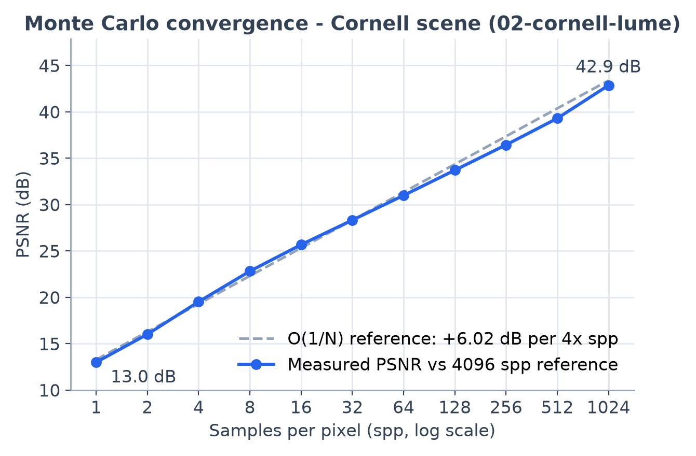
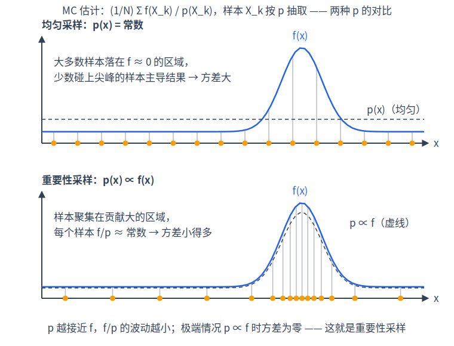

# 第 3 章 蒙特卡洛积分

[第 2 章·光的度量与渲染方程](02-rendering-equation.md)结尾我们面对的是一个没有解析解的方程：积分号里藏着递归的 $`L_i`$，展开后维数无穷。本章引入全书最重要的数值工具——蒙特卡洛（Monte Carlo / MC）积分，回答三个问题：怎么用随机采样算积分？渲染图像的噪点从哪来、为什么加 spp 就变干净？以及两件渲染器每一帧都在用的技术——重要性采样与 pdf 换元。

## 3.1 蒙特卡洛估计量与无偏性

先给直觉：想估计一个积分，就随机抽一些点，把"函数值 ÷ 抽到这个点的概率密度"取平均。抽得密的地方每个样本只代表一小片区域，抽得稀的地方每个样本要代表一大片——除以概率密度函数（probability density function / pdf）正是这个"代表面积"的补偿。

严格地说，要计算 $`I = \int_D f(x)\,dx`$，我们从某个 pdf $`p`$ 独立抽取 $`N`$ 个样本 $`X_1,\dots,X_N`$，构造估计量

```math
\hat F_N = \frac{1}{N}\sum_{k=1}^{N}\frac{f(X_k)}{p(X_k)}
```

它是无偏的（unbiased）——期望恰好等于真值，两行期望运算即可验证：

```math
\mathbb{E}\big[\hat F_N\big] = \frac{1}{N}\sum_{k=1}^{N}\mathbb{E}\!\left[\frac{f(X_k)}{p(X_k)}\right] = \mathbb{E}\!\left[\frac{f(X)}{p(X)}\right] = \int_D \frac{f(x)}{p(x)}\,p(x)\,dx = \int_D f(x)\,dx = I
```

唯一的条件是 $`f(x)\neq 0`$ 处必须 $`p(x)>0`$——任何"$`f`$ 有值却永远抽不到"的区域都会造成系统性偏暗。

举个手算得动的例子：$`I=\int_0^1 x^2\,dx = 1/3`$。取均匀分布 $`p\equiv 1`$，抽 4 个随机数 0.81、0.13、0.55、0.42，估计值为 $`(0.81^2+0.13^2+0.55^2+0.42^2)/4 \approx 0.29`$。不等于 $`1/3`$，但重抽一批会得到 0.36、0.31……**围着真值抖**，抖动幅度随 $`N`$ 增大而缩小——这个"抖"落到图像上就是噪点，缩小的规律就是下一节的收敛速率。

MC 的杀手锏是**收敛速率与维数无关**。传统数值求积（梯形、Simpson）在 $`d`$ 维需要 $`n^d`$ 个格点，维数一高立刻爆炸；而 MC 只看样本数 $`N`$。渲染方程递归展开后是无穷维积分（见[第 4 章·路径追踪算法](04-path-tracing.md)），MC 是唯一现实的选择。在 sundog 里，"一个样本"就是一条从相机出发的完整光线路径，每像素采样数（samples per pixel / spp）就是 $`N`$；像素真值是期望，屏幕上看到的噪点就是估计量的方差。

## 3.2 方差与收敛速率：为什么加 spp 就变干净

样本独立，方差按 $`1/N`$ 累加：

```math
\mathrm{Var}\big[\hat F_N\big] = \frac{1}{N}\,\mathrm{Var}\!\left[\frac{f(X)}{p(X)}\right]
```

标准差（噪声的直观幅度）$`\sigma \propto 1/\sqrt{N}`$，即误差是 $`O(1/\sqrt N)`$：**spp 翻 4 倍，噪声减半**。想把噪声再减半，还得再翻 4 倍——这就是路径追踪"越到后面越磨"的原因，也是后面所有降方差技术存在的理由。

顺带解释了 MC 噪点的独特长相：每个像素是一个**独立**的估计量（sundog 中每个 (像素, 样本) 对拥有独立的随机数流，见[第 10 章](10-sampling-denoising.md)），估计误差在相邻像素间互不相关，于是呈现高频的"胡椒盐"颗粒，而不是模糊或条带。这个统计特征后面有两次登场：它让噪点在低 spp 下特别刺眼，也让它特别适合被神经网络降噪器识别并去除。

用峰值信噪比（PSNR，单位 dB）量化：$`\mathrm{PSNR} = 10\log_{10}(\mathrm{MAX}^2/\mathrm{MSE})`$，其中 MSE 是与参考图的均方误差，MAX 是像素的最大可能值（如 8-bit 图取 255，归一化后取 1）——MSE 与 MAX 须在同一尺度下计算。对无偏估计量 MSE 就是方差，$`\propto 1/N`$，于是

```math
\mathrm{PSNR}(4N) - \mathrm{PSNR}(N) = 10\log_{10}4 \approx 6.0\ \mathrm{dB}
```

即**每 4 倍 spp 约 +6 dB**。下图用 02-cornell-lume 场景对 4096 spp 参考图实测了这条斜率：



*图：PSNR(dB) 与 spp（对数轴）的关系，虚线为 +6dB/4× 理论参考斜率。*

主观感受可回看[第 1 章·成像与光线](01-images-and-rays.md)的 spp 五联图（figures/ch01-spp-convergence.png）：1→4→16 spp 的改善肉眼可见，64→256 就只剩细微差别——收敛在对数尺度上是"匀速"的，在线性尺度上越来越慢。

既然硬堆 $`N`$ 代价高，工程上从压低 $`\mathrm{Var}[f/p]`$ 本身下手：本章的重要性采样、[第 10 章·随机数、纹理与 AI 降噪](10-sampling-denoising.md)的分层采样与降噪器，以及第 4 章的 NEE 与 MIS，本质都是方差工程。

## 3.3 重要性采样

把单样本方差展开：

```math
\mathrm{Var}\!\left[\frac{f(X)}{p(X)}\right] = \int_D \frac{f(x)^2}{p(x)}\,dx - I^2
```

$`p`$ 的形状越接近 $`f`$，比值 $`f/p`$ 越平坦，方差越小——这就是重要性采样（importance sampling）：**把样本花在被积函数大的地方**。极端情况：取 $`p = f/I`$（$`f\ge 0`$ 时可归一化），则 $`f(X)/p(X) \equiv I`$ 是常数，一个样本零方差。当然这要求预先知道答案 $`I`$，做不到；但它指明了方向——**按被积函数中已知的因子采样**。

渲染方程的被积函数是 $`f_r \cdot L_i \cdot \cos\theta`$ 三个因子的乘积：$`f_r\cos\theta`$ 由材质决定、形状已知，可以直接按它采样（[第 5 章·材质与 BSDF](05-materials.md)的 cosine 采样与 VNDF 采样）；$`L_i`$ 里"哪儿有灯"也是已知信息，可以主动朝灯采样（第 4 章的 NEE）。两边各擅胜场，第 4 章的 MIS 负责把它们无偏地拼起来。

反面同样重要：若 $`p`$ 与 $`f`$ 失配——$`f`$ 大的地方 $`p`$ 偏偏很小——那么偶尔抽中时 $`f/p`$ 会异常巨大，方差可能比均匀采样更糟。感受一下量级：设 $`f`$ 的能量集中在占定义域 $`10^{-4}`$ 的小区域（一盏小灯），均匀采样平均一万个样本才命中一次，命中时记录的 $`f/p`$ 约是真值的一万倍——均匀 pdf 的 $`1/p`$ 是常数，放大来自 $`f`$ 在小区域内比全域均值大一万倍（单次命中的贡献 ≈ 真值 ÷ 命中概率）——绝大多数样本记 0，偶尔记一个天文数字，方差惨不忍睹；图像上表现为大片黑底上的孤立超亮像素（成因与治理见第 4 章）。而"朝灯采样"的 pdf 把样本全部布在小区域内，同样的样本数方差可以低几个数量级。



*图：同一被积函数下，均匀采样把大量样本浪费在 f≈0 的区域；重要性采样按 f 的形状布点，f/p 近乎常数。*

## 3.4 pdf 的换元：面积域 ↔ 立体角域

$`\hat F`$ 里的 $`p`$ 必须是"样本实际所在域"的 pdf。若采样发生在域 $`A`$、而积分写在域 $`B`$，就要按变量替换把 pdf 换过去：$`y = T(x)`$ 时 $`p_Y(y) = p_X(x)\,/\,|\det J_T|`$。

渲染里最常用的一次换元：**在光源表面上均匀取点**（面积域 pdf $`p_A`$），但渲染方程按立体角积分，需要立体角 pdf $`p_\omega`$。由第 2 章立体角定义，光源上的面元 $`dA`$ 对着色点张的立体角是 $`d\omega = dA\cos\theta'/r^2`$——$`r`$ 是两点距离，$`\theta'`$ 是光源法线与连线的夹角（越侧对着你，看起来越"扁"）。于是

```math
p_\omega = p_A\,\frac{r^2}{\cos\theta'}
```

对账代码：`sampleLight()`（device/light_sample.cuh）的矩形/圆盘分支在灯面上均匀采样，$`p_A = 1/\text{area}`$，返回

```c
s.pdf = d2 / (cosL * lt.area);   // area pdf -> solid angle
```

其中 `d2` 即 $`r^2`$、`cosL` 即 $`\cos\theta'`$，正是上式。第 4 章 NEE 与 MIS 的所有 pdf 都要在同一个域（立体角）里比较大小，靠的就是这一步换元。

## 3.5 球面与半球上的常用采样

MC 的最后一块拼图：给定两个均匀随机数 $`(u_1,u_2)\in[0,1)^2`$（GPU 上如何又快又可复现地生成，见[第 10 章](10-sampling-denoising.md)的 PCG32），怎么构造出指定分布的方向？

**均匀球面**。`uniformOnSphere()`（device/rng.cuh）取

```math
z = 1-2u_1,\quad \varphi = 2\pi u_2,\quad (x,y) = \sqrt{1-z^2}\,(\cos\varphi,\sin\varphi)
```

为什么这样就均匀？阿基米德的"帽盒定理"：单位球面上高度落在 $`[z, z+dz]`$ 的环带面积恒为 $`2\pi\,dz`$，与 $`z`$ 无关——所以 $`z`$ 均匀即球面面积均匀。球面总立体角 $`4\pi`$，故 pdf 为常数 $`p(\omega) = 1/(4\pi)`$。

**cosine 加权半球**。`cosineHemisphere()`（device/rng.cuh）用的是 Malley 方法：先在单位圆盘上均匀取点 $`(d_x,d_y)`$，再竖直投影到上半球：

```math
\omega = \left(d_x,\ d_y,\ \sqrt{1-d_x^2-d_y^2}\right)
```

验证它的 pdf。圆盘上均匀分布在极坐标 $`(r,\varphi)`$ 下的联合密度是 $`p(r,\varphi) = r/\pi`$（面积元 $`r\,dr\,d\varphi`$ 乘均匀密度 $`1/\pi`$）。投影后 $`r=\sin\theta`$，换元 $`p(\theta,\varphi) = p(r,\varphi)\,|dr/d\theta| = \sin\theta\cos\theta/\pi`$。最后一步是把"关于 $`d\theta\,d\varphi`$ 的密度"换成"关于 $`d\omega`$ 的密度"——pdf 总要声明相对哪个微元定义，这也是 3.4 节换元的另一次应用：同一分布满足 $`p(\omega)\,d\omega = p(\theta,\varphi)\,d\theta\,d\varphi`$，而 $`d\omega = \sin\theta\,d\theta\,d\varphi`$，故除以其中的 $`\sin\theta`$：

```math
p(\omega) = \frac{\cos\theta}{\pi}
```

归一性自检：$`\int_{H^2}\frac{\cos\theta}{\pi}d\omega = \frac{1}{\pi}\int_0^{2\pi}\!\!\int_0^{\pi/2}\cos\theta\sin\theta\,d\theta\,d\varphi = 1`$，无误。

这个分布是第 5 章 Lambert 材质的完美搭档：其被积因子 $`f_r\cos\theta = (\text{albedo}/\pi)\cos\theta`$ 恰好正比于 $`p(\omega)`$，按 3.3 节的标准这是对方向维度的"零方差"重要性采样——权重 $`f_r\cos\theta/p`$ 化简为常数 albedo，`bsdfSample()`（device/bsdf.cuh）里就是直接一行 `s.weight = albedo`。

圆盘均匀点由 `concentricDisk()`（device/rng.cuh）生成，用的是 Shirley–Chiu 同心映射：以常数雅可比（处处等比例放缩面积）把 $`[0,1)^2`$ 映到单位圆盘，因此均匀性保持，且映射连续、低扭曲——第 10 章的分层抖动经它映射后仍保持分层结构。

最后一个工程细节：`cosineHemisphere()` 生成的方向以 $`+Z`$ 为"法线"（局部坐标系），而着色点的法线 $`n`$ 是任意的世界方向。使用处（`bsdfSample()` 的 MT_LAMBERT 分支）先以 $`n`$ 为轴搭一个正交基 `Onb onb(n)`，采样后 `onb.toWorld(li)` 旋转到世界系——旋转不改变分布形状，pdf 中的 $`\cos\theta`$ 直接就是局部样本的 `li.z`。这个"局部采样 + 正交基旋转"的套路贯穿全书：第 4 章的球灯锥采样、第 5 章的 VNDF 采样都是同一模板。

## 小结

本章建立了 MC 估计量 $`\hat F = \frac1N\sum f/p`$ 及其三条性质：无偏（期望即真值）、$`O(1/\sqrt N)`$ 收敛（spp×4 = 噪声减半 = PSNR+6dB）、方差由 $`p`$ 与 $`f`$ 的匹配度决定（重要性采样）；又准备了两件工具：面积↔立体角的 pdf 换元，以及均匀球面与 cosine 半球两种方向采样。下一章（[第 4 章·路径追踪算法](04-path-tracing.md)）把这些全部用上：对渲染方程递归地做单样本 MC，就是路径追踪；对 $`L_i`$ 的"光源因子"做重要性采样，就是 NEE；两种采样策略的无偏合并，就是 MIS。
