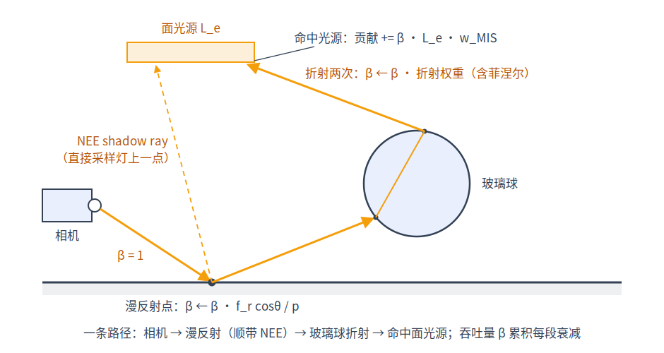
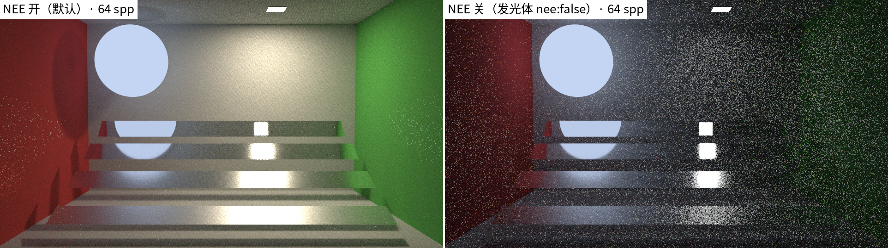
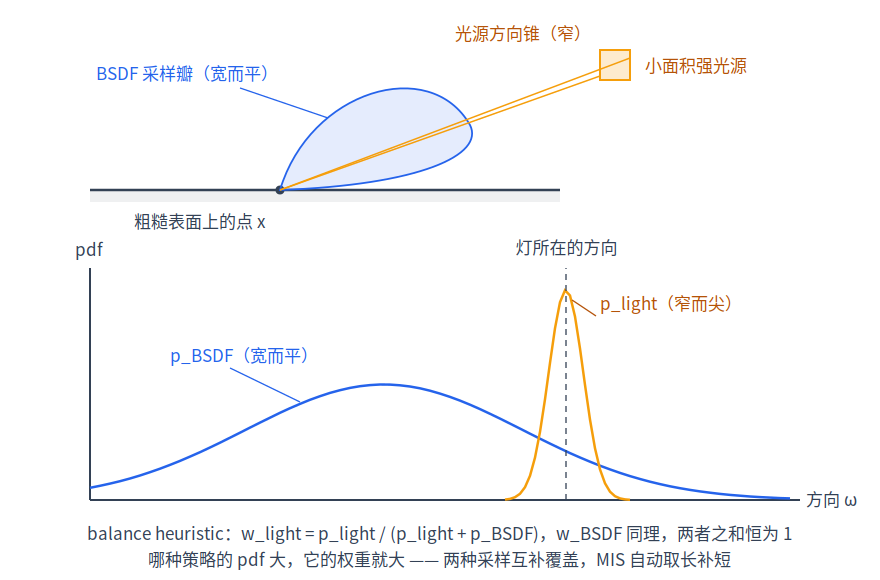
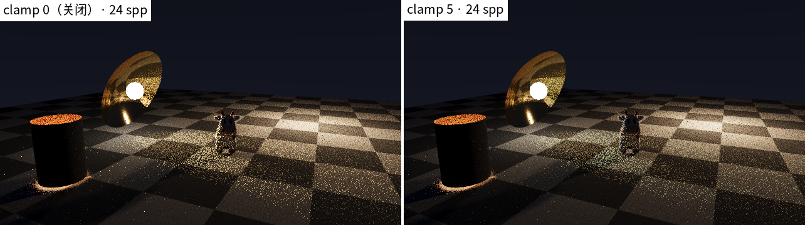

# 第 4 章 路径追踪算法

[第 2 章](02-rendering-equation.md)给出了渲染方程，[第 3 章](03-monte-carlo.md)给出了解它的数值武器。本章把二者拼成完整的路径追踪（path tracing）算法，并逐段对账 sundog 的 raygen 主循环（device/programs.cu）：吞吐量 β 的维护、NEE、MIS、俄罗斯轮盘与 clamp——读完本章，渲染器核心循环的每一行都有出处。

## 4.1 递归展开与吞吐量 β

渲染方程 $`L_o = L_e + \int f_r\,L_i\cos\theta\,d\omega`$ 的右边藏着 $`L_i`$——它是别处表面的 $`L_o`$，本身又满足同一个方程。反复代入：

```math
L = L_{e,1} + \int f_1\cos\theta_1\Big(L_{e,2} + \int f_2\cos\theta_2\big(L_{e,3}+\cdots\big)\,d\omega_2\Big)d\omega_1
```

展开成按"路径长度"分组的求和：像素值 = 长度 1 的路径（直接看见发光体）+ 长度 2（弹一次）+ 长度 3 + ⋯ 的贡献之和。这就是路径积分观点：**渲染 = 对所有可能的光路径求和**，每条路径的被积函数是沿途 $`f_k\cos\theta_k`$ 的连乘再乘上末端的 $`L_e`$。

MC 的处理干脆利落：每层积分只用 1 个样本。从相机出发，在第 $`k`$ 个顶点按 pdf $`p_k`$ 采样下一个方向 $`\omega_k`$，走到第 $`j+1`$ 个顶点命中发光体时，按第 3 章的估计量，这条路径的贡献是

```math
\underbrace{\prod_{k=1}^{j}\frac{f_k\cos\theta_k}{p_k}}_{\displaystyle \beta_j}\cdot L_e
```

前缀积 $`\beta`$ 就是吞吐量（throughput）——这条路径"还剩多少携带光的能力"，每弹一次乘上一个因子即可迭代维护：

```math
\beta \leftarrow \beta\cdot\frac{f_r\cos\theta}{p(\omega)}
```

对账：raygen 主循环里就是一行 `beta *= bs.weight`（device/programs.cu）。`bsdfSample()`（device/bsdf.cuh）返回的 `weight` 字段定义即 $`f\,|\cos\theta|/p`$——这个比值在每种材质里**解析化简**后才写代码（Lambert 恰好等于 albedo，GGX 化简为 $`F\cdot G/G_1`$，推导见[第 5 章·材质与 BSDF](05-materials.md)），避免分子分母分别计算再相除的数值风险。循环由 `maxDepth` 封顶，写成迭代而非递归——GPU 上没有便宜的调用栈，整个循环住在 raygen 程序里（megakernel 组织方式见[第 9 章·OptiX 工程实现](09-optix-pipeline.md)）。



*图：一条典型路径。漫反射顶点处额外伸出一条 NEE 阴影线（虚线），玻璃顶点是 delta 反弹、无 NEE。*

## 4.2 纯 BSDF 采样打不中小灯：NEE

只靠 BSDF 采样方向、撞到发光体才记账，有个致命问题：灯越小，被随机方向撞中的概率越小；而小灯要照亮场景，$`L_e`$ 必然巨大，偶尔撞中时单次贡献 $`\beta\,f\cos\theta\,L_e/p`$ 异常大（$`f\cos\theta/p`$ 本身有界，如 Lambert 恒为 albedo）——方差爆炸；极限情况是点光源与平行光——它们没有面积，对任何着色点只张零立体角（方向分布数学上是 Dirac delta，下称 **delta 灯**），BSDF 光线命中概率严格为 0，画面直接全黑。

下一事件估计（next event estimation / NEE，即"直接光采样"）反其道而行：在每个非镜面顶点 $`x`$，**主动**向光源连线。sundog 的 NEE 段（device/programs.cu）分四步：

1. **均匀选灯**：`k = min(rnd()*numLights, numLights-1)`，选中概率 $`1/\text{numLights}`$；
2. **在灯上采样**：`sampleLight()`（device/light_sample.cuh）按灯型给出方向 `wi`、距离与立体角 pdf——矩形/圆盘在面上均匀取点后按第 3 章换元 `pdf = d2/(cosL*area)`；球灯在可见球冠内立体角均匀，`pdf = 1/(2π(1−cosθ_max))`，其中 $`\theta_{max}`$ 是球面对着色点张开的锥半角（$`\sin\theta_{max} = R/d`$，$`R`$ 为球半径，$`d`$ 为着色点到球心的距离）；点光/平行光是 delta 灯，标记 `isDelta`、`pdf = 1` 且衰减已折进 `Li`（点光实际在半径为 `radius` 的小圆盘上取点以产生软阴影，但记账上仍视为 delta 灯）；
3. **阴影线（shadow ray）验可见性**：起点 `offsetRay(x, ns)` 防自交，`tmax = dist*0.999` 防打中灯本身；不透明表面算完全遮挡，穿透面与 alpha 镂空由 anyhit 放行，玻璃/水则沿直线累积透射率而非硬遮挡（机制见[第 16 章·透明阴影与嵌套介质](16-transparent-media.md)）；
4. **记账**：可见则累加

```math
\beta\,\frac{f_r(\omega_i)\,\cos\theta\;L_i}{p_{le}}\,w,\qquad p_{le} = \frac{p_\omega(\omega_i)}{\text{numLights}}
```

其中 $`\beta`$ 是 4.1 节的路径吞吐量，$`w`$ 是下一节将引入的 MIS 权重——本节可暂视为 1（对 delta 灯它恒为 1）。对应代码 `c = beta * f * cosS * ls.Li * w / pdfLe`，其中 `pdfLe = (ls.isDelta ? 1 : ls.pdf) / numLights`——选灯概率作为分母的一部分，等价于对"所有灯的贡献之和"做单样本估计。

delta 灯**只能**靠 NEE：BSDF 光线命中它们的概率为零。所以它们不参与下节的 MIS——代码里 `ls.isDelta` 时权重取 1，且 `lightPdfSolidAngle()` 对 delta 灯返回 0，两边约定一致。

一个容易忽略的细节：单面灯的两侧判断必须两头一致——`sampleLight()` 拒绝从背面照射（`!twoSided && cosL <= 0`），发光体被 BSDF 光线命中时同样只有 `frontface || twoSided` 才发光；连纹理化的 `Li` 都要与命中时的求值逐位一致，否则 MIS 两侧对不上账、产生偏差（light_sample.cuh 顶部注释特意强调了这一点）。



*图：Cornell 类场景 64 spp。左：NEE 开（默认）；右：发光体不注册为灯（nee:false），只能靠 BSDF 采样撞灯，噪声急剧恶化。*

## 4.3 双重计数与 MIS

引入 NEE 后出现了新问题：同一类"最后一段连到面光源"的路径，现在有**两条获取途径**——顶点 $`x`$ 处的 NEE 连线，以及 $`x`$ 处 BSDF 采样恰好命中同一盏灯。两边都全额记账，这部分能量期望翻倍——双重计数，图像系统性偏亮。

只保留一边行不行？各有不擅长的场景：小而亮的灯，NEE 的 pdf 集中、BSDF 采样几乎打不中；大灯配光滑金属，BSDF 的波瓣（lobe，指方向分布集中的那一团区域，表面越光滑反射波瓣越窄）很窄，而 NEE 的样本撒满整个灯面、落进波瓣的 $`f_r`$ 巨大——哪边"独占"都会在另一边的强项上方差爆炸。

多重重要性采样（multiple importance sampling / MIS）让两边**都记账但各打折扣**。设同一被积函数 $`g(\omega)`$，两种策略 pdf 为 $`p_a, p_b`$，各取一个样本并配权：

```math
F = w_a(X_a)\frac{g(X_a)}{p_a(X_a)} + w_b(X_b)\frac{g(X_b)}{p_b(X_b)}
```

无偏性推导：

```math
\mathbb{E}[F] = \int w_a(\omega)\,g(\omega)\,d\omega + \int w_b(\omega)\,g(\omega)\,d\omega = \int \big(w_a+w_b\big)\,g\,d\omega
```

只要在 $`g\neq 0`$ 处处 $`w_a(\omega)+w_b(\omega)=1`$（且 $`p_s=0`$ 处 $`w_s=0`$），就有 $`\mathbb{E}[F]=\int g\,d\omega`$，无偏。平衡启发式（balance heuristic）取

```math
w_s(\omega) = \frac{p_s(\omega)}{p_a(\omega)+p_b(\omega)}
```

显然满足归一条件。它的妙处代入即见：无论哪一侧，加权后的单样本贡献都是

```math
\frac{g}{p_s}\cdot\frac{p_s}{p_a+p_b} = \frac{g}{p_a+p_b} \le \frac{g}{\max(p_a,p_b)}
```

——一侧 pdf 过小导致的 $`1/p`$ 爆炸，被**另一侧**的 pdf 压住了。直觉：按"哪种策略更容易产生这个样本"分配话语权，谁擅长谁多拿。

对账 sundog 的两侧权重（device/programs.cu），$`g`$ 是"经 $`x`$ 连到灯上点 $`y`$"的贡献，$`p_a`$ 是 NEE 的立体角 pdf、$`p_b`$ 是 BSDF 的：

- **NEE 侧**：`w = pdfLe / (pdfLe + pdfB)`，其中 `pdfB = bsdfPdf(mat, -d, ls.wi, ns)`；
- **发光体命中侧**：BSDF 光线打中注册为灯的发光体时，`w = prevPdf / (prevPdf + pdfL)`，其中 `prevPdf` 是上一顶点 BSDF 采样的立体角 pdf，`pdfL = lightPdfSolidAngle(lights[lightId], prevX, x) / numLights`。注意这笔账记在**下一次**循环迭代：采样方向时把 `bs.pdf` 与当前顶点位置存入 `prevPdf`/`prevX`，命中发光体时才拿出来配权（对应 4.6 伪代码中 `prevPdf`/`prevX` 的赋值行）。

两式互补：对同一对顶点 $`(x, y)`$，`lightPdfSolidAngle()` 与 `sampleLight()` 的 pdf 公式逐字相同，选灯的 $`1/\text{numLights}`$ 因子则在 raygen 的两处调用点（`pdfLe` 与 `pdfL`）各除一次、恰好一致；`bsdfPdf()` 与采样时的 `bs.pdf` 一致，因此两侧权重之和恰为 1——正是无偏条件。

边界情形由 `specularBounce` 标志兜底（初值 true）：上一段是**相机光线**或 **delta 反弹**（镜面/玻璃，`bsdfIsDelta()` 为真时整个 NEE 被跳过）时，发光体命中侧独家记账、$`w=1`$——因为竞争对手根本不存在。未注册为灯的发光体（`lightId < 0`，即场景里 nee:false 的发光体）同理 $`w=1`$。



*图：小亮灯场景中，光源采样 pdf 在灯的方向上集中（NEE 擅长），BSDF 采样 pdf 覆盖反射波瓣（掠射大灯时擅长）；balance heuristic 按二者比例分配权重。*

## 4.4 俄罗斯轮盘：无偏地终止路径

路径该在哪里停？固定深度一刀切会丢掉更长路径的能量，是有偏的。俄罗斯轮盘（Russian roulette / RR）：以概率 $`q`$ 让路径存活并把后续贡献除以 $`q`$，以概率 $`1-q`$ 终止。期望不变，两行证明——设 $`F`$ 是继续走下去的贡献估计量，RR 后的估计量 $`F'`$ 满足

```math
\mathbb{E}[F'] = q\cdot\mathbb{E}\!\left[\frac{F}{q}\right] + (1-q)\cdot 0 = \mathbb{E}[F]
```

代价是方差略增（存活路径权重被放大），换来平均路径长度大幅缩短——典型的"用一点方差买时间"。

对账 RR 段（device/programs.cu）：`depth >= 4` 即启动（前四段承载绝大部分能量，不值得赌）；存活率取吞吐量的最大分量并夹到区间内：

```c
float q = clampf(maxComp(beta), 0.05f, 0.95f);
if (rng.rnd() >= q) break;
beta *= 1.0f / q;
```

β 越暗死得越快——本来就带不动多少能量的路径优先淘汰，正是重要性思想在"路径长度"维度上的体现。

## 4.5 firefly 与 clamp：拿偏差换方差

即便有 MIS，仍有些路径类别 pdf 极小而贡献不小：典型如穿过 delta 链（玻璃、镜面）之后命中强光源或聚焦区——delta 链上 NEE 缺席、MIS 帮不上忙（$`w=1`$），而[第 6 章·几何求交](06-geometry.md)的抛物面恰好是聚焦制造机。这类样本的 $`1/p`$ 重尾让单个样本比像素均值大几个数量级，屏幕上出现孤立的超亮像素——萤火虫噪点（firefly）。按 $`1/\sqrt N`$ 收敛，一颗 firefly 要靠海量 spp 才能摊平。

工程解法简单粗暴：对**单次贡献**逐通道设上限。这是有偏的——亮的间接特征如焦散（caustics，光经镜面或玻璃聚焦在漫反射面上形成的亮斑）会被压暗——但把近乎无界的方差换成有界且可控的偏差，低 spp 下净收益显著，对[第 10 章](10-sampling-denoising.md)的降噪器也更友好。

对账：raygen 里三处贡献（背景、发光体命中、NEE）累加前都有同一句

```c
if (depth >= 1 && params.clampVal > 0.0f) c = min3(c, f3(params.clampVal));
```

**仅 depth ≥ 1 生效**：depth = 0 的贡献——相机直接看到的背景、直接可见的发光体、首个顶点的直接光——永不 clamp。于是直接光照与"看得见的灯"保持严格无偏，偏差被圈禁在间接光里。此外 `sanitize()` 把偶发的 NaN/Inf 归零，是最后一道数值防线。



*图：04-parabolica 24 spp。左：`--clamp 0`（关闭），镜面/折射路径产生大量 firefly；右：`--clamp 5`（刻意取小值使抑制在低 spp 下肉眼可见；该场景默认 clamp 30 与关闭的实测差异在 59 dB 量级——ACES 肩部把残余的超亮贡献压得极扁，8-bit 上不可辨），亮斑消失，间接高光略有压暗。*

## 4.6 完整伪代码

以下伪代码与 `__raygen__render()`（device/programs.cu）逐行对应：

```text
L ← 0;  β ← 1;  specular ← true;  prevPdf ← 0;  (o,d) ← 相机光线
for depth = 0 .. maxDepth-1:
    hit ← traceRadiance(o, d)                       # 一次 optixTrace（第 9 章）
    if !hit:
        L += clamp?(β · 背景色); break               # clamp? 表示仅 depth≥1 生效
    x ← o + hit.t·d;  n ← 命中法线;  mat ← 材质
    if mat 是发光体:                                  # —— BSDF 命中灯，MIS 一侧
        if hit.frontface 或 mat.twoSided:             # 单面灯背面不发光，与 sampleLight 的背面拒绝一致
            w ← 1
            if !specular 且 hit.lightId ≥ 0:
                pdfL ← lightPdfSolidAngle(灯, prevX, x) / numLights
                w ← prevPdf / (prevPdf + pdfL)
            L += clamp?(β · Le · w)
        break
    if 有灯 且 mat 非 delta:                          # —— NEE，MIS 另一侧
        k ← 均匀选一盏灯;  ls ← sampleLight(lights[k], x)
        if ls.valid 且 cosS = ls.wi·n > 0 且 阴影线透射率 Tr > 0:   # 贡献 ×= Tr（第 16 章）
            pdfLe ← (ls.isDelta ? 1 : ls.pdf) / numLights
            w ← ls.isDelta ? 1 : pdfLe / (pdfLe + bsdfPdf(ls.wi))
            L += clamp?(β · f · cosS · ls.Li · w / pdfLe)
    bs ← bsdfSample(mat, d, n)                       # —— 延伸路径
    if !bs.valid: break
    β *= bs.weight                                    # = f·cosθ/p，解析化简
    specular ← bs.isDelta;  prevPdf ← bs.isDelta ? 0 : bs.pdf;  prevX ← x
    o ← offsetRay(x);  d ← bs.wi
    if depth ≥ 4:                                     # —— 俄罗斯轮盘
        q ← clamp(maxComp(β), 0.05, 0.95)
        if rnd() ≥ q: break
        β *= 1/q
像素 ← 增量平均(sanitize(L))                          # 在线均值，支持分块累积
```

三种记账出口（背景、发光体、NEE）加一个延伸动作，就是路径追踪的全部骨架。

## 小结

本章从渲染方程的递归展开得到路径积分，并落成迭代算法：β 记录路径的累积衰减（`beta *= bs.weight`）；NEE 主动连灯解决"撞不中小灯"（delta 灯只能靠它）；MIS 的 balance heuristic 用互补权重（`pdfLe/(pdfLe+pdfB)` 与 `prevPdf/(prevPdf+pdfL)`）无偏地合并两种策略；RR 无偏地终止暗路径；clamp 用可控偏差压制 firefly。循环里尚未展开的两个黑盒——`bsdfSample()` 内部的 $`f`$、$`p`$ 与权重如何按材质推导，正是[第 5 章·材质与 BSDF](05-materials.md)的主题；而 `traceRadiance()` 一行背后的求交与加速，见第 6、8、9 章。
