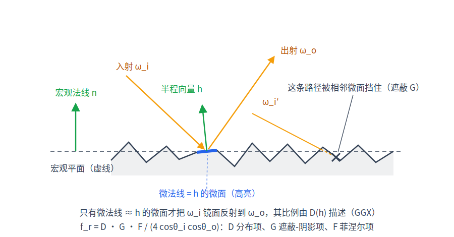
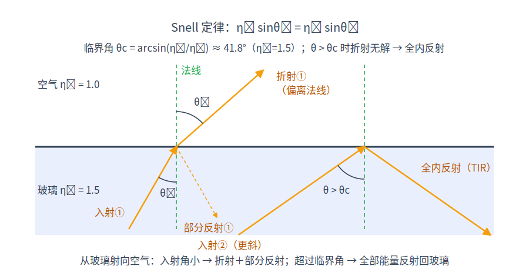

# 第 5 章 材质与 BSDF

[第 4 章·路径追踪算法](04-path-tracing.md)的主循环在每个命中点调用三个接口：采样一个新方向（`bsdfSample()`）、对给定方向求值（`bsdfEval()`）、算出该方向的 pdf（`bsdfPdf()`）——它们合起来就是"材质"。本章回答：漫反射、金属、玻璃在数学上分别是什么函数？粗糙度如何进入方程？这三个接口的每个公式都能在 `device/bsdf.cuh` 中逐行找到对应。

## 5.1 朗伯漫反射：权重恰好是反照率

粉笔、石膏、粗糙的墙面有一个共同点：不管从哪个角度看，亮度都差不多。这类**朗伯（Lambertian）**材质的 BSDF 是一个常数。[第 2 章·光的度量与渲染方程](02-rendering-equation.md)已推导过，能量守恒把这个常数定为

```math
f_r = \frac{\text{albedo}}{\pi},
```

其中 albedo 是反照率（各通道反射的能量比例，$`\le 1`$）。

怎么采样它？渲染方程的被积函数是 $`f_r\,L_i\cos\theta`$，其中 $`f_r`$ 是常数，所以按[第 3 章·蒙特卡洛积分](03-monte-carlo.md)的重要性采样原则，pdf 应正比于 $`\cos\theta`$，即 $`p(\omega)=\cos\theta/\pi`$（归一化：$`\int_{H^2}\frac{\cos\theta}{\pi}\,\mathrm{d}\omega = 1`$）。其构造（Malley 方法：均匀圆盘点"竖直抬升"到半球）与 $`p(\omega)=\cos\theta/\pi`$ 的验证见第 3 章 3.5 节，实现即 `cosineHemisphere()`（device/rng.cuh）。于是第 4 章维护的吞吐量因子出现一个漂亮的化简：

```math
\frac{f_r\cos\theta}{p(\omega)}=\frac{\text{albedo}}{\pi}\cdot\cos\theta\cdot\frac{\pi}{\cos\theta}=\text{albedo}.
```

**权重恰好是反照率**——`bsdfSample()`（device/bsdf.cuh）的 `MT_LAMBERT` 分支正是这么写的：`s.pdf = li.z / π`（`li.z` 即局部坐标里的 $`\cos\theta`$），`s.weight = albedo`。直观解释：每弹一次，路径能量按材质吸收率打一次折扣，$`\beta`$ 单调不增，能量守恒自动成立。

## 5.2 微表面理论与 GGX

镜子和拉丝金属的区别是什么？微观上两者都是镜面反射，差别只在表面的平整程度。**微表面（microfacet）**理论把宏观上"粗糙"的表面建模为大量朝向随机的微小镜面的统计集合：粗糙度越大，微镜面法线越发散，反射瓣越糊。


*图：宏观表面由微镜面构成；只有法线恰好等于半程向量 h 的微镜面才把 ω_i 反射向 ω_o；部分微镜面被遮蔽（masking）或处于阴影（shadowing）。*

先定义**半程向量**（half vector）$`h=\dfrac{\omega_i+\omega_o}{\lVert\omega_i+\omega_o\rVert}`$：只有法线正好等于 $`h`$ 的那部分微镜面，才能把来自 $`\omega_i`$ 的光镜面反射向 $`\omega_o`$。微表面 BRDF 由三个因子组成：

**法线分布函数（normal distribution function / NDF）** $`D(h)`$ 描述微镜面法线的统计密度。sundog 用 GGX（又名 Trowbridge–Reitz）分布：

```math
D(h)=\frac{\alpha^2}{\pi\big((n\cdot h)^2(\alpha^2-1)+1\big)^2},
```

其中**粗糙度（roughness）**参数 $`\alpha=\text{roughness}^2`$（这层平方映射让滑杆手感更线性，对账 `MaterialDesc.roughness` 的注释与各调用点的 `alpha = roughness * roughness`；[第 16 章](16-rough-dielectric.md)的磨砂玻璃透射沿用同一映射）。这正是 `ggxD()`（device/bsdf.cuh）：数值稳定形式 `k = α²c² + (1−c²)`，返回 `α²/(π k²)`——紧凑写法 `c²(α²−1)+1` 数学等价，但在极小 α 下会被 float 舍入吞掉 α² 项，来龙去脉见第 16 章 §16.5。GGX 的特点是"尾巴长"——离 $`n`$ 很远的方向仍有少量密度，高光边缘因此有真实的柔和过渡。

**几何遮蔽项（masking-shadowing）** $`G`$ 描述微镜面之间的互相遮挡：掠射角下大部分微镜面要么背对视线（遮蔽）要么照不到光（阴影）。Smith 模型先定义辅助函数

```math
\Lambda(\omega)=\frac{-1+\sqrt{1+\alpha^2\tan^2\theta}}{2},
```

然后单向遮蔽 $`G_1(\omega)=\dfrac{1}{1+\Lambda(\omega)}`$，双向遮蔽用高度相关形式

```math
G(\omega_o,\omega_i)=\frac{1}{1+\Lambda(\omega_o)+\Lambda(\omega_i)}.
```

对账 `ggxLambda()`：代码里 `t2 = (1−c²)/c²` 就是 $`\tan^2\theta`$，返回 `0.5(−1+√(1+α²t2))`；`ggxG1()`、`ggxG()` 与上两式逐字对应。

**菲涅尔项** $`F`$ 留到 5.4 节。三者合成完整的微表面 BRDF：

```math
f_r(\omega_o,\omega_i)=\frac{F(\omega_o\cdot h)\,D(h)\,G(\omega_o,\omega_i)}{4\,(n\cdot\omega_o)(n\cdot\omega_i)},
```

分母中的 4 来自半程向量 $`h\to`$ 出射方向的换元雅可比（5.3 节将给出 $`\mathrm{d}\omega_i=4(\omega_o\cdot h)\,\mathrm{d}\omega_h`$），两个余弦则来自把微表面反射功率换算回宏观辐亮度时的投影面积因子；完整推导可参考 Walter et al. 2007。对账 `bsdfEval()` 的 `MT_METAL` 分支：`F * ggxD(h,α) * ggxG(lo,li,α) / (4 lo.z li.z)`，其中 `lo.z`、`li.z` 是局部标架（`Onb`，$`n=+Z`$）下的两个余弦，与公式一致。


*图：5 个金属球，roughness = 0 / 0.1 / 0.25 / 0.45 / 0.7——从完美镜面到近漫反射的连续过渡。*

## 5.3 VNDF 采样：按"看得见的"微镜面采样

有了 $`f_r`$ 还需要好的采样策略。朴素做法按 $`D`$ 采样微镜面法线，但掠射角下 $`D`$ 采出的很多法线属于被遮蔽的微镜面——要么产生无效方向，要么权重出现 $`1/(n\cdot\omega_o)`$ 的爆炸项。更好的做法是只按**从 $`\omega_o`$ 方向看得见的**微镜面采样，即**可见法线分布采样（VNDF sampling）**。它的目标密度有直观的构成：分子 $`G_1(\omega_o)\,(\omega_o\cdot h)\,D(h)`$ 是"法线为 $`h`$ 且从 $`\omega_o`$ 方向看得见"的微镜面朝 $`\omega_o`$ 的投影面积密度，分母 $`n\cdot\omega_o`$ 是它在半球上的积分值（宏观表面的投影面积），除掉后恰好归一：

```math
D_{\text{vis}}(h)=\frac{G_1(\omega_o)\,(\omega_o\cdot h)\,D(h)}{n\cdot\omega_o}.
```

`ggxSampleVndf()`（device/bsdf.cuh）实现 Heitz 的构造，分三步：①按 $`\alpha`$ 把空间拉伸成粗糙度为 1 的"标准"空间；②在 $`\omega_o`$ 的投影半圆盘上均匀采样；③还原拉伸并归一化——短短十行，精确产生 $`D_{\text{vis}}`$ 分布（细节见 Heitz, "Sampling the GGX Distribution of Visible Normals", 2018）。采到 $`h`$ 后令 $`\omega_i=\mathrm{reflect}(-\omega_o,h)`$，其中 $`\mathrm{reflect}(v,n)=v-2(v\cdot n)n`$，即把 $`v`$ 关于法线 $`n`$ 做镜像（`reflect()`，device/math.cuh）；从 $`h`$ 到 $`\omega_i`$ 的变换雅可比是 $`\frac{1}{4(\omega_o\cdot h)}`$（即 $`\mathrm{d}\omega_i=4(\omega_o\cdot h)\,\mathrm{d}\omega_h`$），于是

```math
p(\omega_i)=\frac{D_{\text{vis}}(h)}{4(\omega_o\cdot h)}=\frac{G_1(\omega_o)\,D(h)}{4\,(n\cdot\omega_o)},
```

对账 `ggxPdf()`：`ggxG1(wo,α) * ggxD(h,α) / (4 wo.z)`。这个 pdf 也被第 4 章的 MIS 用来给 NEE 侧算平衡启发式权重。采样权重随之化简：

```math
\frac{f_r\,(n\cdot\omega_i)}{p(\omega_i)}
=\frac{F\,D\,G}{4(n\cdot\omega_o)(n\cdot\omega_i)}\cdot(n\cdot\omega_i)\cdot\frac{4(n\cdot\omega_o)}{G_1(\omega_o)\,D}
=F\cdot\frac{G}{G_1(\omega_o)}.
```

$`D`$、两个余弦全部相消，只剩菲涅尔乘一个 $`\le 1`$ 的遮蔽比值——对账 `bsdfSample()` `MT_METAL` 分支：`s.weight = F * (ggxG(...) / ggxG1(...))`。由于 $`G/G_1(\omega_o)\le 1`$ 且 $`F\le 1`$，权重永不大于 1，金属材质不产生萤火虫噪点。

当 `roughness < 1e-3` 时反射瓣已窄于浮点精度，代码退化为**delta 镜面**：方向由 `reflect()` 唯一确定，pdf 在数学上是狄拉克 delta 分布，无法参与普通的 pdf 运算，因此 `s.pdf = 0`、`s.isDelta = true`、权重直接取 $`F`$。第 4 章的 NEE 与 MIS 靠 `bsdfIsDelta()` 识别并跳过这类瓣（对光源方向求值恒为零，采样它没有意义）。

## 5.4 菲涅尔：反射与透射的分配

站在湖边：低头看脚下的水几乎透明，远眺水面却像镜子。反射与透射的比例随入射角变化，这就是**菲涅尔（Fresnel）**效应。对折射率为 $`\eta_i\to\eta_t`$ 的电介质界面，物理精确的（非偏振）反射率为

```math
r_s=\frac{\eta_i\cos\theta_i-\eta_t\cos\theta_t}{\eta_i\cos\theta_i+\eta_t\cos\theta_t},\qquad
r_p=\frac{\eta_t\cos\theta_i-\eta_i\cos\theta_t}{\eta_t\cos\theta_i+\eta_i\cos\theta_t},\qquad
F=\frac{r_s^2+r_p^2}{2},
```

其中 $`\theta_t`$ 是折射（透射）角，由下节的 Snell 定律 $`\eta_i\sin\theta_i=\eta_t\sin\theta_t`$ 确定。实时与离线渲染中广泛使用 Schlick 近似：

```math
F(\cos\theta)\approx F_0+(1-F_0)(1-\cos\theta)^5,\qquad
F_0=\left(\frac{1-\eta}{1+\eta}\right)^2,
```

其中 $`F_0`$ 是垂直入射反射率（玻璃 $`\eta=1.5`$ 时 $`F_0=0.04`$），$`\eta`$ 是相对折射率。sundog 全部使用 Schlick：标量版 `schlick()`（device/math.cuh）把 $`(1-\cos\theta)^5`$ 写成 `m2*m2*m` 并夹取 $`1-\cos\theta\in[0,1]`$；三通道版 `schlick3()` 形式相同。


*图：η=1.5 的精确 Fresnel 与 Schlick 近似，0°–90°——两条曲线高度贴合，仅在 85° 附近有约 0.036 的最大绝对偏差。*

金属没有透射，其菲涅尔反射率天然是彩色的（金反黄光、铜反红光）。工程上的标准做法是**把材质颜色直接当作 $`F_0`$**：`bsdfEval()` 与 `bsdfSample()` 的金属分支都写作 `schlick3(dot(lo,h), albedo)`——正视金属时看到的颜色就是 $`F_0`$，掠射时按 Schlick 曲线趋白，这正是真实金属边缘泛白的原因。

## 5.5 折射与全内反射

光穿过玻璃界面时方向改变，服从 Snell 定律 $`\eta_i\sin\theta_i=\eta_t\sin\theta_t`$。记相对折射率 $`\eta=\eta_i/\eta_t`$，把单位入射方向 $`v`$ 分解为切向与法向分量可推出折射方向：

```math
\omega_t=\eta\,v+\big(\eta\cos\theta_i-\sqrt{k}\big)\,n,\qquad
k=1-\eta^2(1-\cos^2\theta_i)=\cos^2\theta_t,
```

其中 $`\cos\theta_i=-v\cdot n`$（$`n`$ 已朝向入射侧）。对账 `refract()`（device/math.cuh）：`cosi = -dot(v,n)`、`k = 1 - eta*eta*(1 - cosi*cosi)`、`out = eta*v + (eta*cosi - sqrtf(k))*n`，并在 `k < 0` 时返回 `false`。


*图：折射几何、临界角与全内反射——光从密介质射向疏介质且入射角超过临界角时，折射方向不存在。*

$`k<0`$ 何时发生？$`k=1-\eta^2\sin^2\theta_i`$，仅当 $`\eta>1`$（从密介质射向疏介质）且 $`\sin\theta_i>1/\eta`$ 时为负——此时 Snell 定律要求 $`\sin\theta_t>1`$，无解，光被完全反射，即**全内反射（total internal reflection / TIR）**。临界角 $`\sin\theta_c = 1/\eta`$，玻璃约 $`41.8°`$。玻璃球内壁的亮环、光纤的导光都来自 TIR。

由此 `bsdfSample()` 的 `MT_DIELECTRIC` 分支要做三个"按面选取"：

1. **相对折射率按面选取**：`eta = frontface ? etaExt/ior : ior/etaExt`——外侧折射率 `etaExt` 来自路径当前所处介质（[第 15 章](15-transparent-media.md)的介质栈；真空中为 1，此时化简为熟悉的 `1/ior` 与 `ior`）。进入玻璃时 $`\eta<1`$（永不 TIR），从密介质离开时 $`\eta>1`$（可能 TIR）——注意水中的玻璃 $`\eta=1.33/1.5`$，临界角与空气中不同。`frontface` 由几何求交阶段根据几何法线与光线方向的点积判定（见 5.6 节与[第 6 章·几何求交](06-geometry.md)）。
2. **$`F_0`$ 与面无关**：$`F_0=\big(\frac{1-\eta}{1+\eta}\big)^2`$ 对 $`\eta`$ 与 $`1/\eta`$ 给出同一个值（玻璃两侧都是 0.04），代码按当前 `eta` 计算，结果对称。
3. **Schlick 的余弦必须取低折射率一侧**：代码写作

```c
// device/bsdf.cuh, MT_DIELECTRIC 分支
float cosine = eta < 1.0f ? -dot(rayDir, n) : -dot(refr, n);
float reflectProb = schlick(cosine, f0);
```

按 $`\eta`$ 选取：$`\eta<1`$ 时用入射角的余弦，$`\eta>1`$ 时用**折射方向的余弦** $`-\,\omega_t\cdot n=\cos\theta_t`$——两者取的都是低折射率一侧的角度；`etaExt = 1` 时这恰好化简为熟悉的进入/离开二分。为什么？Schlick 近似的自变量约定就是疏介质一侧的角度；更直观的检验是连续性：当出射角逼近临界角时 $`\cos\theta_t\to 0`$，Schlick 给出 $`F\to 1`$，与 TIR 分支的"全反射"无缝衔接。若错用密介质一侧的余弦，$`F`$ 在临界角处仍只有约 0.04，反射率被严重低估——这是折射实现里的经典陷阱，完整分析见[附录](appendix-pitfalls.md)。

采样策略与金属的 delta 镜面同理：玻璃是双 delta 瓣（一反一折），以概率 $`F`$ 取反射、$`1-F`$ 取折射，两个分支的 $`f/p`$ 恰好相消，`s.weight = 1`、`isDelta = true`。（严格的辐亮度传输在透射时还应乘 $`\eta^2`$ 缩放因子；对进出成对的封闭玻璃体该因子沿路径相消，delta 分支因此省略它——但注意这个省略只对"纯 BSDF 路径"合法，[第 16 章](16-rough-dielectric.md)的粗糙玻璃因为要被 NEE 单界面求值，必须把 $`\eta^2`$ 请回来。）本章的玻璃是光滑极限——粗糙度让反射与折射各自糊成微表面波瓣的"磨砂玻璃"，见[第 16 章·粗糙电介质](16-rough-dielectric.md)。

出射侧余弦选取的数值差别很悬殊：光线在玻璃内以 40° 入射（临界角 41.8° 以内）时，正确的反射率 $`\mathrm{schlick}(\cos\theta_t)\approx 0.246`$——若错用入射侧余弦，只剩约 0.041，差近 6 倍；超过临界角则必须全反射。任何此处的偏差都会立即改变 golden 图像（[第 11 章·验证方法学与性能](11-validation.md)）。视觉上二者的差别同样醒目：正确的 Fresnel 让玻璃体在掠射与临界角附近内反射显著增强，整体更暗、更"玻璃"；反之则偏亮偏透、丢失内壁亮环。

## 5.6 双面材质与穿透面

sundog 的场景语义里有一条很有表现力的约定：**每个面片的正面和背面可以挂不同材质，也可以不挂材质**。SBT 记录（见[第 9 章·OptiX 工程实现](09-optix-pipeline.md)）里每个实例存 `matFront, matBack` 两个材质索引，特殊值 `MAT_NONE` 表示"该侧无材质"。命中处理时（`packHit()`（device/programs.cu））先用几何法线判定 `frontface = dot(n_geom, rayDir) < 0`，据此选取材质，并把着色法线翻向入射一侧——本章所有公式中的 $`n`$ 都以此为前提（$`n\cdot\omega_o>0`$ 恒成立）。

`MAT_NONE` 的一侧是**穿透面**：任意命中（any-hit / AH）程序 `maskAnyhit()` 对它直接调用 `optixIgnoreIntersection()`，光线如入无物之境。阴影光线走独立的 `shadowAnyhit()`（device/programs.cu），其 `MAT_NONE` 穿透与 alpha 裁剪规则与 `maskAnyhit()` 完全一致（另加[第 15 章·透明阴影与嵌套介质](15-transparent-media.md)的透明阴影衰减），所以光与影的穿透行为保持一致。一个典型用法是第 4 章场景里的抛物面聚光碗：凸面（正面）设 `MAT_NONE`、凹面（背面）挂镜面金属——光线从外侧穿入碗内、在内壁反射聚焦（这也依赖第 6 章"隐式面把两个交点都上报"的设计）。发光材质另有一个 `twoSided` 标志：单面灯只在正面可见（`hit.frontface || mat.twoSided`，对账 raygen 的发光体分支），Cornell 盒顶灯就是典型的单面灯。

## 小结

本章把三种材质放进了同一个接口：朗伯瓣采样权重恰好是反照率；GGX 微表面用 $`D`$、$`G`$、$`F`$ 三因子描述粗糙镜面，VNDF 采样让权重化简为 $`F\cdot G/G_1`$；玻璃在光滑极限下是按菲涅尔概率二选一的双 delta 瓣（粗糙情形见[第 16 章](16-rough-dielectric.md)），TIR 与"Schlick 取疏介质侧余弦"是其正确性的两个关键。所有公式已与 `device/bsdf.cuh`、`device/math.cuh` 逐一对账。下一章回到几何：光线到底怎么"打中"球、圆柱、抛物面和三角形，法线与 UV 从哪里来——[第 6 章·几何求交](06-geometry.md)。
