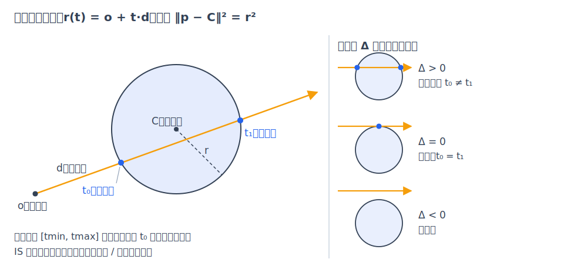
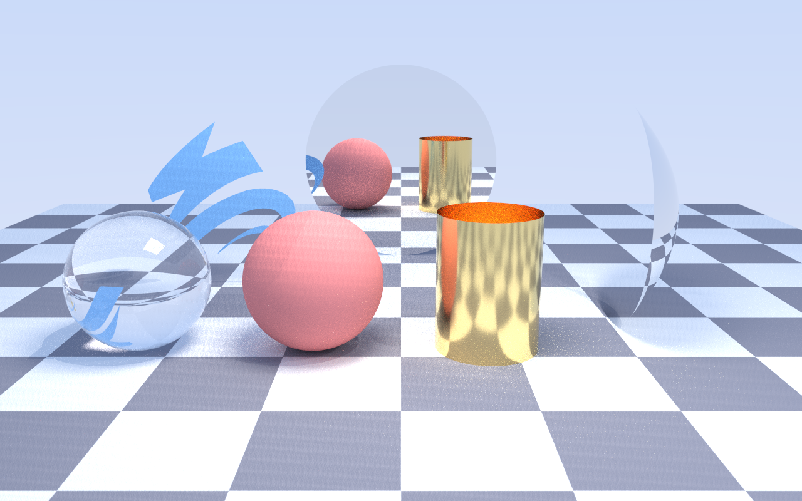
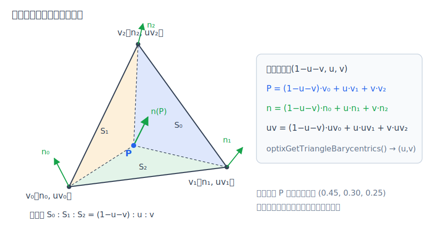
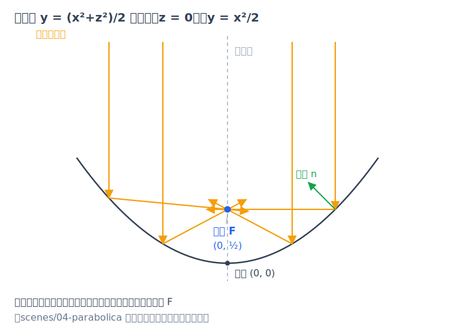

# 第 6 章 几何求交

前面几章把渲染归结为"沿光线找到最近的表面点，在那里做着色与采样"（[第 4 章·路径追踪算法](04-path-tracing.md)、[第 5 章·材质与 BSDF](05-materials.md)），但"找到表面点"本身一直被当作黑盒。本章打开这个黑盒：光线怎么"打中"一个球、圆柱、抛物面或三角形？命中之后，着色需要的法线和纹理坐标又从哪里来？本章公式全部对应 `intersectQuadric()` 等纯函数（device/intersect.cuh）——同一份头文件既编译进 GPU，也被主机端单元测试逐值验证（见[第 11 章·验证方法学与性能](11-validation.md)）。

## 6.1 光线参数化与"最近正根"

光线（ray）写成参数形式

$$r(t) = o + t\cdot d$$

$o$ 是起点，$d$ 是方向，标量 $t$ 沿方向走的"里程"。$t>0$ 在光线前方，$t<0$ 在背后——只有正根才算命中。一条光线可能与场景中许多图元（primitive）相交，最终的着色点是有效区间内 $t$ 最小的那个交点，即"最近正根"原则；跨图元的筛选由 OptiX 的遍历完成（第 8、9 章），单个求交函数只负责把本图元的所有候选根报上去。

有效区间 $(t_{\min}, t_{\max})$ 用严格不等式判断（代码统一写 `t > tmin && t < tmax`）。sundog 的路径光线取 $t_{\min}=0$、$t_{\max}=10^{16}$（`traceRadiance()`（device/programs.cu））；反弹时的自相交问题不靠把 $t_{\min}$ 设成小 ε 解决，而是把新光线的起点沿法线抬高一小段，抬高量随坐标绝对值缩放（`offsetRay()`（device/math.cuh））。阴影光线则把 $t_{\max}$ 设为到光源距离的 0.999 倍，避免打到光源自己。

一个贯穿本章的约定：**不假设 $|d|=1$**。求交发生在图元各自的规范物体空间（球是原点处的单位球，矩形是 $y=0$ 平面上的 $[-1,1]^2$，等等——完整清单见 intersect.cuh 文件头），光线是从世界空间逆变换过来的，方向长度已经改变（原因见[第 7 章·变换与实例化](07-transforms.md)）。因此下面所有二次式都老老实实带着 $a = d\cdot d$。

## 6.2 隐式面求交：代入即解方程

解析图元都能写成隐式面 $F(p)=0$：$F<0$ 在内部、$F>0$ 在外部、恰好为零的点构成表面。求交的范式只有一句话——**把 $r(t)$ 代入 $F$，解关于 $t$ 的一元方程**。方程的次数就是交点个数的上限：平面（一次）至多 1 个，球、圆柱、抛物面（二次）至多 2 个。

### 球：二次式的完整推导

单位球 $F(p) = p\cdot p - 1$。代入 $p = o + t d$ 并展开点积：

$$(o+td)\cdot(o+td) - 1 = (d\cdot d)\,t^2 + 2(o\cdot d)\,t + (o\cdot o - 1) = 0$$

令 $a = d\cdot d$、$b = o\cdot d$、$c = o\cdot o - 1$（正是 `intersectSphere()`（device/intersect.cuh）里的三个变量），方程是 $at^2 + 2bt + c = 0$。注意 $b$ 取的是"半形式"——教科书的一次项系数是 $2(o\cdot d)$，把这个 2 留在方程里，求根公式的分子分母可以约掉公因子 2：

$$t = \frac{-2b \pm \sqrt{4b^2 - 4ac}}{2a} = \frac{-b \pm \sqrt{b^2 - ac}}{a}$$

判别式简化为 $\mathrm{disc} = b^2 - ac$，少乘一次 4。它的几何含义（取 $|d|=1$ 即 $a=1$ 时最清楚）：$\mathrm{disc} = 1 - (o\cdot o - b^2)$，括号里恰是球心到光线的垂距平方，于是 $\mathrm{disc} > 0$ 等价于"垂距小于半径"。代码在 $\mathrm{disc} \le 0$ 时直接返回未命中——擦边相切（判别式为零）按未命中处理。

*图：光线穿过球得到两个根 $t_-$、$t_+$；判别式的几何含义是比较球心到光线的垂距与半径。*

### 为什么两个根都要上报

求交（intersection）与任意命中（any-hit）是 OptiX 的两类回调程序（机制详见[第 9 章·OptiX 工程实现](09-optix-pipeline.md)）；此处只需知道两条规则：一次追踪中，intersection 回调对每个图元只进入一次（在光线进入其包围盒时），any-hit 回调则可以逐个否决命中。`QuadricHits` 结构最多容纳两个命中，`__intersection__quadric()`（device/programs.cu）把区间内的每个根都调用一次 `optixReportIntersection`。这不是多余：既然 intersection 对每个图元只进入一次，如果只报最近的根，一旦 any-hit 程序因为穿透面（背面或正面材质为 MAT_NONE，语义见[第 5 章·材质与 BSDF](05-materials.md)）或 alpha 镂空（按纹理透明度丢弃命中，见第 9 章）而忽略了它，同一图元更远的那个交点就永远丢失了。两根都报，OptiX 会在近根被忽略后自动落到远根。04 号场景的金色天线就依赖这一点：抛物面外侧材质为 null、内侧是金属，光线"穿过"透明的外壳后命中的内壁正是第二个根。

### 平面类：一次式加范围裁剪

矩形与圆盘都躺在 $y=0$ 平面上，代入后是一次方程 $o_y + t\,d_y = 0$，即 $t = -o_y / d_y$（$d_y = 0$ 时光线与平面平行，无交）。解出 $t$ 后再做范围裁剪：矩形要求 $|x|\le 1$ 且 $|z|\le 1$；圆盘要求 $x^2+z^2 \le 1$。一次方程至多一个根，这两类每次最多报一个命中（`intersectRect()` / `intersectDisk()`）。

### 圆柱：投影到 xz 平面的二次式

侧面方程 $x^2+z^2=1$ 与 $y$ 无关，等于把问题投影到 xz 平面上解一个圆：$a = d_x^2+d_z^2$、$b = o_x d_x + o_z d_z$、$c = o_x^2+o_z^2-1$，与球一样的半形式。竖直光线（$a=0$）直接判未命中——圆柱是开口的，没有端盖可打。每个根还要通过高度裁剪 $|y|\le 1$；两根可能都有效（一穿入一穿出），同样都上报（`intersectCylinder()`）。

### 抛物面：会退化的二次式

规范抛物面取 $y = (x^2+z^2)/2$，即 $F = \tfrac12(x^2+z^2) - y$。代入光线整理成 $At^2+Bt+C=0$：

$$A = \tfrac12(d_x^2+d_z^2),\quad B = o_x d_x + o_z d_z - d_y,\quad C = \tfrac12(o_x^2+o_z^2) - o_y$$

这里保留了完整形式（判别式 $B^2-4AC$），与球/圆柱的半形式不同——因为 $B$ 里混进了 $-d_y$，凑不出整齐的公因子 2。它还有个球没有的退化情形：竖直光线 $d_x=d_z=0$ 使 $A=0$，二次式塌成一次式 $t = -C/B$（代码判 $|A|<10^{-12}$；若 $B$ 也为零则无交）。每个根解出后再做半径裁剪 $x^2+z^2\le 1$（`intersectParabola()`）。

以上五种图元各自还提供物体空间包围盒（bounding box/AABB）供加速结构构建使用（`quadricAabb()`，详见[第 8 章·加速结构与 RT Core](08-acceleration.md)）。

*图：features.json 场景一帧内的五种解析图元——玻璃球与漫反射球、金属圆柱、镜面抛物面、镜面圆盘，以及作为地面和灯的矩形。*

## 6.3 法线与 UV：命中点的"身份信息"

着色需要两样东西：法线（决定光怎么反弹）和 UV 纹理坐标（决定表面"长什么样"，纹理求值见[第 10 章·随机数、纹理与 AI 降噪](10-sampling-denoising.md)）。

**法线是梯度。** 隐式面 $F=0$ 上任取一条过命中点的曲线，$F$ 沿它恒为零，求导得 $\nabla F \cdot \tau = 0$——梯度垂直于一切切向 $\tau$，归一化后就是法线。逐个图元算：

- 球：$\nabla(p\cdot p - 1) = 2p$，归一化后 $n = p$——法线就是命中点本身的方向；
- 圆柱：$n = (x, 0, z)$，水平指向外；
- 抛物面：$\nabla F = (x, -1, z)$，指向凸起的外侧，代码约定这一侧为"正面"；
- 矩形/圆盘：常量 $+Y$。

这些都是物体空间法线；变到世界空间不能直接乘变换矩阵，要用逆转置——推导见[第 7 章·变换与实例化](07-transforms.md)。

**UV 参数化**把表面摊平到 $[0,1]^2$。方位角统一取 $u = (\mathrm{atan2}(z,x)+\pi)/(2\pi)$，其余维度各有安排：球用经纬展开，$v = (\arcsin y + \pi/2)/\pi$（`sphereUv()`）；矩形直接取 $u=(x+1)/2$、$v=(z+1)/2$；圆盘与抛物面的 $v$ 是径向距离；圆柱的 $v = (y+1)/2$ 沿高度展开。

## 6.4 三角形与重心坐标

三角形求交由 RT Core 硬件完成（第 8 章），程序侧只在命中后取回结果：重心坐标（barycentric coordinates）。直觉上，三角形内任意一点都是三个顶点的"加权平均"：

$$p = (1-b_1-b_2)\,p_0 + b_1\,p_1 + b_2\,p_2,\qquad b_1, b_2 \ge 0,\ b_1+b_2 \le 1$$

OptiX 返回 $(b_1, b_2)$，顶点 $p_0$ 的权重是 $1-b_1-b_2$。重心坐标的价值在于**同一组权重可以插值任何顶点属性**。`triShadePoint()`（device/programs.cu）做了三件事：

- **几何法线**：$n_g = (p_1-p_0)\times(p_2-p_0)$，由顶点环绕次序直接确定，不做插值；正反面判定（frontface）始终以它为准。
- **平滑法线**：若网格带顶点法线，则按重心权重插值再归一化，得到"看起来是曲面"的着色法线 $n_s$；若插值结果与几何法线背离（$n_s\cdot n_g < 0$）则翻回几何一侧——平滑法线只是着色技巧，不能改变表面真实的朝向。
- **UV**：有顶点 UV 时同样插值；没有时直接用 $(b_1, b_2)$ 兜底。

顶点属性从哪来：OBJ 文件里位置索引与纹理坐标索引是分开的，加载时按 (顶点, 纹理坐标) 索引对重索引，接缝处的顶点会被复制、各自携带自己的 UV（mesh_obj.cpp）。

*图：三角形内一点的重心坐标 $(1-b_1-b_2,\ b_1,\ b_2)$，同一组权重同时插值法线与 UV。*

## 6.5 抛物面为什么能聚光

规范抛物面 $y = r^2/2$（$r^2 = x^2+z^2$）不只是又一个二次面——它有光学身份。标准形式的抛物面写作 $y = r^2/(4f)$，$f$ 是焦距：沿轴入射的平行光反射后全部经过焦点 $(0, f, 0)$。对照系数，$1/(4f) = 1/2$，得 $f = 1/2$——**规范抛物面的焦点在 $(0, \tfrac12, 0)$**。

用 6.3 节的抛物面法线与镜面反射公式 $r = d - 2(d\cdot \hat n)\hat n$（`reflect()`（device/math.cuh））可以两行验证（取 xz 对称性化为 2D）：在点 $(x,\ x^2/2)$ 处法线正比于 $(x, -1)$（正是 6.3 节的梯度）。竖直入射 $d = (0,-1)$，反射方向

$$r = d - 2(d\cdot \hat n)\hat n = \frac{(-2x,\ 1-x^2)}{1+x^2}$$

从命中点沿 $r$ 走 $s = (1+x^2)/2$ 恰好回到轴上 $x=0$，此时高度为 $x^2/2 + (1-x^2)/2 = 1/2$——与 $x$ 无关，所有平行光线聚于同一点，聚焦性质得证。

反过来用：把点状光源放在焦点上，反射后就是一束平行光。04 号场景（scenes/04-parabolica.json）的光束正是这么造的——抛物面的变换列表为 scale 1.6 → rotate_z −115° → translate (−3.6, 2.1, 0)（这个列表如何复合成矩阵见第 7 章），把物体空间焦点 $(0, \tfrac12, 0)$ 映到世界坐标 $(-2.875,\ 1.762,\ 0)$；而场景里发光球 beambulb 的球心恰好就是 $(-2.875,\ 1.762,\ 0)$，两者逐位一致。

*图：轴向平行光经抛物面反射全部通过焦点 $(0, 1/2, 0)$；反之，焦点处的光源产生平行光束——04 号场景的原理。*

## 小结

求交的全部数学就是"代入解方程"：隐式面给出关于 $t$ 的一次或二次方程，最近正根是着色点，梯度给法线，参数化给 UV；三角形则靠硬件求交加重心坐标插值。所有公式都在规范物体空间里，用的是"单位"图元——但画面里的球有大有小、奶牛朝向各异。下一章（[第 7 章·变换与实例化](07-transforms.md)）解释这些单位图元如何被缩放、旋转、平移到世界中，以及为什么一万份摆放只需要一份几何。
