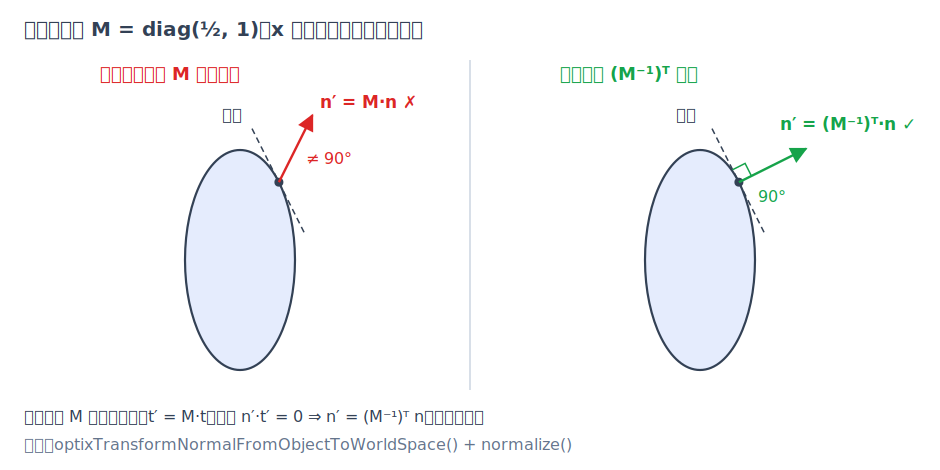
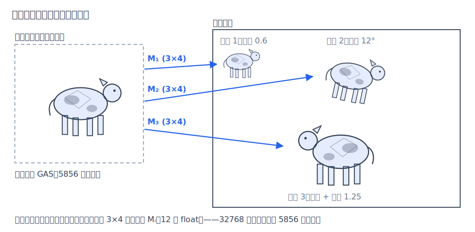

# 第 7 章 变换与实例化

[上一章](06-geometry.md)的所有求交都发生在规范物体空间：单位球、$`[-1,1]^2`$ 的矩形、开口向上的单位抛物面。本章回答两个问题：场景文件里的 scale/rotate/translate 列表如何变成一个矩阵，把单位图元摆进世界；以及为什么三万多头奶牛的场景只需要一份三角形数据。顺带解决两个容易踩坑的细节——法线的逆转置变换，和面光源在世界空间里的面积与 pdf。

## 7.1 仿射变换与复合顺序

仿射变换（affine transform）是"线性变换加平移"：$`p \mapsto Ap + t_M`$，其中 $`A`$ 是 $`3\times 3`$ 线性部分（缩放、旋转、剪切、镜像），$`t_M`$ 是平移向量（加下标 $`M`$ 以区别于光线参数 $`t`$）。sundog 把它存成行主序的 $`3\times 4`$ 矩阵（`Affine`（device/math.cuh）），行布局与 OptiX 实例的 transform 字段一致，后面会看到主机端可以直接按字节拷贝。它区分两种作用对象：

- **点**用 `applyPoint()`：乘 $`A`$ 再加 $`t_M`$；
- **向量**（方向、切向）用 `applyVector()`：只乘 $`A`$——方向没有"位置"，平移对它没有意义。

复合用 `mul(a, b)`，语义是 $`a \circ b`$——先作用 $`b`$、再作用 $`a`$。场景里的 transform 是一个步骤列表（Python 端 `scale()/rotate_*()/translate()` 构造，IR 形态如下），例如 05 号场景里一头奶牛：

```json
[{ "scale": 0.85 }, { "rotate_y": 319.21 }, { "translate": [-29.145, 0.812, -29.54] }]
```

`parseTransform()`（src/scene_json.cpp）逐项解析，每一步执行

```math
M \leftarrow E \cdot M
```

即新步骤 $`E`$ 左乘到已有矩阵 $`M`$ 上、"包在外面"。于是列表的语义就是从上到下**依次施加**：先缩放、再旋转、最后平移，最终 $`M = T\,R\,S`$，对点的作用从右往左读。这正是摆放物体的自然次序——如果先平移再缩放，缩放会把平移量一起拉伸，物体就跑到别处去了。三个轴向旋转 `affineRotateX/Y/Z()` 是标准右手系旋转矩阵，JSON 中的角度按度输入、解析时乘 $`\pi/180`$；scale 接受标量（各向同性）或三分量（非均匀）。

## 7.2 光线的逆变换：让几何待在原地

要和被 $`M`$ 摆放过的图元求交，有两条等价路线：把几何变换到世界空间（每个物体存一份变换后的顶点），或者**把光线逆变换到物体空间**。后者只需要存一个矩阵：世界点 $`p`$ 落在变换后的表面上，当且仅当 $`M^{-1}p`$ 落在规范表面上，即 $`F(M^{-1}p) = 0`$。

对光线 $`o + t\,d`$ 施加 $`M^{-1}`$：起点按点变换（$`o' = A^{-1}(o - t_M)`$），方向按向量变换（$`d' = A^{-1}d`$）。关键细节是 **$`d'`$ 不做归一化**。这样

```math
o' + t\,d' = M^{-1}(o + t\,d)
```

对每个 $`t`$ 都成立——物体空间和世界空间在同一个 $`t`$ 值处对应同一个点，物体空间解出的根不需要任何换算就是世界空间的命中距离。代价是 $`|d'| \ne 1`$，这正是上一章所有二次式都带着 $`a = d\cdot d`$、不敢假设单位方向的原因。

在 sundog 里这套机制由 OptiX 的实例（instance）承担：硬件遍历两级加速结构时自动应用实例矩阵的逆（见[第 8 章·加速结构与 RT Core](08-acceleration.md)），intersection 程序里一句 `optixGetObjectRayOrigin()`/`optixGetObjectRayDirection()`（`__intersection__quadric()`，device/programs.cu）拿到的就是已经变换好的物体空间光线。命中点甚至不需要变换回来——raygen 循环里直接用世界空间的 $`x = o + t\,d`$ 重建（`__raygen__render()`，device/programs.cu）。

## 7.3 法线为什么用逆转置

法线是唯一不能直接乘 $`A`$ 的几何量。直觉：法线不是"表面上的一段几何"，而是"垂直约束"的代表——它的定义不是自己怎么动，而是必须与谁垂直。

在命中点取表面上任意一条曲线 $`p(s)`$，它的切向量 $`\tau = \mathrm{d}p/\mathrm{d}s`$ 是真正"跟着几何走"的向量，变换后是 $`A\tau`$。变换后的法线 $`n'`$ 必须仍与所有变换后的切向垂直：$`n' \cdot (A\tau) = 0`$ 对一切 $`\tau`$ 成立。往原始的垂直关系里插一个 $`A^{-1}A`$：

```math
0 = n \cdot \tau = n^{\mathsf T} A^{-1} (A\tau) = \left((A^{-1})^{\mathsf T} n\right) \cdot (A\tau)
```

所以取 $`n' = (A^{-1})^{\mathsf T} n`$（逆转置）即可，差一个正的伸缩因子无妨，反正最后要归一化。当 $`A`$ 是旋转或均匀缩放时 $`(A^{-1})^{\mathsf T} \propto A`$，直接乘 $`A`$ 恰好也不出错——这解释了为什么这个 bug 总是潜伏到**非均匀缩放**才暴露。

一个二维反例：45° 斜面，切向 $`(1,1)`$、法线 $`(-1,1)`$。沿 $`x`$ 拉伸 2 倍（$`A = \mathrm{diag}(2,1)`$）后斜面变缓，切向变为 $`(2,1)`$；若"直接变换法线"得 $`(-2,1)`$，与切向 $`(2,1)`$ 点积为 $`-3 \ne 0`$——法线不再垂直于表面：它其实是另一张更陡斜面（斜率 2）的法线，跟不上被拉平的几何；用逆转置 $`(A^{-1})^{\mathsf T} = \mathrm{diag}(\tfrac12, 1)`$ 得 $`(-\tfrac12, 1) \propto (-1,2)`$，与 $`(2,1)`$ 点积为零，仍然垂直。


*图：非均匀缩放下"直接变换法线"不再垂直于表面，逆转置才保持垂直。图中取 $`M=\mathrm{diag}(\tfrac12,1)`$，与正文示例互为逆变换，结论相同。*

代码里这一步由 `optixTransformNormalFromObjectToWorldSpace()` 完成（`quadricShadePoint()`/`triShadePoint()`，device/programs.cu），它应用的正是实例矩阵线性部分的逆转置；逆转置不保长度，所以两处都紧跟 `normalize()` 重新归一化。

## 7.4 实例化：一份几何，万次摆放

有了"光线逆变换"这一机制，几何数据与摆放方式就彻底解耦了：几何加速结构（GAS，OptiX 对单份几何构建的加速结构，构建细节见[第 8 章](08-acceleration.md)）只对几何本身建一次，摆放只是一条 12 个浮点数的记录。这就是实例化（instancing）。

sundog 的做法（src/accel.cpp）：对场景**用到的**每种解析图元各建一个规范 GAS（`buildQuadricGas()`——内容只是一个物体空间包围盒，求交走上一章的 intersection 程序），每个 OBJ 网格建一个三角形 GAS（`buildTriangleGas()`）。场景里的每个物体只是"GAS 引用 + 变换 + 材质"的三元组，`buildIas()` 为它填一条 OptixInstance：变换矩阵直接从 `Affine` 按字节拷贝 12 个 float（两者行布局刻意一致），traversableHandle 指向共享的 GAS，sbtOffset 取 $`2\times`$ 实例号——用于在着色器绑定表（SBT）中找到各自的材质记录，乘 2 是因为 radiance/shadow 两套 hitgroup（见[第 9 章·OptiX 工程实现](09-optix-pipeline.md)）。

规模效果最直观的是 05 号场景：32768 头 Spot 奶牛全部引用同一份 5856 个三角形的网格 GAS（scenes/05-spot-swarm.py；docs/BENCHMARKS.md 计 32770 个实例，含两块面光矩形）。等效三角形约 $`32768 \times 5856 \approx 1.9`$ 亿，而显存里三角形只存一份——摆放的开销是每头牛一条 80 字节的实例记录（OptixInstance），而不是 5856 个三角形的拷贝。


*图：一份单位几何的 GAS 被三个实例矩阵引用，在世界中呈现三种不同摆放。*


*图：05 号场景——32768 个实例共享一份 5856 三角形的奶牛网格。*

## 7.5 世界空间的面积与 pdf

实例化有一个容易忽略的推论：**采样发生在世界空间，所有面积和 pdf 也必须是世界空间的量**。下一事件估计（NEE，见[第 4 章](04-path-tracing.md)）采样面光源时，立体角 pdf 由面积 pdf 换元而来（[第 3 章·蒙特卡洛积分](03-monte-carlo.md)）：

```math
p_\omega = \frac{r^2}{\cos\theta' \cdot \mathrm{area}}
```

其中 $`r`$ 是着色点到灯上采样点的距离（与第 3 章的记号一致），$`\mathrm{area}`$ 是**变换之后**的世界空间面积（对应代码 `lt.area`；不记作 $`A`$，以免与变换的线性部分混淆）。sundog 在场景解析时注册灯（src/scene_json.cpp）：把规范图元的骨架推到世界空间——中心 $`p = M(0,0,0)`$、基向量 $`u_x = A\,e_x`$、$`u_y = A\,e_y`$、$`u_z = A\,e_z`$（即三个物体空间坐标轴的线性像），然后按图元类型算面积。

**矩形**：规范矩形边长为 2，两条半边向量变换后张成平行四边形，面积为 $`|2u_x \times 2u_z| = 4\,|u_x \times u_z|`$——对任意线性映射（含剪切、镜像）都精确，因为矩形的线性像永远是平行四边形。代码即 `area = 4|u_x×u_z|`；设备端 `sampleLight()`（device/light_sample.cuh）的 rect 分支用它做换元：`pdf = d2 / (cosL * area)`。

**法线与行列式符号**：灯的朝向取 $`\mathrm{normalize}(u_z \times u_x)`$——物体空间里 $`e_z \times e_x = +Y`$ 正是矩形的规范正面。但叉积藏着一个陷阱，先给直觉：镜像变换把右手系翻成左手系，两个切向的叉积方向随之翻转，而逆转置路线的法线不翻——两条路线会差一个符号。定量地，由余子式恒等式

```math
(Aa) \times (Ab) = \det(A)\,(A^{-1})^{\mathsf T}(a \times b)
```

两个变换后切向量的叉积会带上 $`\det(A)`$ 的**符号**，而设备端着色法线走的是 7.3 节的逆转置路线、不带这个符号。若变换含镜像（$`\det(A) < 0`$），两条路线算出的法线正好相反，NEE 会把灯当成背对着自己。所以主机侧计算 $`\mathrm{detSign} = \mathrm{sign}\big(u_y \cdot (u_z \times u_x)\big)`$ 并乘回灯法线——这个三重积恰好就是行列式：

```math
u_y \cdot (u_z \times u_x) = \det[u_y,\ u_z,\ u_x] = \det(A)\cdot\big(e_y \cdot (e_z \times e_x)\big) = \det(A)
```

从而保证灯注册与命中着色对同一表面朝向达成一致。

**圆盘与球的限制**：圆盘的线性像是椭圆，真实面积为 $`\pi\,|u_x \times u_z|`$；代码取 $`\pi\,|u_x|\,|u_z|`$，仅当 $`u_x \perp u_z`$ 时两者严格相等（均匀 XZ 缩放加旋转是最常见的充分情形）。因此解析时用 $`|u_x| \approx |u_z|`$ 作启发式检查，不满足就报错拒绝（错误信息直言 "pdf would be wrong"）——注意该检查不覆盖剪切造出"非正交但等长"基向量的罕见组合。球更严格：采样端用解析锥采样——从点 $`x`$ 看半径 $`\rho`$、球心距 $`r`$ 的球，立体角 pdf 为

```math
p_\omega = \frac{1}{2\pi\,(1-\cos\theta_{\max})},\qquad \cos\theta_{\max} = \sqrt{1 - \rho^2/r^2}
```

（切线几何：$`\sin\theta_{\max} = \rho/r`$）。这套闭式只对真正的球成立；非均匀缩放把球变成椭球，它张出的立体角没有解析式，pdf 无从写对，而 pdf 一旦与实际采样分布不符，蒙特卡洛估计就系统性有偏。sundog 的选择是在场景解析期直接报错（"sphere NEE light requires uniform scale; set nee:false"）——宁可当场失败，也不悄悄渲染出一张偏差图（这一验证哲学见[第 11 章](11-validation.md)）。设 `nee:false` 后物体仍正常发光，只是退出光源采样列表、只能被 BSDF 采样命中。

## 小结

一个 $`3\times 4`$ 矩阵把"单位图元"与"世界摆放"解耦：光线逆变换让求交永远发生在规范物体空间且 $`t`$ 无需换算；法线走逆转置以保持垂直；一份 GAS 配上任意多的实例矩阵就是实例化，1.9 亿等效三角形只占一份显存；而面积与 pdf 必须用变换后的世界空间量，做不到解析修正的组合（椭球灯）在场景解析期就被拒绝。下一章（[第 8 章·加速结构与 RT Core](08-acceleration.md)）解释这些实例和几何如何组织成两级加速结构，让上亿条光线在几十毫秒内完成遍历。
