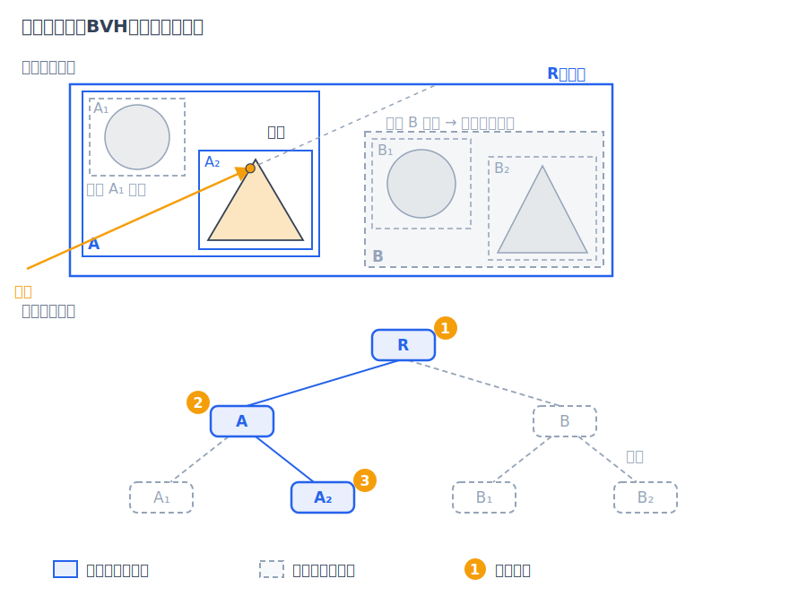
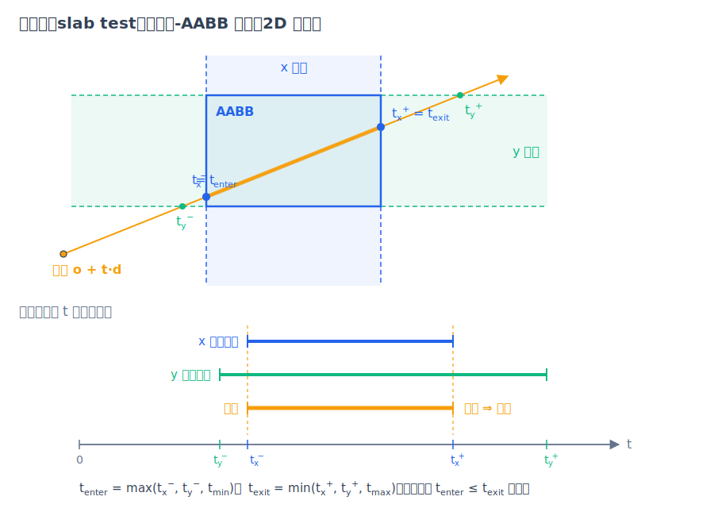
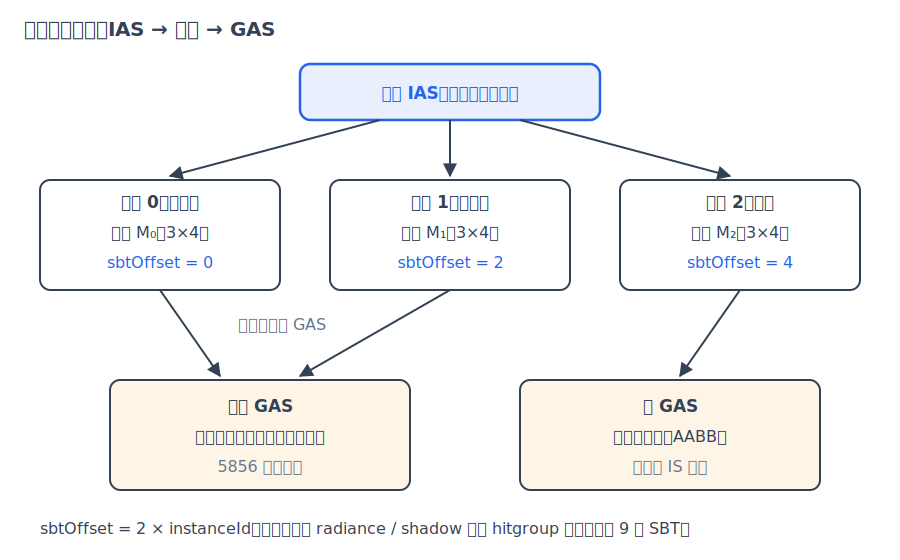

# 第 8 章 加速结构与 RT Core

[第 6 章·几何求交](06-geometry.md)解决了"光线怎么打中一个图元"，[第 7 章·变换与实例化](07-transforms.md)解决了"一份几何怎么摆出一万个物体"。本章回答规模问题：当场景里有 1.9 亿个三角形、一帧要追踪几千万条光线时，为什么整帧渲染只需要十几毫秒？答案分两层——数据结构（层次包围盒）把每条光线的工作量从 O(N) 降到 O(log N)，硬件（RT Core）再把这套遍历与求交固化成专用电路。

## 8.1 朴素求交有多贵：先算一笔账

最直接的做法是：每条光线对场景里**每一个**图元做一次求交测试，取最近正根。对 N 个图元这是 O(N) 的工作量。N 很大时到底意味着什么？我们用本书最大的场景（`scenes/05-spot-swarm.json`，即画廊图 [05-spot-swarm](../gallery/05-spot-swarm.png)）算给读者看。

这个场景包含 32768 头奶牛实例，每头共享同一份 5856 个三角形的网格（见[第 7 章·变换与实例化](07-transforms.md)），等效三角形数为

```math
32768 \times 5856 = 191\,889\,408 \approx 1.92\times10^{8}.
```

一次实测（分辨率 960×540，每像素采样数（samples per pixel/spp，定义见[第 1 章·成像与光线](01-images-and-rays.md)）为 32，数据存于 `out/05-check.stats.json`）中，这一帧共追踪了 45 309 758 条光线（含弹射与阴影光线，约 $`4.53\times10^{7}`$ 条）。若按朴素算法，光线-三角形测试次数是

```math
4.53\times10^{7} \times 1.92\times10^{8} \approx 8.7\times10^{15} \text{ 次}.
```

一次光线-三角形求交（如常用的 Möller–Trumbore 算法：两次叉乘、四次点乘再加若干标量运算）约需 30 次浮点乘法，于是一帧的乘法总量约 $`2.6\times10^{17}`$ 次。即便假设有一台每秒能做 $`10^{14}`$ 次乘法（百 TFLOPS 量级）的理想机器全速只干这一件事，也要约 2600 秒——**43 分钟一帧**。而实测这帧渲染只花了 12.3 毫秒：中间隔着约 $`2\times10^{5}`$ 倍的鸿沟。结论显而易见：绝大多数"光线×三角形"配对根本不能去测，必须有办法**批量排除**。

## 8.2 层次包围盒：把 O(N) 变成 O(log N)

排除的工具是包围盒（bounding box/AABB）：一个各面与坐标轴对齐的长方体，把一组图元整个装进去。关键性质是：**光线连包围盒都没穿过，就绝不可能打中盒内任何图元**。把包围盒递归地组织成树——根节点包住全场景，每个内部节点包住两个子节点，叶子节点装少量图元——就得到层次包围盒（bounding volume hierarchy/BVH）。遍历时从根出发：光线打不中某节点的盒子，整棵子树连同其中成千上万个图元被一次性剪掉；平衡情况下树高是 O(log N)，每条光线只需几十次盒测试加上叶子里少数几次真正的图元求交。对 $`1.92\times10^{8}`$ 个三角形，$`\log_2 N \approx 27.5`$——每条光线的代价从约 58 亿次乘法降到数百次的量级。



*图：场景包围盒的递归层级（左）与对应二叉树（右）；一根光线沿树下行，打不中的盒子对应的整棵子树被剪掉。*

剩下的问题是：光线与 AABB 怎么测？答案是平板法（slab test）。设盒子为 $`[b^{\min}, b^{\max}]`$，光线 $`r(t)=o+t\cdot d`$。对每个坐标轴 $`k\in\{x,y,z\}`$，盒子的两张面 $`x_k=b_k^{\min}`$、$`x_k=b_k^{\max}`$ 夹出一个无限大的"平板"，光线与两张平面的交点参数为

```math
t_k^{(1)}=\frac{b_k^{\min}-o_k}{d_k},\qquad t_k^{(2)}=\frac{b_k^{\max}-o_k}{d_k}.
```

令 $`t_k^-=\min(t_k^{(1)},t_k^{(2)})`$、$`t_k^+=\max(t_k^{(1)},t_k^{(2)})`$（当 $`d_k<0`$ 时两交点次序颠倒，所以要排序）。光线"待在盒子里"的参数区间是三个平板区间与光线有效区间 $`[t_{\min},t_{\max}]`$ 的交集：

```math
t_{\text{enter}}=\max\!\big(t_x^-,\,t_y^-,\,t_z^-,\,t_{\min}\big),\qquad t_{\text{exit}}=\min\!\big(t_x^+,\,t_y^+,\,t_z^+,\,t_{\max}\big),
```

当且仅当 $`t_{\text{enter}}\le t_{\text{exit}}`$ 时光线与盒相交。每条光线预先算好 $`1/d_k`$ 后，一次盒测试只要 6 次乘法、6 次减法和一串 min/max——比一次三角形求交便宜约 5 倍，而它一旦失败就能剪掉整棵子树。



*图：平板法（2D 示意）——x、y 两对平板各自夹出光线的参数区间 $`[t_x^-, t_x^+]`$ 与 $`[t_y^-, t_y^+]`$；取交集时下界取最大、上界取最小，交集非空即穿盒。*

两个边角情形与一条额外剪枝值得单独交代。$`d_k=0`$（光线平行于平板）时 $`1/d_k`$ 为 $`\pm\infty`$，min/max 在 IEEE 浮点下仍给出正确区间；真正要留意的是光线原点恰落在盒面上的情形——此时分子为 0，IEEE 规则下 $`0\times\infty=\mathrm{NaN}`$。此外遍历还有一条重要剪枝：若 $`t_{\text{enter}}`$ 已经比当前找到的最近命中还远，这个盒子里不可能再有更近的交点，同样可以跳过。

BVH 的效果好坏取决于构建质量：好的划分让兄弟盒体积小、重叠少，光线才更容易"只进一边"。OptiX 的构建器在驱动内部完成，具体算法不对用户暴露；反面教材可看原 cxxrt 的随机选轴中位数切分（见[附录·原 cxxrt 的计算问题与修正](appendix-cxxrt.md)）。

## 8.3 RT Core：硬件化的是哪一步

上面的遍历循环——取节点、测两个子盒、决定走哪边、到叶子测三角形——是一段分支密集、访存不规则的代码，用普通着色器核心跑并不高效。自 Turing 架构起，NVIDIA RTX GPU 在每个流式多处理器（streaming multiprocessor/SM，即 GPU 上执行普通 CUDA/着色程序的通用计算单元）旁配备了 RT Core：一种专用硬件单元，把两类操作固化成电路：

- **BVH 遍历**：读取 BVH 节点、执行光线-AABB 相交测试、决定下行路径；
- **三角形求交**：对叶子中的三角形直接完成光线-三角形测试，返回命中距离与重心坐标。

也就是说，对纯三角形场景，一次 `optixTrace` 的"找最近命中"可以基本不占用通用计算单元。而 sundog 的球、矩形、圆盘、圆柱、抛物面这五种解析图元（代码中统称 quadric，求交推导见第 6 章）走的是**自定义图元**（custom primitive）路径：硬件只遍历到它们的 AABB 叶节点，命中盒子后回调运行在 SM 上的求交程序（intersection/IS，见[第 9 章·OptiX 工程实现](09-optix-pipeline.md)），由我们在[第 6 章·几何求交](06-geometry.md)推导的解析公式给出精确交点。这个分工很清晰：硬件负责"排除几乎所有不可能"，软件只在极少数候选处做数学。同理，需要逐命中做判断的任意命中程序（any-hit/AH，如穿透面与 alpha 镂空）也要回到 SM 执行，因此 sundog 对不需要它的物体显式关闭 AH（`OPTIX_INSTANCE_FLAG_DISABLE_ANYHIT`），减少硬件遍历与 SM 之间的往返——细节在第 9 章展开。

## 8.4 两级结构：GAS、IAS 与压缩

OptiX 把加速结构（acceleration structure/AS）组织成两级，恰好与第 7 章的实例化一一对应：

- **几何加速结构（GAS）**：建在物体空间的几何上——三角形网格，或自定义图元的 AABB 列表；
- **实例加速结构（IAS）**：叶子是一个个实例，每个实例带一个 3×4 仿射变换和一个指向某 GAS 的引用。

遍历 IAS 时命中某实例的包围盒，硬件用该实例的逆变换把光线变到物体空间，继续遍历被引用的 GAS——这正是第 7 章"世界光线→物体空间求交"的机制化。于是 32768 头奶牛只需**一份** 5856 三角形的 GAS（网格数据不过百 KB 量级；若真复制 32768 份，仅顶点与索引就是 GB 量级，还得为 1.9 亿三角形建一棵巨树）加上 32768 条实例记录。遍历深度也随之分解：IAS 上约 $`\log_2 32768 = 15`$ 层，进入奶牛 GAS 后再约 $`\log_2 5856 \approx 13`$ 层。

对账到代码（src/accel.cpp）：`buildQuadricGas()` 给每种**用到的**解析图元建一个只含单个 AABB 的 GAS（盒子来自 `quadricAabb()`（device/intersect.cuh），如抛物面是 $`[-1,1]\times[0,\tfrac12]\times[-1,1]`$ 外加 $`10^{-4}`$ 的浮点余量），全场景同类物体共享；`buildTriangleGas()` 给每个 OBJ 网格建一个三角形 GAS；`buildIas()` 为每个场景对象填一条 `OptixInstance`——变换矩阵、`instanceId = i`、`sbtOffset = 2i`（这串偏移是第 9 章 SBT 的伏笔）以及是否 `DISABLE_ANYHIT` 的标志。

三种构建殊途同归于 `buildAndCompact()`（src/accel.cpp）：

```cpp
opts.buildFlags = OPTIX_BUILD_FLAG_PREFER_FAST_TRACE |
                  OPTIX_BUILD_FLAG_ALLOW_COMPACTION;
emit.type = OPTIX_PROPERTY_TYPE_COMPACTED_SIZE;
OPTIX_CHECK(optixAccelBuild(ctx, 0, &opts, &input, 1, /*...*/ &gas.handle, &emit, 1));
if (compactedSize < sizes.outputSizeInBytes) {
  gas.buffer.alloc(compactedSize);
  OPTIX_CHECK(optixAccelCompact(ctx, 0, gas.handle, gas.buffer.ptr,
                                compactedSize, &gas.handle));
}
```

`PREFER_FAST_TRACE` 让构建器为追踪速度优化（构建慢一点没关系，AS 建一次用几百万次）；压缩（compaction）则是两步走：构建时按保守估计分配缓冲，同时让驱动写出"实际紧凑尺寸"，若更小就把 AS 搬进一块恰好大小的新缓冲、释放旧的。代价是搬家瞬间两块缓冲并存，换来常驻显存显著缩小。IAS 与 GAS 都走同一条压缩路径。



*图：IAS 的每个实例带 3×4 变换与 SBT 偏移（`2×instanceId`），引用共享的 GAS；同一份奶牛 GAS 被三万多个实例复用。*

## 8.5 实测：规模到底什么感觉

回到 05 场景的实测数字（`out/05-check.stats.json`，960×540、32 spp；表格版见 `docs/BENCHMARKS.md` B 层）：

- **构建**：2 个 GAS（矩形 quadric + 奶牛网格）加 1 个 32770 实例的 IAS，共 2.1 ms；
- **渲染**：12.3 ms 追完 45 309 758 条光线，吞吐 3697 Mrays/s（`docs/BENCHMARKS.md` 中 64 spp 一档为 0.025 s、3726 Mrays/s；Mrays/s 的含义与解读见[第 11 章·验证方法学与性能](11-validation.md)）；
- **显存**：整个进程峰值 612 MB——含帧缓冲、纹理与网格，而非几何复制的 GB 量级。

按吞吐折算，平均每条光线只摊到约 0.27 纳秒。这当然不是单条光线的延迟——单次显存访问都不止这个时间——而是数十万条光线在整卡上并行流水的摊销结果。与 8.1 节"理想机器也要 43 分钟"的朴素估算对照，BVH 的对数剪枝加上 RT Core 的硬件化，共同兑现了这约五个数量级的差距。

**小结**：朴素求交的代价随图元数线性爆炸；BVH 用"打不中盒子就剪掉整棵子树"把每条光线的代价压到 O(log N)，平板法给出便宜的盒测试；RT Core 把 BVH 遍历与三角形求交固化成硬件，自定义图元通过 IS 程序回调保留了灵活性；GAS/IAS 两级结构让实例化天然融入，压缩再省下常驻显存。下一章拆开 `optixTrace` 这个黑盒：五种程序如何协作、光线怎么通过 SBT 找到"它的程序"、以及 sundog 把整个路径追踪循环塞进 raygen 的工程取舍——[第 9 章·OptiX 工程实现](09-optix-pipeline.md)。
