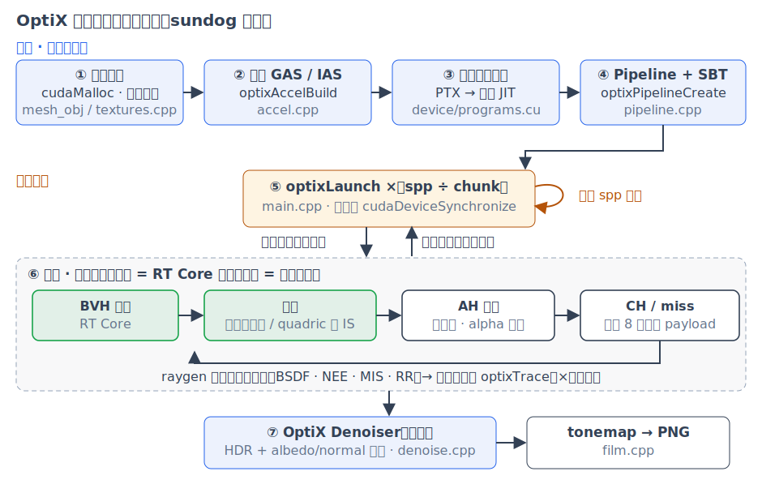
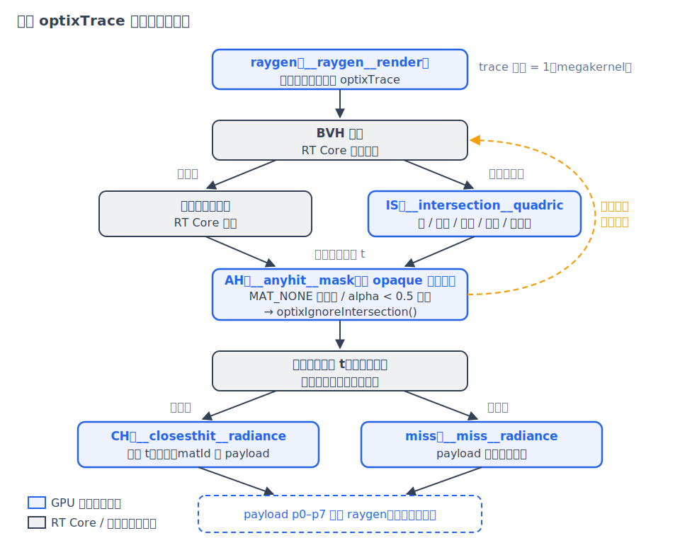
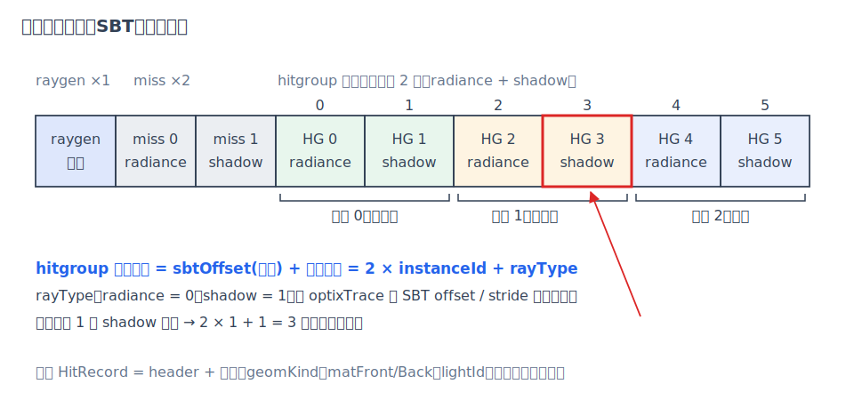
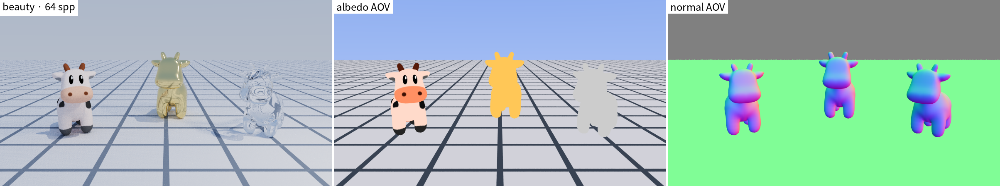

# 第 9 章 OptiX 工程实现

[第 4 章·路径追踪算法](04-path-tracing.md)给出了算法，[第 8 章·加速结构与 RT Core](08-acceleration.md)解释了"找最近命中"为什么快。本章回答工程问题：一个 OptiX 应用从头到尾长什么样？一次 `optixTrace` 调用背后发生了什么？一个完整的渲染器如何组织成 GPU 上的几段程序、又如何把数据递给它们？9.1 节先把整个应用的生命周期串成一条主线，其余各节再对关键环节深潜。

## 9.1 一个 OptiX 应用的完整生命周期

教科书式的 OptiX 应用流程是七步：**① 准备 CUDA 几何数据 → ② 构建 GAS/IAS 加速结构 → ③ 编译 raygen/miss/hit 等程序 → ④ 创建 Pipeline 与 SBT → ⑤ 调用 optixLaunch → ⑥ 光线遍历、求交与自定义着色 → ⑦ Denoiser 降噪**。sundog 七步全部走到，其中 ①–④ 是启动时的一次性准备，⑤⑥ 构成渲染循环，⑦ 在循环结束后收尾：



*图：sundog 的七步流程——主机侧一次性准备（①–④）、渲染循环（⑤ 发射 × ⑥ 设备执行）、收尾（⑦ 降噪与落盘）；框内标注对应源文件。*

**① 准备 CUDA 数据**。一切喂给 GPU 的东西先要变成显存对象：OBJ 网格的顶点/索引/法线/UV 经 `cudaMalloc` 上传（`loadObjMesh()`（src/mesh_obj.cpp），含按（顶点, 纹理坐标）对重索引，见[第 6 章·几何求交](06-geometry.md)）；五种解析图元各上传一个单位包围盒；图片纹理走 `cudaMallocArray` + `cudaCreateTextureObject`，把 sRGB 解码与双线性过滤交给硬件（`TextureSet::upload()`（src/textures.cpp），见[第 10 章](10-sampling-denoising.md)）；材质/灯/纹理的描述符数组整块上传，设备侧经 launch params 中的指针访问。项目里所有显存都由 RAII 封装 `CudaBuffer`（src/cuda_check.h）统一管理。

**② 构建加速结构**。`optixAccelBuild` 把上一步的三角形与 AABB 变成 GPU 上的 BVH：每种**用到的**解析图元建一个 GAS、每个网格建一个 GAS（均做 compaction 压缩），顶层 IAS 为每个场景对象生成一个带 3×4 变换的实例（`buildQuadricGas()/buildTriangleGas()/buildIas()`（src/accel.cpp）；原理与两级结构见[第 8 章](08-acceleration.md)）。

**③ 编译程序**。八个设备程序全部写在唯一的模块 `device/programs.cu` 里，构建期由 nvcc 编成 PTX、`bin2c` 嵌入可执行文件，运行期 `optixModuleCreate` 交给驱动即时编译——教科书路线是 OptiX-IR，sundog 因工程坑退回 PTX（见 9.6 节末段）。

**④ 创建 Pipeline 与 SBT**。`optixProgramGroupCreate` 把程序包成 1（raygen）+2（miss）+8（hitgroup 变体）个程序组，`optixPipelineCreate` 以 `maxTraceDepth = 1` 链接成管线，随后组装 SBT——把"每个对象 × 每种光线"接到正确的程序与数据上（`Pipeline`（src/pipeline.cpp）；索引规则见 9.4 节）。

**⑤ 调用 optixLaunch**。主机把 spp 按固定块大小（16）切块，循环发射并同步，每次 launch 覆盖全部像素、每像素一个线程（src/main.cpp 渲染循环，代码见 9.6 节）。

**⑥ 遍历、求交与着色**。设备侧每条光线由 RT Core 遍历 BVH：三角形硬件求交，解析图元回调 IS 程序，AH 对穿透面与 alpha 镂空行使否决权，CH/miss 收尾——但 sundog 的着色（BSDF、NEE、MIS、俄罗斯轮盘）**不在 CH 里**，而是全部收在 raygen 的路径循环中，CH 退化为把命中信息打包进 8 个 payload 寄存器。这是 sundog 与"在 CH 里递归着色"的教科书结构最大的差异，动机见 9.3 节。

**⑦ 降噪与落盘**。渲染循环结束后，OptiX Denoiser 在线性 HDR 域、以 albedo/normal 为引导层做 AI 降噪（`Denoiser`（src/denoise.cpp），原理见[第 10 章](10-sampling-denoising.md)），最后 ACES tonemap 写出 PNG（[第 1 章](01-images-and-rays.md)）。

七步与代码、章节的完整映射：

| 步骤 | 关键 API | sundog 实现 | 深入阅读 |
|---|---|---|---|
| ① CUDA 数据准备 | `cudaMalloc` / `cudaCreateTextureObject` | `CudaBuffer`、`loadObjMesh()`、`TextureSet::upload()` | 第 6、10 章 |
| ② GAS / IAS | `optixAccelBuild` / `optixAccelCompact` | src/accel.cpp | 第 8 章 |
| ③ 程序编译 | nvcc `-ptx` → `optixModuleCreate` | device/programs.cu、Makefile | 9.6 节末段 |
| ④ Pipeline + SBT | `optixProgramGroupCreate` / `optixPipelineCreate` / `optixSbtRecordPackHeader` | src/pipeline.cpp | 9.2、9.4 节 |
| ⑤ 发射 | `optixLaunch` | src/main.cpp 渲染循环 | 9.6 节 |
| ⑥ 遍历/求交/着色 | `optixTrace` / `optixReportIntersection` / `optixIgnoreIntersection` | device/programs.cu | 9.2、9.3、9.5 节；第 6 章 |
| ⑦ 降噪 | `optixDenoiserInvoke` | src/denoise.cpp | 第 10 章 |

带 `physics` 块的场景（如画廊 06 号）在 ① 与 ② 之间还有一步：PhysX GPU 刚体模拟把场景声明的初始条件推演成最终位姿再烘焙回变换，之后的六步对此毫无感知——见[第 12 章·物理装载](12-physics.md)。

## 9.2 程序模型：五种程序与一次 trace 的时序

OptiX 不是"一个单一的大核函数（kernel）"，而是一个以光线为中心的调度框架：开发者提供若干小程序，遍历硬件与驱动负责在恰当的时机调用它们。一次 `optixLaunch` 以二维网格发起海量线程（sundog 中一个像素对应一个线程），每个线程从同一个入口程序开始执行。sundog 用到五种程序（全部实现在 `device/programs.cu` 这一个模块里；OptiX 还有 exception、callable 等类型，本项目未用）：

- **光线生成（raygen）**：launch 的入口，每个像素一个线程，由它发起 `optixTrace`；
- **求交（intersection/IS）**：自定义图元的解析求交（第 8 章的"软件求交回调"）；
- **任意命中（any-hit/AH）**：每个**潜在**命中点上被调用，可以宣布"这个命中不算数"；
- **最近命中（closest-hit/CH）**：遍历结束、最近命中尘埃落定后调用一次；
- **未命中（miss）**：整条光线什么都没打中时调用。

后三种程序总是按图元类型成套使用：把某类图元的 IS/AH/CH 打包成的一组称为命中组（hitgroup），它是 9.4 节着色器绑定表（SBT）中记录的基本单位——每条 hitgroup 记录指向其中一组。

一次 `optixTrace` 的时序是：光线进入加速结构遍历→每遇到候选图元，三角形由硬件求交、自定义图元回调 IS→若产生命中且该实例未禁用 AH，调用 AH，AH 可用 `optixIgnoreIntersection()` 把命中作废（光线像没事一样继续）→遍历维护当前最近命中→遍历结束，有命中调 CH、没有调 miss→控制流回到 raygen。这些程序之间不共享局部变量，唯一的通信通道是随光线携带的光线负载（payload）：可以把一次 trace 理解成一次函数调用——光线的起点、方向与区间是参数，payload 是返回值。



*图：raygen 发起 trace 后的调用时序，含 AH 通过 `optixIgnoreIntersection()` 忽略命中、返回遍历的回路。*

## 9.3 megakernel 决策：路径循环放 raygen，CH 只打包

这些程序怎么分工，OptiX 不做规定。经典做法是让 CH 递归地再调 `optixTrace`（"在着色程序里继续追下一段光线"），sundog 选了另一头，即所谓 megakernel（单一大内核）结构：**整个第 4 章的路径循环都写在 `__raygen__render` 里**，管线链接选项 `maxTraceDepth = 1`——全系统只有 raygen 调用 `optixTrace`，CH/AH/miss 一律不再发光线。CH 的职责被压缩到极致：只把命中信息打包进 payload 寄存器，BSDF 求值（见[第 5 章·材质与 BSDF](05-materials.md)）、下一事件估计（NEE）、多重重要性采样（MIS）与俄罗斯轮盘（均见第 4 章）全部回到 raygen 的 for 循环里做。好处有二：一是每线程的栈开销最小（下段展开）；二是控制流集中在一处，寄存器压力（每线程占用的寄存器数，占得越多能同时驻留的线程越少）与分支发散可控——分支发散指同组并行执行的线程走进不同的 if 分支时只能相互等待、依次通过，路径循环收在一个函数里，这种等待更容易控制。

栈的细节：OptiX 要按"递归 `optixTrace` 的最大层数"与"加速结构的嵌套层数"为每个线程预留栈空间，sundog 里二者分别是 1（只有 raygen 发光线）和 2（IAS→GAS 单层实例化），栈因此接近最小。对账代码：`Pipeline` 构造函数先用 `optixUtilComputeStackSizes()` 按 trace 深度 1、可调用程序（callable，本项目未用）深度 0 算出所需栈大小，再以最大遍历图深度 2 调用 `optixPipelineSetStackSize()`。

payload 是 trace 调用者与 CH/miss 之间的寄存器通道，sundog 固定 8 个 32 位寄存器（`numPayloadValues = 8`，src/pipeline.cpp），布局对账 `packHit()`（device/programs.cu）及文件顶部注释：

| 寄存器 | 内容 |
|---|---|
| p0 | 0 = miss；否则 bit0 = 命中，bit1 = frontface（从正面入射） |
| p1 | 命中距离 t（float 按位存入 uint） |
| p2–p4 | miss：背景辐亮度；命中：世界空间着色法线（已翻向入射侧） |
| p5–p6 | 纹理坐标 u、v |
| p7 | matId（低 16 位）\|（lightId + 1）<< 16 |

两处打包很值得玩味：miss 时 p2–p4 **复用**法线寄存器直接携带背景色，raygen 拿来就当辐亮度用，省一次分支后的二次求值；p7 把材质号与灯号（`lightId + 1`，0 表示"不是 NEE 灯"）挤进一个寄存器，raygen 全程不需要读 SBT 数据。阴影光线用 5 个寄存器：`traceShadow()` 以 `TERMINATE_ON_FIRST_HIT | DISABLE_CLOSESTHIT` 发射，p0 由 `__miss__shadow` 置 1 表示"到达光源"——被不透明表面挡住时 miss 不会执行、p0 保持 0；p1–p4 携带沿线累积的透射率（逐界面菲涅尔连乘 + 逐通道符号光学深度，玻璃/水的透明阴影，见[第 16 章](16-transparent-media.md)）。属性寄存器（attribute）则是 IS 与 AH/CH 之间的通道：`numAttributeValues = 5`，quadric 的 IS 经它交出法线（3）加 UV（2）；三角形用内建重心坐标，不占这 5 个。

## 9.4 SBT：光线如何找到"它的程序"

同一次 trace，打中奶牛要跑三角形的 CH、打中玻璃球要跑 quadric 的 IS，阴影光线又不该跑任何 CH——运行时按什么规则选程序？答案是着色器绑定表（shader binding table/SBT）：一张记录（record）数组，每条记录 = 一个头部（标识某个程序组）+ 一段用户数据。sundog 的布局（对账 `Pipeline::buildSbt()`（src/pipeline.cpp））：

```
raygen ×1 | miss ×2（radiance, shadow）| hitgroup ×(2×对象数)
```

每个场景对象占**两条**连续的 hitgroup 记录（radiance 一条、shadow 一条），记录的数据段是 `HitRecordData`（device/params.h）：geomKind、正/背面材质号、lightId、镂空纹理号，网格对象再加顶点/索引/法线/UV 的设备指针。设备侧程序用 `optixGetSbtDataPointer()` 取得当前命中所属记录的数据段——第 6 章的求交函数由此知道"自己是球还是抛物面"，第 5 章的双面材质逻辑由此知道"正面、背面各用哪号材质"：CH/AH/IS 里一切"这个物体是什么"的问题都从这里回答。

命中时的记录索引由三方拼出：实例的 `sbtOffset`（第 8 章 `buildIas()` 设为 `2×instanceId`）、GAS 内部的记录序号、以及 trace 调用传入的偏移与步长，通式为

```math
\text{index} = \text{instance.sbtOffset} + \text{SBTstride}\times(\text{GAS 内部记录序号}) + \text{SBToffset}.
```

对账 `traceRadiance()/traceShadow()`（device/programs.cu）：radiance 光线传 `(SBToffset, SBTstride, missSBTIndex) = (0, 2, 0)`，shadow 光线传 `(1, 2, 1)`；而本项目每个 GAS 只有 1 条记录（构建输入 `numSbtRecords = 1`），内部序号恒为 0，stride 那一项随之消失，于是化简为

```math
\text{index} = 2\times\text{instanceId} + \text{rayType},
```

正好落在"该对象的该光线类型"那条记录上；miss 记录也按 rayType 各选各的。

记录头部指向哪个程序组（program group/PG）？hitgroup PG 一共 8 个变体，按 {quadric, 三角形} × {radiance, shadow} × {不透明, 需掩码} 组合（在 `Pipeline` 构造函数中创建；`buildSbt()` 只负责为每个对象**选**变体并打包头部）：

| 变体 | IS | CH | AH |
|---|---|---|---|
| Q_RAD_OPQ | `__intersection__quadric` | `__closesthit__radiance` | — |
| Q_RAD_MSK | `__intersection__quadric` | `__closesthit__radiance` | `__anyhit__mask` |
| Q_SHD_OPQ | `__intersection__quadric` | — | — |
| Q_SHD_MSK | `__intersection__quadric` | — | `__anyhit__mask` |
| T_RAD_OPQ | — | `__closesthit__radiance_tri` | — |
| T_RAD_MSK | — | `__closesthit__radiance_tri` | `__anyhit__mask_tri` |
| T_SHD_OPQ | — | — | — |
| T_SHD_MSK | — | — | `__anyhit__mask_tri` |

注意两点：shadow 变体一律没有 CH（trace 侧还叠加了 `DISABLE_CLOSESTHIT` 双保险）；"三角形 + shadow + 不透明"三个槽位全空——硬件求交加首命中即终止已经足够，"被挡住"完全由 miss **没有**被调用来表达。非不透明物体的 shadow 槽则挂统一的 `__anyhit__shadow[_tri]`：除穿透面与镂空外，还对玻璃/水累积透射率（第 16 章）。



*图：SBT 布局——raygen、两条 miss、每实例两条 hitgroup 记录；索引 = 2×instanceId + rayType。*

## 9.5 anyhit 的四件事与 DISABLE_ANYHIT 快速路径

sundog 的 AH 有两段逻辑：radiance 变体上的 `maskAnyhit()`（device/programs.cu）与 shadow 变体上的 `shadowAnyhit()`，共干四件事。前者：

```cpp
int matId = sp.frontface ? rec->matFront : rec->matBack;
if (matId == (int)MAT_NONE) { optixIgnoreIntersection(); return; }
if (rec->cutoutTexId >= 0) {
  float4 c = evalTexture(params.textures[rec->cutoutTexId], sp.u, sp.v);
  if (c.w < 0.5f) optixIgnoreIntersection();
}
```

**其一，穿透面**：双面材质语义（见[第 5 章·材质与 BSDF](05-materials.md)）允许某一侧无材质（`MAT_NONE`），光线从这一侧打来时命中被忽略、直接穿过——这也是第 6 章 quadric 求交"两个根都上报"的原因：第一个交点被忽略后，第二个交点还在候选队列里。**其二，alpha 镂空**：有镂空纹理的物体按 UV 采样 alpha，小于 0.5 的部位视为空洞。**其三，阴影线复用**：`shadowAnyhit()` 以同样的规则放行穿透面与镂空孔，所以光与影的穿透行为一致。**其四，透明阴影**：阴影线命中玻璃/水时，`shadowAnyhit()` 不再接受命中，而是把菲涅尔透过与 Beer–Lambert 光学深度累积进 payload 后 `optixIgnoreIntersection()` 续跑（机制与偏差分析见[第 16 章·透明阴影与嵌套介质](16-transparent-media.md)）。GAS 构建时的 `OPTIX_GEOMETRY_FLAG_REQUIRE_SINGLE_ANYHIT_CALL`（src/accel.cpp）保证 AH 对同一命中恰好调用一次——对第四件事这不再只是省一次纹理采样的性能项，而是**正确性前提**：重复调用会双计一次穿越。

AH 每次都要从硬件遍历回到 SM，是有代价的（第 8 章）。因此 `buildIas()` 做了静态分流：`matFront/matBack` 均非 `MAT_NONE`、无镂空纹理**且非透射材质**（玻璃/水）的对象，实例标志设为 `OPTIX_INSTANCE_FLAG_DISABLE_ANYHIT`，SBT 里也选 opaque 变体——这类对象（场景中的绝大多数）的命中处理零 AH 开销；其余对象走 masked/透射变体（透射物体只有 shadow 槽带 AH，radiance 槽仍是 opaque）。

## 9.6 主机侧：一帧的编排

`main.cpp` 把前几章的所有部件串成一条直线：解析 CLI 并覆盖场景参数→加载场景 JSON→上传纹理→加载 OBJ 网格→只为**用到的** quadric 种类建 GAS、每个网格建 GAS、再建 IAS（第 8 章）→创建 `Pipeline`（编译模块、创建 1+2+8 个程序组、链接）并组装 SBT→分配胶片缓冲、填 `LaunchParams`→渲染循环→可选降噪→写 PNG 与 stats。渲染循环本体不过几行（src/main.cpp）：

```cpp
int done = 0;
while (done < rs.spp) {
  int chunk = std::min(rs.chunk, rs.spp - done);
  params.sampleOffset = done;
  params.sppThisLaunch = chunk;
  pipeline.launch(params, rs.width, rs.height);
  CUDA_CHECK(cudaDeviceSynchronize());
  done += chunk;
}
```

每像素采样数（spp）按固定块大小（16 spp 一块）切成多次 `optixLaunch`，既能打印进度，也避免单次 launch 过长。分块**不影响结果**：累积用递推均值 `accum += (L - accum)/(s+1)`，而每个样本的随机数流由 (pixel, s) 独立播种（见[第 10 章·随机数、纹理与 AI 降噪](10-sampling-denoising.md)），与它落在哪个 chunk 无关。raygen 顺带在首个命中处累积两张 AOV（arbitrary output variable，主图之外的附加输出通道）——反照率（albedo）与相机空间法线——作为降噪器（denoiser）的引导层（guide layer），也可用 `--aov-albedo/--aov-normal` 单独导出：



*图：左起 beauty、反照率 AOV、法线 AOV（03-spot-atrium 场景）；AOV 作降噪引导层的用法见第 10 章。*

最后是一个工程坑，一段带过：设备代码理论上可编成 OptiX-IR（OptiX 专用的二进制中间表示）交给驱动，但 nvcc 13.0 的 `--optix-ir` 输出会被 R610 驱动（610.47.04）的加载器拒收，`optixModuleCreate` 报出空日志的编译错误。因此 sundog 一律编成 PTX（CUDA 的汇编级中间表示，`-arch=compute_120`）嵌入二进制，运行时由驱动即时编译（JIT）为机器码，性能无差别，代价只是首次创建模块稍慢。

**小结**：OptiX 的五种程序各管一段——raygen 发光线、IS 算自定义求交、AH 行使否决权、CH/miss 收尾；sundog 用 megakernel 结构把整个路径积分器收进 raygen，trace 深度压到 1，CH 退化为 8 寄存器的打包器；SBT 以 `2×instanceId + rayType` 的索引规则把每个对象、每种光线接到 8 个 hitgroup 变体之一；anyhit 一段逻辑同时实现穿透、镂空与正确的阴影，其余对象全部走 DISABLE_ANYHIT 快速路径。下一章转向让图像"干净"的另一半工程：并行随机数如何做到逐位可复现、纹理如何采样、以及 AI 降噪如何用 16 spp 逼近数千 spp——[第 10 章·随机数、纹理与 AI 降噪](10-sampling-denoising.md)。
