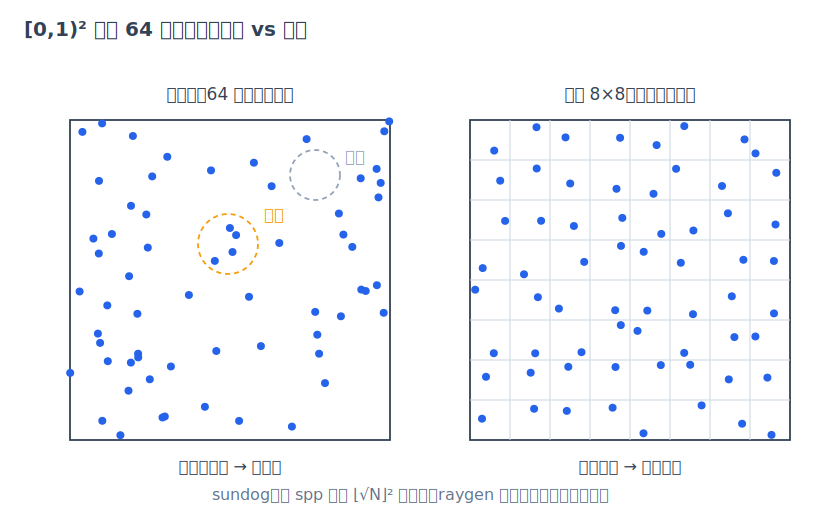

# 第 10 章 随机数、纹理与 AI 降噪

[第 9 章·OptiX 工程实现](09-optix-pipeline.md)把整个路径追踪循环装进了 raygen。本章补齐这个循环消耗的两类"原料"——随机数与纹理，并回答两个问题：GPU 上百万条并行光线怎么"随机"得又快又可复现？低 spp 的噪点图像怎么变干净？

## PCG32：并行且逐位可复现的随机数

蒙特卡洛渲染处处要随机数：像素内抖动、光圈采样、选灯、光源上取点、BSDF 采样、俄罗斯轮盘。在 GPU 上这带来三个特殊要求：同时活跃的百万条路径各要一条互不相关的随机数流；生成要便宜到可以内联在寄存器里做；而且结果必须**可复现**——否则第 11 章的回归测试就没有"参考答案"可言。

CUDA 自带的 curand 库不满足最后两条的组合。curand 的典型用法是为每个线程在显存里维护一个生成器状态：先跑一次初始化核函数，渲染核函数再读写这些状态。状态与"线程"绑定，意味着随机序列取决于线程与像素的映射方式和 launch 配置。设想把图像分上下两块各自 launch：同一像素在两种分块下由不同的线程处理，curand 的状态跟着线程走，该像素拿到的随机序列就变了——分块方式一变，图像就变；而下文按（像素，样本）播种的 PCG32 与"谁来算"无关。此外，状态缓冲还占显存和带宽。

sundog 改用 PCG32（permuted congruential generator，O'Neill 的 pcg-random.org 方案）：状态只有两个 64 位整数，内部是一个线性同余生成器（linear congruential generator/LCG）递推加一步输出置换（异或移位 + 随机旋转），统计质量远好于朴素 LCG。整个实现只有十几行（`Pcg32`（device/rng.cuh）），编写时与官方参考实现的输出序列逐字核对过。

关键在播种。raygen 里每个（像素，样本）对现场构造一个独立生成器（`Pcg32::init()`（device/rng.cuh）、raygen 主循环（device/programs.cu））：

```c++
Pcg32 rng = Pcg32::init(((unsigned long long)pixel << 32) ^ (unsigned long long)s,
                        (unsigned long long)params.seed);
```

64 位种子由像素编号（高 32 位）与全局样本序号 $`s`$（低 32 位）拼成，命令行的 `--seed` 则作为 PCG 的流选择子（`init` 内部 `inc = (seq << 1) | 1`）。初始化只需两次 `next()`，无初始化核函数、无状态缓冲。`rnd()` 取输出的高 24 位乘 $`2^{-24}`$，得到严格落在 $`[0,1)`$ 的浮点数。

由此可以给出**逐位决定性**的论证：

- 每个样本的整条随机序列只由 $`(\text{pixel}, s, \text{seed})`$ 决定，与 launch 配置无关。spp 分多次 launch 时，$`s`$ 是全局序号（`params.sampleOffset + si`），分块方式不影响任何一次采样；
- 序列内的"维度分配"由程序顺序固定：先抖动、再光圈、再 NEE、再 BSDF、再轮盘，代码路径相同则消耗相同；
- 累积不经过原子浮点加法：每像素每 launch 恰好一个线程，用递推均值 `accum += (L - accum)/(s+1)` 顺序更新，浮点运算顺序完全固定，与线程调度无关。

于是固定 `--seed`，在同一 GPU 与驱动上输出 PNG 比特级一致——这正是 [第 11 章·验证方法学与性能](11-validation.md) 中 golden 测试拿 sha256 校验决定性的基础。跨驱动版本则不保证（PTX 即时编译可能改变指令调度），所以 golden 参考图与 GPU/驱动组合绑定。作为对照，朴素实现的常见做法是用 `random_device` 播种：同一场景渲染两次，结果像素级不同，回归测试只能靠肉眼（见[附录](appendix-pitfalls.md)）。

## 分层采样：把运气变成保证

纯随机样本会成团、留空隙——一个像素取 64 个随机抖动点，可能有十几个挤在同一角落；这正是[第 3 章·蒙特卡洛积分](03-monte-carlo.md)中单样本方差 $`\mathrm{Var}[f/p]`$ 的来源之一。分层采样（stratified sampling）把 $`[0,1)^2`$ 切成 $`n\times n`$ 格，每格强制放一个样本：估计量仍然无偏（格内位置依旧均匀随机），但"成团/漏采"这部分方差被直接消除。



*图：同样 64 个样本，纯随机（左）出现空隙与团簇，8×8 分层（右）保证每个子区域恰好一个样本。*

sundog 只对像素内抖动这两维做分层（raygen 抖动段，device/programs.cu）：

```c++
if (s < nStrata * nStrata) {
  jx = ((s % nStrata) + rng.rnd()) / nStrata;
  jy = ((s / nStrata) + rng.rnd()) / nStrata;
} else {
  jx = rng.rnd();
  jy = rng.rnd();
}
```

格数 $`n=\lfloor\sqrt{N}\rfloor`$：代码先取 $`n=\mathrm{round}(\sqrt{N})`$（即 `floorf(sqrtf(N)+0.5)`），若 $`n^2>N`$ 再减一——净效果恰为 $`\lfloor\sqrt{N}\rfloor`$，绕开了浮点开方的舍入误差。第 $`s`$ 个样本落在第 $`(s \bmod n,\ \lfloor s/n\rfloor)`$ 格：前 $`\lfloor\sqrt{N}\rfloor^2`$ 个样本铺满整个格网，超出的余数退化为纯随机。golden 测试的 64 spp 恰好是完整的 $`8\times 8`$ 分层。注意分层格坐标只依赖 $`s`$，抖动仍来自各自的 PCG 流，决定性不受影响；一个容易踩的坑是让全屏所有像素**共享**同一组分层抖动偏移，等于把像素间本应独立的维度锁到了一起（见附录）。至于光圈、选灯、BSDF 这些更高维度，继续用独立均匀随机——高维分层收益递减，工程上不值得复杂化。

## 纹理：从 UV 到线性颜色

材质的反照率可以不是常数，而是表面参数 $`(u,v)`$ 的函数——这就是纹理（texture）。[第 6 章·几何求交](06-geometry.md)已经给出每种图元的 UV 参数化，`evalTexture()`（device/texture_eval.cuh）负责把 UV 变成颜色，支持四种：纯色、棋盘格（按 $`\lfloor u s_x\rfloor + \lfloor v s_y\rfloor`$ 的奇偶选色）、网格线（小数部分落在格边宽度内取线色），以及图像纹理。前三种是纯算术；图像纹理走 GPU 纹理单元：

```c++
case TX_IMAGE:
  return tex2D<float4>(tx.tex, u, 1.0f - v);
```

$`v`$ 取反是因为图像行序自顶向下，而 UV 约定 $`v`$ 向上。host 侧的上传流程在 `TextureSet::upload()`（src/textures.cpp）：stb_image 把 PNG 统一解码成 RGBA8，拷进 `cudaArray`，再创建纹理对象，几项配置各有含义——

- **wrap 寻址**：两个方向都是 `cudaAddressModeWrap`，UV 超出 $`[0,1)`$ 时周期平铺，棋盘地板类场景直接复用一张小图；
- **过滤**：默认 `cudaFilterModeLinear` 即双线性过滤（bilinear filtering），取周围 4 个纹素（texel）按距离加权混合，避免放大时的马赛克；
- **sRGB 硬件解码**：8 位美术资源几乎都存成 sRGB 编码（近似 $`\gamma=2.2`$ 的感知均匀编码），而[第 1 章·成像与光线](01-images-and-rays.md)说过一切光照运算必须在线性空间进行。置位 `td.sRGB` 后，纹理单元在取样时逐纹素硬件解码成线性浮点、**然后**才做双线性混合——顺序正确且零开销。若在渲染方程里直接拿 sRGB 值当反照率，所有中间调都会系统性偏暗。

第四个通道 alpha 用于镂空：任意命中程序 `maskAnyhit()`（device/programs.cu）采样 cutout 纹理，$`\alpha<0.5`$ 就 `optixIgnoreIntersection()` 当作没打中（机制见第 9 章）。辐射光线与阴影光线走同一逻辑，所以镂空的影子也是镂空的。

## AI 降噪：用先验换采样

第 3 章的收敛律是残酷的：误差 $`O(1/\sqrt{N})`$，噪声减半要付 4 倍采样。AI 降噪换了一条路——把"低 spp 图像 → 干净图像"当成图像回归问题，用卷积网络学习。这条路对蒙特卡洛噪声格外有效，因为 MC 噪声的统计性质极好：逐像素零均值（估计量无偏）、高频、像素间近乎独立；而真实图像内容大多是分片光滑的。网络只需从噪声邻域回归出局部均值，难点只剩一个——**别把真边缘也抹掉**。

这就是引导层（guide layer）的作用。raygen 顺带累积两张辅助输出（AOV，见第 9 章）：首次命中的反照率与相机空间法线（raygen 中 `aovAlbedo/aovNormal` 的递推均值段，device/programs.cu；miss 时反照率记背景色）。这两张图几乎无噪声——首跳命中由几何决定，不含路径采样的随机性——它们告诉网络哪些不连续是真实的几何边、纹理边，哪些只是噪声，网络就能在平坦区域大胆平滑、在引导层的边缘处收手。


*图：降噪器的三张输入（复用第 9 章三联图）——含噪 beauty、首跳反照率引导层、相机空间法线引导层。*

sundog 用 OptiX 内置降噪器（denoiser），流程在 `Denoiser`（src/denoise.cpp）：创建时声明 `guideAlbedo/guideNormal` 并选 `OPTIX_DENOISER_MODEL_KIND_HDR` 模型——HDR 即高动态范围（high dynamic range），指未经压缩的线性辐亮度值域，可以远超 $`[0,1]`$；每帧先 `optixDenoiserComputeIntensity` 在整幅 HDR 输入上算一个全局亮度尺度（`hdrIntensity`，把任意曝光的场景归一到网络训练时的量级），再 `optixDenoiserInvoke` 输出。所有输入输出都是 float4 线性辐亮度缓冲——降噪发生在**HDR 线性域、色调映射之前**（src/capi_render.cpp 的顺序：渲染循环 → 降噪 → `writePng` 才做 exposure/ACES/gamma）。这与噪声的统计假设一致：辐亮度域里噪声零均值，若先做 clamp 和伽马这类非线性再降噪，均值就被扭曲了。

|  |  |
|:---:|:---:|
| 16 spp 原始蒙特卡洛 | 16 spp + OptiX AI 降噪 |

*图：余烬湖岸（体积火焰 + 波纹水面，低采样噪声最重的场景）16 spp 降噪前后对比（复用画廊图）。量化数字见第 11 章：16 spp 从 30.23 dB 提到 42.21 dB。*

代价也要说清楚。降噪是**有偏**的：网络会在细节与噪声难以区分时选择平滑，输出不再是渲染方程的一致估计量，spp 再高也不保证收敛到真值；其输出还依赖驱动内置模型的版本，不具备跨版本的比特级决定性。因此 golden 测试一律 `--no-denoise`（scripts/run-golden.sh），降噪只作为最终展示环节，不进入正确性基线。

## 小结

PCG32 按（像素，样本）播种，把随机性变成了纯函数，决定性由构造保证；分层抖动用零成本换走一部分方差；纹理单元免费提供 sRGB 解码与双线性过滤；AI 降噪则用学习到的图像先验替代了数十倍的采样，条件是喂给它 HDR 域的输入和无噪的引导层。这些机制的最终检验都汇聚到同一个问题——怎么证明整台渲染器算得对、快得值？这就是[第 11 章·验证方法学与性能](11-validation.md)。
