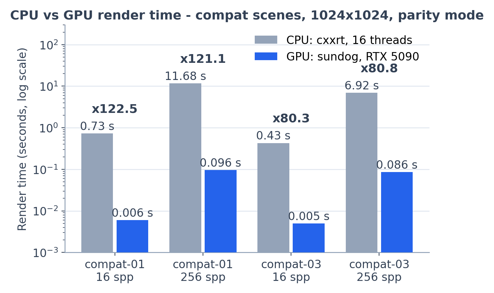

# 第 11 章 验证方法学与性能

前十章把一台 GPU 路径追踪器从数学建到工程。最后要回答两个"凭什么"：凭什么相信它**算得对**？凭什么说 GPU **快 80–122 倍**、这个数字是怎么量出来的？本章承接[第 10 章·随机数、纹理与 AI 降噪](10-sampling-denoising.md)的决定性设计，给出完整的验证与基准方法学。

## 正确性验证金字塔

一张渲染图"看起来对"毫无说服力——附录里 cxxrt 的玻璃从不发生全内反射，图照样"好看"。sundog 的验证像一座金字塔：底层是海量、廉价、定位精确的断言，越往上越接近整机行为、也越昂贵。`make check` 一次串起前四层（host-tests、smoke、golden 及其决定性子测试）。

**第一层：host 单元测试，217 万条断言。** 关键是一个架构决策：所有数值核心——BSDF、求交、采样、随机数——都写在 `device/*.cuh` 头文件里，用 `SD_HD` 宏同时编译为 CUDA 设备代码和普通 C++（device/math.cuh）。于是 5 个测试程序（tests/host/）用纯 g++ 编译，在没有 GPU 的开发机上就能逐位核对**与 GPU 完全相同的**源码。实测 `make host-tests` 共通过 2,170,851 条断言，其中 `test_bsdf` 172 万、`test_rng` 45 万——大头是统计性检验的采样循环。几个有代表性的：

- **参考序列**：PCG32 用官方测试向量 `pcg32_srandom(42,54)` 的前 6 个输出逐字对表（`testPcg32Reference()`（tests/host/test_rng.cpp）），实现偏离上游即失败；
- **采样分布**：余弦采样验证 $\mathbb{E}[\cos\theta]=2/3$、pdf 在半球上蒙特卡洛积分回 1；朗伯采样逐样本验证权重恰等于反照率（见[第 5 章·材质与 BSDF](05-materials.md)）；
- **白炉测试**（white furnace test）：把金属的 $F_0$ 设为纯白 1——一个不吸收任何能量的极限材质——则每个 VNDF 样本的权重 $F\cdot G/G_1$ 必须 $\le 1$：单次散射绝不允许凭空增益能量（`testGgx()`（tests/host/test_bsdf.cpp），4 档粗糙度 × 3 个入射角 × 2 万样本）；
- **物理定律回归**：玻璃逐样本权重恒为 1、折射方向逐分量核对 Snell 定律、超临界角必发生全内反射；还有一条专门的回归测试钉死附录第 1 条 bug——玻璃内侧 40° 入射时，出射面菲涅尔（用透射侧余弦）的反射率应为 0.244，旧实现的错误余弦只给 0.041（`testDielectricExitFresnel()`）。

**第二层：烟雾测试。** `scripts/run-smoke.sh` 是最快的整机连通性检查：`--probe` 能报出 GPU、最小场景 64×64 / 4 spp 渲得出非空 PNG、`--denoise` 变体能跑通、`--stats` 写出的 JSON 可解析。它不判断"对不对"，只回答"活没活着"，改动后几秒内给出第一反馈。

**第三层：golden 图像回归。** `scripts/run-golden.sh` 把 4 个场景（smoke 与三个画廊场景）按冻结参数——256×256、64 spp、`--seed 7`、不降噪——重新渲染，与入库参考图比峰值信噪比（PSNR，见[第 3 章·蒙特卡洛积分](03-monte-carlo.md)），阈值 45 dB。比较工具 `img_compare`（tests/tools/img_compare.cpp）按 8 位 RGB 算 $\mathrm{PSNR}=10\log_{10}(255^2/\mathrm{MSE})$；45 dB 意味着均方根误差约 1.4 个灰阶——任何肉眼可辨的行为变化都过不去，而合法的微小数值抖动（如编译器升级）不会误报。参考图由 `scripts/make-goldens.sh` 生成，同时写入 `manifest.json` 记录 GPU 与驱动版本：golden 只对该组合有效，换驱动须重新生成——这是第 10 章"决定性只在同 GPU/驱动内成立"的直接推论。

**第四层：sha256 决定性。** golden 脚本还把 smoke 场景渲染两遍，要求两个 PNG 的 sha256 **完全相同**。这是对第 10 章整套决定性论证（按样本播种的 PCG32 + 固定顺序累积）的端到端检验：任何一处引入调度相关性——一个原子浮点加、一次依赖线程序的归约——都会立刻在这里失败。

**第五层：compute-sanitizer。** `scripts/run-sanitizer.sh` 用 CUDA 的 memcheck（非法访存/泄漏）与 initcheck（读未初始化显存）跑一次小渲染，任何发现即失败。唯一豁免是一个已确认的误报：OptiX 在加速结构构建时写入的 compaction 大小回读对 initcheck 不可见（`buildAndCompact()`（src/accel.cpp）），脚本按精确签名过滤，其余 initcheck 错误照常拦截。

## 和 CPU 原版公平对比：parity 模式

"GPU 比 CPU 快多少"这个问题很容易问歪。sundog 的物理模式与原 cxxrt 在**算法上**就不同：NEE 覆盖所有非 delta 材质、有 MIS、有俄罗斯轮盘、有 clamp、玻璃有全内反射——拿它对比 CPU 原版，等于把"算法更好"记进了"硬件更快"。

`--parity` 模式因此存在：它在 GPU 上逐式复刻 cxxrt 的采样算法，只比硬件、不比算法。对账 `programs.cu` 与 `bsdf.cuh` 中的 `parity` 分支，逐项复刻的差异如下——连 bug 也一并保留，各条的数学分析见[附录·原 cxxrt 的计算问题与修正](appendix-cxxrt.md)：

- **NEE**：只对朗伯材质做，且直接按 cxxrt 的 $\text{albedo}/\pi \cdot L_i\cos\theta$ 求和式加权（朗伯采样的权重问题见附录 A.2）；
- **MIS**：命中发光体不做 MIS，权重恒 1；
- **俄罗斯轮盘**：无，`depth >= 4` 分支被跳过（见附录 A.6）；
- **clamp**：被强制为 0（src/main.cpp）；
- **点光源**：保留 cxxrt 的 $L_i = I\cdot\frac{1}{4\pi}/d^2$ 单位约定（$I$ 为场景文件的 intensity，$1/4\pi$ 把总功率换算为单位立体角的强度，$d$ 为着色点到灯的距离）；
- **玻璃**：复刻恒 $\eta=1/\text{ior}$ 加原始 Schlick（见附录 A.1）。

在此之上，`scripts/run-benchmark.sh` 设计了三层基准：

- **A. compat 层**：cxxrt 自带 example 场景的 1:1 JSON 移植，GPU 端 `--parity --gamma 2.0 --clamp 0 --max-depth 50`（伽马与递归深度也对齐原版），1024×1024，spp 取 16 与 256——必须是完全平方数，因为 cxxrt 会把 spp 向下取整到 $\lfloor\sqrt{n}\rfloor^2$。计时两边都只含渲染循环：CPU 取 cxxrt 自己打印的 "Rendering elapsed time"，GPU 取 stats 的 `render` 分段，场景解析与加速结构构建都不计入；
- **B. 特性层**：5 个画廊场景固定 960×540 / 64 spp 采集吞吐与显存，衡量 GPU 版独有特性（实例化、网格、降噪 AOV）的规模表现；
- **C. 降噪层**：量化 AI 降噪的等效收益（下节）。

CPU 基线为 cxxrt 以 `-O3 -march=native` 编译、OMP 16 线程运行。以下数字全部引自 `docs/BENCHMARKS.md`（RTX 5090，2026-07-11 实测）。

## 结果解读：80–122× 从哪来

*图：compat 层 CPU 与 GPU 渲染时间（对数轴）及加速比标注，数据同下表。*

| 场景 | spp | CPU (s) | GPU (s) | 加速比 | GPU Mrays/s |
|---|---|---|---|---|---|
| compat-01 | 16 | 0.73 | 0.006 | 122.5 | 6220 |
| compat-01 | 256 | 11.68 | 0.096 | 121.1 | 6116 |
| compat-03 | 16 | 0.43 | 0.005 | 80.3 | 7473 |
| compat-03 | 256 | 6.92 | 0.086 | 80.8 | 7510 |

同一采样算法、同一场景、同样只计渲染循环，GPU 快 80–122 倍。加速比在 spp 从 16 涨到 256 时几乎不变（GPU 时间同步扩到 16 倍），说明两边都处在吞吐主导的稳态，不是 launch 开销的假象。来源可以拆成三份：

1. **并行度**。路径追踪的样本之间天然独立（见第 3 章），是尴尬并行（embarrassingly parallel）的教科书案例：GPU 上百万像素 × 每 launch 一线程全部同时在飞，对面是 16 条 CPU 线程；
2. **RT Core**。BVH 遍历与三角形求交走专用硬件（见[第 8 章·加速结构与 RT Core](08-acceleration.md)），不占用计算核心。需要诚实标注的是：parity 只约束采样算法，加速结构不在复刻范围——cxxrt 用的是随机选轴中位数切分的 BVH（附录第 4 条），遍历质量本身就差，这部分收益混在总加速比里；
3. **内存层次**。场景常量走 `__constant__`，纹理走带专用缓存的纹理单元，显存带宽比主存高一个数量级，且 GPU 以海量并行线程在访存等待时切换执行，把不规则访存的延迟摊平。

**Mrays/s 的含义**：`--stats` 时 raygen 逐线程数 `optixTrace` 调用（辐射光线 + 阴影光线都算），launch 末原子累加，除以渲染时间（src/main.cpp、device/programs.cu）。用表中数字可以还原路径结构：compat-01 的 256 spp 共 $0.096\times 6116 \approx 587$M 条光线，除以 $1024^2\times 256\approx 268$M 个像素样本，平均每样本约 2.2 次 trace——短路径加上朗伯面的阴影线，量级合理。特性层的吞吐在 3.7–6.0 Gigarays/s 之间；规模上限的直观感受是 05-spot-swarm：32,770 个物体（32,768 个实例共享一份 5,856 三角形的 GAS，约 1.9 亿等效三角形），960×540 / 64 spp 渲染 0.025 s。

## 降噪的等效加速

C 层基准在 02-cornell-lume（960×540）上以 4096 spp 渲染作参考，再量 16 spp 的两种出图：

| 图像 | spp | 降噪 | PSNR vs 参考 (dB) |
|---|---|---|---|
| 原始蒙特卡洛 | 16 | 否 | 26.13 |
| OptiX AI 降噪 | 16 | 是 | 42.32 |

按第 3 章的收敛律外推——spp 每翻 4 倍 PSNR 约 +6 dB——纯蒙特卡洛要从 26.13 dB 爬到 42.32 dB，需要把采样再乘约 $4^{16.19/6.02}\approx 40$ 倍，即数百到上千 spp 量级的计算，何况收敛后期参考图自身噪声会让实际需求更高；而降噪只是一次与 spp 无关的固定网络推理。这就是"等效加速"：不是把每条光线算得更快，而是让 16 条光线的钱花出 600 条的效果。代价在第 10 章已经交代——有偏、跨版本不可复现，所以它被排除在 golden 之外，是展示环节而非正确性环节。

## 小结

正确性靠金字塔：217 万条与 GPU 同源的 host 断言钉住每个数值核心，白炉与物理定律测试钉住能量与方向，45 dB golden 钉住整机行为，sha256 钉住决定性，sanitizer 钉住内存。性能靠三层基准：parity 模式剥离算法差异后，同一采样算法在 RTX 5090 上比 16 线程 CPU 原版快 80–122 倍，降噪再在低采样端换来约 40 倍的等效收益。至于这台渲染器替代的那个 CPU 原版身上到底修了什么——请看[附录·原 cxxrt 的计算问题与修正](appendix-cxxrt.md)。
