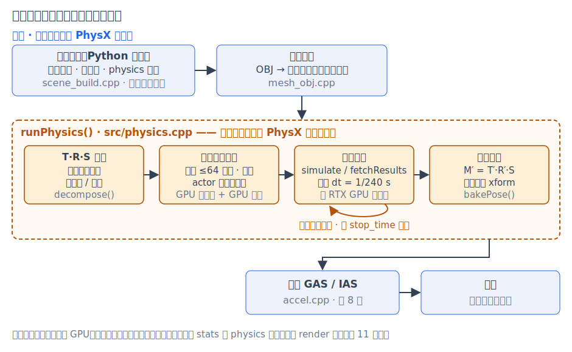
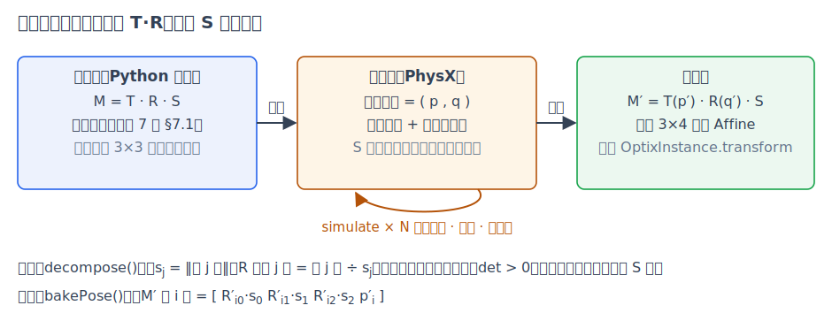
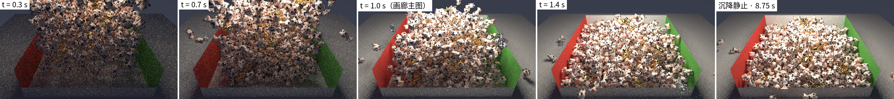

# 第 12 章 物理装载：PhysX GPU 刚体模拟

[第 11 章·验证方法学与性能](11-validation.md)之前，我们建成并验证了一台渲染器。本章讲渲染**开始之前**的一步：画廊 06 号场景里那 512 只互相倚靠、翻滚、堆叠的奶牛，位姿是谁摆的？答案是没有人摆——场景文件里只有它们出生时的位置和速度，最终的堆叠形态由 NVIDIA PhysX 的刚体模拟在加载时算出来，而且这场模拟就跑在即将用来渲染的同一块 GPU 上。本章回答三个问题：刚体模拟在算什么？它怎么接进渲染管线而不惊动下游？以及它凭什么和渲染一样可复现？

## 12.1 为什么渲染器要长出物理

到第 11 章为止，场景里每个物体的变换都是场景文件写死的：`05-spot-swarm` 的三万头奶牛排成整齐的点阵，每头只有一个随机的水平旋转。点阵可以用一个循环生成，但"自然"生成不了——一堆玩具倾泻进箱子后的样子，是几百个物体之间成千上万次碰撞、滑动、弹跳的净结果。想手工摆出"这只搭在那只背上、那只卡在墙角、还有一只翻出墙外"的姿态组合，既不现实也必然假：人手摆的堆总会违反某处的接触约束，悬空或穿插一眼可辨。

sundog 的解法是把"摆放"这件事声明化：场景只描述**初始条件**——每个刚体（rigid body，不发生形变的理想物体）出生时的位姿（pose，位置加姿态）、初速度、角速度，外加一个顶层 `physics` 块给出重力、步长等全局参数（格式见 docs/SCENES.md；`scenes/06-spot-cascade.py` 用固定种子程序化排出 512 头奶牛在半空 8×8×8 的出生点阵）。加载场景时，渲染器先把这套初始条件交给物理引擎推演，把演化结果**烘焙**回每个对象的变换矩阵，然后一切照旧：构建加速结构、发射光线。放进[第 9 章](09-optix-pipeline.md) 9.1 节的七步生命周期里，物理装载插在 ①（数据上传）与 ②（构建 GAS/IAS）之间，调用点是渲染编排里网格加载之后的一个条件分支（对账 `runPhysics()` 调用处（src/capi_render.cpp））：



*图：物理装载全程。虚线框是 `src/physics.cpp` 的模块边界——全项目唯一接触 PhysX 头文件的翻译单元；场景解析只填纯结构体描述，主机单测因此完全不依赖 PhysX。烘焙之后，下游对物理一无所知。*

## 12.2 刚体动力学速成

一个刚体的运动状态由四个量描述：位置 $`p`$、姿态、线速度 $`v`$、角速度（angular velocity）$`\omega`$。位置和速度是普通的三维向量；姿态需要多说两句——它是一个三维旋转，sundog 场景里用旋转矩阵 $`R`$ 表示（[第 7 章](07-transforms.md)），而物理引擎内部用**单位四元数**（quaternion）$`q`$：四个数、一个归一化约束，恰好三个自由度，没有欧拉角的万向锁问题，数值漂移只需重新归一化就能修正。两种表示可以互相转换，12.4 节的烘焙正是做这件事。

动力学方程是牛顿第二定律及其旋转版本：

```math
m\,\dot v = F,\qquad I\,\dot\omega = \tau - \omega \times (I\,\omega),
```

其中 $`m`$ 是质量，$`I`$ 是惯量张量（inertia tensor）——旋转世界里的"质量"，一个由形状与密度决定的 $`3\times 3`$ 矩阵，描述物体绕不同轴转动的难易（sundog 只给出密度，质量与惯量由碰撞形状自动积分，对账 `PxRigidBodyExt::updateMassAndInertia` 调用（src/physics.cpp））。$`F`$ 与 $`\tau`$ 是合外力与合外力矩：这里主要是重力和接触力。

方程是连续的，计算机按**固定步长**离散推进。PhysX 用半隐式欧拉（semi-implicit Euler）：

```math
v_{n+1} = v_n + \Delta t\,a_n,\qquad p_{n+1} = p_n + \Delta t\,v_{n+1}
```

——先更新速度，再用**新**速度更新位置。与"用旧速度更新位置"的显式欧拉只差一个下标，性质却天差地别：显式欧拉的能量随步数系统性增长（轨道越转越大），半隐式欧拉在振荡系统上能量有界，是游戏物理的标准积分器。sundog 取 $`\Delta t = 1/240\,\mathrm{s}`$，且**不做**"按真实流逝时间折算步数"的常见游戏写法——步长固定、步数由模拟时长决定，这是 12.5 节决定性的前提之一。

## 12.3 碰撞：从形状到接触

重力之外，一切戏剧性都来自碰撞。碰撞处理分两个问题：**谁碰了谁**（检测），以及**碰了之后怎么办**（响应）。

**碰撞体不是渲染网格。** Spot 有 5,856 个三角形，直接拿来做碰撞检测既慢又没必要——堆叠效果里没人看得出奶牛腿间的凹陷参与了碰撞。sundog 给每个网格烹制一个**凸包**（convex hull）：包住全部顶点的最小凸多面体，顶点数上限 64。凸形状之间的相交测试有高效且稳健的算法，这正是物理引擎偏爱凸包的原因。和渲染侧的实例化（第 7 章）同一个思路，凸包每个网格只烹制一份，512 个实例共享，各自只带一个缩放（对账 `convexOf()` 与 `PxMeshScale`（src/physics.cpp））。渲染专属的零厚度矩形则是另一处形状学差异：无限薄的面挡不住离散步进的刚体（一步 $`\Delta t`$ 内可能整个跨过去），所以 rect 碰撞体沿背面挤出成厚度可配的实体薄盒——地板与墙在物理世界里是有厚度的。

**检测分两级。** 上千个物体两两配对是 $`O(N^2)`$，和[第 8 章](08-acceleration.md)光线求交面对的是同一种组合爆炸，解法也同源——先粗后细：**宽相**（broad phase）用包围盒快速筛出"可能接触"的对子，**窄相**（narrow phase）只对这些对子做精确的凸形状相交，算出接触点、法线与穿透深度。区别在于物理的几何每步都在动，宽相用的是可增量更新的结构而非每步重建 BVH。

**响应是约束求解。** 每个接触点携带一条不可穿透约束（沿法线方向的相对速度不得为负），加上库仑摩擦的切向约束。几百个物体堆在一起时约束彼此耦合——推动一只牛会波及整堆——精确求解等价于一个大规模互补问题，代价不可接受。实用解法是迭代：轮流处理每个接触，施加冲量修正速度，扫多遍直到近似收敛（sundog 每步 8 轮位置迭代 + 2 轮速度迭代，对账 `setSolverIterationCounts`（src/physics.cpp））。材质参数只有两个：摩擦系数与恢复系数（restitution，碰撞后保留的法向速度比例——06 场景里奶牛取 0.1、地板与墙取 0.05，落地几乎不弹）。快速移动的小物体还可能在一步内穿过薄障碍，刚体开启投机式连续碰撞检测（speculative CCD）在步进前预留接触余量兜底。

最后是**休眠**（sleeping）：动能持续低于阈值的刚体被引擎冻结，不再参与积分与求解。它给了"模拟结束"一个天然定义——当 512 只奶牛全部睡着，堆就成形了。我们把这称作**沉降**（settling）。

## 12.4 GPU 上的物理与位姿烘焙

上面每一步都高度并行：积分是逐刚体独立的，宽相是海量包围盒测试，窄相是几千对独立的凸-凸相交，约束求解可以把不共享刚体的接触分组并行处理。这正是 GPU 的用武之地，也是本项目选 PhysX GPU 刚体（`eENABLE_GPU_DYNAMICS` + GPU 宽相）的原因：模拟与渲染共用同一块 RTX GPU，先模拟、后渲染，串行执行，互不争抢。实测（RTX 5090，`06-spot-cascade`，512 刚体 + 5 静态碰撞体）：沉降全程 2,100 步、模拟时长 8.75 秒，墙钟约 2.5 秒——含凸包烹制与场景装配，摊到每步约 1.2 毫秒（数字来自 `--stats` 的 `physics` 分段，同一分段也保证了第 11 章基准的 `render` 计时口径不被污染）。

工程上最要紧的是**模块边界**。PhysX 是几百 MB 的重依赖，不该渗进解析、测试或设备代码：场景构建（src/capi_scene.cpp + src/scene_build.cpp）只把 physics 声明翻译成纯结构体描述，全项目只有 `src/physics.cpp` 一个翻译单元包含 PhysX 头文件、链接 PhysX 库（对账 `runPhysics()`（src/physics.cpp））。主机单测照常在无 PhysX 的环境下编译运行，渲染设备代码更是从头到尾不知道物理的存在。

模拟前后各有一次矩阵手术，合起来是第 7 章 §7.1 复合公式的逆向应用。场景作者给出的变换是 $`M = T\,R\,S`$，但物理引擎只认刚体位姿 $`(p, q)`$——缩放不是刚体运动的一部分。**分解**（对账 `decompose()`（src/physics.cpp））从 $`M`$ 的 $`3\times 3`$ 部分按列提取缩放与旋转：

```math
s_j = \lVert A\,e_j \rVert,\qquad R = \begin{bmatrix} c_0/s_0 & c_1/s_1 & c_2/s_2 \end{bmatrix},
```

即第 $`j`$ 列的长度是该轴缩放，归一化后的列拼成旋转。这个分解只有在 $`A`$ 确实是"旋转乘缩放"时才成立，所以顺带完成合法性检查：列间不正交说明有剪切、行列式为负说明有镜像，二者都没有物理对应，解析期直接拒绝；动态刚体还要求 $`s_x = s_y = s_z`$（均匀缩放），否则旋转中的物体每换个朝向"形状"就变了，质量性质无从谈起。**烘焙**（对账 `bakePose()`（src/physics.cpp））是逆过程：模拟结束后从引擎读回 $`(p', q')`$，把 $`q'`$ 转回旋转矩阵、乘回**原封不动**的 $`S`$、拼上 $`p'`$，重组成行主序 $`3\times 4`$ 写回对象——正是第 7 章里按字节直拷给 OptiX 实例的那个 `Affine`。



*图：物理只演化平移与旋转；缩放在分解时被提出、模拟期间挂在碰撞形状上、烘焙时原样乘回。*

## 12.5 两种停机：沉降与定格

模拟何时停？默认答案是 12.3 节的沉降——全体休眠（或到达 `max_time` 上限，此时告警并照常烘焙）。但"运动中的一个瞬间"往往比尘埃落定更有表现力，于是有了第二种停机：场景键 `stop_time`（或命令行 `--physics-time`）让模拟推进到**恰好**指定时刻就停下烘焙，凌空翻滚的刚体以当时的位姿原样入画。我们称之为**定格**（freeze-frame）。画廊 06 号主图就是同一个场景在 $`t = 1.0\,\mathrm{s}`$ 的定格——下层已在堆积、上方牛雨仍在下落——旁边的对照图则是沉降态；两张图之间只差一个命令行参数：



*图：同一份初始条件在 t = 0.3 / 0.7 / 1.0 / 1.4 秒的定格与沉降静止态（480×270 / 24 spp）。定格属于"锐利定格"：没有运动模糊，凌空刚体完全清晰。*

最后是可复现性。[第 10 章](10-sampling-denoising.md)与[第 11 章](11-validation.md)为渲染建立了"同 GPU 同驱动逐位一致"的决定性口径，物理装载不能破坏它——否则每次运行连场景几何都不一样，golden 与 sha256 无从谈起。物理侧的决定性由四件事共同保证：固定步长（步数只由模拟时长决定）、固定求解迭代次数、按场景顺序创建 actor、以及整场模拟落在同一块 GPU 上。实测与渲染同口径：`06-spot-cascade` 无论沉降还是 $`t=1.0`$ 定格，连渲两遍的 PNG 哈希逐位一致。同样地，跨机器、跨驱动不作承诺，因此 06 号场景不进 golden 基线——这与第 11 章对 golden 适用范围的约定一脉相承。

## 小结

物理装载让场景文件退到"声明初始条件"：刚体状态 $`(p, q, v, \omega)`$ 按固定步长半隐式欧拉推进，碰撞经凸包近似、两级检测与迭代约束求解归于休眠，全程跑在渲染用的同一块 RTX GPU 上；模拟前后的 T·R·S 分解与烘焙把物理世界与第 7 章的变换体系无缝对接，`stop_time` 则把"哪一瞬间入画"也变成一个参数。固定步长与固定迭代保住了全项目"同机逐位可复现"的口径。物理让场景摆得自然；下一章渲染器再学一件新事——渲染不是表面的东西：篝火场景里那团光线可以穿过、却一路发光的火焰，见[第 13 章·体积渲染](13-volumes.md)。
