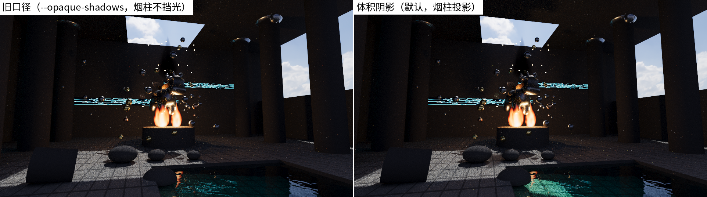

# 第 13 章 体积渲染：程序化火焰

[第 12 章·物理装载](12-physics.md)之后，渲染器学会了让物理摆场景；本章讲它学会的另一件新事：渲染**不是表面的东西**。画廊 07 号场景中央那团篝火既不是几何体也不是贴图——光线穿过它时，一路"捡起"火焰自己发出的光，同时被它轻微遮挡。本章回答三个问题：光穿过"会发光的空气"时在数学上发生了什么？没有解析解的积分怎么算？以及没有任何模拟数据时，一团火的形状从哪里来？

## 13.1 从表面到介质

前十二章有一条从未言明的假设：光在表面**之间**的旅程是免费的——一条光线从相机到第一个命中点、从命中点到光源，途中辐亮度不增不减，所有的物理都发生在表面上。这对真空和干净空气是极好的近似，但对火焰、烟、雾统统失效：这类**参与介质**（participating medium）在光的旅途中间就参与进来。介质对一条光线能做三件事：**吸收**（absorption，能量转化为介质内能）、**发射**（emission，介质自己发光——火焰的本质是高温气体的热辐射）、**散射**（scattering，光被改向到别的方向）。

sundog 的火焰只取前两件：**发射 + 吸收**，舍弃散射。这是对火焰这类光学薄介质的标准近似——火焰的亮度几乎全部来自自身发射，它对别处光线的散射微不足道；而砍掉散射能把问题从"每个介质点都要向整个球面收集入射光"的递归，简化成一条光线上的一维积分。边界也要说清楚：烟雾那样**散射主导**的介质，这套模型渲不了——这条限制写在 device/volume.cuh 的头注释里。而吸收这半边是完整的：不只相机光线，**NEE 的阴影线同样按体积透射率衰减**——火焰会投影、烟柱会遮光，机制与[第 16 章](16-transparent-media.md)的表面透射阴影（玻璃/水，衰减发生在界面与介质段）互补，两套机制在阴影线上如何会师见 §13.6。

## 13.2 辐射传输：发射-吸收方程

把光线参数化为 $`t`$，考察辐亮度 $`L(t)`$ 走过一小段 $`\mathrm{d}t`$ 的变化。介质在这一小段里干了两件事：按吸收密度 $`\sigma`$ 扣掉一部分（扣多少正比于当前有多少，即 $`-\sigma L\,\mathrm{d}t`$），再注入自己的发射 $`\varepsilon\,\mathrm{d}t`$。合起来就是发射-吸收形式的辐射传输方程（radiative transfer）：

```math
\frac{\mathrm{d}L}{\mathrm{d}t} = -\,\sigma(t)\,L(t) + \varepsilon(t).
```

先看只有吸收的情形（$`\varepsilon = 0`$）：方程分离变量直接积分，得

```math
L(t_1) = L(t_0)\,\exp\!\Big(-\int_{t_0}^{t_1} \sigma(s)\,\mathrm{d}s\Big) \;=\; L(t_0)\,T(t_0,t_1),
```

指数因子 $`T`$ 就是**透射率**（transmittance）——穿过介质后活下来的光的比例，这条规律即比尔–朗伯定律（Beer–Lambert）。再把发射加回来（常数变易法，或者直接验证），完整解是

```math
L_{\text{出}} = \int_{t_0}^{t_1} T(t_0, t)\,\varepsilon(t)\,\mathrm{d}t \;+\; T(t_0, t_1)\, L_{\text{背景}} :
```

介质里每一点的发射，先被"它到出口之间"的介质衰减一道再交给相机；介质背后的一切（表面、天空）统一被整段透射率打折。


*图：光线穿过发射-吸收介质。微元里的账目 dL = (−σL + ε)dt；下方是透射率随光程的衰减曲线。*

这个解与[第 4 章·路径追踪算法](04-path-tracing.md)的路径循环拼接起来只需一行账：raygen 每次 `optixTrace` 拿到命中距离后，先沿 $`[\epsilon, t_{\text{hit}}]`$ 算出介质的发射积分与透射率——发射按当前吞吐量 $`\beta`$ 记入 $`L`$，然后 $`\beta \mathrel{*}= T`$。之后无论这条路径走到发光体、打中漫射面还是逃进背景，所有贡献都自动带上了介质的衰减，能量顺序严格正确（对账 raygen 的 marchFlames 调用段（device/programs.cu））。

## 13.3 光线行进

$`\sigma`$ 和 $`\varepsilon`$ 是任意的三维场，上面的积分没有解析解，只能数值求积：把 $`[t_0, t_1]`$ 切成 $`N`$ 段（sundog 取 32），逐段累加发射、逐段更新透射率——这就是**光线行进**（ray marching）：

```math
L \mathrel{+}= T_k\,\varepsilon(p_k)\,\Delta t,\qquad T_{k+1} = T_k\,e^{-\sigma(p_k)\,\Delta t}.
```

固定的采样位置会把离散误差排成整齐的**带状伪影**；把起点加一个 $`[0,1)`$ 的随机偏移，同样的误差就化成人眼不敏感的噪声，还能被 spp 平均掉。这个抖动取自按（像素, 样本）播种的 PCG 流（[第 10 章](10-sampling-denoising.md)），所以体积路径与渲染共享同一条决定性论证：07 场景连渲两遍，PNG 逐位一致。

行进的成本控制靠**先粗筛再细算**——与[第 8 章](08-acceleration.md)包围盒剪枝同一思想的体积版。每团火焰配一个竖直包围圆柱（半径 $`R`$、高 $`H`$），raygen 用几行解析几何算出光线与圆柱的相交区间（y 平板与无限圆柱各裁一次，对账 `clipFlameBounds()`（device/volume.cuh）），没穿过包围柱的光线一步都不用走。火焰因此完全不进 OptiX 的加速结构与 SBT：它们存在 launch params 的一个小数组里，对 GAS/IAS/anyhit 零侵入。代价上这笔账很划算：07 场景 64 spp 一帧渲染 0.069 秒、4403 Mrays/s（docs/BENCHMARKS.md 特性层，含 §13.6 的阴影线行进）——与不含体积的场景同一量级，因为只有穿过火焰包围柱的那一小撮光线付了行进的钱；而无火焰的场景连分支都不进，golden 七场景 PSNR 全为 inf（v0.14 新增的 13 号含火焰，基线按当期口径钉住），逐位证明体积代码对既有渲染零扰动。

## 13.4 程序化火焰场

制片管线里的火来自流体模拟的体素缓存；sundog 没有模拟数据，火焰形状要**当场造出来**——$`\sigma(p)`$ 与 $`\varepsilon(p)`$ 都是位置的纯函数（对账 `flameField()`（device/volume.cuh)），由三层构造叠成：


*图：泪滴轮廓给出宏观形状，fbm 噪声扰动边界产生火舌，发射梯度按"热度"分层上色。*

**第一层：泪滴轮廓。** 把火焰局部化为归一化高度 $`h \in [0,1]`$ 与径向距离 $`d`$，轮廓函数

```math
r(h) = 3.2\,\sqrt{h}\,(1-h)^{1.55}
```

给出每个高度上的火焰半径：$`\sqrt{h}`$ 让底部从一点张开，$`(1-h)^{1.55}`$ 把顶部收成尖。极值点在 $`\mathrm{d}\ln r/\mathrm{d}h = \tfrac{1}{2h} - \tfrac{1.55}{1-h} = 0`$，解得最宽处 $`h^\* = 1/(1+2\times 1.55) \approx 0.24`$，代回得峰值约 $`0.32`$——系数 $`3.2`$ 正是把峰值归一化到 1。

**第二层：噪声扰边。** 光滑的泪滴太"干净"，真实火焰的边界被湍流撕扯。sundog 用三层构造的程序化噪声：整数 **hash**（借用 PCG 的输出置换，对账 `hashU()`）把格点坐标映射为伪随机数；**值噪声**（value noise）在格点间做三线性插值得到连续场（对账 `vnoise()`）；再按"频率近似翻倍（$`\times 2.03`$，避免格点对齐）、振幅减半"叠三个八度成**分形布朗运动**（fBm，对账 `fbm3()`）——大尺度起伏叠上小尺度细节，正是自然纹理的统计特征。用它扰动归一化径向距离 $`d' = d/r(h) + (n - 0.45)`$，边界就长出火舌；噪声采样坐标在 y 向压缩过，扰动特征因此被竖向拉长，像被上升气流拽出的撕裂条纹。图 `ch13-noise-anatomy` 把这一层拆开看：


*图：同一团火在 noise_scale 0 / 1.5 / 3 下的特写——纯轮廓、微扰、完整火舌。*

**第三层：发射梯度。** 定义"热度" $`\text{heat} \propto (0.88 - d')(1.25 - h)`$——越靠核心、越靠底部越热，随后让三个通道按不同速度点亮：

```math
(r, g, b) = \big(\min(2.6\,\text{heat},\,1),\ \min(2.1\,\text{heat}^2,\,1),\ \min(1.7\,\text{heat}^3,\,1)\big).
```

低热度时只有红通道有值（暗红边缘），中等热度绿通道跟上（橙黄），高热度蓝通道补齐（白热核心）——这是黑体辐射"越热越白"规律的一个廉价近似，在线性空间直接可用。

## 13.5 照明与工程记账

体积发射让火焰**看得见**，但要让它**照得亮**周围还差一步：NEE（第 4 章）需要在光源上采样一个点并算出面积 pdf，而弥散在空间里的发射场没有"面积"可言——对发射加权的体积采样是一套不小的机制。sundog 用工业界的标准近似代替：每团火焰在解析场景时自动注册两个带半径的点光（轴上 $`0.35H`$ 与 $`0.70H`$ 处，半径 $`0.3R`$ 给软阴影，暖色按 65%/35% 分摊 `light_intensity`，对账 `addFlameDerived()`（src/scene_build.cpp）），照明走现成的 NEE 机制。分工是"体积负责看得见，点光负责照得亮"。

这个近似的代价要如实记账：BSDF 路径偶然穿过火焰体积时也会拾取发射——这部分能量与内嵌点光**轻微重复**。量级可以放心：火焰对任一着色点的立体角很小，随机路径穿过它的概率低，且 $`\sigma`$ 小、单次穿越拾取的能量有限；这是一笔远小于照明本身的正偏差，换来的是零额外机制。相比之下，第 10 章的 AI 降噪为了收敛也接受了有偏——渲染工程里"如实声明的近似"是常态，掩盖才是问题。

这个"点光代理"的语义还有一条推论，在下一节会用到：`light_intensity` 校准的是**已经逃出火焰的那部分发射**——调参者看着火焰照亮地面的效果定这个数，火焰自身的吸收已经隐含在数值里了。所以当阴影线学会穿越体积衰减之后，点光对**自己宿主火焰**的穿越必须豁免，否则同一笔吸收会被记两次账。

决定性同样如实：场是位置的纯函数、步数固定、抖动来自决定性的 PCG 流，体积渲染完全落在全项目"同机同驱动逐位一致"的口径内，07 场景照常通过双渲 sha256 检验；它与其它画廊场景一样不进 golden 基线之外的任何特殊通道。

## 13.6 阴影线的体积透射：火焰会投影

本章前五节让光线"穿过火焰时捡起光、被打折"，但有一类光线曾被豁免：NEE 的阴影线。旧口径下阴影线只问 BVH 里的表面（布尔遮挡，后来第 16 章教它透过玻璃和水），对火焰这种不在 BVH 里的程序化体积视而不见——灯光无衰减地穿过烟柱，火焰不投影。12 号场景把这个缺口摆到了明处：祭坛上方那根**零发射黑烟柱**（`intensity=0` 的纯吸收体积）挡在两团祭坛火与天窗神光的路上，物理上它必须投下影子，旧口径下它却是"影子的绝缘体"。本节补上这最后一块：阴影线也走一遍 Beer–Lambert。

**数学上没有新东西。** 第 4 章 NEE 的被积项里有一个可见性因子 $`V(x, y)`$，第 16 章已经把它从二元推广为表面透射率 $`T_{\text{surf}}`$（菲涅尔积 × 介质段 Beer–Lambert）；体积吸收并入同一个乘积：

```math
T(x, y) \;=\; T_{\text{surf}}(x, y)\,\cdot\, T_{\text{vol}}(x, y),
\qquad
T_{\text{vol}} = \exp\!\Big(-\int_{x}^{y} \sigma(s)\,\mathrm{d}s\Big).
```

$`T_{\text{vol}}`$ 就是 §13.2 那条发射-吸收方程在 $`\varepsilon = 0`$ 时的解——阴影线只问"挡了多少"，不问"加了多少"（沿阴影线的发射属于体积对光源方向的直接贡献，那是内嵌点光的职责，见 §13.5 的分工）。

**算法是 §13.3 的直接复用。** 对阴影段 $`[x, y]`$ 逐火焰做同一套动作：包围圆柱解析裁剪（`clipFlameBounds()` 原样复用）→ 32 步抖动行进 → 逐步 $`T \mathrel{*}= e^{-\sigma \Delta t}`$、透射率跌破 $`10^{-4}`$ 提前收工——只是不再累加发射（对账 `flameTransmittance()`（device/volume.cuh），raygen 在 NEE 的 `traceShadow` 之后把它乘进透射率）。行进的内循环与 `marchFlames` 的透射轨道**逐位相同**：同一段、同一抖动下，相机看到的衰减和阴影线算出的衰减必须是同一个数，否则"火焰挡住相机的程度"与"火焰挡住灯光的程度"会悄悄漂移——tests/host/test_volume.cpp 用克隆的 RNG 流把两个行进器钉在同一个离散化上。

**抖动与决定性的账要重新对一遍。** 阴影行进和 §13.3 一样抖动起点（定相采样的带状伪影在大面积软半影上格外显眼，抖动化带为噪、随 spp 收敛），这意味着 NEE 每碰到一团火焰包围柱就多抽一次 PCG——渲染的随机流变了，这不就破坏决定性了吗？账分两层：其一，抽取契约与 `marchFlames` 相同——**裁剪早退之后才抽**，没穿过任何包围柱的阴影线一次都不抽，所以无火焰的场景随机流逐位照旧，golden 七场景 PSNR 维持 inf；其二，行进放在"BVH 已判定不遮挡"的早退分支之内（全黑的阴影线不值得行进），而某条固定线段是否被遮挡是场景的确定性性质、与 anyhit 触发顺序无关，条件抽取仍是（场景, 像素, 样本, 种子）的纯函数——同机同驱动双渲，含火焰的场景照样逐位一致。

**宿主豁免。** §13.5 末尾埋的推论在这里落地：每团火焰的两个内嵌点光位于火焰**内部**（轴上 $`0.35H`$、$`0.70H`$），任何指向它们的阴影线都要纵穿半个火焰体——若照单全收，$`e^{-4.5 \times 0.4} \approx 0.16`$ 量级的自吸收会把 07 号场景的唯一主光源压暗一到两档，而这笔吸收在 `light_intensity` 的校准里已经付过一次。解法是给 `LightDesc` 加一个 `flameId` 回链（对账 `addFlameDerived()`（src/scene_build.cpp）），行进时跳过阴影线目标灯的宿主火焰——**只豁免自己**：两团火互相投影、烟柱遮蔽祭坛火、火焰给太阳光挡路，全部照常衰减。这不是回避物理，而是拒绝双重记账。

**口径开关。** 体积阴影随 `transparent_shadows` 一同门控：`--opaque-shadows` 关掉表面透射的同时也关掉体积衰减，旧口径对照实验保持完整——这也是本节效果最直接的验收方式：12 号场景带与不带该开关各渲一帧，烟柱下方的地面与水池一明一暗。



*图：12 号场景同机位对比——左为旧口径（`--opaque-shadows`，烟柱不挡光），右为本节口径（烟柱在祭坛火与神光下投出体积阴影）。*

成本依旧遵循"不穿火不付费"：只有真正穿过包围柱的阴影线付行进的钱，无火焰场景在 `numFlames > 0` 的分支外零开销。

## 小结

体积渲染把"光在表面之间免费旅行"的假设换成了发射-吸收辐射传输方程：介质逐段扣除 $`\sigma L\,\mathrm{d}t`$、注入 $`\varepsilon\,\mathrm{d}t`$，解由透射率 $`T = e^{-\int\sigma}`$ 组织，与路径循环的拼接只是 $`L \mathrel{+}= \beta\!\int\! T\varepsilon`$ 与 $`\beta \mathrel{*}= T`$ 两笔账。积分靠抖动起点的光线行进，成本靠包围圆柱解析剪枝压到"不穿火不付费"；火焰形状由泪滴轮廓、fbm 扰边与热度梯度三层程序化构造当场生成；照明用内嵌点光近似并如实声明了能量重复。NEE 的阴影线走同一条 Beer–Lambert：火焰投影、烟柱遮光，宿主火焰对自家点光豁免以免双重记账。介质的故事还有下半场——当吸收不由包围柱界定、而是由一个折射界面围出来，再叠上一层会骗人的法线，就得到了渲染里的"水"：[第 14 章·水面](14-water.md)。
