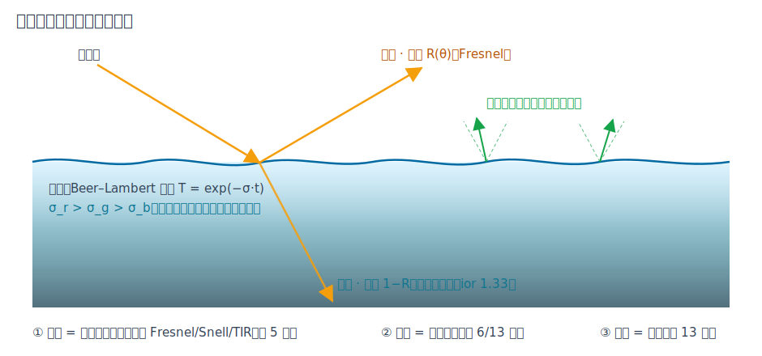
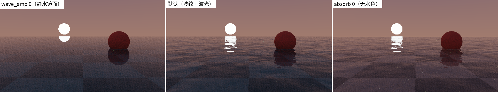
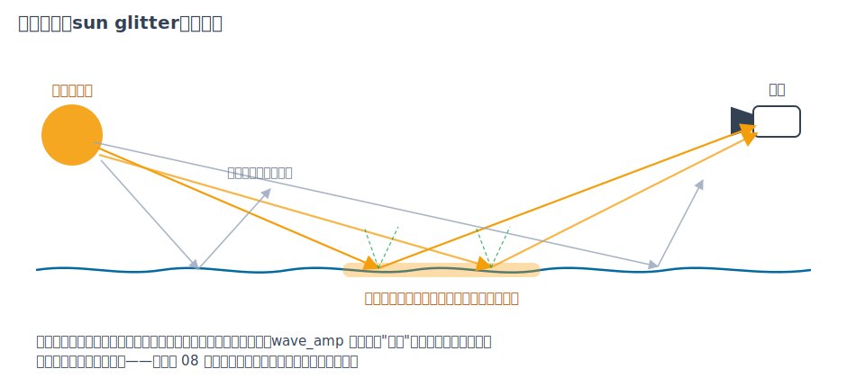

# 第 14 章 水面：界面、波纹与水色

[第 13 章·体积渲染](13-volumes.md)之后，渲染器的"材质观"已经覆盖了表面与介质两个世界。本章讲一种恰好横跨两者的东西：画廊 08 号场景里那面既照出落日、又能看见水底、深处还泛着蓝绿的湖水。"水"在渲染里到底是什么？答案有点反高潮——**它几乎没有任何新数学**，只是把第 5、6、13 章各自讲过的三件事拼成一种材质（真正的新机制——介质栈与透明阴影——要到[第 16 章](16-transparent-media.md)才登场）。本章把这三层拆开，再看它们的组合怎么产生波光、破碎倒影与水色这些一眼可辨的"水味"。

## 14.1 水面的三层拆解

[第 5 章·材质与 BSDF](05-materials.md)讲菲涅尔时用过一个直觉引子：站在湖边，低头看水几乎透明，远眺却像镜子。那一节的数学在这里原样闭环——**界面层**就是一个光滑电介质：菲涅尔决定反射与折射的比例、Snell 定律折弯透射光、掠入射时全反射，与玻璃唯一的区别是折射率从 1.5 换成水的 **1.33**。sundog 的 `water` 材质在 BSDF 层面因此什么都不用新写：它与 `MT_DIELECTRIC` 共享同一个采样分支（对账 `bsdfSample()` 的 case 贯穿（device/bsdf.cuh））。铺一个 `rect` 配 `water`，就是一面物理正确的静水。

但静水太"死"。可信的水还差两层：**波纹**——真实水面的微起伏把倒影揉碎、把太阳拉成一条波光；**水体**——水对穿过它的光有波长选择性的吸收，深水才会偏蓝绿。前者是几何问题（14.2），后者正是第 13 章参与介质吸收项的回归（14.3）。三层各自独立、各有开关：



*图：纵剖面。界面按菲涅尔比例分光；波纹让法线在锥内随位置抖动；水下路径按 Beer–Lambert 衰减，红最先被吸收。*



*图：同一场景的三个变体——wave_amp 0（静水镜面，倒影完整）、默认（倒影破碎、波光出现）、absorb 全零（水底如同隔着玻璃，毫无水色）。*

## 14.2 波纹：高度场与法线扰动

给水面加波纹的老实做法是位移几何——但那会把解析平面变成网格，求交、显存、加速结构全要陪着变。sundog 用图形学的经典捷径：**几何一动不动，只骗着色**。把水面想成隐函数曲面 $`y = H(x, z)`$，即 $`F(x,y,z) = y - H(x,z) = 0`$ 的零等值面；[第 6 章](06-geometry.md)说过隐函数曲面的法线就是梯度 $`\nabla F`$，逐分量求偏导立得

```math
\mathbf{n} \;\propto\; \nabla F \;=\; \Big(-\tfrac{\partial H}{\partial x},\; 1,\; -\tfrac{\partial H}{\partial z}\Big),
```

坡越陡（偏导越大），法线倒得越厉害——直觉与公式一致，

高度场 $`H`$ 则由[第 13 章](13-volumes.md)现成的 fbm 噪声栈提供——火焰与水共用同一套 hash→值噪声→分形叠加（对账 `waterNormal()`（device/noise.cuh），偏导用中心差分近似）。每个着色点按其世界坐标算出一个微微倾斜的法线，交给完全不知情的菲涅尔与反射公式，倒影就自然碎了。

白骗是有代价的：着色法线不再垂直于真实几何。大多数角度下没人察觉，但在掠射角，扰动法线可能整个背对视线，反射方向穿到水面之下——画面上出现噪声状黑边。工程解法直白：检测到这种姿态就回退未扰动的平面法线（`waterNormal()` 的末行防线）。

这一层最值得停下来看的现象是**波光路径**（sun glitter）——08 号场景里从落日直铺到镜头前的那条碎金亮带。静水是完美镜面，太阳只在一个点成像；波纹把每个点的法线撒进一个锥，于是"能把太阳镜面反进相机"的点不再是一个，而是一整片——而这片点集恰好沿太阳与相机的连线方向拉长成带。波幅越大，法线锥越宽，亮带越长越碎：



*图：锥内法线抖动让亮带上的每个点都存在一条太阳→水面→相机的镜面路径；锥外的点把太阳反去别处。*

## 14.3 水色：介质吸收

清水几乎不散射，但**吸收**显著且偏心：红光最先被吃掉，绿次之，蓝最耐久。这正是第 13 章的 Beer–Lambert 透射率 $`T = e^{-\sigma t}`$，只是介质不再由包围圆柱界定，而是由水面**围出来**：光线折射入水的那一刻进入介质，直到再次穿出水面为止，中间每一段都按走过的长度衰减。sundog 的 `water` 默认 $`\sigma = (0.45, 0.08, 0.035)`$（每世界单位）——红光的半衰深度 $`\ln 2 / 0.45 \approx 1.5`$ 个单位，两三米深的水底就明显偏青；蓝光的半衰深度接近 20 个单位，所以深水最后剩下的是蓝。08 号场景用了更浓的 $`\sigma = (0.7, 0.14, 0.06)`$，红光半衰只剩约 1 个单位——湖床棋盘在浅处还看得见暖色、往深处两三格就沉进青蓝里，正是三联图第三格（`absorb` 全零）拿掉的那层"水味"。

工程上这是 raygen 路径循环里的一个**介质栈**（本章成稿时还是单个变量，[第 16 章](16-transparent-media.md)把它升级成了栈以支持嵌套介质）：水面上的**透射**事件操作它——从正面折射进水把 $`\sigma`$ 压栈、从背面折射出水弹栈回到外层介质；全内反射是反射，不切换。此后每次 `optixTrace` 返回，先按段长以栈顶 $`\sigma`$ 把 $`\beta \mathrel{*}= e^{-\sigma\, t}`$ 再处理命中（对账 raygen 的介质栈记账段（device/programs.cu））。开放水域里折射光可能在介质内 miss（射向无穷远），按大程长衰减到近零——无限深的水本就该吞掉一切。判断"是否透射"复用了现有的半空间检验 $`\langle \mathbf{w}_i, \mathbf{n}_s\rangle < 0`$，与 offsetRay 选边是同一逻辑，波纹扰动过的法线也自动适用。

## 14.4 工程记账与边界

如实声明边界——本章初稿的两条限制后来都被[第 16 章](16-transparent-media.md)解除：**嵌套介质**曾因单变量介质状态而不支持（水里放玻璃按真空算），介质栈落地后水中玻璃、玻璃中气泡都按相对折射率算对（画廊 11 号场景即为演示）；**水下 NEE 死区**曾因阴影线把透射材质当不透明而存在（水下照明只能靠折射穿出水面的 BSDF 路径，深水底偏暗），透明阴影落地后水下阴影线经菲涅尔与 Beer–Lambert 衰减穿过水面，Snell 窗口自然涌现。保留的一条是**决定性不破**：波纹与吸收都是位置的纯函数，08 号场景双渲 PNG 逐位一致。

性能上水几乎免费：波纹是每次水面命中多四次 fbm 求值，吸收是每段一个指数。08 号场景 64 spp 一帧渲染 0.035 秒、6380 Mrays/s（docs/BENCHMARKS.md）——全画廊最快，因为开阔场景大半光线一跳就 miss 进天空。

最后记一笔有教学价值的插曲。water 分支合入后，golden 回归里 01 号场景从逐位一致（PSNR = inf）变成了 **101 dB**——水代码明明一行都不会在无水场景里执行。原因在编译器：raygen 里新增的分支改变了指令调度，个别浮点乘加的融合顺序随之微调，少数像素偏了 ±1 个灰阶。这正是[第 11 章](11-validation.md)设计 45 dB 阈值时预留的空间："任何肉眼可辨的行为变化都过不去，而合法的微小数值抖动不会误报"——那句话在这里第一次被现场兑现。

## 小结

水面 = 三件已学之事的组合：第 5 章的电介质界面换个折射率（1.33），第 6 章的梯度法线套上第 13 章的 fbm 高度场（只骗着色不动几何，掠射角回退防黑边），第 13 章的 Beer–Lambert 吸收由界面围出介质（透射切换状态、TIR 不切换、波长偏心的 $`\sigma`$ 给出水色）。波光路径、破碎倒影与深水蓝绿都不是新机制，而是这三层组合的自然涌现。顺着"组合旧知识"的思路还有最后一站：本章的湖面靠发光大球和 distant 灯手工拼出落日，而[第 15 章·环境光照](15-envlight.md)会把整个天空——连同真正的太阳——装进一张 HDR 照片当灯，第 3 章的重要性采样在那里迎来一次教科书式的实战。
