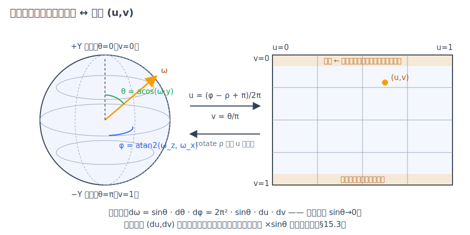
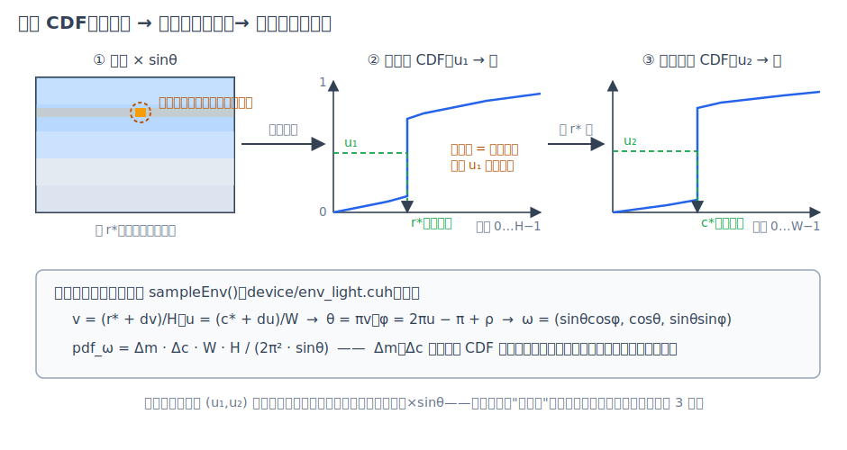
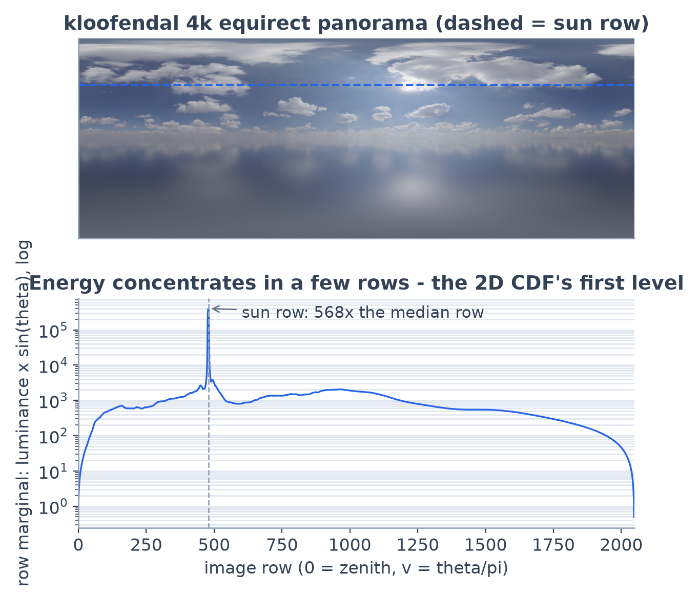
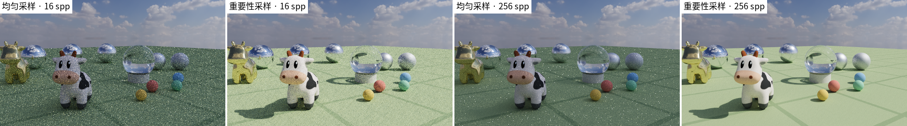

# 第 15 章 环境光照：HDR 环境贴图与重要性采样

[第 14 章·水面](14-water.md)结束时，渲染器的光源清单是：发光物体、点光、平行光，外加一个只会在 miss 时上色的背景。这份清单拼不出"晴天"。08 号湖畔场景的落日其实是三件道具的手工合成——一颗 intensity 60 的发光大球扮太阳、一盏 distant 灯补方向光、一层渐变背景画天色。真实世界里这三者本是同一样东西：**天空整体就是光源**。本章给渲染器补上这块拼图：把一张 360° 的高动态范围（high dynamic range/HDR）全景照片挂到无穷远处当灯，这个技法叫**基于图像的照明**（image-based lighting/IBL）；再回答一个更根本的问题——图里那颗只占几个纹素、却亮过天空几十万倍的太阳，怎样才能被蒙特卡洛"打中"。这正是[第 3 章](03-monte-carlo.md)重要性采样与逆变换采样两个概念的实战应用，也是画廊 10 号场景「晴空捕日」全部照明的来源。

## 15.1 从"背景"到"光源"

sundog 原有的背景（solid/gradient）在数学上是渲染方程的边界项：路径逃逸出场景（miss）时，按方向补一笔辐亮度，仅此而已。它有两个致命局限。其一，它不参与 NEE——[第 4 章](04-path-tracing.md)讲过，下一事件估计靠"主动朝光源采一根阴影线"压方差，而背景没有可采样的立体角描述，漫反射面只能靠 BSDF 光线碰运气撞进亮区。天空这种铺满半球的柔光源撞得到；一颗小太阳几乎撞不到。其二，纯色与渐变本身没有细节，镜面金属映不出云，玻璃球里也倒扣不进一片天。

环境贴图一次解决两个问题。把场景想象成被一个半径无穷大的球壳包住，壳上每个方向 $`\omega`$ 都有一份来自照片的辐亮度 $`L_{env}(\omega)`$——因为在无穷远，它与着色点位置无关，只是方向的函数。miss 时按方向查图（对账 `evalBackground()` 的 `BG_ENVMAP` 分支（device/programs.cu）），这是"背景"的老角色；同时它作为一盏**方向域光源**加入 NEE 的策略集，阴影线沿采出的方向射向"无穷远"（tmax 取 1e16，与平行光同款），中途无遮挡即命中。场景 JSON 里只多一种背景类型：

```json
"background": { "type": "envmap", "file": "../assets/sky_4k.hdr",
                "rotate": 210, "intensity": 1.0 }
```

## 15.2 HDR 与等距柱状投影

为什么必须是 HDR？看实测：kloofendal 天空图里，含太阳那一行的总亮度是中位行的约 568 倍，而单个日面纹素与普通天空纹素的辐亮度差出四五个数量级。8-bit 图像顶格只有 255，还叠着 sRGB 非线性——把太阳存进 PNG，它会被削成一块普通的白斑，之后再怎么采样都点不亮场景。Radiance `.hdr` 格式用 **RGBE** 编码解决存储：每纹素四字节，RGB 三个尾数共享一个指数字节，动态范围覆盖几十个数量级，代价只是 PNG 的一倍体积。加载端 `stbi_loadf` 直接解码成线性浮点，上传为 float4 纹理——这里不能沿用第 10 章 image 纹理的 uchar4 + sRGB 硬解码路径，8-bit 归一化会把辐亮度截回 [0,1]（对账 `EnvMap::upload()` 的 `cudaReadModeElementType` 纹理描述（src/env_light.cpp））。



*图：方向球面与 (u,v) 矩形的互换。rotate 只是 u 方向的平移；靠近两极，一整行像素挤在越来越小的方向帽上。*

方向和像素之间用**等距柱状投影**（equirectangular）互换：横轴 u 均匀铺方位角 $`\phi\in[-\pi,\pi)`$，纵轴 v 均匀铺极角 $`\theta\in[0,\pi]`$（v=0 是天顶、正对 HDR 顶行），

```math
u=\frac{\phi-\rho+\pi}{2\pi},\qquad v=\frac{\theta}{\pi},\qquad
\omega=(\sin\theta\cos\phi,\ \cos\theta,\ \sin\theta\sin\phi)
```

绕 y 轴的旋转 $`\rho`$（场景键 `rotate`）在这套坐标里退化成 u 的循环平移——调太阳方位不用动任何矩阵（对账 `envDirToUv()`（device/env_light.cuh））。这套映射的代价是畸变：立体角微元 $`d\omega=\sin\theta\, d\theta\, d\phi = 2\pi^2 \sin\theta\, du\, dv`$，靠近两极 $`\sin\theta\to 0`$，同样一格像素对应的立体角越来越小。这个 $`\sin\theta`$ 马上就会在采样权重里回来。

## 15.3 把亮度变成概率

[第 3 章](03-monte-carlo.md)的结论：重要性采样的 pdf 越贴近被积函数，方差越小。对环境光，被积函数正比于 $`L_{env}(\omega)`$，而我们手里恰好有它的完整表格——图像本身。于是目标 pdf 顺理成章：**按纹素亮度采样，再乘上 $`\sin\theta`$ 补偿投影畸变**（不乘的话，两极的纹素会被按"像素面积"而非"立体角"超采，图看着没错、噪声分布却诡异）。

采样一个 2D 分布用"先选行、再选列"的分解：行的**边缘分布**（marginal）是每行亮度×sinθ 的总和，选定行后列的**条件分布**（conditional）就是该行内逐纹素的亮度。加载时一次性构建两级**累积分布函数**（CDF）：行边缘 CDF 共 H+1 项，每行再各存一条 W+1 项的条件 CDF，前缀和用 double 累加、末项钉死 1.0 防浮点尾差（对账 `EnvMap::upload()` 的构建循环（src/env_light.cpp））。渲染时每次环境采样消耗两个均匀随机数 $`(u_1,u_2)`$，做两次二分搜索——这正是逆变换采样：CDF 单调，$`u_1`$ 落进哪个区间的概率恰好等于该区间的概率质量，太阳行在边缘 CDF 上是一段陡峭的跳变，大段 $`u_1`$ 都会落进去。



*图：亮度图逐行求和得边缘 CDF；u₁ 二分选行、u₂ 在该行的条件 CDF 上二分选列；纹素内再线性插值。*



*图：上为 kloofendal 全景与太阳所在行；下为行边缘亮度（对数轴）——尖峰一行是中位行的 568 倍，这就是"必须重要性采样"的直观证据。*

选出纹素 (row,col) 后拼回方向与密度。图像域 pdf 是分段常数 $`p_{img}=\Delta m\cdot\Delta c\cdot W\cdot H`$（$`\Delta m,\Delta c`$ 是两条 CDF 在所选区间的高度差），经 15.2 的面积元换到立体角域：

```math
p_\omega(\omega)=\frac{\Delta m\,\Delta c\, W H}{2\pi^2\sin\theta}
```

自检一下：纯白图时 $`\Delta m\propto\sin\theta_{row}`$、$`\Delta c=1/W`$，代入恰好约成均匀球面的 $`1/4\pi`$（对账 `sampleEnv()` 与 `envPdfSolidAngle()`（device/env_light.cuh）——采样端与反查端用同一份 CDF 差分重建 pdf，两侧永远自洽）。

## 15.4 与 NEE/MIS 的接驳

环境光进入 NEE 后，[第 4 章](04-path-tracing.md)的双重计数问题原样出现：同一笔"漫反射面被太阳照亮"的贡献，既能被环境采样的阴影线拿到，也能被 BSDF 采样的光线 miss 进太阳拿到。解法也原样：多重重要性采样。sundog 把策略集定义为"显式灯 + 环境光"，均匀选一个，选择概率 $`1/n_{strat}`$ 折进两侧 pdf；NEE 侧沿用既有的 balance heuristic 权重不动，miss 分支新增与之逐字互补的另一半——

```math
w_{miss}=\frac{p_{bsdf}}{p_{bsdf}+p_\omega(\omega)/n_{strat}},\qquad
w_{nee}=\frac{p_\omega(\omega)/n_{strat}}{p_\omega(\omega)/n_{strat}+p_{bsdf}}
```

两式之和恒为 1，能量既不重复也不丢失（对账 raygen 的 `nStrat`、miss 权重与 NEE 分支（device/programs.cu））。镜面反弹后 miss 权重取 1（delta BSDF 的 NEE 侧概率为零）；solid/gradient 背景不在策略集里，miss 权重保持 1，旧场景一个比特都不变。有一处与分段常数 pdf 有关的细节值得写明：双线性过滤会把亮纹素的辐亮度"漏"到 pdf 为零的邻居方向上，NEE 采不到那里——但 BSDF 路径能到、且 MIS 权重恰为 1，所以这是方差不是偏差，不需要（也不应该）修。真正采不到的只有一类：玻璃球后面的太阳**焦散**。透明阴影（[第 16 章](16-transparent-media.md)）让玻璃背后的直射透光可以经阴影线获得，但透射率累积不折弯光线——被曲面**聚焦**的亮斑仍只能靠 BSDF 折射路径慢慢撞，这是 10 号场景残余噪声的主要来源。

`importance:false` 开关把 `sampleEnv()` 退化成均匀球面方向（$`p=1/4\pi`$）、反查端同步——结构、随机数消耗、MIS 公式全不变，只换密度，构成一组干净的受控实验：



*图：同场景同 spp 只换采样分布。直径约半度的日面只占全天球立体角的约百万分之五，均匀撒 16 个方向命中太阳的概率不足万分之一——直射光几乎全丢，偶尔命中的样本权重巨大又被 clamp 截断，画面又暗又噪；重要性采样在 16 spp 已给出正确的亮度与影子。*

## 15.5 工程记账与实测

定量对照（960×540，vs 同场景 4096 spp 参考，img_compare）：16 spp 时均匀采样 12.64 dB、重要性采样 **29.06 dB**——按第 3 章"+6 dB/4×"的收敛律折算 $`4^{16.42/6.02}\approx 44`$ 倍等效采样；更能说明问题的是均匀采样加到 256 spp（16 倍算力）也只爬到 13.37 dB：被 clamp 截走的太阳能量是系统性损失，加样本救不回来，这与第 4 章"clamp 用可控偏差换方差"的交代在极端光源下的表现完全一致。正确性用白炉测试收口（在 `tonemap:"clamp"` 线性输出模式下——白炉检验的是线性域能量守恒，须绕过 ACES 曲线）：纯白环境（intensity 0.5）加白色 lambert 球，4096 spp 下球面 41×41 像素块均值 127.49、理论值 127.5（8-bit），背景恰为 128——MIS 无重复计数、无能量泄漏。

开销全部发生在加载期与显存里：4k HDR 解码 + 双层 CDF 构建 + 上传共约 30 ms（含在 10 号场景 stats 的 scene_load 里）；显存增量约 160 MB，其中 float4 全景纹理 128 MB、行条件 CDF（2048×4097 个 float）约 32 MB——10 号场景峰值 856 MB，对比无环境贴图场景的约 694 MB（docs/GALLERY.md）。渲染期每次环境 NEE 是两次二分（log₂2048 + log₂4096 约 23 次访存）加一次纹理查询，10 号场景 64 spp 实测 0.078 秒、4229 Mrays/s（docs/BENCHMARKS.md），在十场景里属于较慢的一档——每次环境 NEE 都要多付两次二分与一次纹理查询，与实例化、物理两个几何重场景（05/06）同量级；最快的仍是一跳进天的 08。

决定性有一条设计红线值得记录：环境光作为新策略加入 NEE 时，选灯的随机数必须仍是**同一次** `rng.rnd()`（乘数从 numLights 换成 nStrat），而不是"先抽一个数决定灯还是环境、再抽一个数选灯"——后者会让所有无环境贴图的场景多消耗一个随机数，整条 RNG 流错位，全部 golden 崩掉。按前者实现后，四张旧 golden 在合入后保持逐位一致（PSNR = inf）：连[第 14 章](14-water.md)结尾那种编译器指令重排级的 ±1 灰阶抖动都没有发生——新增代码全部躲在 `bg.kind == BG_ENVMAP` 的分支后面，旧路径的指令流原样保留。

## 小结

环境光照 = 一张图 + 一次换元 + 一条旧公式：equirect 把方向域摊平成像素（15.2），亮度×sinθ 的两级 CDF 把"图有多亮"变成"该往哪采"（15.3，第 3 章逆变换采样的完整落地），balance heuristic 的另一半权重把 miss 分支纳入 MIS 的账本（15.4，第 4 章两式的镜像补全）。太阳这种"小而炽烈"的光源由此从噪声灾难变成一次二分搜索就能命中的普通样本。但阴影线的故事还差最后一块：本章的阴影线仍把玻璃与水当成不透明的墙——[第 16 章·透明阴影与嵌套介质](16-transparent-media.md)将拆掉这堵墙，顺手把"水里放玻璃"这类嵌套介质也算对。
