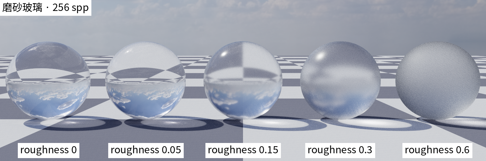
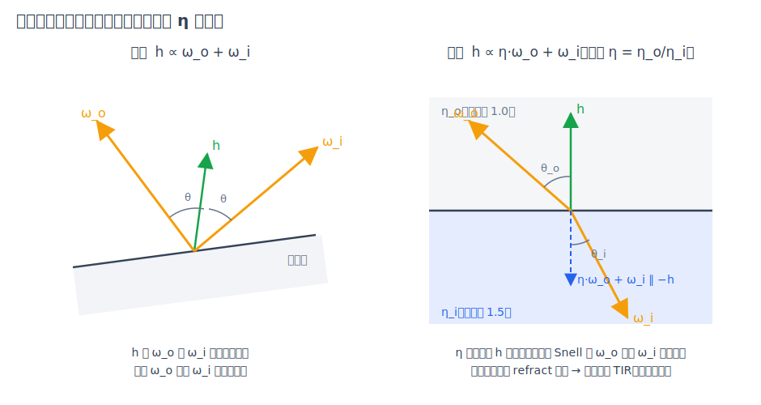

# 第 16 章 粗糙电介质：微表面透射与磨砂玻璃

[第 15 章·透明阴影与嵌套介质](15-transparent-media.md)把玻璃的**影子**算对了，但玻璃本身仍是完美光滑的：一面镜子般的反射加一束不打折的折射。本章给玻璃加上最后一维——**粗糙度**，回答三个问题：磨砂玻璃为什么"透光不透形"？[第 5 章](05-materials.md)的 GGX 微表面怎么从反射搬进透射？粗糙度归零时如何**逐位**退回旧玻璃？

## 16.1 两个旧答案拼不出的新材质

翻回第 5 章的材质清单会发现一个空档。金属有粗糙度：GGX 法线分布把镜面反射糊成高光瓣，`roughness` 从 0 到 1 连续调节（5.2–5.3）。玻璃能透射：菲涅尔概率二选一的双 delta 瓣，一反一折（5.4–5.5）。但**粗糙 + 透射**的组合——磨砂玻璃、喷砂灯罩、毛玻璃浴门——两个旧答案都给不出：金属没有"穿过去"的瓣，玻璃没有"糊开"的机制。

而磨砂玻璃的日常体验恰恰同时需要两者：隔着它看不清对面的**形**，却挡不住对面的**光**——浴室门后的人影只剩色块，门缝里的灯光照样洒进来。13 号场景「霜幕屏风」把这句话排成一列：五扇玻璃屏粗糙度从 0 递增到 0.6，屏后各燃一簇火焰，镜面端火苗清晰如无物，磨砂端只剩一团暖色光晕（[画廊](../GALLERY.md)）。

直觉模型与第 5 章的金属完全同源：磨砂表面在微观上是**无数个各自光滑的微镜面**，每一面都按斯涅尔定律规规矩矩地折射；只是它们的法线在宏观法线附近抖动，同一束入射光经过不同微镜被折向略微不同的方向——透射方向被"糊开"，糊开的宽度就是粗糙度。剩下的全部工作，是把这个直觉写成可采样、可求值、可算 pdf 的 BSDF。



*图：五颗玻璃球，dielectric roughness 0 → 0.6——折射的棋盘地面从镜面清晰连续糊成霜面，能量不变、只有方向被抖散。*

## 16.2 透射半程向量

第 5 章反射微表面的关键构造是**半程向量**（half vector）：给定入射出射方向，$`\mathbf{h}_r \propto \omega_o + \omega_i`$ 是唯一能把 $`\omega_o`$ 镜面反射到 $`\omega_i`$ 的微镜面法线——它是两个方向的角平分线。透射侧的对应构造来自 Walter 等人 2007 年的经典工作：能按斯涅尔定律把 $`\omega_o`$ 折射到 $`\omega_i`$ 的微镜面法线是

```math
\mathbf{h}_t \;\propto\; \eta\,\omega_o + \omega_i,
```

其中 $`\eta = \eta_o / \eta_i`$ 是 $`\omega_o`$ 侧对 $`\omega_i`$ 侧的**相对折射率**——正是 `bsdfSample()` 里沿用至今的 `eta = frontface ? etaExt/ior : ior/etaExt`（第 15 章的介质栈约定）。为什么是 η 加权和？把斯涅尔定律写成向量形式：折射要求两个方向在界面切向上的投影满足 $`\eta_o \sin\theta_o = \eta_i \sin\theta_i`$，即 $`\eta_o\,\omega_o`$ 与 $`\eta_i\,\omega_i`$ 的**切向分量恰好相消**——它们的和只剩法向分量，方向就是（负的）微镜面法线。归一化并翻转到 $`\omega_o`$ 一侧，就得到代码里的 `h = normalize(eta * lo + li)`（对账透射半程向量构造，device/bsdf.cuh）。



*图：左，反射半程向量是 ω_o 与 ω_i 的角平分线；右，透射半程向量是 η 加权和的方向——能按斯涅尔把 ω_o 折到 ω_i 的那面微镜。*

微镜面级也有全内反射：从光密侧掠射某个微镜时 `refract()` 无解。宏观光滑玻璃在 TIR 时确定性反射、不掷菲涅尔硬币（第 5 章）；微表面版本原样继承——所采微镜发生 TIR 就确定性走反射瓣，**不消耗瓣选择随机数**（对账 `fresnelDielectric()` 的 F=1 分支与 `bsdfSample()` 的 TIR 路径，device/bsdf.cuh）。

## 16.3 Walter BTDF 与折射雅可比

反射微表面的 BRDF 是熟悉的 $`F\,D\,G / (4\,|\omega_o\!\cdot\!\mathbf{n}||\omega_i\!\cdot\!\mathbf{n}|)`$，那个 $`1/4`$ 来自"半程向量测度到立体角测度"的雅可比 $`|\partial\omega_h/\partial\omega_i| = 1/(4|\omega_i\!\cdot\!\mathbf{h}|)`$。透射侧的每一因子都有对应物，唯独雅可比要重推——这一步是本章数学的心脏。

固定 $`\omega_o`$，让微镜法线 $`\mathbf{h}`$ 抖动，问折射方向 $`\omega_i`$ 跟着动多快。从 $`\mathbf{h}_t`$ 的定义反解：未归一化的 $`\mathbf{H} = \eta\,\omega_o + \omega_i`$，其长度 $`\|\mathbf{H}\| = |\eta(\omega_o\!\cdot\!\mathbf{h}) + (\omega_i\!\cdot\!\mathbf{h})|`$（把 $`\mathbf{H}`$ 投影到自己的方向上）。对方向微元做球面测度换算——与第 14 章环境光 pdf 的换元同一套路——得

```math
\left|\frac{\partial \omega_h}{\partial \omega_i}\right|
= \frac{|\omega_i\!\cdot\!\mathbf{h}|}{\big(\eta\,(\omega_o\!\cdot\!\mathbf{h}) + (\omega_i\!\cdot\!\mathbf{h})\big)^2}.
```

分母正是 $`\|\mathbf{H}\|^2`$：微镜转一个小角度，$`\omega_i`$ 被折射放大或压缩的比例由 $`\mathbf{H}`$ 的长度平方控制——掠射折射（$`\|\mathbf{H}\|`$ 小）时方向变化剧烈，接近正入射时平缓。代入微表面框架（Walter 2007 式 21，按上面的相对 η 形式整理），透射 BTDF 为

```math
f_t(\omega_o, \omega_i)
= \eta^2\,\big(1 - F\big)\, D(\mathbf{h})\, G(\omega_o, \omega_i)\;
\frac{|\omega_o\!\cdot\!\mathbf{h}|\,|\omega_i\!\cdot\!\mathbf{h}|}
     {|\omega_o\!\cdot\!\mathbf{n}|\,|\omega_i\!\cdot\!\mathbf{n}|\,
      \big(\eta(\omega_o\!\cdot\!\mathbf{h}) + (\omega_i\!\cdot\!\mathbf{h})\big)^2}
```

（对账 `bsdfEval()` 的透射分支，device/bsdf.cuh）。$`D`$ 与 $`G`$ 原封不动复用第 5 章的 GGX 与高度相关 Smith——`ggxLambda` 只依赖 $`\cos^2`$，对下半球方向天然有效，透射不需要新的遮蔽函数。

单独说 $`\eta^2`$。它是辐亮度穿过折射界面时的"压缩因子"：一束光从疏介质进入密介质，立体角被折射压小，辐亮度相应放大 $`\eta_i^2/\eta_o^2`$。沿一条**完整**的 BSDF 路径它似乎可以省略——进玻璃乘 $`\eta^2 < 1`$、出玻璃乘 $`1/\eta^2`$，闭合玻璃体上恰好相消，这也是光滑分支 `weight = 1` 约定成立的原因。**但它不能从 eval 里省**：NEE 拿 `bsdfEval` 做的是**不成对的单界面连接**——阴影线从磨砂屏内侧直连屏后的火焰，只穿这一个界面，没有"另一半"来相消。开发中省略它的初版实现让每个透射 NEE 连接偏了 $`\eta^2`$（IOR 1.5 下是 2.25 倍），这笔账由 delta 极限验证当场揭发（见 16.5）。

## 16.4 VNDF 采样、瓣选择与权重化简

采样端几乎是金属分支的复刻。第一步用第 5 章的 VNDF 采样取微镜法线 $`\mathbf{h}`$——`ggxSampleVndf` 原样复用，消耗一次 `rnd2()`。第二步在这面微镜上算菲涅尔 $`F(\omega_o\!\cdot\!\mathbf{h})`$，掷一次 `rnd()` 硬币选瓣：概率 $`F`$ 反射、$`1-F`$ 折射。**抽取顺序是数学定的**：$`F`$ 依赖所采的微镜，瓣选择必须排在 VNDF 之后——顺带让前两次抽取与金属分支的流位置完全对齐。

权重的化简是本章最优雅的一步。透射瓣的 $`f_t\,|\cos\theta_i| / p`$：pdf 是 VNDF 密度乘 16.3 的雅可比再乘瓣概率 $`(1-F)`$，

```math
p_t = (1-F)\;\underbrace{\frac{G_1(\omega_o)\,D(\mathbf{h})\,|\omega_o\!\cdot\!\mathbf{h}|}{|\omega_o\!\cdot\!\mathbf{n}|}}_{\text{VNDF 密度}}\;
      \frac{|\omega_i\!\cdot\!\mathbf{h}|}{\big(\eta(\omega_o\!\cdot\!\mathbf{h})+(\omega_i\!\cdot\!\mathbf{h})\big)^2},
```

与 $`f_t`$ 逐项对约：$`(1-F)`$ 消、$`D`$ 消、两个点积消、雅可比分母消，只剩

```math
\frac{f_t\,|\cos\theta_i|}{p_t} = \eta^2\,\frac{G}{G_1(\omega_o)} \;\le\; \eta^2 .
```

反射瓣同法得 $`G/G_1`$——正是金属分支 $`F \cdot G/G_1`$ 里那个几何项，菲涅尔被瓣概率吃掉了。两瓣统一成"权重 = 微镜间互遮蔽的损失（乘透射侧的 $`\eta^2`$）"，粗糙度趋零时 $`G/G_1 \to 1`$，与光滑分支的 `weight = 1` 无缝衔接（对账 `bsdfSample()` 的权重行，device/bsdf.cuh）。

MIS 那侧的账（第 4 章）要求 `bsdfPdf` 给出与采样一致的组合 pdf：反射方向返回 $`F \cdot p_r`$、透射方向返回 $`(1-F) \cdot p_t`$，瓣概率**必须**折进去——发光体命中侧的 `prevPdf` 与 NEE 侧的 `pdfB` 都消费它，缺了瓣概率两侧就对不上（对账 `bsdfPdf()` 与 `ggxPdfTransmit()`，device/bsdf.cuh）。

## 16.5 delta 退化、决定性与一次数值现场

`roughness < 1e-3` 时粗糙分支整个短路，走第 5 章的原 delta 双瓣代码——不是"近似相同"，是**同一段指令**：折射成功恰好一次 `rnd()`、TIR 零抽取，随机数流逐字节照旧。这就是本次特性对决定性契约的全部承诺：不含粗糙电介质的场景（包括 10、11 两个玻璃 golden，其光滑电介质路径逐位不变）在特性合入前后**逐位一致**，golden 七场景 PSNR 全 inf 是它的机器证明。水面（第 13 章）固定在光滑极限：波纹的"糊"来自 fbm 法线扰动，是宏观几何而非微表面，两套机制不混用。

粗糙管线自身的正确性则由 **delta 极限**验证：`roughness = 2e-3`（刚过门槛，走完整的 VNDF + Walter 管线）与 `roughness = 0`（可信的 delta 路径）各渲 4096 spp，收敛图必须一致。这个测试在开发中先后抓住两条真 bug：一条是 16.3 已述的 $`\eta^2`$ 省略；另一条值得单独立此存照——

**ggxD 的浮点陷阱。** GGX 法线分布的紧凑写法 $`k = c^2(\alpha^2 - 1) + 1`$（$`c = \mathbf{h}\!\cdot\!\mathbf{n}`$）在纸面上无懈可击，但 `roughness = 2e-3` 意味着 $`\alpha^2 = 1.6\times10^{-11}`$，远小于 float 在 1 附近的分辨率（约 $`1.2\times10^{-7}`$）：$`\alpha^2 - 1`$ 被舍入成**恰好** $`-1`$，而 VNDF 采出的 $`\mathbf{h}`$ 在这么小的粗糙度下几乎总是 $`c = 1`$ 精确——于是 $`k = 0`$ 精确，$`D = \alpha^2/(\pi k^2) = \infty`$，建在它上面的每一个 pdf 跟着爆掉，成图是一场全画面的白噪暴雨。修复是把同一多项式**重新结合**：

```math
k \;=\; \alpha^2 c^2 + (1 - c^2)
```

——数学上恒等，数值上 $`k \ge \alpha^2 > 0`$ 对任何过门槛的粗糙度都成立（对账 `ggxD()`，device/bsdf.cuh）。金属分支共用此函数，顺带同获修复；代价是含粗糙金属的场景经历了一次指令级的浮点漂移，第 11 章 45 dB 阈值按设计吸收（04 号 golden 重钉前 92.62 dB，与第 13 章记载的 101 dB 事件同性质）。教训与第 13 章那次一模一样但更进一步：**编译器会重排你的浮点，而你自己写的浮点也会在极端参数下背叛纸面代数**——重结合一个多项式，是比堵 `1e-6` 下限更体面的修法。

## 16.6 NEE、MIS 与阴影近似的第五项

粗糙电介质不再是 delta 材质，第 4 章的 NEE 机制对它自动生效——还多出一个新能力：**透射 NEE**。光源在玻璃**另一侧**时（$`\cos\theta_i < 0`$），NEE 照样主动连线：阴影线从界面背侧出发，`bsdfEval` 的透射分支给出 BTDF——这正是 13 号场景的方差控制来源，屏后火焰的辉光靠它在低采样数下就收敛出干净的光晕，而不是靠 BSDF 路径慢慢撞出一团萤火虫（对账 raygen NEE 分支的 `transmitNee` 门，device/programs.cu）。

阴影这侧则**有意不变**：阴影线穿过粗糙玻璃时，anyhit 仍按光滑界面算菲涅尔直线透射，粗糙度不参与——第 15 章的近似清单从四项增至**五项**：磨砂只糊"看得见的路径"，不糊"影子"。13 号场景把这笔账渲染成了可视化：屏后的辉光逐扇变糊，屏**前**地面的火光光斑却逐扇一样锐利。物理上磨砂玻璃的影子边缘本该随粗糙度软化，这里保持锐利——亮度精度换零随机数消耗，与前四项同一价格谈成的交易。

实测（docs/BENCHMARKS.md）：13 号 1080p/64 spp 渲染 0.224 秒、2264 Mrays/s——五簇体积火焰加十面粗糙玻璃界面的组合，落在 11 号纯光滑玻璃场景（0.12 秒、3166 Mrays/s）与 12 号封面场景之间，粗糙透射的代价是"每次玻璃命中多一次 VNDF 采样加一次瓣选择"，量级温和。

## 小结

磨砂玻璃 = 第 5 章微表面与第 5 章玻璃的合流：透射半程向量 $`\mathbf{h}_t \propto \eta\omega_o + \omega_i`$ 找到"能按斯涅尔折过去的那面微镜"，折射雅可比 $`|\omega_i\!\cdot\!\mathbf{h}|/\|\eta\omega_o+\omega_i\|^2`$ 把微镜测度换到方向测度，Walter BTDF 的每个因子都有反射侧的镜像——包括那个不可从 eval 里省略的 $`\eta^2`$。VNDF 采样原样复用，菲涅尔掷硬币选瓣，两瓣权重同时化简为 $`G/G_1`$；粗糙度归零时逐位退回 delta 双瓣，golden 七场景全 inf 为证。一场 $`\alpha^2`$ 淹没在 float 舍入里的数值事故，用多项式重结合体面收场。微表面的故事还差最后一课，而它不在玻璃里：下一章把本章的 GGX 反射瓣原样端给最日常的一类材质——罩在漫反射底上的透明涂层，顺便看看当两个波瓣不再各守一个半球时，这里用得顺手的 $`G/G_1`$ 权重化简为什么恰好失效：[第 17 章·塑料](17-plastic.md)。
