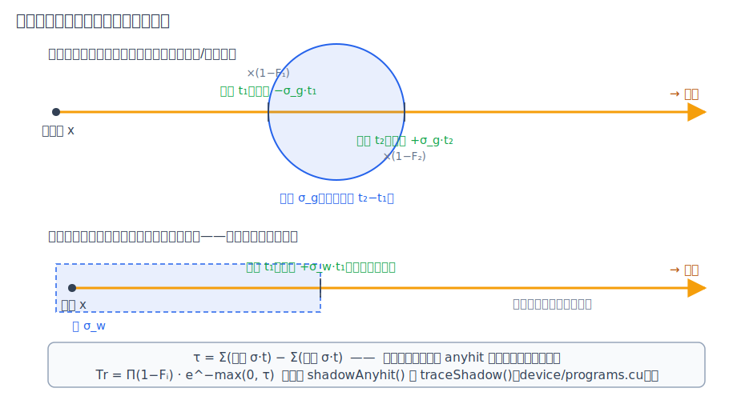
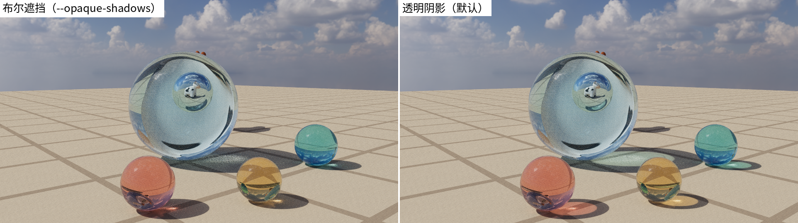
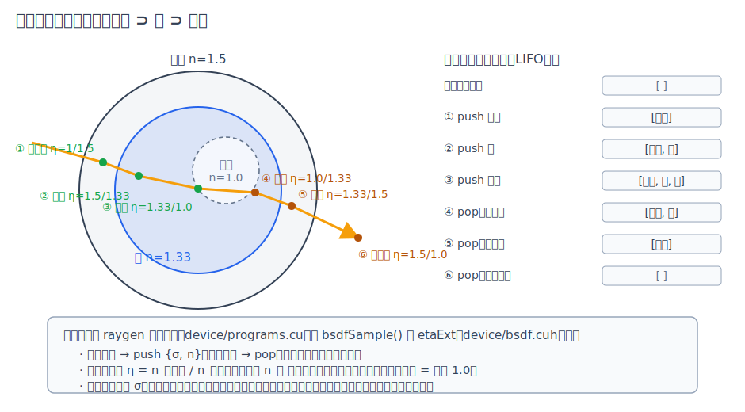

# 第 16 章 透明阴影与嵌套介质

[第 15 章·环境光照](15-envlight.md)之后，渲染器的光源体系已经完整，但阴影体系里还埋着一条从[第 4 章](04-path-tracing.md)一路沿用下来的粗暴假设：阴影线是**布尔**的——打中任何实体表面就算被挡，玻璃与石头同样"挡光"。这条假设让玻璃球投出实心黑影（[附录](appendix-pitfalls.md)陷阱 3 记录过这个折衷），也让水下世界一片死寂：湖底任何一点朝天空发的阴影线都会撞上水面，NEE 全军覆没，水下照明只能靠恰好折射穿出水面的 BSDF 路径苟活（[第 14 章](14-water.md)初稿因此建议"让水底保持浅"）。与它孪生的还有第二条假设：介质状态是**单个变量**——出介质一律清零、折射一律按"材质对真空"取折射率，于是水里放玻璃会把玻璃内部当真空算。本章把两条假设一起拆掉：阴影线升级为**直线透射率**，介质状态升级为**栈**。画廊 11 号场景「琉璃静物」——玻璃球里嵌水球、水球里悬气泡、有色玻璃珠投彩色亮影——就是两项升级的联合演示。

## 16.1 布尔阴影的两宗罪与它的根因

布尔阴影在工程上由三件套实现：非镂空物体的实例设 `DISABLE_ANYHIT`（阴影线命中它连 anyhit 都不跑）、阴影线带 `TERMINATE_ON_FIRST_HIT`（首个被接受的命中即终止）、anyhit 只放行 `MAT_NONE` 穿透面与 alpha 镂空（[第 9 章](09-optix-pipeline.md)的"三件事"）。玻璃在这套机制里与石头无异——第一宗罪：**透明体投实心黑影**，不透光、更没有颜色。第二宗罪是它的放大形态：水面是一整张透明表面，水下**所有**着色点的**所有**阴影线都被它拦截，NEE 这台方差压缩机在水下整体停机。

修这两宗罪不需要新的光传输理论，只需要承认一件事：阴影线问的不是"有没有挡"，而是"**透过来多少**"。

## 16.2 直线透射近似：菲涅尔 × 比尔–朗伯

严格解要沿折射方向弯着走（那是双向方法的领地）。sundog 采用离线渲染器的通行近似：阴影线**保持直线**，穿过每个透明界面时乘一份菲涅尔透过率，穿过每段介质时按比尔–朗伯定律衰减：

```math
T_r \;=\; \prod_i \big(1-F_i\big)\;\cdot\; e^{-\tau},\qquad
\tau \;=\; \sum_{\text{出射}} \sigma\, t \;-\; \sum_{\text{入射}} \sigma\, t
```

第一个因子里每个界面的 $`F_i`$ 用与 `bsdfSample()` 完全相同的约定计算（η、$`F_0`$、低折射率侧余弦，回链[第 5 章](05-materials.md)）；其中藏着一件漂亮的免费赠品：从背面（密介质一侧）穿出时若超过临界角，`refract()` 判全内反射，阴影线直接判**全遮挡**——于是水下仰望天空，只有 $`\arcsin(1/1.33)\approx 48.8^\circ`$ 半角的锥体内有直接光，这正是潜水员熟悉的**斯涅尔窗口**，物理自己涌现，不需要任何特判：


*图：水下垂直仰视（临时场景，静水面）。天空被压进约 97.5° 的圆锥；锥外的方向全内反射，映出的是绿棋盘湖底。*

第二个因子 $`\tau`$ 是光学深度，它的写法针对一个 OptiX 特有的约束设计：anyhit 的调用顺序**没有保证**（[第 9 章](09-optix-pipeline.md)），无法"先入后出"地配对界面。解法是**符号距离法**：每次穿越只累加一个带符号的项——出射面加 $`+\sigma t`$、入射面加 $`-\sigma t`$（$`t`$ 是该命中的光线参数）。加法交换律保证无序累加的结果与顺序无关，而成对的入/出恰好相消出"介质内段长 × σ"；起点本身就在介质里的情形（水下的湖底点）只有出射穿越、没有匹配的入射，净和 $`+\sigma t_{\text{出}}`$ 恰好就是水中段长——不需要任何特殊处理：



*图：玻璃球情形入/出成对相消；水下情形不成对，净和自动等于水中段长。`max(0,τ)` 收掉光源端点在介质内的欠账退化。*

透明阴影带来的画面变化在 11 号场景里最直白——有色玻璃（`dielectric` 新增 `absorb` 键）的影子从黑块变成带颜色的亮池：



*图：同一场景。左为旧布尔遮挡（`--opaque-shadows`），右为透明阴影——玫瑰、金、青三色亮影是逐界面菲涅尔 × 介质吸收的直接可视化。*

## 16.3 OptiX 落地：从 1 比特到 5 个寄存器

布尔阴影只需要 1 个 payload 寄存器（miss 置 1 = 可见）。透明阴影把 shadow payload 扩到 5 个：p0 仍是可见性；p1 累乘逐界面 $`(1-F)`$；p2–p4 逐通道累加符号光学深度（σ 是 RGB 向量，三个通道各记各的）。`traceShadow()` 在 optixTrace 返回后合成 $`T_r`$，NEE 的贡献式乘上它（对账 `traceShadow()` 与 NEE 段（device/programs.cu））。

命中处理走一个新的统一阴影 anyhit：穿透面与镂空沿用原规则放行；玻璃/水累积衰减后 `optixIgnoreIntersection()` 续跑；其余材质正常返回——被接受的命中配合 `TERMINATE_ON_FIRST_HIT` 立即终止，p0 保持 0（对账 `shadowAnyhit()`（device/programs.cu））。物体分类从两态变三态：opaque / masked / **transmissive**，透射物体不再设 `DISABLE_ANYHIT`，其 SBT 阴影槽换到带 anyhit 的变体；radiance 槽保持 opaque 快速路径不变（对账 `buildSbt()`（src/pipeline.cpp）与 `buildIas()`（src/accel.cpp））。

一个身份升级值得单独点名：GAS 构建时的 `OPTIX_GEOMETRY_FLAG_REQUIRE_SINGLE_ANYHIT_CALL` 在第 9 章还只是"省一次纹理采样"的性能项，现在它是**正确性前提**——anyhit 在做累加，重复调用会把同一次穿越计两遍。这类"约束语义随功能演进而升级"的时刻，最值得在代码注释里留下路标（src/accel.cpp 两处构建点均已锚定）。

## 16.4 嵌套介质栈与相对折射率

第 14 章的介质记账是单个变量：进水置 σ、出水清零。放个玻璃杯进水里它就露馅——从水进入玻璃时"外面"不是真空，从玻璃退回水里时也不该清零。修法是把变量换成**栈**：透射进入把 `{σ, n}` 压栈、透射退出弹栈（全内反射是反射，不动栈）；段衰减永远取栈顶 σ。折射率随之升级为**相对折射率**：界面两侧的介质由栈给出，$`\eta = n_{\text{入射侧}}/n_{\text{透射侧}}`$——进入时入射侧是当前栈顶，退出时是弹栈后的新栈顶，空栈即真空。`bsdfSample()` 为此多了一个参数 `etaExt`；Schlick 的余弦选择也从"按面"泛化为"按 $`\eta<1`$ 取低折射率侧"（真空下两种写法一致，对账 raygen 介质栈段（device/programs.cu）与 `bsdfSample()`（device/bsdf.cuh））。



*图：玻璃 ⊃ 水 ⊃ 气泡的六次穿越与栈演化。水中玻璃按 1.5/1.33 折射、水中气泡按 1.33/1.0——弯折比对真空弱得多，这正是 11 号场景里气泡中奶牛清晰可辨的原因。*

11 号场景的主角就是这套机制的三层走读：光线穿过玻璃壳（栈 `[玻璃]`）、进入水球（`[玻璃,水]`，此界面 η=1.5/1.33，弯折轻微）、再进气泡（`[玻璃,水,泡]`，η=1.33/1.0）。藏在球后的奶牛经过两重"倒像再倒像"，最终**正立**在气泡里——双重反转的物理彩蛋，也是"嵌套算对了"的一眼可验证词。栈容量固定为 4，但计数器允许逻辑深度超限（写入丢弃、退出不错位），病态深嵌套只是退化而不会算乱。

## 16.5 偏差与记账

四项近似如实入账。**不折弯**：透射率沿直线累积，修复的是"直射透光"；被曲面**聚焦**的焦散亮斑仍只能靠 BSDF 折射路径慢慢撞（[第 15 章](15-envlight.md)那颗玻璃球背后的太阳焦散依旧如此），且直线 NEE 与折射 BSDF 路径的 MIS 记账不含透射率，二者在玻璃后方有轻微的能量重叠——与"不折弯"同源，量级同样有限。**界面对真空**：阴影 anyhit 无序执行、拿不到介质上下文，逐界面 η 一律按对真空取；嵌套区间的 σ 也因符号和的"边界包含"语义被**双重衰减**（水包玻璃段按 σ_水+σ_玻璃 衰减）。**平面法线**：阴影菲涅尔不做 `waterNormal` 波浪扰动，省一次 fbm 且保持确定性。这些近似的共同性质是：只影响透明体阴影的**明暗精度**，不引入任何随机数消耗——决定性红线（[第 15 章](15-envlight.md)先例）原样成立。

代价与验证的实测：4096 只玻璃奶牛的 05 号场景是 anyhit 开销的压力上限，阴影线不再"首命中即停"让它的吞吐从 3876 降到约 3462 Mrays/s（约 11%，docs/BENCHMARKS.md）；其余场景变化在噪声量级。零扰动的另一侧有三重独立证据：无透明材质的 smoke/02/04 三个 golden 场景在两次改动后均与旧基线**逐字节一致**、tier B 降噪 PSNR 逐位不变、smoke 决定性 sha256 原值。体积火焰起初仍是阴影线的盲区——那是无界面的程序化体积，本章的 anyhit 机制够不到它；后来两套机制在阴影线上会师：同一条 NEE 线段先由 anyhit 攒表面透射，再由火焰行进乘上体积透射（[第 13 章 §13.6](13-volumes.md)），`--opaque-shadows` 同时关闭两者、保持旧口径对照完整。

## 小结

透明阴影 = 一个换位（"有没有挡"→"透过来多少"）加两条会计规则：逐界面乘 $`(1-F)`$、介质段按符号距离法攒光学深度——加法交换律替我们消化了 anyhit 的无序性，全内反射白送一扇斯涅尔窗口。嵌套介质 = 把单变量换成栈：进 push 出 pop，相对折射率从栈顶读——水中玻璃、玻璃中气泡就都算对了。两项升级合力把附录陷阱 3 从"sundog 也如此"改写成"sundog 修好了它的一半"——直射透光归 NEE，聚焦焦散仍归 BSDF。全书的特性章到此收束；至于这些机制在开发中各自逮住过什么、那些一度让图"照样好看"的数值陷阱长什么样，请移步[附录·路径追踪常见实现陷阱](appendix-pitfalls.md)的案例复盘。
