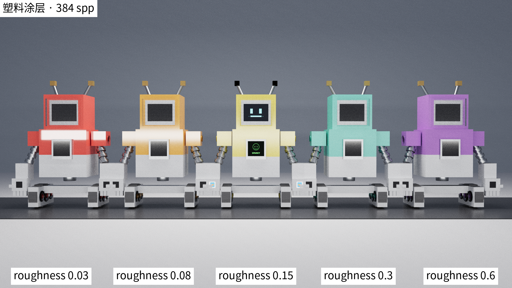
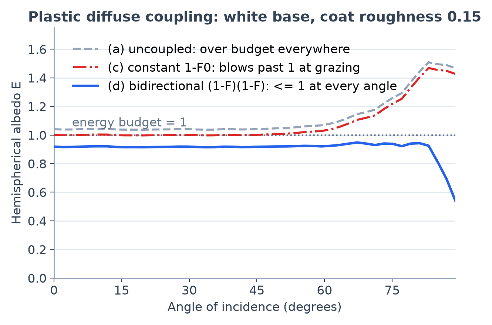

# 第 17 章 塑料：涂层直觉与首个双瓣混合 BSDF

[第 16 章·粗糙电介质](16-rough-dielectric.md)之后，材质清单看似齐整：漫反射、金属、玻璃、水，每样都能采样、能求值、能算 pdf。但拿起手边任何一件塑料玩具就能看出还缺一块：它有**颜色**（漫反射的事）也有**白色高光**（菲涅尔反射的事），两者同时出现在同一个表面上——而我们的每种材质都只会其中一样。本章补上这最后一类日常材质，回答三个问题：塑料为什么天生是"两层"？两个**同半球**的波瓣怎么共享一套 sample/eval/pdf 而互不欠账？以及第 5 章与第 16 章用惯的那步权重化简，为什么到这里恰好失效？

## 17.1 清单上的空档：有色底、白高光

逐一检查旧材质就能定位空档。朗伯漫反射（5.1）有颜色没高光——怎么转都不会闪。金属（5.2–5.3）有高光，但导体的菲涅尔反射率就是它的本色：金色金属的高光是金色的，不存在"红色金属泛白光"。玻璃（5.4、第 16 章）有白高光却全透明，没有"底色"可言。而塑料、清漆木器、陶釉、汽车漆——现实中最大的一类材质——恰恰是**有色不透明底 + 白色高光**的组合，四种旧答案排列组合也拼不出来。

物理结构一句话就能说清：一层透明**涂层**（电介质，折射率约 1.5）罩住一个漫反射底。光到达表面先过涂层的菲涅尔关卡：约 4% 在涂层表面直接反走——这就是白高光，颜色是光源的颜色而不是底的颜色；其余约 96% 穿入涂层、在底层里扩散染色，再穿出来成为带色的漫反射。高光"浮"在颜色**上面**，正是塑料质感的来源。画廊 14 号场景「玩具工厂」把它排成一列：五只同模具的 Sparky 玩具，塑料壳只差一个涂层粗糙度（0.03 → 0.6），相机后方一根灯管在最清漆的壳上映出一条锐利亮条，逐只糊成宽晕、最终摊平成哑光（[画廊](../GALLERY.md)）。



*图：14 号场景「玩具工厂」，五只塑料 Sparky 的涂层粗糙度 0.03 → 0.6——除涂层参数外一切恒定，灯管反射条从锐利白线连续糊成哑光平晕。*

模型选择也随之而定：涂层 = 第 16 章反射瓣的原班人马——GGX 微表面配电介质菲涅尔；底 = 第 5 章的朗伯漫反射。两个波瓣**相加**：

```math
f(\omega_o,\omega_i) \;=\; \underbrace{\frac{F(\omega_o\!\cdot\!\mathbf{h})\,D(\mathbf{h})\,G(\omega_o,\omega_i)}{4\,(\mathbf{n}\!\cdot\!\omega_o)(\mathbf{n}\!\cdot\!\omega_i)}}_{f_{\text{coat}}\text{（白高光）}} \;+\; \underbrace{\frac{\text{albedo}}{\pi}\cdot k_{\text{couple}}}_{f_{\text{diff}}\text{（有色底）}},
```

其中 $`F`$ 用 Schlick 近似、$`F_0 = \left(\frac{\eta-1}{\eta+1}\right)^2`$ 直接从材质的 `ior`（默认 1.5，$`F_0 = 0.04`$）计算。注意一个刻意的选择：塑料是不透明表面，从不加入第 15 章的介质栈，正反两面按同一套公式着色，因此接口相对折射率参数被**有意忽略**——水下的塑料仍按 $`F_0=0.04`$ 算高光，这是一条文档化的近似（对账 `plasticTerms()`（device/bsdf.cuh））。真正需要斟酌的是那个耦合因子 $`k_{\text{couple}}`$：它管的是两个瓣之间的**能量记账**。

## 17.2 菲涅尔耦合：能量守恒的四个候选

高光反走的能量，漫反射就不该再拿。若两瓣各算各的、互不通气（$`k_{\text{couple}}=1`$），白色塑料（albedo = 1）在垂直入射就有 $`1 + 0.04`$ 的反照率——凭空多出 4%；掠射时 $`F \to 1`$、高光独自就近满额，加上不打折的漫反射直接冲到约 1.9。能量超 1 的 BSDF 在多次弹跳里是指数放大器，第 3 章的方差分析全部作废。四个候选耦合：

| 方案 | $`f_{\text{diff}}`$ 因子 | 互易 | 全角度能量 ≤ 1 |
|---|---|---|---|
| (a) 不耦合 | $`1`$ | 是 | 否（处处超 4%，掠射超一倍） |
| (b) 高光补 | $`1-F(\omega_o\!\cdot\!\mathbf{h})`$ | 名义上 | 否（掠射照超；还把漫反射拴上了高光的 $`\mathbf{h}`$） |
| (c) 常数补 | $`1-F_0`$ | 是 | 否（垂直入射修好了，掠射约 1.5） |
| (d) 双向菲涅尔 | $`\bigl(1-F(\mathbf{n}\!\cdot\!\omega_o)\bigr)\bigl(1-F(\mathbf{n}\!\cdot\!\omega_i)\bigr)`$ | 是 | **是** |

(d) 的直觉：光要进底层染色，得**先穿进**涂层（打折 $`1-F(\mathbf{n}\!\cdot\!\omega_i)`$——按入射角），染完还得**穿出来**（再打折 $`1-F(\mathbf{n}\!\cdot\!\omega_o)`$——按出射角）。两个因子对称，交换 $`\omega_o \leftrightarrow \omega_i`$ 不变，互易性白得；而掠射时 $`F \to 1`$，漫反射恰好在高光吃满的地方**自动归零**——底层暗下去的能量正是高光亮起来的能量，这就是全角度守恒的机制（对账 `plasticTerms()` 的 `fDiff`（device/bsdf.cuh））。



*图：白色塑料（albedo=1，涂层粗糙度 0.15）三种耦合的半球反照率随入射角的变化——(a) 处处超 1，(c) 在掠射角冲过 1，唯 (d) 全程压在 1 以下。*

守恒是有价的。对 (d) 的漫反射瓣在半球上积分，出射打折因子提出来，入射打折的角度平均是

```math
\bar F \;=\; 2\!\int_0^1 F(c)\,c\,\mathrm{d}c \;=\; F_0 + (1-F_0)\cdot 2\!\int_0^1 (1-c)^5 c\,\mathrm{d}c \;=\; F_0 + \frac{1-F_0}{21} \;\approx\; 0.086,
```

（Schlick 的 $`(1-c)^5`$ 与 $`c`$ 的乘积积出 $`1/42`$，乘 2 得 $`1/21`$。）于是白色塑料的漫反射半球反照率约为 $`(1-0.04)\times(1-0.086) \approx 0.87`$——**白色塑料比白色朗伯暗约 10%**，差额进了高光。这不是 bug 而是账本：14 号场景的"白色"下身壳故意只用 0.80 的 albedo，`plastic()` 的 docstring 也把这句话写给每个场景作者（对账 `plastic()` docstring（scenes/scenelib.py））。

## 17.3 混合 pdf：一枚硬币、两个瓣、一本账

采样一个双瓣 BSDF 的标准做法是**瓣选择**：掷一枚概率 $`p_s`$ 的硬币，正面按涂层瓣采样（VNDF，5.3），反面按漫反射瓣采样（余弦半球，5.1）。sundog 取 $`p_s = 0.5`$ 的常数硬币——比"按菲涅尔或按 albedo 亮度加权"聪明的方案都存在，但常数是唯一同时满足三件事的选择：权重有硬上界（17.4）、`bsdfPdf()` 不需要 albedo 参数（签名零改动）、采样与 pdf 两侧**不可能**失配。分配不够聪明的代价由第 4 章的平衡启发式自动吸收——MIS 本来就是干这个的。

抽取顺序与第 16 章刻意相反：**瓣选硬币先掷，方向后抽**。第 16 章的硬币概率是所采微镜面的菲涅尔 $`F(\omega_o\!\cdot\!\mathbf{h})`$，不先采到 $`\mathbf{h}`$ 就没有概率可言，所以 VNDF 在前；塑料的硬币是常数，什么都不依赖，于是先掷硬币、再为选中的瓣抽 2D 方向——每次命中**恒定三次抽取，与走哪个分支无关**，这是比第 10 章"抽取数是命中状态的确定函数"更强的决定性契约（对账 `bsdfSample()` 的 MT_PLASTIC 分支（device/bsdf.cuh））。

关键在 pdf。抽到方向 $`\omega_i`$ 后，它的采样密度是什么？**不是**"所选瓣的 pdf"——因为同一个 $`\omega_i`$ 两条路都能到达：硬币正面经 VNDF 落在这里，硬币反面经余弦采样也可能落在这里。真实密度是全概率公式下的**混合边际**：

```math
p(\omega_i) \;=\; \tfrac12\,p_{\text{spec}}(\omega_i) + \tfrac12\,p_{\text{diff}}(\omega_i),
```

而且这同一个表达式必须同时出现在三处：`bsdfSample()` 返回的 `bs.pdf`（喂给下一跳发光体命中的 MIS，第 4 章）、`bsdfPdf()`（喂给 NEE 的 $`p_B`$）、以及两者与 `bsdfEval()` 的配平。eval 侧对应地必须返回**两瓣之和**——NEE 的平衡权重 $`p_L/(p_L+p_B)`$ 里的 $`p_B`$ 是混合 pdf，配的就是全量 $`f`$；只还一个瓣的 eval 会让区域光下的塑料丢掉涂层高光。为了让"三处一致"在结构上不可能被破坏，三个函数共用一个 `plasticTerms()` 助手算全部四个量（$`f_{\text{spec}}, f_{\text{diff}}, p_{\text{spec}}, p_{\text{diff}}`$），谁也没有机会抄近路（对账 `plasticTerms()`/`bsdfEval()`/`bsdfPdf()`（device/bsdf.cuh））。

## 17.4 失效的捷径与权重上界 2

第 5 章金属与第 16 章玻璃有一步优雅的化简：采样权重 $`f\cos/p`$ 里的菲涅尔（连同瓣选择概率）互相约掉，剩下 $`G/G_1 \le 1`$。到塑料这里，这条捷径**恰好失效**，原因值得一讲。

第 16 章的两个瓣住在**不同的半球**：反射瓣在上、透射瓣在下。任取一个方向 $`\omega_i`$，两个瓣的 pdf 至多一个非零——混合 pdf 在每个方向上都**退化成单项**，$`F`$（或 $`1-F`$）在分子分母同时出现、干净约掉。塑料的两个瓣却挤在**同一个半球**：任何上半球方向两项 pdf 都大于零，混合 pdf 永远是货真价实的两项之和，什么都约不掉。权重只能按全式算：

```math
w \;=\; \frac{\bigl(f_{\text{spec}} + f_{\text{diff}}\bigr)\,(\mathbf{n}\!\cdot\!\omega_i)}{\tfrac12 p_{\text{spec}} + \tfrac12 p_{\text{diff}}}.
```

失去了 $`\le 1`$ 的化简，是否会引来萤火虫？不会——全式有自己的硬上界。注意两条逐瓣不等式：$`f_{\text{spec}}\cos = F\,(G/G_1)\,p_{\text{spec}} \le p_{\text{spec}}`$（VNDF pdf 的定义配上 $`F \le 1`$、$`G/G_1 \le 1`$），以及 $`f_{\text{diff}}\cos = k_D\, p_{\text{diff}} \le p_{\text{diff}}`$（余弦 pdf 的定义配上耦合后的 $`k_D \le 1`$）。分子的每一项都不超过分母对应项的 2 倍（分母各带 $`\tfrac12`$），于是

```math
w \;\le\; \frac{p_{\text{spec}} + p_{\text{diff}}}{\tfrac12(p_{\text{spec}} + p_{\text{diff}})} \cdot \max\!\bigl(F\,G/G_1,\; k_D\bigr) \;\le\; 2.
```

权重永远压在 2 以下——一次采样至多把吞吐量翻倍，没有第 3 章意义上的病态权重（对账 `bsdfSample()` 权重全式（device/bsdf.cuh））。

最后一个设计决定：涂层**永不退化为 delta**。设备端把粗糙度按 `1e-3` 下限钳制——正是第 16 章数值事故后 `ggxD()` 稳定式能安全承受的最小合法粗糙度。原因是 delta + 漫反射的混合会把 NEE 拖进泥潭：阴影线连向光源的方向上，delta 瓣的 $`f`$ 是一个积不出来的冲激，eval 只能返回漫反射部分，而混合 pdf 又必须知道"另一半概率去了哪"——支持它需要一路穿透 sample/eval/pdf 与 raygen MIS 的"半 delta"旗标机制。镜面涂层的塑料在现实中罕见（那是喷了清漆的镜子），想要的话用 dielectric 薄壳套一个 lambert 内胆即可，不值得为它把四处记账各撕开一半。`bsdfIsDelta()` 对塑料恒返回 false，NEE 永远可连（对账 `bsdfIsDelta()` 与 `plasticTerms()` 的钳制（device/bsdf.cuh））。

## 17.5 数值审计：把三方一致钉死在 20 万样本上

混合 BSDF 唯一真正的风险就是 17.3 那本账在某处记岔——sample 说密度是 $`p`$、pdf 算出来却是 $`p'`$，或者 weight 与 $`f\cos/p`$ 差一个因子。这类偏差图上未必看得出来（画面只是稍微亮一点或暗一点），所以在任何 GPU 渲染之前，先用主机端数值审计把它钉死：BSDF 头文件是主机可编译的（第 11 章的老手法），对 albedo {1.0, 0.05} × 粗糙度 {0.05, 0.15, 0.6} 六组参数各采 20 万个随机方向，逐样本断言 `weight == f·cos/pdf` 且 `bsdfPdf == bs.pdf`（容差 $`10^{-3}`$ 相对），同时统计权重峰值、并对三个入射角（含 $`\cos\theta_o = 0.1`$ 的掠射）数值积分半球能量。

结果：六组 **120 万样本零失配**；权重峰值 1.84，压在上界 2 之内；能量全角度 ≤ 1，其中白色塑料垂直入射 $`E \approx 0.908`$——与 17.2 的理论值 $`0.87 \times 1 + 0.04 \approx 0.91`$ 对上。顺带一提，粗糙度 0.6 的掠射能量只有约 0.48：这是 GGX 单次散射模型在高粗糙度下的固有能量损失（$`G/G_1`$ 吃掉的部分，金属与磨砂玻璃同样存在，第 16 章已见），与耦合无关。

GPU 侧的收尾是第 11 章的老规矩。`MT_PLASTIC` 追加在材质枚举尾部、既有场景的抽取流零触碰、raygen 的每一处材质判断都是白名单式（塑料天然落进"不透明、全遮挡、不入介质栈"的默认路径，一行未改），于是**既有 7 张 golden 必须逐字节不变**——实测全部 PSNR = inf，这就是"纯加法"的机器证明。14 号场景作为第 8 张 golden 入列，三连跑逐位一致。

## 小结

塑料 = 涂层直觉的最小实现：GGX 电介质涂层（$`F_0`$ 从 `ior` 来，默认 0.04）叠在朗伯底上，双向菲涅尔耦合 $`(1-F(\mathbf{n}\!\cdot\!\omega_o))(1-F(\mathbf{n}\!\cdot\!\omega_i))`$ 让底层恰好在高光吃满处归零——互易、全角度能量 ≤ 1，代价是白色比朗伯暗约 10% 并如实入档。它也是渲染器第一个**同半球双瓣混合**：常数 0.5 硬币选瓣、混合边际 pdf 三处共用一个 `plasticTerms()`、eval 两瓣求和，第 16 章的 $`G/G_1`$ 化简因"两瓣同居一个半球、pdf 永不退化单项"而失效，全式权重以 mediant 论证压在 2 以下；涂层钳在粗糙度 1e-3 以上永不 delta，NEE 永远可连。至此光传输的特性章全部收束；正文最后一站走出渲染本身——画廊 06 号场景里那 512 只翻滚堆叠的奶牛，位姿是谁摆的：[第 18 章·物理装载](18-physics.md)。
