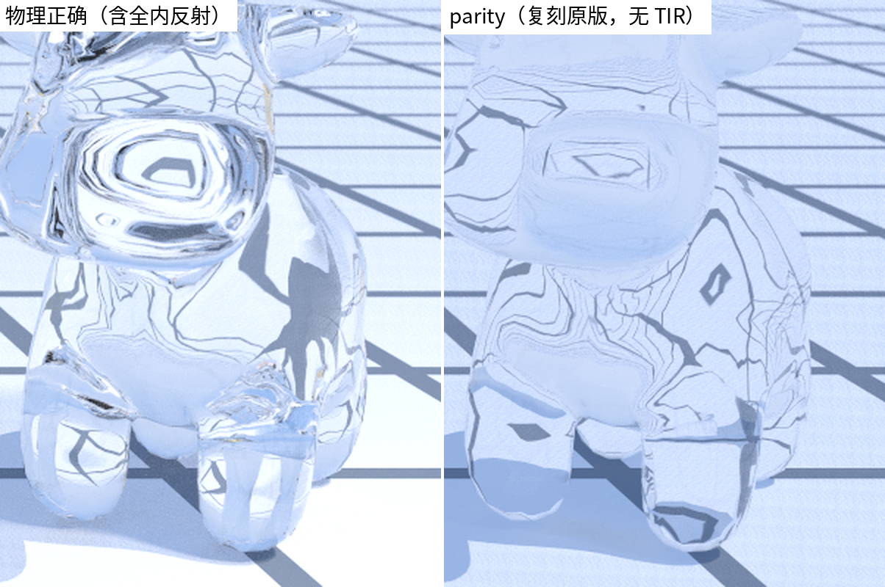

# 附录 原 cxxrt 的计算问题与修正

sundog 是对 CPU 渲染器 cxxrt 的全新重写。重写的过程也是一次逐行审计：一些原版图像里"看着不太对但说不清"的现象，最终都能落到具体的数学错误上。本附录以案例形式复盘六组问题，每条按**现象—数学解释—修正**展开，原版代码摘自 `raytracing-master.tar.gz`。需要强调：sundog 的 `--parity` 模式**有意保留**这些原始行为（见[第 11 章·验证方法学与性能](11-validation.md)），使 CPU/GPU 基准对比在算法上逐式公平；下述"修正"均指默认的物理模式。

## A.1 玻璃永远不发生全内反射

**现象**：原版的玻璃球没有全内反射（total internal reflection / TIR）造成的高亮内环，内反射普遍偏弱，玻璃显得过透过亮（对比 [第 5 章](05-materials.md) 的 `figures/ch05-glass-tir.png`，放大裁剪见下图）。


*图：ch05-glass-tir 的放大裁剪——物理模式（左）与 parity 复刻原版（右）的玻璃奶牛细节。*

**数学解释**：`Dielectric::getScatteredAlbedoAndRay()`（cxxrt/contrib/dielectric.h）不区分光线是进入还是离开玻璃，恒用 $`\eta = 1/\text{ior}`$ 调用折射：

```cpp
// cxxrt/contrib/dielectric.h
if (refract(incident_direction, hit_normal, Numeric::unit() / ref_idx,
            refracted)) {
  Real cosine =
      -dot(incident_direction, hit_normal / length(incident_direction));
  Real reflect_prob = schlick(cosine, ref_idx);
```

cxxrt 的几何求交会把法线预先翻向入射一侧（如 cxxrt/contrib/sphere.h 对内侧命中返回 `-normal`），这处理了折射公式的方向问题，却处理不了折射率之比——出射时 $`\eta`$ 本应是 $`\text{ior}`$ 而非 $`1/\text{ior}`$。后果可以严格证明：`refract()`（cxxrt/core/blas.h）的判别式为

```math
\Delta = 1-\eta^2(1-(v\cdot n)^2) = 1-\eta^2\sin^2\theta_i \;\ge\; 1-\eta^2 \;=\; 1-\frac{1}{\text{ior}^2} \;>\; 0,
```

其中 $`v`$、$`n`$ 为单位向量，且玻璃 $`\text{ior}>1`$ 使 $`\eta=1/\text{ior}<1`$。判别式对**一切**入射角严格为正，`refract()` 永远成功，TIR 分支成为死代码——玻璃里的光永远"折得出去"。

这个错误还有两个连带后果。其一，出射折射方向也错了：Snell 定律给出 $`\sin\theta_t=\sin\theta_i/\text{ior}`$，出射光被再次**折向**法线，而物理上离开密介质应**偏离**法线。其二，Schlick 用了错误一侧的余弦：出射时代码用的是玻璃内的入射角余弦，而 Schlick 近似的自变量应取疏介质一侧的角度。定量地（$`\text{ior}=1.5`$，纯数学计算可复核）：临界角 $`41.8°`$ 处真实反射率为 $`1`$，而 $`\mathrm{schlick}(\cos 41.8°)\approx 0.041`$，低估约 24 倍；对从玻璃内部出射的余弦加权方向平均，真实平均反射率约 $`0.60`$（其中约 $`55\%`$ 的方向本应发生 TIR），原版给出约 $`0.086`$，整体低估约 7 倍。

**修正**：`bsdfSample()`（device/bsdf.cuh）物理分支按面选取 $`\eta`$（`frontface ? 1/ior : ior`），保留 TIR 分支，并让 Schlick 恒用低折射率侧余弦（出射时用折射方向的余弦 $`-\,\omega_t\cdot n=\cos\theta_t`$，与 TIR 分支在临界角处连续衔接）。推导见[第 5 章·材质与 BSDF](05-materials.md) 5.5 节。

## A.2 Lambertian 采样分布与权重不匹配

**现象**：漫反射表面的间接光有系统性方向偏差——头顶方向来的间接光偏亮、掠射方向来的偏暗；由于总量"看起来差不多"，单看一张图很难察觉。

**数学解释**：原版的散射方向构造是经典的 Ray Tracing in One Weekend 第一版写法：

```cpp
// cxxrt/contrib/lambertian.h
scattered_direction = normalize(hit_normal + Random::randomInUnitSphere());
```

即"法线 + 单位球**内**均匀点"再归一化，随后贡献直接乘 albedo——这隐含假设采样分布恰好是余弦分布 $`p(\omega)=\cos\theta/\pi`$（那样 $`f_r\cos\theta/p=\text{albedo}`$，见第 5 章 5.1 节）。但只有"法线 + 单位球**面**上均匀点"才精确给出余弦分布；球内版本的分布明显更向法线集中。数值实验（$`2\times 10^6`$ 样本）：其 pdf 与 $`\cos\theta/\pi`$ 之比在 $`\theta\approx 0`$ 处约为 $`2.0`$，随 $`\theta`$ 增大单调跌落，接近地平线时趋于 $`0`$；平均余弦 $`\mathbb{E}[\cos\theta]=0.80`$，而余弦分布应为 $`2/3`$。


*图：n+单位球内点（归一化）与余弦采样的方向分布对比——前者向法线过度集中。*

于是估计量 $`\text{albedo}\cdot L(\omega_{\text{sampled}})`$ 的期望是 $`\text{albedo}\int L\,p\,\mathrm{d}\omega`$ 而非正确的 $`\text{albedo}\int L\,\frac{\cos\theta}{\pi}\,\mathrm{d}\omega`$：这不是噪声，是**偏差**，加多少 spp 都不收敛到正确值。两个可验算的例子：入射辐亮度 $`L\propto\cos\theta`$（顶光）时高估 $`20\%`$（$`0.80`$ vs $`2/3`$）；$`L\propto 1-\cos\theta`$（掠射光）时低估 $`40\%`$（$`0.20`$ vs $`1/3`$）。唯独 $`L`$ 为常数（均匀天空）时任何归一化 pdf 都给出无偏结果——这正是它"平时看不出来"的原因。

**修正**：sundog 用精确的余弦采样 `cosineHemisphere()`（device/rng.cuh，Malley 方法，推导见第 5 章），权重 = albedo 严格成立；`--parity` 模式则用 `uniformInBall()` 精确复刻原分布（连同其偏差），保证基准对比的是同一个算法。

## A.3 阴影线把玻璃当不透明

**现象**：玻璃球在地面投下一团全黑的影子——物理上透明体的影子应当有透光与焦散（光被曲面聚焦形成的亮斑）。

**数学解释**：原版对每个灯发一条阴影线，用只回答"有没有挡"的布尔求交：

```cpp
// cxxrt/cxxrt.cc（NEE 段；累加表达式略缩）
if (!_ras.hitTest({hit.point, light_direction},
                  {Numeric::tiny(), light_distance})) {
  direct_lighting = direct_lighting + light_intensity *
      max(Numeric::zero(), dot(hit.normal, light_direction));
}
```

`hitTest` 的布尔重载（cxxrt/core/ras.h）只查几何、不看材质：玻璃与石头同样"挡光"。而 cxxrt 的 NEE 灯表只有点光（带采样半径的球形光，cxxrt/contrib/point_light.h）与平行光两类——都不是场景几何，BSDF 采样的路径永远打不中它们（见[第 4 章·路径追踪算法](04-path-tracing.md)）——于是玻璃背后**没有任何途径**获得直接光，影子全黑。

**修正与取舍**：严格解需要沿阴影线累积透射率或用双向/光子类方法算焦散，超出本项目范围。sundog 的取舍是：阴影线仍然"命中任何非穿透面即遮挡"（`maskAnyhit()` 只放行 `MAT_NONE` 穿透面与 alpha 镂空，见[第 9 章·OptiX 工程实现](09-optix-pipeline.md)），但 sundog 的主力光源是**发光几何体**（面光），BSDF 采样的折射路径可以穿过玻璃命中它们，由 MIS 正确加权——玻璃后方与焦散由路径追踪自然产生。点光/平行光后方的限制与原版相同，属已知记录的取舍。

## A.4 随机选轴的中位数切分 BVH

**现象**：同一场景两次运行，渲染耗时明显波动；复杂场景遍历偏慢。

**数学解释**：原版自建的层次包围盒（bounding volume hierarchy / BVH，见[第 8 章·加速结构与 RT Core](08-acceleration.md)）在每个内部节点**随机**挑一根轴做中位数切分：

```cpp
// cxxrt/core/ras.h（build）
static uniform_int_distribution dis(0, 2);
int dim = dis(Random::engine());
sort(next(_surfaces.begin(), low), next(_surfaces.begin(), high), ...);
size_t mid = low + (high - low) / 2;
```

问题有三。其一，切分质量：中位数切分只均衡图元**数量**，不考虑包围盒被光线命中的概率正比于其表面积这一事实（即业界标准的表面积启发式，surface area heuristic / SAH），而随机选轴还可能选到完全不分离的退化轴。其二，遍历顺序：`search()` 固定先左后右，不按光线方向做近-远排序，剪枝只能靠 `closest_so_far` 缩小，效率打折。其三，不可复现：`Random::engine()` 由 `random_device` 播种，每次运行建出**不同的树**，性能测量与回归调试都失去基准。

**修正**：sundog 把加速结构完全交给 OptiX 的 GAS/IAS 硬件路径（`buildAndCompact()`（src/accel.cpp），第 8 章）——高质量构建、RT Core 硬件遍历，且同输入同驱动下确定。

## A.5 Transformer 每次求交现算 sin/cos；rotate() 的 z 分支复制粘贴

**现象**：带旋转变换的物体求交显著变慢；`rotate` 的三个分量语义与直觉不符。

**数学解释**：原版的实例变换在**每次**求交时把光线原点和方向各过一遍 `rotate()`：

```cpp
// cxxrt/core/transformer.h（hitTest）
origin = rotate(origin + _inverse_translate, _inverse_rotate) * _inverse_scale;
direction = rotate(direction, _inverse_rotate) * _inverse_scale;
```

而 `rotate()`（cxxrt/core/blas.h）每个非零分量都现场调用一对 sin/cos——单次求交最多 12 次三角函数，命中后变换交点与法线再加 12 次。这些量在物体不动时全是常数，本可预乘成一个 3×4 矩阵（9 乘 6 加）。sundog 正是这么做的：主机侧 `parseTransform()`（src/scene_json.cpp）把变换列表折叠成 `Affine`，实例变换由 OptiX 在遍历时应用（[第 7 章·变换与实例化](07-transforms.md)）。

更有趣的是 `rotate()` 本身：

```cpp
// cxxrt/core/blas.h（rotate；各分支内的 sin/cos 局部声明省略）
if (a.x() != 0) {
  u = {u.x() * cos + u.y() * sin, -u.x() * sin + u.y() * cos, u.z()};
}
if (a.y() != 0) {  // 在 yz 平面内旋转，即绕 X 轴
  u = {u.x(), u.y() * cos + u.z() * sin, -u.y() * sin + u.z() * cos};
}
if (a.z() != 0) {
  u = {u.x() * cos + u.y() * sin, -u.x() * sin + u.y() * cos, u.z()};
}
```

x 分支和 z 分支**逐字相同**——都在 xy 平面内旋转，也就是都绕 Z 轴（且按此写法每个分支实转的都是 $`-\alpha`$）；只有 y 分支在 yz 平面内旋转，绕的是 X 轴。这显然是复制粘贴漏改。三个分支依次施加 $`R_z(-a_x)`$、$`R_x(-a_y)`$、$`R_z(-a_z)`$，本意的 XYZ 欧拉角实际成了 **Z-X-Z 欧拉角**：$`u' = R_z(-a_z)\,R_x(-a_y)\,R_z(-a_x)\,u`$。妙处在于 ZXZ 恰好是经典欧拉角，是三维旋转群 SO(3) 的完备参数化——**任何姿态仍然表达得出来**，所以这个 bug 从未在功能上暴露，只是 `rotate.x` 其实绕 Z 转这件事与所有人的直觉相反。sundog 迁移原版场景时的换算由上式逐项对照即得：sundog 的变换列表 $`[s_1,s_2,s_3]`$ 复合为 $`M=s_3\cdot s_2\cdot s_1`$（`parseTransform()`（src/scene_json.cpp）"后写的步骤包在外层"的语义），$`s_1`$ 最先作用，恰与上式中 $`R_z(-a_x)`$ 最先作用一一对应——把每步的 $`-\alpha`$ 原样搬进对应的 `rotate_z`/`rotate_x` 即可（对账 scenes/compat-03.json）：

```math
\text{rot}=(r_x,r_y,r_z)\;\longrightarrow\;[\;\texttt{rotate\_z}(-r_x),\;\texttt{rotate\_x}(-r_y),\;\texttt{rotate\_z}(-r_z)\;].
```

## A.6 无俄罗斯轮盘的 50 层递归、全屏共享的分层抖动、random_device 不可复现

三个独立的小问题，都出在采样工程上。

**50 层递归、无俄罗斯轮盘**：`Shader::color()`（cxxrt/cxxrt.cc）递归到 `MAX_DEPTH = 50`（cxxrt/core/shader.h）才截断，没有俄罗斯轮盘（RR）。在封闭场景里多数路径的吞吐量早已衰减到对图像毫无贡献，却仍要陪跑满 50 层求交——纯浪费；而 50 层处的硬截断又引入（微小的）能量缺失偏差。RR 以概率 $`q`$ 存活、除以 $`q`$ 补偿，期望严格不变（两行证明见第 4 章），是"无偏地提前收工"的标准做法。sundog：默认 `maxDepth = 16`（src/scene.h），并从 `depth >= 4` 起做 RR（device/programs.cu）。

**全屏共享的分层抖动**：`renderTo()`（cxxrt/cxxrt.cc）先生成一张 `sampling_points` 表，**整幅图所有像素**的第 $`s`$ 个样本都用同一个亚像素偏移。分层降方差本身没错（见[第 10 章·随机数、纹理与 AI 降噪](10-sampling-denoising.md)），但像素之间共享同一组抖动使相邻像素的噪声高度相关——低 spp 下呈结构化的花纹而非白噪声，也破坏了"各像素独立估计"的方差分析前提。另外 `samples` 被静默降为 $`\lfloor\sqrt{N}\rfloor^2`$（如请求 50 实得 49）。sundog：每个 (pixel, sample) 一条独立的 PCG32 流，分层索引由样本序号 $`s`$ 确定（第 $`s`$ 个样本落在第 $`s`$ 个层），层内抖动取自该样本自己的 PCG32 流。

**random_device 不可复现**：`Random::engine()`（cxxrt/core/random.h）是由 `random_device` 播种的 `thread_local mt19937`，叠加随线程数变化的交错行分配（各线程消费的随机数序列随线程数改变）——同一命令行跑两次得到两张（统计等价但逐像素不同的）图。渲染器最重要的测试手段之一是"同输入必须同输出"的回归对比，这里从根上被堵死。sundog：PCG32 按 `(pixel << 32) ^ sample` 加全局 seed 播种，固定 `--seed` 时图像逐位一致，golden 图像测试（第 11 章）正建立在这一决定性之上。

## 小结

六组问题里，A.1/A.2 是数学错误（有偏或错误的物理），A.3 是被灯光模型放大的近似，A.4–A.6 是工程质量问题（性能与可复现性）。它们共同的教训是：蒙特卡洛渲染器"图看着差不多"完全不构成正确性证据——分布错了、权重错了、判别式恒正了，图往往**仍然像那么回事**。这也是 sundog 把白炉测试、解析对账单测与逐位决定性（[第 11 章·验证方法学与性能](11-validation.md)）放进构建流程的原因。
