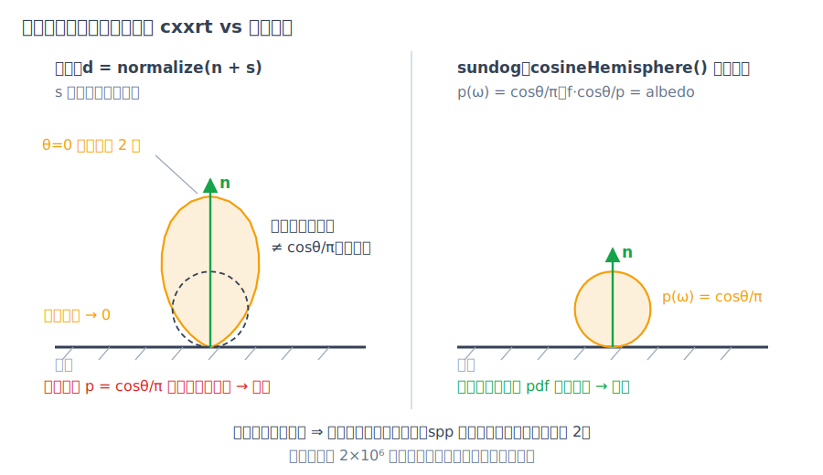

# 附录：路径追踪常见实现陷阱

蒙特卡洛渲染器有一个危险的性质：分布采错了、权重配错了、判别式恒正了，图往往**仍然像那么回事**。写 sundog 的过程中，我们把朴素实现最容易犯的计算错误系统梳理了一遍——有些直接来自流传甚广的教程代码，有些是入门实现里反复出现的模式。本附录以案例形式剖析六组陷阱，每条按**症状—数学分析—sundog 的做法**展开：先描述图像上"看着不太对但说不清"的现象，再把它落到具体的数学错误上，最后指认 sundog 源码里的正确实现。

## 陷阱 1：玻璃永远不发生全内反射

**症状**：玻璃体没有全内反射（total internal reflection / TIR）造成的高亮内环，内反射普遍偏弱，玻璃显得过透过亮，丢掉了真实玻璃那种"内壁会发亮"的质感。

**数学分析**：一类常见的朴素写法在电介质散射时不区分光线是进入还是离开玻璃，恒用 $`\eta = 1/\text{ior}`$ 调用折射。这种写法通常配合"法线预先翻向入射一侧"的几何约定——翻法线处理了折射公式的方向问题，却处理不了折射率之比：出射时 $`\eta`$ 本应是 $`\text{ior}`$ 而非 $`1/\text{ior}`$。后果可以严格证明：折射函数的判别式为

```math
\Delta = 1-\eta^2(1-(v\cdot n)^2) = 1-\eta^2\sin^2\theta_i \;\ge\; 1-\eta^2 \;=\; 1-\frac{1}{\text{ior}^2} \;>\; 0,
```

其中 $`v`$、$`n`$ 为单位向量，且玻璃 $`\text{ior}>1`$ 使 $`\eta=1/\text{ior}<1`$。判别式对**一切**入射角严格为正，折射永远成功，TIR 分支成为死代码——玻璃里的光永远"折得出去"。

这个错误还有两个连带后果。其一，出射折射方向也错了：Snell 定律给出 $`\sin\theta_t=\sin\theta_i/\text{ior}`$，出射光被再次**折向**法线，而物理上离开密介质应**偏离**法线。其二，Schlick 近似容易跟着用错侧的余弦：出射时若沿用玻璃内的入射角余弦，就违背了 Schlick 近似的自变量应取疏介质一侧角度的约定。定量地（$`\text{ior}=1.5`$，纯数学计算可复核）：临界角 $`41.8°`$ 处真实反射率为 $`1`$，而 $`\mathrm{schlick}(\cos 41.8°)\approx 0.041`$，低估约 24 倍；对从玻璃内部出射的余弦加权方向平均，真实平均反射率约 $`0.60`$（其中约 $`55\%`$ 的方向本应发生 TIR），错侧余弦的写法给出约 $`0.086`$，整体低估约 7 倍。

**sundog 的做法**：`bsdfSample()`（device/bsdf.cuh）的电介质分支按面选取 $`\eta`$（`frontface ? 1/ior : ior`），保留 TIR 分支，并让 Schlick 恒用低折射率侧余弦（出射时用折射方向的余弦 $`-\,\omega_t\cdot n=\cos\theta_t`$，与 TIR 分支在临界角处连续衔接），推导见[第 5 章·材质与 BSDF](05-materials.md)。这一差异（正确反射率 0.244 对错侧余弦的 0.041）在第 5 章有完整的数值对照，任何此处的回归都会直接改变 golden 图像。

## 陷阱 2：Lambertian 采样分布与权重不匹配

**症状**：漫反射表面的间接光有系统性方向偏差——头顶方向来的间接光偏亮、掠射方向来的偏暗；由于总量"看起来差不多"，单看一张图很难察觉。

**数学分析**：Ray Tracing in One Weekend 第一版流传下来的经典散射方向构造是 `normalize(hit_normal + random_in_unit_sphere())`，即"法线 + 单位球**内**均匀点"再归一化，随后贡献直接乘 albedo——这隐含假设采样分布恰好是余弦分布 $`p(\omega)=\cos\theta/\pi`$（那样 $`f_r\cos\theta/p=\text{albedo}`$，见第 5 章 5.1 节）。但只有"法线 + 单位球**面**上均匀点"才精确给出余弦分布；球内版本的分布明显更向法线集中。数值实验（$`2\times 10^6`$ 样本）：其 pdf 与 $`\cos\theta/\pi`$ 之比在 $`\theta\approx 0`$ 处约为 $`2.0`$，随 $`\theta`$ 增大单调跌落，接近地平线时趋于 $`0`$；平均余弦 $`\mathbb{E}[\cos\theta]=0.80`$，而余弦分布应为 $`2/3`$。


*图：n+单位球内点（归一化）与余弦采样的方向分布对比——前者向法线过度集中。*

于是估计量 $`\text{albedo}\cdot L(\omega_{\text{sampled}})`$ 的期望是 $`\text{albedo}\int L\,p\,\mathrm{d}\omega`$ 而非正确的 $`\text{albedo}\int L\,\frac{\cos\theta}{\pi}\,\mathrm{d}\omega`$：这不是噪声，是**偏差**，加多少 spp 都不收敛到正确值。两个可验算的例子：入射辐亮度 $`L\propto\cos\theta`$（顶光）时高估 $`20\%`$（$`0.80`$ vs $`2/3`$）；$`L\propto 1-\cos\theta`$（掠射光）时低估 $`40\%`$（$`0.20`$ vs $`1/3`$）。唯独 $`L`$ 为常数（均匀天空）时任何归一化 pdf 都给出无偏结果——这正是它"平时看不出来"的原因。

**sundog 的做法**：用精确的余弦采样 `cosineHemisphere()`（device/rng.cuh，Malley 方法：单位圆盘均匀采样后垂直投影上半球，推导见第 5 章），权重 = albedo 严格成立；该分布满足 $`\mathbb{E}[\cos\theta]=2/3`$ 与 pdf 归一化（推导见第 3 章）。

## 陷阱 3：阴影线把玻璃当不透明

**症状**：玻璃球在地面投下一团全黑的影子——物理上透明体的影子应当有透光与焦散（光被曲面聚焦形成的亮斑）。

**数学分析**：直接光采样（NEE）通常对每个灯发一条阴影线，用只回答"有没有挡"的布尔求交。布尔遮挡查询只查几何、不看材质：玻璃与石头同样"挡光"。这个近似的破坏力取决于灯光模型——若场景里只有点光与平行光这类**不是场景几何**的灯，BSDF 采样的路径永远打不中它们（见[第 4 章·路径追踪算法](04-path-tracing.md)），于是玻璃背后**没有任何途径**获得直接光，影子全黑；若主力光源是发光几何体，折射路径还能"绕过"这个近似，缺口就小得多。

**sundog 的做法与取舍**：严格解需要沿阴影线累积透射率或用双向/光子类方法算焦散，超出本项目范围。sundog 如实采用了同样的工程折衷：阴影线仍然"命中任何非穿透面即遮挡"（`maskAnyhit()`（device/programs.cu）只放行 `MAT_NONE` 穿透面与 alpha 镂空，见[第 9 章·OptiX 工程实现](09-optix-pipeline.md)），玻璃对阴影线同样不透明。但 sundog 的主力光源是**发光几何体**（面光），BSDF 采样的折射路径可以穿过玻璃命中它们，由 MIS 正确加权——玻璃后方与焦散由路径追踪自然产生。点光/平行光后方的全黑仍然存在，属已知记录的取舍：这个折衷本身很常见，关键是清楚它的代价会被灯光模型放大还是兜底。

## 陷阱 4：随机选轴的中位数切分 BVH

**症状**：同一场景两次运行，渲染耗时明显波动；复杂场景遍历偏慢。

**数学分析**：自建层次包围盒（bounding volume hierarchy / BVH，见[第 8 章·加速结构与 RT Core](08-acceleration.md)）的朴素写法，是在每个内部节点**随机**挑一根轴，按图元中位数一分为二。问题有三。其一，切分质量：中位数切分只均衡图元**数量**，不考虑包围盒被光线命中的概率正比于其表面积这一事实（即业界标准的表面积启发式，surface area heuristic / SAH），而随机选轴还可能选到完全不分离的退化轴。其二，遍历顺序：固定先左后右的递归不按光线方向做近-远排序，剪枝只能靠"目前最近命中"缩小，效率打折。其三，不可复现：若选轴的随机数由 `random_device` 播种，每次运行建出**不同的树**，性能测量与回归调试都失去基准。

**sundog 的做法**：把加速结构完全交给 OptiX 的 GAS/IAS 硬件路径（`buildAndCompact()`（src/accel.cpp），第 8 章）——高质量构建、RT Core 硬件遍历，且同输入同驱动下确定。

## 陷阱 5：每次求交现算 sin/cos 的实例变换

**症状**：带旋转变换的物体求交显著变慢，慢得与几何复杂度不成比例。

**数学分析**：实例变换的朴素写法在**每次**求交时把光线原点和方向各过一遍"逐轴旋转"函数，而逐轴旋转的每个分量都现场调用一对 sin/cos——单次求交可达 12 次三角函数，命中后变换交点与法线再加 12 次。求交是渲染器的最内层循环，而这些三角函数的自变量在物体不动时全是常数：旋转、缩放、平移完全可以在场景加载时预乘成一个 3×4 仿射矩阵，之后每条光线只花 9 次乘法 6 次加法。

**sundog 的做法**：主机侧 `parseTransform()`（src/scene_json.cpp）把变换列表折叠成一个 `Affine` 复合矩阵，实例变换由 OptiX 在遍历时应用（[第 7 章·变换与实例化](07-transforms.md)）——设备代码里没有任何逐光线的三角函数。

## 陷阱 6：无俄罗斯轮盘的深递归、全屏共享的分层抖动、random_device 不可复现

三个独立的小陷阱，都出在采样工程上。

**深递归、无俄罗斯轮盘**：朴素实现常把递归深度硬设成一个大数（如 50 层）才截断，没有俄罗斯轮盘（RR）。在封闭场景里多数路径的吞吐量早已衰减到对图像毫无贡献，却仍要陪跑满 50 层求交——纯浪费；而深处的硬截断又引入（微小的）能量缺失偏差。RR 以概率 $`q`$ 存活、除以 $`q`$ 补偿，期望严格不变（两行证明见[第 4 章·路径追踪算法](04-path-tracing.md)），是"无偏地提前收工"的标准做法。sundog：默认 `maxDepth = 16`（src/scene.h），并从 `depth >= 4` 起做 RR（device/programs.cu）。

**全屏共享的分层抖动**：另一种常见写法先生成一张亚像素偏移表，**整幅图所有像素**的第 $`s`$ 个样本都用同一个偏移。分层降方差本身没错（见[第 10 章·随机数、纹理与 AI 降噪](10-sampling-denoising.md)），但像素之间共享同一组抖动使相邻像素的噪声高度相关——低 spp 下呈结构化的花纹而非白噪声，也破坏了"各像素独立估计"的方差分析前提。这种写法还常把 spp 静默降为 $`\lfloor\sqrt{N}\rfloor^2`$（如请求 50 实得 49）。sundog：每个 (pixel, sample) 一条独立的 PCG32 流，分层索引由样本序号 $`s`$ 确定（第 $`s`$ 个样本落在第 $`s`$ 个层），层内抖动取自该样本自己的 PCG32 流。

**random_device 不可复现**：用 `random_device` 播种全局随机引擎，再叠加随线程数变化的任务划分（各线程消费的随机数序列随线程数改变），结果是同一命令行跑两次得到两张（统计等价但逐像素不同的）图。渲染器最重要的测试手段之一是"同输入必须同输出"的回归对比，这里从根上被堵死。sundog：PCG32 按 `(pixel << 32) ^ sample` 加全局 seed 播种（device/programs.cu），固定 `--seed` 时图像逐位一致，golden 图像测试（第 11 章）正建立在这一决定性之上。

## 小结

六组陷阱里，第 1、2 条是数学错误（有偏或错误的物理），第 3 条是被灯光模型放大的近似，第 4–6 条是工程质量问题（性能与可复现性）。它们共同的教训是：蒙特卡洛渲染器"图看着差不多"完全不构成正确性证据——分布错了、权重错了、判别式恒正了，图往往**仍然像那么回事**。这也是 sundog 把 golden 图像校验与逐位决定性（[第 11 章·验证方法学与性能](11-validation.md)）放进构建流程的原因。
